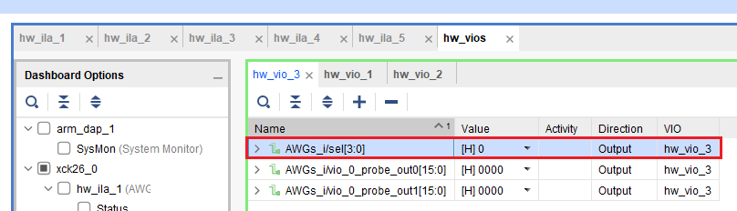
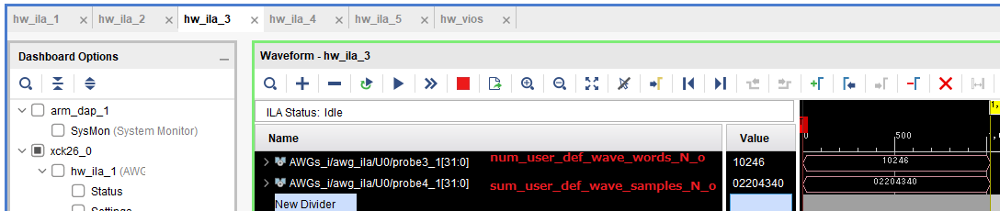

# send random テスト説明

## 検証内容

python プログラム上でランダムなサンプル値の波形を生成して, KR260 上の AWG から出力します．
波形データのシグニチャを HW と SW で計算して両者が一致するか検証します．

## 実行方法

このファイルのあるディレクトリに移動して，以下のコマンドを実行します．

```
python send_random.py [--ipaddr=KR260 上の AWG コントローラに割り当てられた IP アドレス]
```

Vivado を起動して, test_result/AWGs_wrapper.ltx を使用して KR260 版 e7awg_hw の ILA の値を見られるようにします．

send_random.py が生成した result_send_random/awg_**N**/sigunature_**N**.txt (N = 0~15) に書かれた

- **num words**
- **sum**

の値を ILA から見られる

- **awg_array_0/num_user_def_wave_words_N_o** 信号
- **awg_array_0/sum_user_def_wave_samples_N_o** 信号

の値と比較します.

<br>

### Vivado 上で操作および確認するポート

<br>

- AWG の信号を切り替えるための VIO のポート (0x0 ~ 0xF を指定してください)



<br>

- AWG の信号を確認するための ILA のポート．

上図の VIO のポートの値が N のとき, **awg_array_0/num_user_def_wave_words_N_o** および **awg_array_0/sum_user_def_wave_samples_N_o** の値が出力されます．


