# send_random テスト結果

SW と HW のそれぞれで計算した出力波形の「総 AWG ワード数」と「チェックサム」が一致することを確認するのに使ったデータを記す.

## send_random.py によって計算された出力波形のシグネチャ

signature_*.txt を参照.

## AWG が出力した出力波形のシグネチャを ILA で見た結果

- probe3_1 : 出力波形の総 AWG ワード数
- probe4_1 : 出力波形のチェックサム

AWG 0

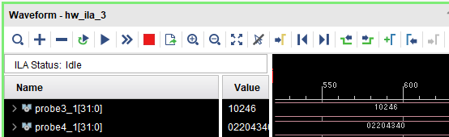

 

AWG 1

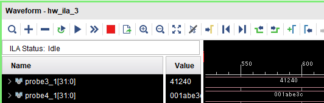

 

AWG 2

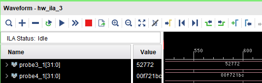

 

AWG 3

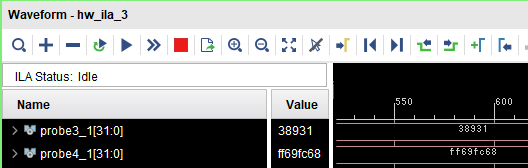

 

AWG 4

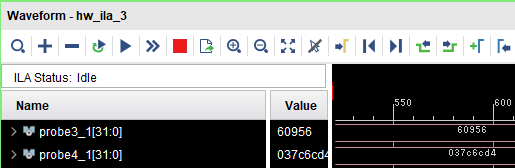

 

AWG 5

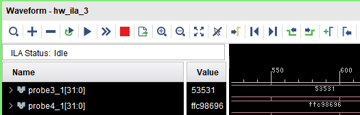

 

AWG 6

 

AWG 7

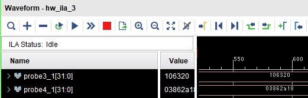

 

AWG 8

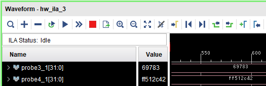

 

AWG 9

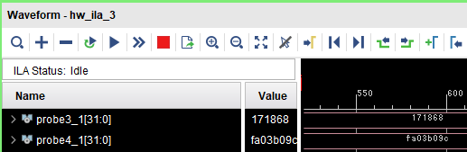

 

AWG 10

 

AWG 11

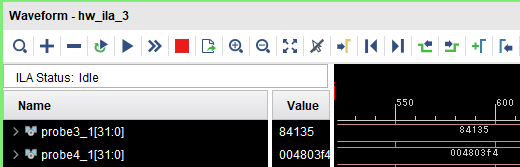

 

AWG 12

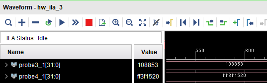

 

AWG 13

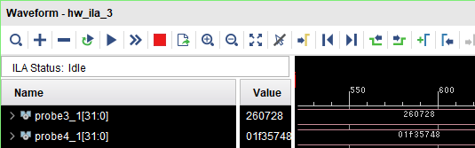

 

AWG 14

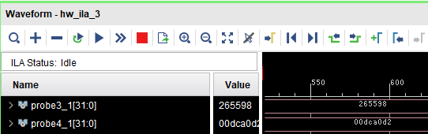

 

AWG 15

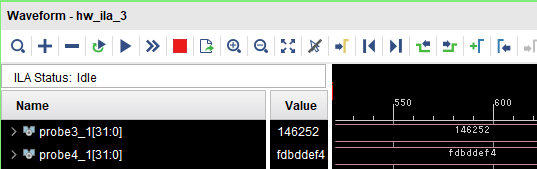
