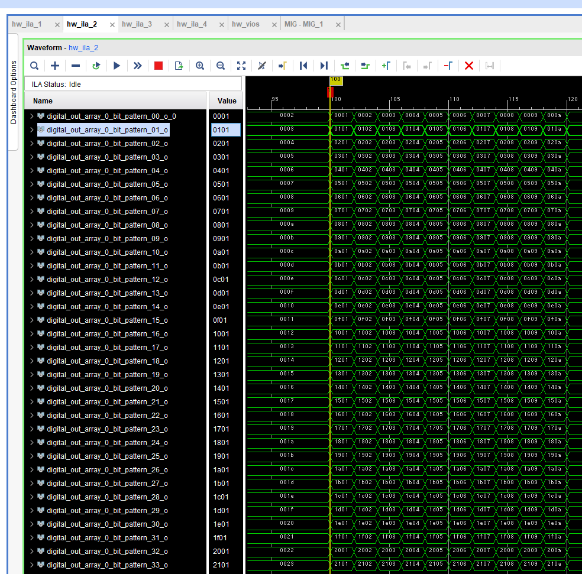

# ディジタル出力モジュールの出力値を確認する

## 検証内容

python プログラム上でディジタル値を生成して, ZCU111 上のディジタル出力モジュールから出力します．
意図したディジタル値が出力されていることを確認します．


## 実行方法

このファイルのあるディレクトリに移動して，以下のコマンドを実行します．

```
python digital_out_x34_test.py
```

Vivado を起動して, bitfile/zcu111_rfsoc_trd_wrapper.ltx を使用して ZCU111 版 e7awg_hw の ILA の値を見られるようにします．
ディジタル出力モジュールの出力値を入力された ILA を探し，その値が変化したときにキャプチャするように設定します.

上記のコマンドをもう一度実行し，ILA のキャプチャ結果が以下の図のようになることを確認します．


