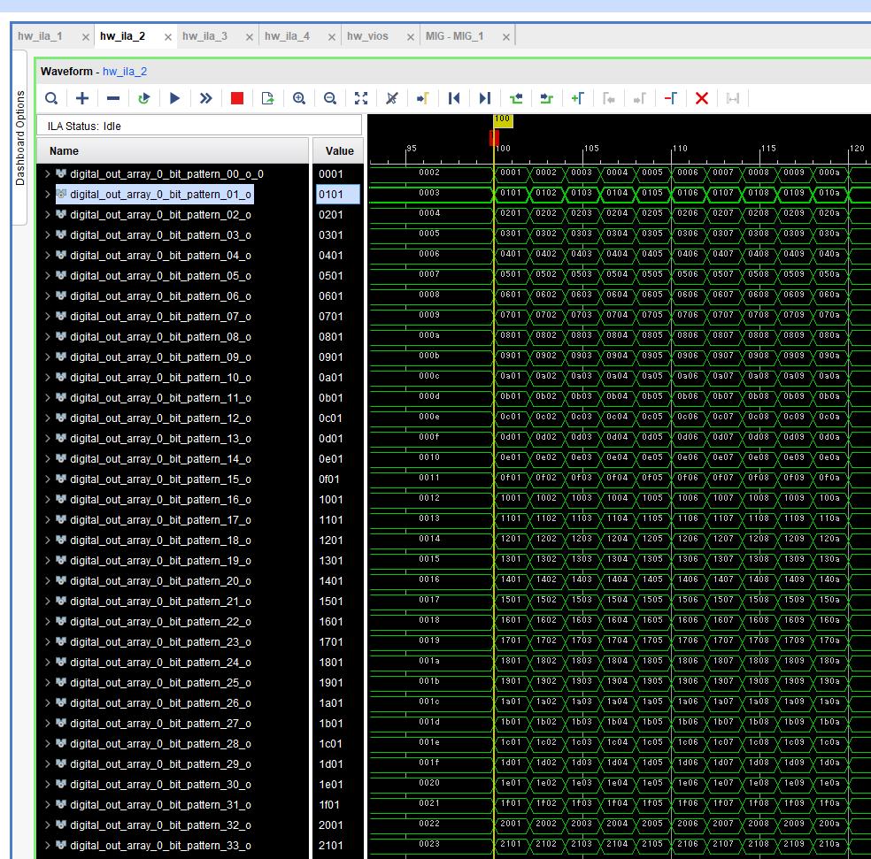

# ディジタル出力モジュールの出力値を確認する

## 検証内容

python プログラム上でディジタル値を生成して, ZCU111 上のディジタル出力モジュールから出力します．
意図したディジタル値が出力されていることを確認します．

## 実行方法

このファイルのあるディレクトリに移動して，以下のコマンドを実行します．
各デザインのモジュール構成については，[e7awg_hw ユーザマニュアル](../../../manuals/zcu111/hw/README.md) を参照してください．

```
# デザイン 0 を使用する場合
python digital_out_x34_test.py

# デザイン 1 を使用する場合
python digital_out_x34_test.py --design-type=dac6g

# デザイン 2 を使用する場合
python send_wave.py  --design-type=dac1g-uram2

# デザイン 3 を使用する場合
python send_wave.py  --design-type=dac6g-uram2
```

Vivado を起動して, e7awg_hw の合成時に出力される zcu111_rfsoc_trd_wrapper.ltx を使用して ZCU111 版 e7awg_hw の ILA の値を見られるようにします．
ディジタル出力モジュールの出力値を入力された ILA を探し，その値が変化したときにキャプチャするように設定します.

上記のコマンドをもう一度実行し，ILA のキャプチャ結果が以下の図のようになることを確認します．


