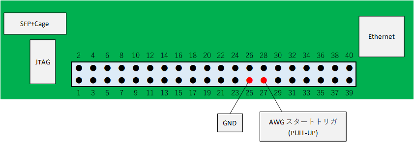
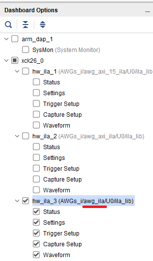
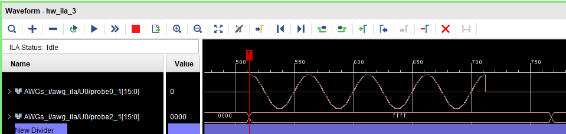

# AWG から余弦波を出力する

[awg_external_trigger.py](./awg_external_trigger.py) は AWG (Arbitrary Waveform Generator) をキャリアカードのピンに割り当てられた外部トリガからスタートするスクリプトです．

## セットアップ

KR260 キャリアボードの Raspberry Pi HAT Header の 25 番ピンと 27 番ピン (下図参照) を接続してください．




e7awg_hw をコンフィギュレーションしてから, FPGA デザイン合成時に作成される `AWGs_wrapper.ltx` を使って, 
Vivado から ILA の波形を見られるようにしてください.

Vivado の HARDWARE MANAGER の画面にある `Dashboard Options` から awg_ila の波形を表示するタブ (下図の場合だと hw_ila_3) を探してください．



awg_ila に対応するタブの画面から以下の 2 つの信号を探し, 信号 2 が 0xFFFF になったときに, 波形を取り込むようにトリガを設定してください.
信号 1 の `Waveform Style` を `アナログ` にしてください.

1. AWGs_i/awg_ila/U0/probe0_1
2. AWGs_i/awg_ila/U0/probe2_1


## 実行手順と結果

以下のコマンドを実行します．

```
python awg_external_trigger.py
```

`Disconnect Pin 27 from Pin 25 on the carrier board and press 'Enter'` と表示されたら，Raspberry Pi HAT Header の 25 番ピンと 27 番ピンの接続を解除します．
AWG が波形の出力を開始し，awg_ila の 信号 1 に AWG から出力された波形が表示されます．
Enter を押してプログラムを終了します．


