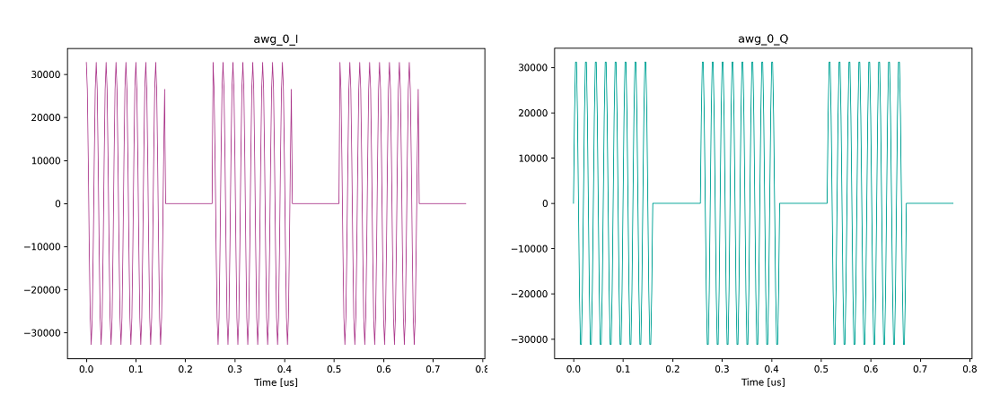
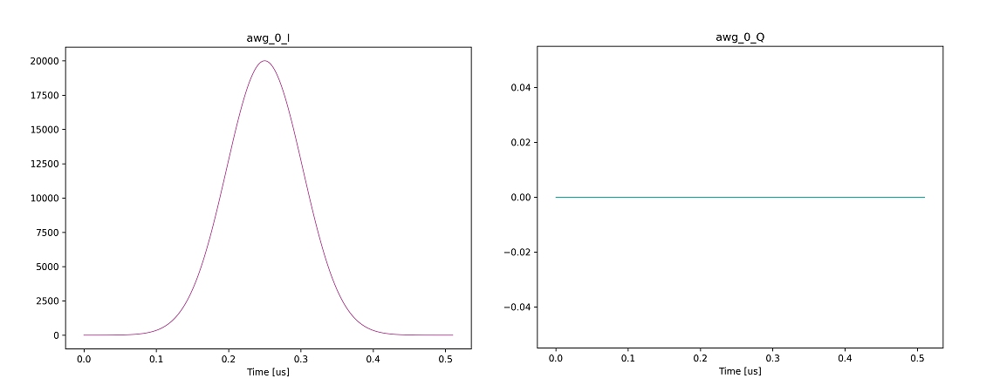

# AWG とキャプチャモジュールを連動させる

[send_recv.py](./send_recv.py) と [gaussian_send_recv.py](./gaussian_send_recv.py) は AWG から波形を出力し，それに連動して入力波形をキャプチャするスクリプトです．
AWG が出力するユーザ定義波形は以下の図ようになります．

**ユーザ定義波形 (send_recv.py)**  


**ユーザ定義波形 (gaussian_send_recv.py)**  



## 実行方法

以下のコマンドを実行します．

**send_recv.py**  
```
python send_recv.py [オプションリスト]
```

**gaussian_send_recv.py**  
```
python gaussian_send_recv.py [オプションリスト]
```

|  オプション  |  説明 | 設定例 |
| ---- | ---- | ---- |
|--ipaddr| AWG コントローラとキャプチャコントローラの IP アドレス <br> デフォルト値: 10.0.0.16 | --ipadd=10.0.0.5 |
|--awgs| 使用する AWG <br> デフォルト値: 全 AWG | --awgs=0,7,12 |
|--capture-module| 使用するキャプチャモジュール <br> デフォルト値: 全キャプチャモジュール | --capture-module=0 |
|--labrad| LabRAD サーバ経由で HW を制御する <br> デフォルト値: LabRAD を使用しない| --labrad |
|--server-ipaddr| LabRAD サーバの IP アドレス <br> デフォルト値: localhost | --server-ipaddr=192.168.0.6 |

## 実行結果

カレントディレクトリの下の `result_[スクリプト名]` ディレクトリ以下に，ユーザ定義波形とキャプチャデータのグラフが AWG および キャプチャユニットごとに保存されます．
