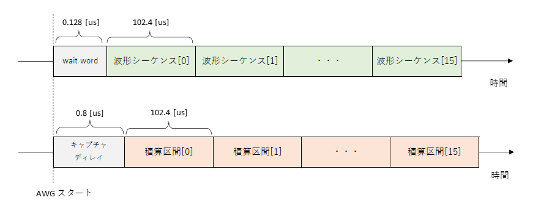
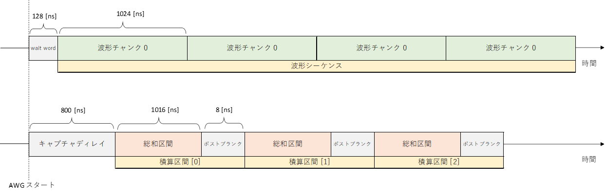
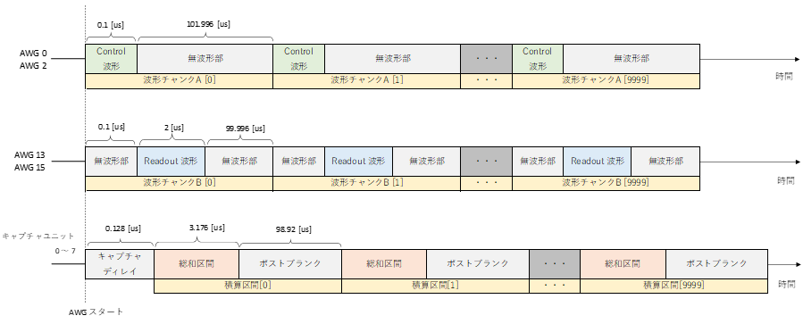

# 四値化以外の DSP ユニット有効化してキャプチャを行う

[send_recv_dsp.py](./send_recv_dsp.py) は AWG から波形を出力し，入力波形に四値化以外の DSP (複素 FIR フィルタ，間引き，実数 FIR フィルタ，窓関数，総和，積算) を適用してキャプチャするスクリプトです．
AWG の波形シーケンスとキャプチャユニットの積算区間のタイミングは以下のようになります．


**ユーザ定義波形と積算区間**  



## 実行方法

以下のコマンドを実行します．

```
python send_recv_dsp.py [オプションリスト]
```

|  オプション  |  説明 | 設定例 |
| ---- | ---- | ---- |
|--ipaddr| AWG コントローラとキャプチャコントローラの IP アドレス <br> デフォルト値: 10.0.0.16 | --ipadd=10.0.0.5 |
|--awgs| 使用する AWG <br> デフォルト値: 全 AWG | --awgs=0,7,12 |
|--capture-module| 使用するキャプチャモジュール <br> デフォルト値: 全キャプチャモジュール | --capture-module=0 |
|--labrad| LabRAD サーバ経由で HW を制御する <br> デフォルト値: LabRAD を使用しない| --labrad |
|--server-ipaddr| LabRAD サーバの IP アドレス <br> デフォルト値: localhost | --server-ipaddr=192.168.0.6 |

## 実行結果

カレントディレクトリの下の `result_send_recv_dsp` ディレクトリ以下に，キャプチャデータのグラフがキャプチャユニットごとに保存されます．


# 四値化・積算を有効化してキャプチャを行う
[send_recv_classification.py](./send_recv_classification.py) は AWG から波形を出力し，入力波形に四値化もしくは，四値化と積算を適用してキャプチャするスクリプトです．
AWG の波形シーケンスとキャプチャユニットの総和区間のタイミングは以下のようになります．
積算が有効な場合は，積処理の結果に四値化を適用します．
積算が無効な場合は，各総和区間の I/Q サンプルに対し四値化を適用します．


**ユーザ定義波形と総和区間**  



## 実行方法

以下のコマンドを実行します．

```
python send_recv_classification.py [オプションリスト]
```

|  オプション  |  説明 | 設定例 |
| ---- | ---- | ---- |
|--ipaddr| AWG コントローラとキャプチャコントローラの IP アドレス <br> デフォルト値: 10.0.0.16 | --ipaddr=10.0.0.5 |
|--awgs| 使用する AWG <br> デフォルト値: 全 AWG | --awgs=0,7,12 |
|--capture-module| 使用するキャプチャモジュール <br> デフォルト値: 全キャプチャモジュール | --capture-module=0 |
|--labrad| LabRAD サーバ経由で HW を制御する <br> デフォルト値: LabRAD を使用しない| --labrad |
|--server-ipaddr| LabRAD サーバの IP アドレス <br> デフォルト値: localhost | --server-ipaddr=192.168.0.6 |
|--integ| 積算処理を有効にする | --integ |

## 実行結果

カレントディレクトリの下の `result_send_recv_classification` ディレクトリ以下に，四値化結果がキャプチャユニットごとに保存されます．


# 積算を有効化してキャプチャを行う

[send_recv_integ.py](./send_recv_integ.py) は AWG から波形を出力し，入力波形に積算処理を適用してキャプチャするスクリプトです．
AWG の波形シーケンスとキャプチャユニットの積算区間のタイミングは以下のようになります．

**ユーザ定義波形と積算区間**  


AWG 0，2 の波形チャンクには Control 波形が含まれ，AWG 13，15 の波形チャンクには Readout 波形が含まれます．
各 AWG は，同じ波形チャンクを 10000 回連続で出力します．
無波形部と書かれている期間は I/Q 共に 0 を出力します.

キャプチャユニットは，Readout 波形の開始に合わせてキャプチャを開始し，
異なる積算区間同士で波形データを足し合わせます．
ポストブランクと書かれている期間は，波形データのキャプチャはキャプチャされません．

## 実行方法

以下のコマンドを実行します．

```
python send_recv_integ.py [オプションリスト]
```

|  オプション  |  説明 | 設定例 |
| ---- | ---- | ---- |
|--wavelen | コントロール波形の長さ <br> (単位: AWG ワード，※ 1 AWG ワード = 4 サンプル) <br> デフォルト値: 100 | --wavelen=150 |
|--ipaddr| AWG コントローラとキャプチャコントローラの IP アドレス <br> デフォルト値: 10.0.0.16 | --ipadd=10.0.0.5 |
|--awgs| 使用する AWG <br> デフォルト値: 全 AWG | --awgs=0,7,12 |
|--capture-module| 使用するキャプチャモジュール <br> デフォルト値: 全キャプチャモジュール | --capture-module=0 |
|--labrad| LabRAD サーバ経由で HW を制御する <br> デフォルト値: LabRAD を使用しない| --labrad |
|--server-ipaddr| LabRAD サーバの IP アドレス <br> デフォルト値: localhost | --server-ipaddr=192.168.0.6 |


## 実行結果

カレントディレクトリの下の `result_send_recv_integ` ディレクトリ以下に，キャプチャデータのグラフがキャプチャユニットごとに保存されます．
