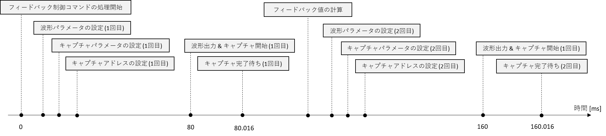
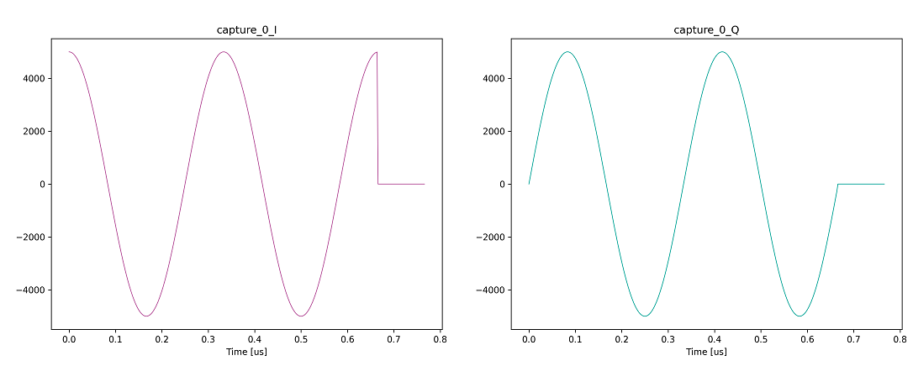
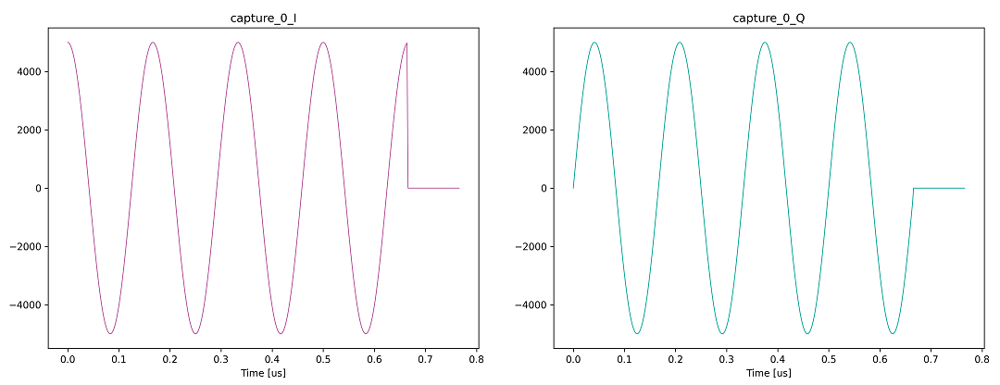
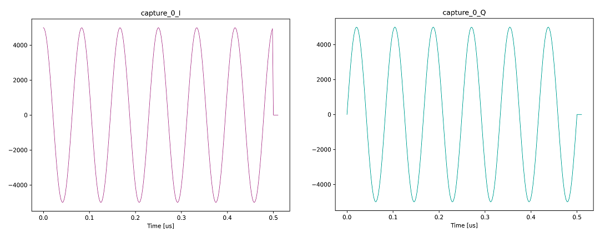
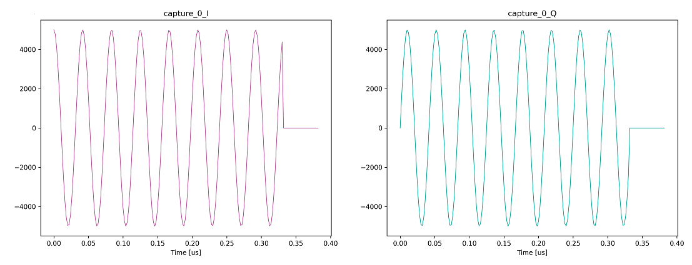

# フィードバックシステムを用いて波形の出力とキャプチャを行う

[seq_send_recv.py](./seq_send_recv.py) は，フィードバックシステムを用いて波形の出力とキャプチャを行うスクリプトです．
フィードバックシステムによる AWG とキャプチャユニットの操作を以下の図に示します．
フィードバックシステムの詳細は，[フィードバックシステムユーザマニュアル](../../manuals/feedback.md) を参照してください．

フィードバック値は，1 回目のキャプチャで保存されたキャプチャデータをもとに計算されます．
このフィードバック値は，2 回目の波形パラメータとキャプチャパラメータの設定で参照されます．



## フィードバック値と AWG の 2 回目の波形の対応

**フィードバック値 0**
(左 : I データ, 右 : Q データ)



**フィードバック値 1**
(左 : I データ, 右 : Q データ)



**フィードバック値 2**
(左 : I データ, 右 : Q データ)



**フィードバック値 3**
(左 : I データ, 右 : Q データ)



## 実行方法

以下のコマンドを実行します．

```
python seq_send_recv.py [オプションリスト]
```

|  オプション  |  説明 | 設定例 |
| ---- | ---- | ---- |
|--ipaddr| AWG コントローラとキャプチャコントローラの IP アドレス <br> デフォルト値: 10.1.0.255 | --ipadd=10.1.0.255 |
|--seq-ipaddr| シーケンサの IP アドレス. デフォルト値: 10.2.0.255 | --seq-ipaddr=10.2.0.255 |
|--awgs| 使用する AWG <br> デフォルト値: 全 AWG | --awgs=0,7,12 |
|--capture-module| 使用するキャプチャモジュール <br> デフォルト値: 全キャプチャモジュール | --capture-module=0 |
|--labrad| LabRAD サーバ経由で HW を制御する <br> デフォルト値: LabRAD を使用しない| --labrad |
|--server-ipaddr| LabRAD サーバの IP アドレス <br> デフォルト値: localhost | --server-ipaddr=192.168.0.6 |

## 実行結果

カレントディレクトリの下の `result_seq_send_recv` ディレクトリ以下に，2 回目のキャプチャのキャプチャデータがグラフとしてキャプチャユニットごとに保存されます．
