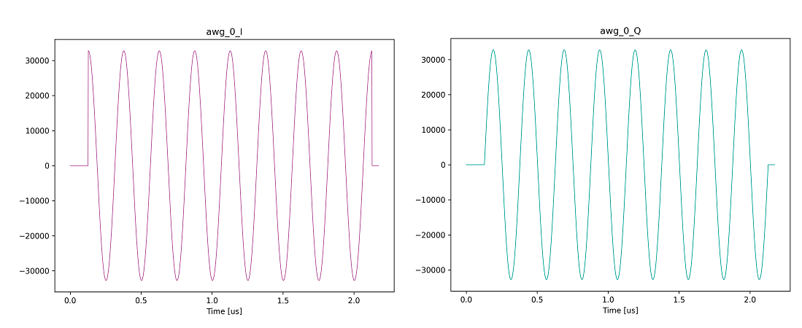
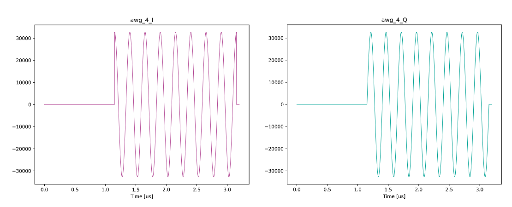

# 波形シーケンスの開始タイミングを変える

[wait_word_test.py](./wait_word_test.py) は AWG から波形を出力し，それに連動して入力波形をキャプチャするスクリプトです．
AWG が出力するユーザ定義波形は以下の図ようになります．

**AWG 0 波形**  


**AWG 4 波形**  


上図の正弦波が始まるタイミングが波形シーケンスの開始点であり，本スクリプトでは，このタイミングが AWG ごとに異なります．
波形シーケンスの開始タイミングは WaveSequence コンストラクタの num_wait_words 引数で変更可能です．

## 実行方法

以下のコマンドを実行します．

```
python wait_word_test.py [オプションリスト]
```

|  オプション  |  説明 | 設定例 |
| ---- | ---- | ---- |
|--ipaddr| AWG コントローラとキャプチャコントローラの IP アドレス <br> デフォルト値: 10.0.0.16 | --ipadd=10.0.0.5 |
|--awgs| 使用する AWG <br> デフォルト値: 全 AWG | --awgs=0,7,12 |
|--capture-module| 使用するキャプチャモジュール <br> デフォルト値: 全キャプチャモジュール | --capture-module=0 |
|--labrad| LabRAD サーバ経由で HW を制御する <br> デフォルト値: LabRAD を使用しない| --labrad |
|--server-ipaddr| LabRAD サーバの IP アドレス <br> デフォルト値: localhost | --server-ipaddr=192.168.0.6 |

## 実行結果

カレントディレクトリの下の `result_wait_word` ディレクトリ以下に，ユーザ定義波形とキャプチャデータのグラフが AWG および キャプチャユニットごとに保存されます．
