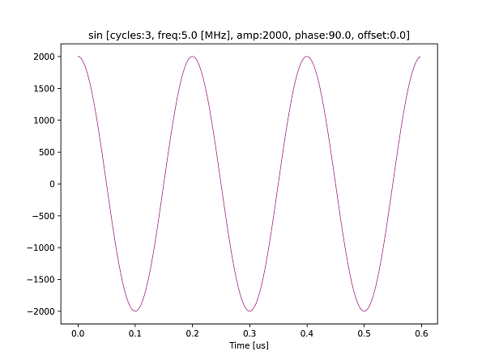
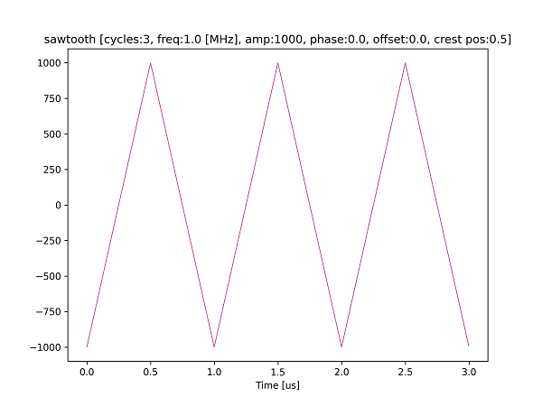

# ユーティリティクラスを使って波形データを生成する

e7awgsw パッケージには，波形データ生成用のユーティリティクラスが用意されています．
[wave_gen_util.py](./wave_gen_util.py) は，それらのクラスを用いて波形データを作成するスクリプトです．

波形データ生成クラス一覧
| クラス | 説明 |
| ---- | ---- |
| SinWave | 正弦波 |
| SquareWave | 方形波 |
| SawtoothWave | ノコギリ波 |
| GaussianPulse | ガウシアンパルス |

## 実行方法

以下のコマンドを実行します．

```
python wave_gen_util.py
```

## 実行結果

カレントディレクトリの下の `result` ディレクトリ以下に，生成した波形データのグラフが保存されます．

**正弦波**  


**ノコギリ波**  

