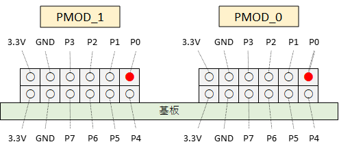
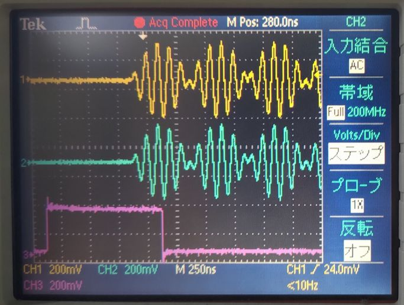

# AWG を外部トリガでスタートする

[awg_external_trigger.py](./awg_external_trigger.py) は AWG (Arbitrary Waveform Generator) を PMOD 1 のポート 0 に割り当てられた外部トリガからスタートするスクリプトです．

## セットアップ

DAC, PMOD とオシロスコープを接続します．


## 実行手順と結果

以下のコマンドを実行します．

```
python awg_external_trigger.py
```

コンソールに `Connect PMOD 0 port 0 to PMOD 1 port 1 and press 'Enter'` と表示されたら，下図の PMOD 0 の P0 と PMOD 1 の P0 を接続してから Enter を押します．



ディジタル出力モジュール 0 からディジタル値が出力されると PMOD 0 のポート 0 の電圧が Lo から Hi に変わり，接続されている PMOD 1 の P0 を通して AWG のスタートトリガがかかります．

ディジタル出力モジュール と AWG が動作すると AWG と PMOD から下図の波形が観測できます．

| 色 | 信号 |
| --- | --- |
| 黄色 | AWG 0 |
| 水色 | AWG 1 |
| ピンク | PMOD 0 P0 |


