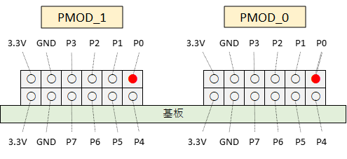
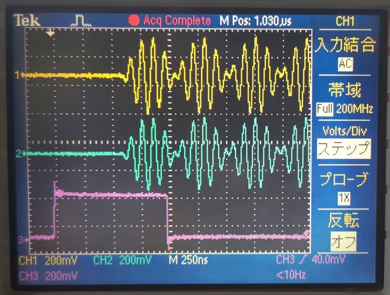
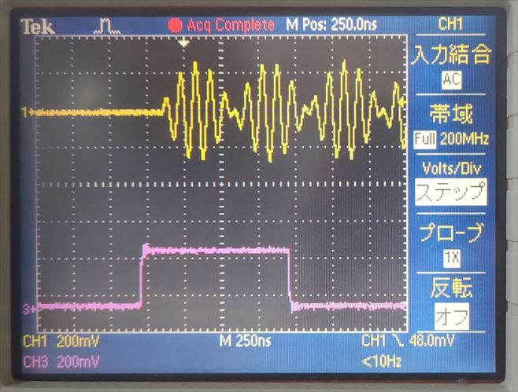
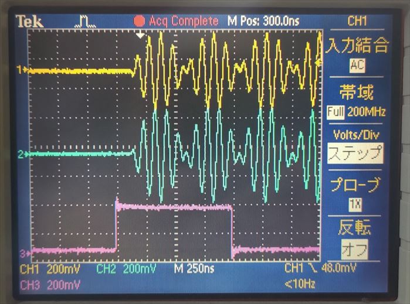
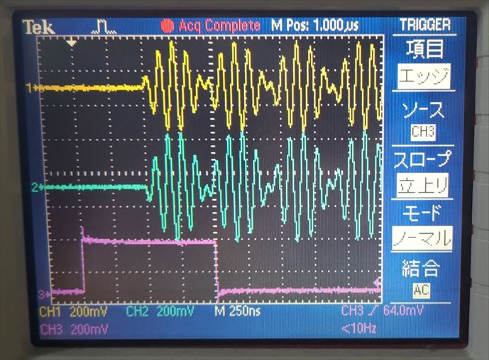

# AWG を外部トリガでスタートする

[awg_external_trigger.py](./awg_external_trigger.py) は AWG (Arbitrary Waveform Generator) を PMOD 1 のポート 0 に割り当てられた外部トリガからスタートするスクリプトです．
本スクリプトは ZCU111 版 e7awg_hw の `デザイン 0 ~ 4` に対応しています．
各デザインのモジュール構成については，[e7awg_hw ユーザマニュアル](../../../manuals/zcu111/hw/README.md) を参照してください．

本スクリプトで動作する AWG と上述のデザインの対応関係は以下の表の通りです．

| デザイン ID | AWG |
| --- | --- |
| 0 | 0 ~ 4 |
| 1 | 0 |
| 2 | 0 ~ 4，6 ~ 7 |
| 3 | 0，6，7 |
| 4 | 0 ~ 3, 6 ~ 7 |

## セットアップ

DAC, PMOD とオシロスコープを接続します．


## 実行手順と結果

### DAC 1Gsps デザインを使用する場合

以下のコマンドを実行します．

```
# デザイン 0 を使用する場合
python awg_external_trigger.py

# デザイン 1 を使用する場合
python awg_external_trigger.py --design-type=dac6g

# デザイン 2 を使用する場合
python awg_external_trigger.py --design-type=dac1g-uram2

# デザイン 3 を使用する場合
python awg_external_trigger.py --design-type=dac6g-uram2

# デザイン 4 を使用する場合
python awg_external_trigger.py --design-type=dqd
```

コンソールに `Connect PMOD 0 port 0 to PMOD 1 port 1 and press 'Enter'` と表示されたら，下図の PMOD 0 の P0 と PMOD 1 の P0 を接続してから Enter を押します．



ディジタル出力モジュール 0 からディジタル値が出力されると PMOD 0 のポート 0 の電圧が Lo から Hi に変わり，接続されている PMOD 1 の P0 を通して AWG のスタートトリガがかかります．

ディジタル出力モジュール と AWG が動作すると AWG と PMOD から下図の波形が観測できます．

**デザイン 0, 2**

| 色 | 信号 |
| --- | --- |
| 黄色 | AWG 0 |
| 水色 | AWG 1 |
| ピンク | PMOD 0 P0 |



<br>

**デザイン 1**

| 色 | 信号 |
| --- | --- |
| 黄色 | AWG 0 |
| ピンク | PMOD 0 P0 |



<br>

**デザイン 3**

| 色 | 信号 |
| --- | --- |
| 黄色 | AWG 0 |
| 水色 | AWG 6 |
| ピンク | PMOD 0 P0 |



※ AWG 6 の波形は ZCU111 付属のバランの回路の特性により変位が反転しています．

<br>

**デザイン 4**

| 色 | 信号 |
| --- | --- |
| 黄色 | AWG 3 |
| 水色 | AWG 7 |
| ピンク | PMOD 0 P0 |



※ AWG 7 の波形は ZCU111 付属のバランの回路の特性により変位が反転しています．
