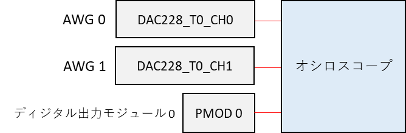
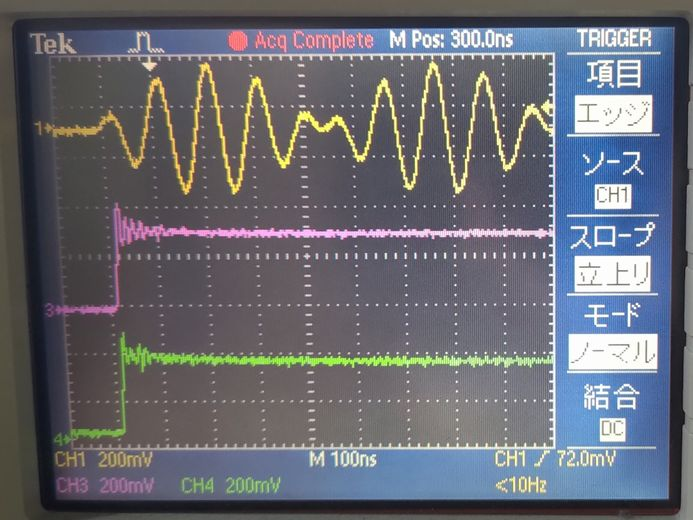
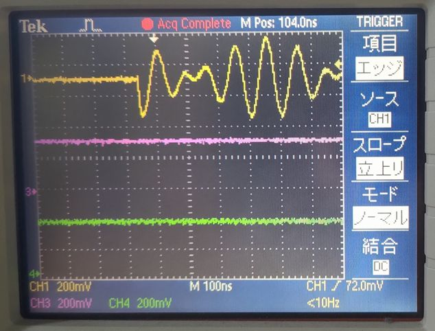
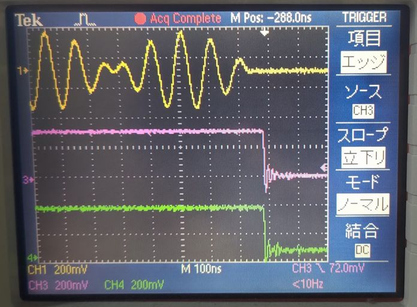

# AWG の一時停止と再開を行う

[awg_pause.py](./awg_pause.py) は AWG (Arbitrary Waveform Generator) の波形出力の「一時停止」と「再開」機能を確認するスクリプトです．

## セットアップ

DAC, PMOD とオシロスコープを接続します．



## 実行手順と結果

以下のコマンドを実行します．

```
python awg_pause.py
```

AWG とディジタル出力モジュールが動作を開始すると DAC と PMOD から下図の波形が観測できます．

| 色 | 信号 |
| --- | --- |
| 黄色 | AWG 0 |
| ピンク | PMOD 0 P0 |
| 緑 | PMOD 0 P1 |



<br>

コンソールに `Press 'Enter' to resume AWGs` と表示されると AWG が一時停止され，波形の出力が止まります．
このとき，ディジタル出力モジュールも一時停止しており，出力値が一時停止前の値から変わらなくなります．
ここで，コンソール上で Enter を入力すると AWG およびディジタル出力モジュールは動作を再開し，下図の波形が観測できます．



<br>

AWG とディジタル出力モジュールの動作再開から数秒で両方の動作が終了し，下図の波形が観測できます．


