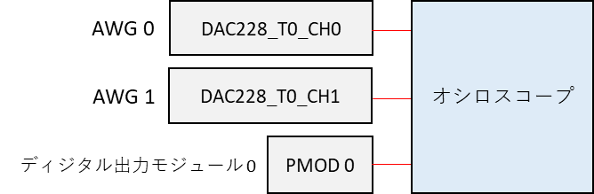
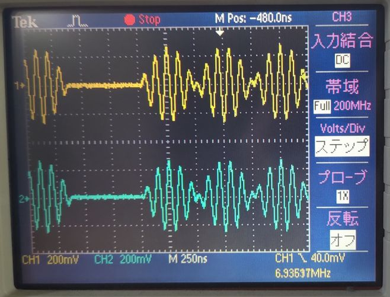

# AWG を強制停止する

[awg_termination.py](./awg_termination.py) は波形を出力中の AWG を強制停止するスクリプトです．

## セットアップ

DAC, PMOD とオシロスコープを接続します．



## 実行手順と結果

以下のコマンドを実行します．

```
python awg_termination.py
```

DAC から下図のような波形が連続的に出力されます．
PMOD は 全てのポートが Hi になります．
「press Enter to stop AWGs.」と表示されたら Enter を押してください．
DAC の波形出力と PMOD からのディジタル値の出力が止まります．

AWG 0, AWG 1 の波形  (上から順に AWG 0, AWG 1)



<br>
