# キャプチャユニットの間引き，総和，二値化，リダクションを有効にする

[dec_sum_bin_red_recv.py](./dec_sum_bin_red_recv.py) はキャプチャユニットの間引き，総和，二値化，リダクションを有効にして波形データを保存するスクリプトです．
本スクリプトでは，同じ波形シーケンスを設定した AWG 6 と 7 から波形を出力し，それぞれキャプチャユニット 0 と 1 が受信します．
キャプチャユニット 0 は間引き，総和，二値化，リダクションを適用して波形データをキャプチャし，キャプチャユニット 1 は生データをキャプチャします．
その後，キャプチャユニット 1 が保存した生データに，間引き，総和，二値化，リダクションをソフトウェアで適用し，キャプチャユニット 0 がキャプチャしたデータと比較を行います．

本スクリプトは ZCU111 版 e7awg_hw の `デザイン 4` に対応しています．
デザイン 4 のモジュール構成は，[e7awg_hw ユーザマニュアル](../../../manuals/zcu111/hw/README.md) を参照してください．

## セットアップ

以下の図のように DAC と ADC を接続します．


<br>

## 実行手順

以下のコマンドを実行します．
`reduction` オプションによりリダクションの内容が変わります．
`all` の場合，キャプチャターゲットのサンプルの値が全て 1 以上のとき，そのキャプチャターゲットのリダクションの結果が 1 になります．
`any` の場合，キャプチャターゲットに値が 1 以上のサンプルが 1 つ以上あるとき，そのキャプチャターゲットのリダクションの結果が 1 になります．

```
python dec_sum_bin_red_recv.py --reduction=all (or any) 
```

<br>

## Reduction = all を指定したときの実行結果

キャプチャユニット 0, 1 がキャプチャしたデータが，カレントディレクトリの下の `plot_capture_data` ディレクトリ以下にキャプチャユニットごとに作成されます．

#### キャプチャユニット 0 がキャプチャしたデータ

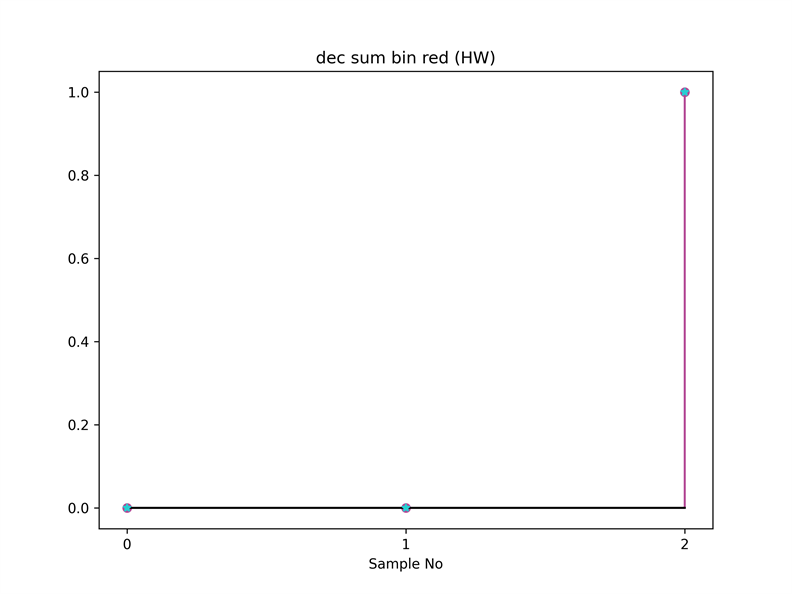

※ ★で示した点は，キャプチャユニット 1 が保存した生データにソフトウェアで間引き，総和，二値化，リダクションを適用したデータを表します．

<br>

#### キャプチャユニット 1 がキャプチャした生データ

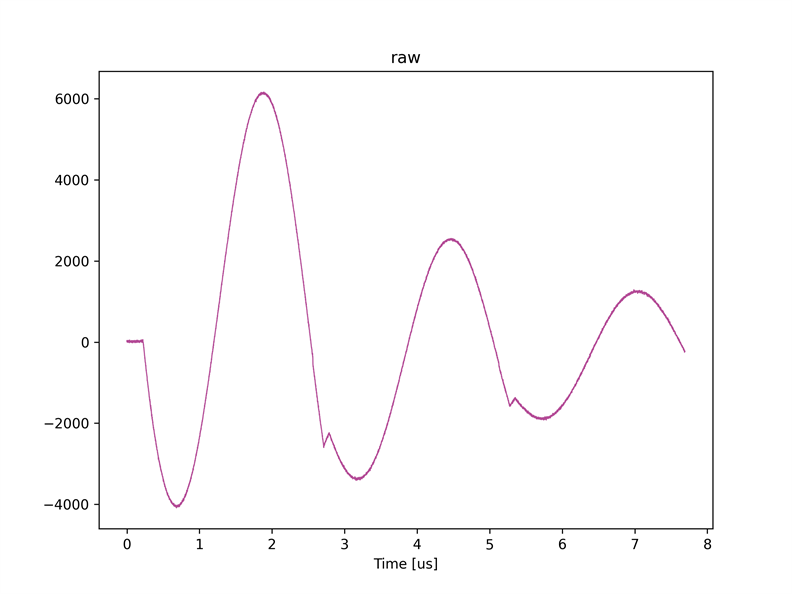

<br>

#### キャプチャユニット 1 がキャプチャした生データにソフトウェアで間引きを適用したデータ

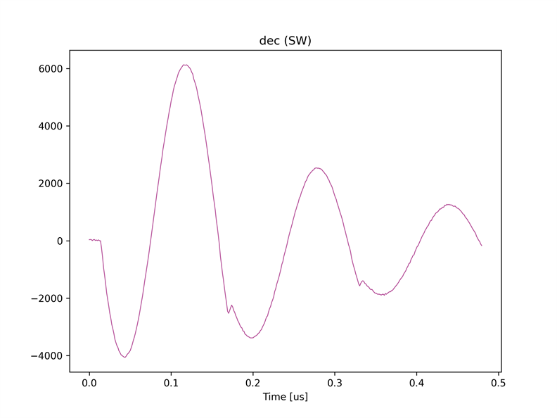

<br>

#### キャプチャユニット 1 がキャプチャした生データにソフトウェアで間引きと総和を適用したデータ

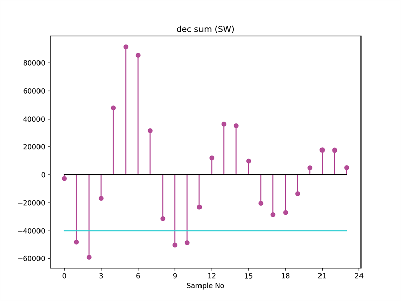

**サンプルナンバーとキャプチャターゲットの対応**

| Sample No | キャプチャターゲット |
|--|--|
| 0 ~ 7 | 0 |
| 8 ~ 15 | 1 |
| 16 ~ 23 | 2 |

<br>

#### キャプチャユニット 1 がキャプチャした生データにソフトウェアで間引き，総和，二値化を適用したデータ

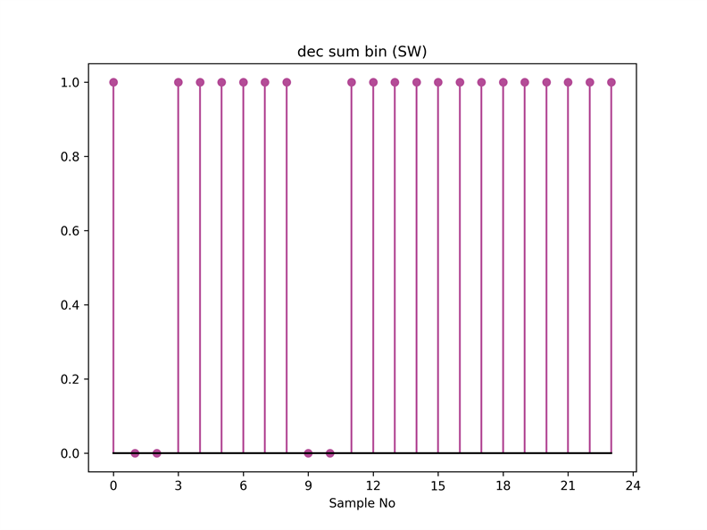

<br>

#### キャプチャユニット 1 がキャプチャした生データにソフトウェアで間引き，総和，二値化，リダクションを適用したデータ

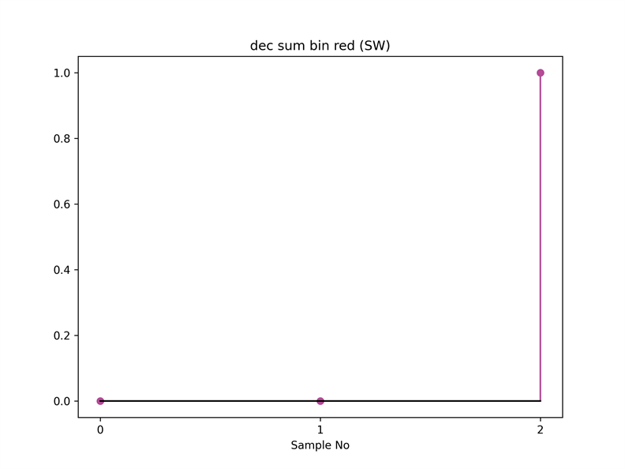

<br>

## Reduction = any を指定したときの実行結果

キャプチャユニット 0, 1 がキャプチャしたデータが，カレントディレクトリの下の `plot_capture_data` ディレクトリ以下にキャプチャユニットごとに作成されます．

#### キャプチャユニット 0 がキャプチャしたデータ

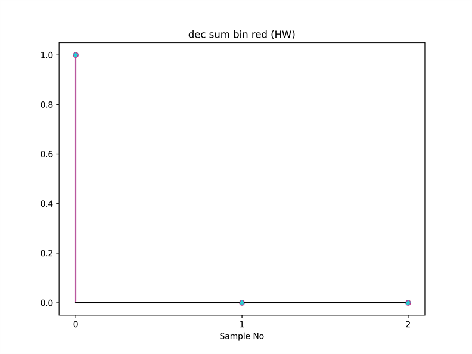

※ ★で示した点は，キャプチャユニット 1 が保存した生データにソフトウェアで間引き，総和，二値化，リダクションを適用したデータを表します．

<br>

#### キャプチャユニット 1 がキャプチャした生データ

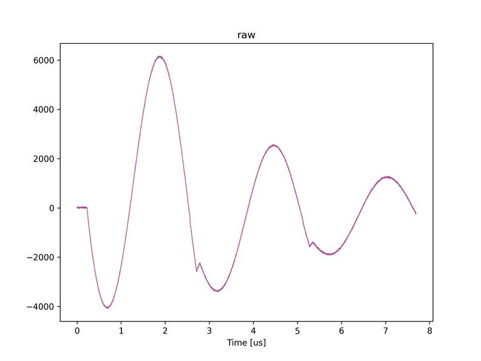

<br>

#### キャプチャユニット 1 がキャプチャした生データにソフトウェアで間引きを適用したデータ

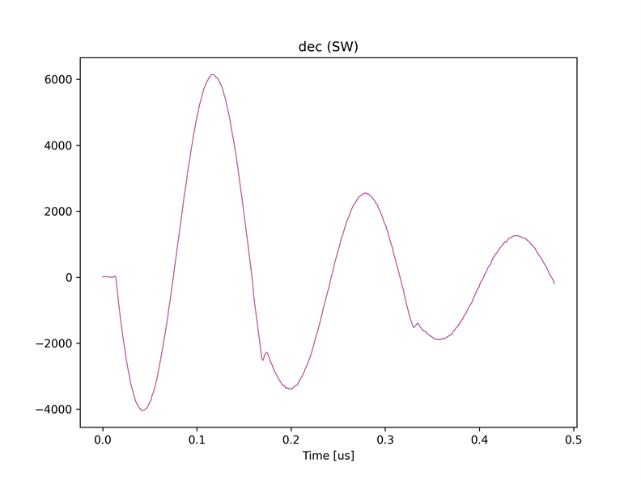

<br>

#### キャプチャユニット 1 がキャプチャした生データにソフトウェアで間引きと総和を適用したデータ

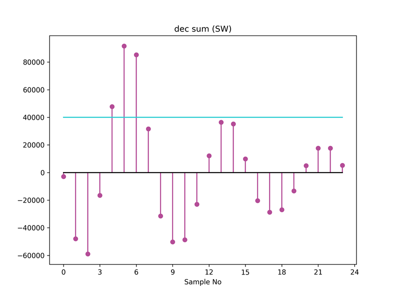

**サンプルナンバーとキャプチャターゲットの対応**

| Sample No | キャプチャターゲット |
|--|--|
| 0 ~ 7 | 0 |
| 8 ~ 15 | 1 |
| 16 ~ 23 | 2 |

<br>

#### キャプチャユニット 1 がキャプチャした生データにソフトウェアで間引き，総和，二値化を適用したデータ

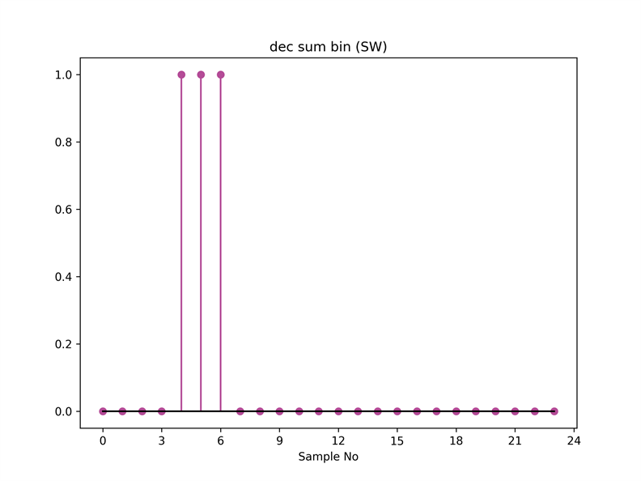

<br>

#### キャプチャユニット 1 がキャプチャした生データにソフトウェアで間引き，総和，二値化，リダクションを適用したデータ

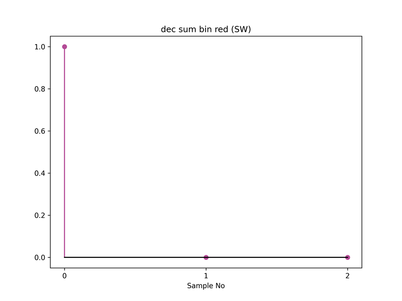

<br>
