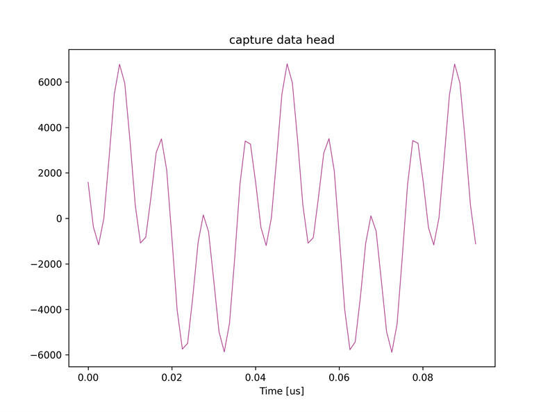
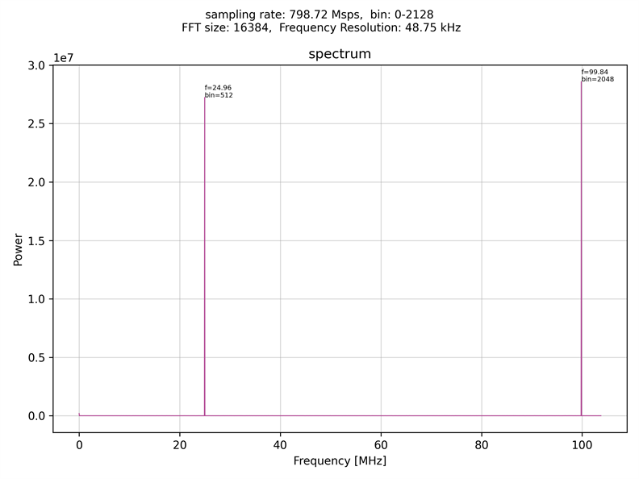
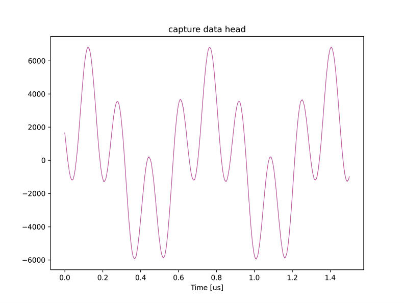
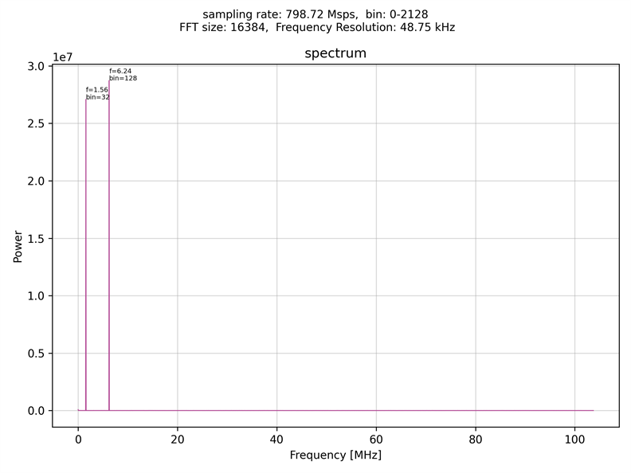

# キャプチャユニットの間引きを有効にする

[decimation_recv.py](./decimation_recv.py) はキャプチャユニットの間引きを有効にして波形データを保存するスクリプトです．
本スクリプトでは，同じ波形シーケンスを設定した AWG 6 と 7 から波形を出力し，それぞれキャプチャユニット 0 と 1 が受信します．
キャプチャユニット 0 は間引きを適用して波形データをキャプチャし，キャプチャユニット 1 は生データをキャプチャします．

本スクリプトは ZCU111 版 e7awg_hw の `デザイン 4` に対応しています．
デザイン 4 のモジュール構成は，[e7awg_hw ユーザマニュアル](../../../manuals/zcu111/hw/README.md) を参照してください．

## セットアップ

以下の図のように DAC と ADC を接続します．


## 実行手順と結果

以下のコマンドを実行します．

```
python decimation_recv.py
```

<br>

キャプチャユニット 0, 1 がキャプチャしたデータが，カレントディレクトリの下の `plot_capture_data` ディレクトリ以下にキャプチャユニットごとに作成されます．

#### キャプチャユニット 0 がキャプチャした波形データの先頭部分




#### キャプチャユニット 0 がキャプチャした波形データのスペクトル



キャプチャユニット 0 のキャプチャデータのピーク周波数が，キャプチャユニット 1 のそれの 16 倍になっていることが確認できます．
これは，キャプチャユニット 1 が入力データをそのまま保存したのに対し，キャプチャユニット 0 は 1/16 に間引いて保存したためです．

<br>

#### キャプチャユニット 1 がキャプチャした波形データの先頭部分




#### キャプチャユニット 1 がキャプチャした波形データのスペクトル



<br>

## DAC ミキサの設定値の詳細

RF Data Converter の DAC の I/Q ミキサが行う処理は以下の式で表されます．


<!--
$$
\begin{align*}

R(t) & = a \; \{ I(t) * cos(2\pi ft + p) - Q(t) * sin(2\pi ft + p) \} 　　　  \\[1ex]
t & \in \{ \; \frac{n}{S} \;|\; n \in \mathbb{Z} _ {+} \; \} \\[4ex]

t &: I/Q ミキサの動作開始時刻を 0 としたときの時刻 \\[1ex]
R(t) &: 時刻 \;t\; における I/Q ミキサの出力値 \\[1ex]
I(t) &: 時刻 \;t\; に I/Q ミキサに入力される I データのサンプル値 \\[1ex]
Q(t) &: 時刻 \;t\; に I/Q ミキサに入力される Q データのサンプル値 \\[1ex]
a &: I/Q ミキサの振幅　(0.7 か 1.0 を選択可能) \\[1ex]
f &: I/Q ミキサの周波数 \\[1ex]
p &: I/Q ミキサの初期位相 \\[1ex]
S &: DAC のサンプリングレート [samples/sec] \\[1ex]

\end{align*}
$$
-->

本スクリプトでは，
- a = 0.7
- f = 2.34 * 10 <sup>6</sup>
- p = 0
- I(t) = 周波数 3.9 MHz の余弦派
- Q(t) = 0

となるように I/Q ミキサおよび出力波形を設定しているので，DAC から出力される波形のピーク周波数は，6.24 MHz と 1.56 MHz になります．

<br>

## ADC ミキサの設定値の詳細

本スクリプトでは RF Data Converter の ADC の I/Q ミキサは無効になっています．
