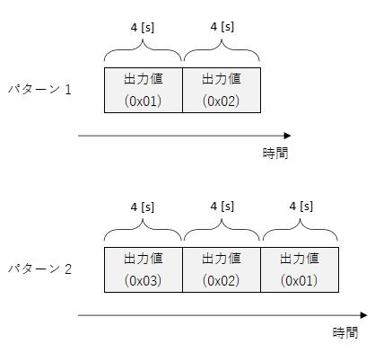
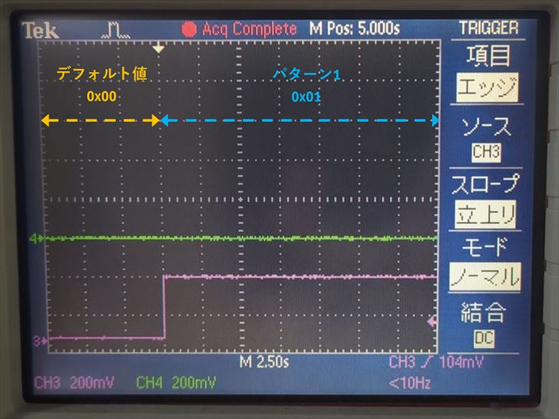
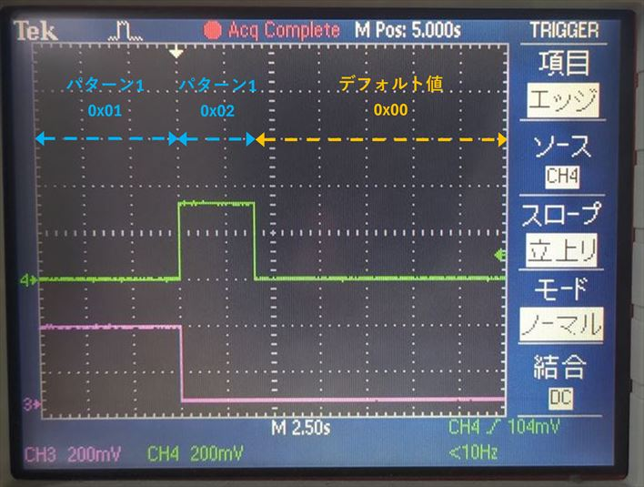
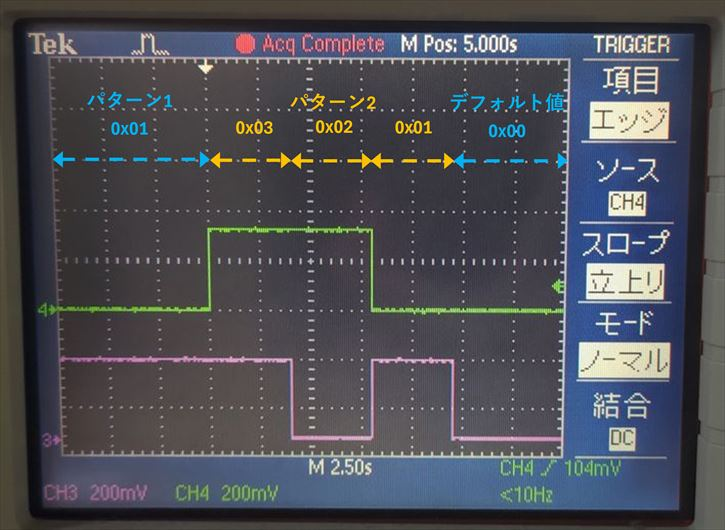
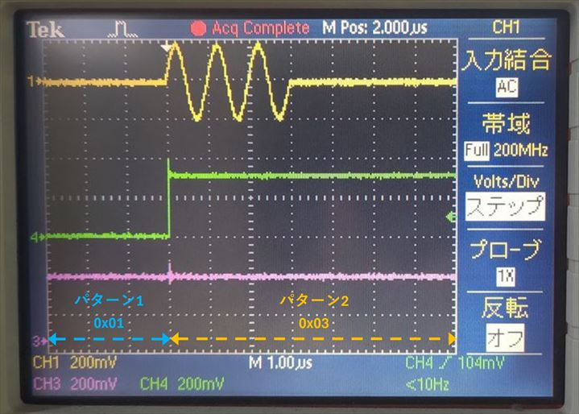

# ディジタル出力モジュールの「一時停止」,「再開」,「再スタート」を行う

[dout_pause.py](./dout_pause.py) はディジタル出力モジュールの「一時停止」,「再開」,「再スタート」機能を確認するためのスクリプトです．

## セットアップ

DAC, PMOD とオシロスコープを接続します．


<br>


## 出力されるディジタル値

本スクリプトで PMOD 0 から出力されるディジタル出力値のリストは 2 パターンあります．
最初にパターン 1 の 0x01 が出力され，ディジタル出力モジュールは「一時停止」されます．
その後，ディジタル値の出力を「再開」した場合，パターン 1 の 0x02 が出力されます．
一方，ディジタル出力モジュールを「再スタート」した場合，パターン 2 の 3 つの値が順に出力されます．




## 実行手順と結果

以下のコマンドを実行します．

```
python dout_pause.py
```

PMOD 0 からディジタル出力値がオシロスコープで観察できます．
ディジタル出力モジュールが，パターン 1 の 0x01 を出力して，一時停止するまでの PMOD のデータは以下のようになります．

| 色 | 信号 |
| --- | --- |
| ピンク | PMOD 0 P0 |
| 緑 | PMOD 0 P1 |

(ピンク : 出力値の 0 ビット目，緑 : 出力値の 1 ビット目)



<br>

一時停止後に以下のメッセージが表示されるので，0, 1, 2 のいずれかをコンソールに入力して Enter を押します．

```
input
    0: resume
    1: restart from software
    2: restart from AWG
```

0 (再開) を選択した場合，以下の波形が出力されます．



<br>

1 (ソフトウェアから再スタート) または 2 (AWG の波形出力開始に合わせて再スタート) を選択した場合，以下の波形が出力されます．



<br>

2 を選択した場合，以下の図のようにパターン 1 の出力値 0x01 からパターン 2 の出力値 0x03 に切り替わる際に AWG 0 から波形が出力されることが確認できます．

| 色 | 信号 |
| --- | --- |
| 黄色 | AWG 0 |
| ピンク | PMOD 0 P0 |
| 緑 | PMOD 0 P1 |


