# I/Q ミキシングした波形を送受信する

[iq_send_iq_recv.py](./iq_send_iq_recv.py) は DAC と ADC の I/Q ミキサを有効にして波形を送受信するスクリプトです．
本スクリプトは ZCU111 版 e7awg_hw の `デザイン 3` に対応しています．
`デザイン 3` のモジュール構成は，[e7awg_hw ユーザマニュアル](../../../manuals/zcu111/hw/README.md) を参照してください．

## セットアップ

以下の図のように DAC と ADC を接続します．

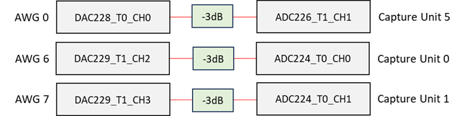


## 実行手順と結果

以下のコマンドを実行します．

```
python iq_send_iq_recv.py
```

キャプチャユニット 0, 1, 5 がキャプチャした波形とスペクトルが，カレントディレクトリの下の `plot_capture_data` ディレクトリ以下にキャプチャユニットごとに作成されます．

#### キャプチャユニット 0 がキャプチャした I データの先頭部分

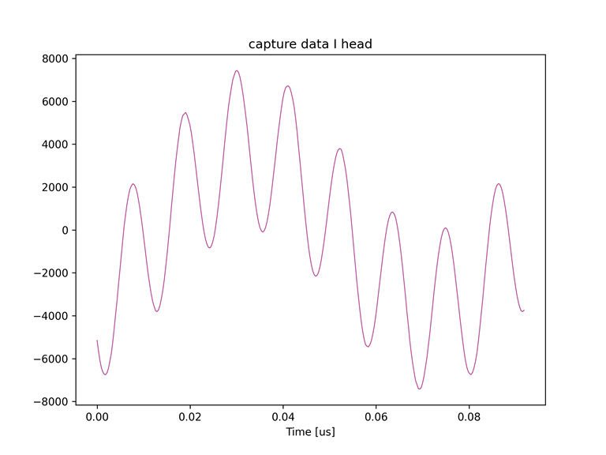

#### キャプチャユニット 0 がキャプチャした Q データの先頭部分

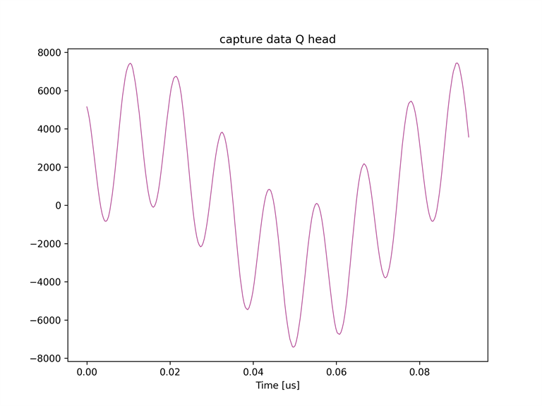

#### キャプチャユニット 0 がキャプチャした I データのスペクトル

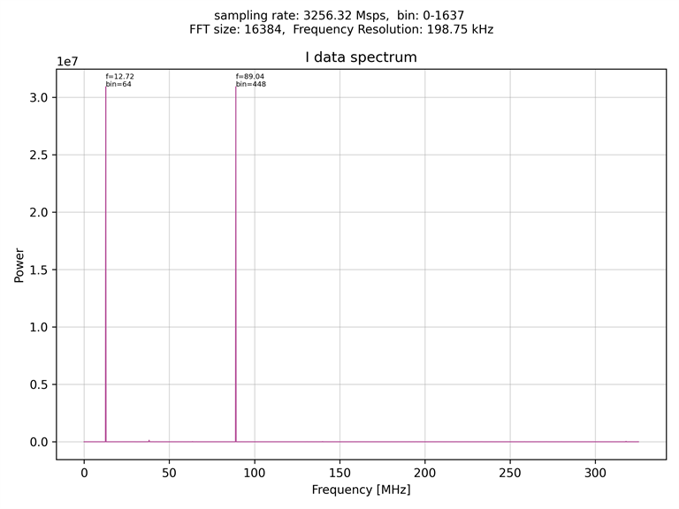

#### キャプチャユニット 0 がキャプチャした Q データのスペクトル

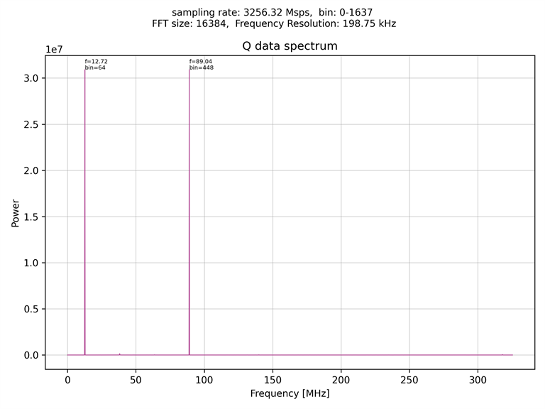

#### キャプチャユニット 1 がキャプチャした I データの先頭部分

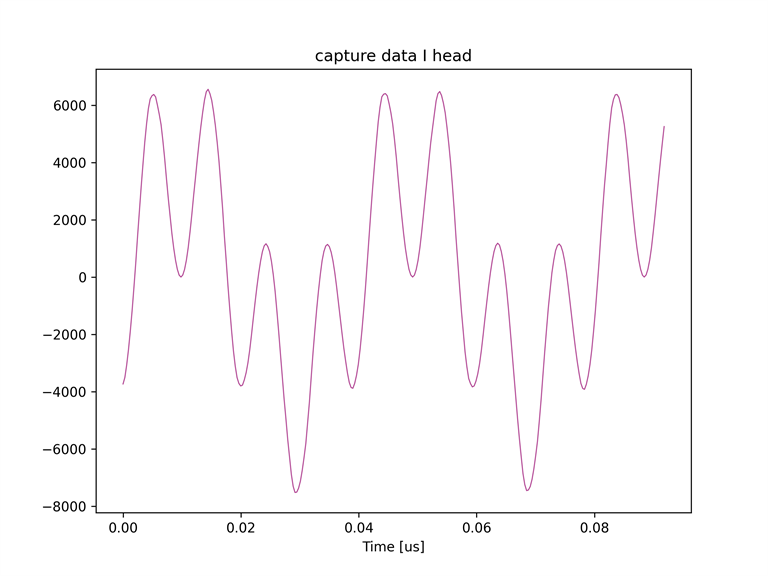

#### キャプチャユニット 1 がキャプチャした Q データの先頭部分

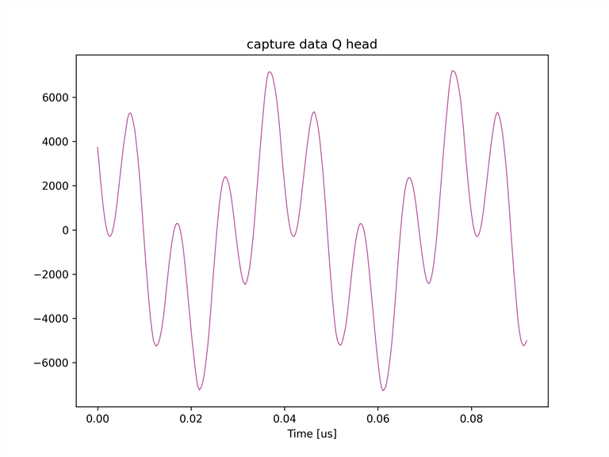

#### キャプチャユニット 1 がキャプチャした I データのスペクトル

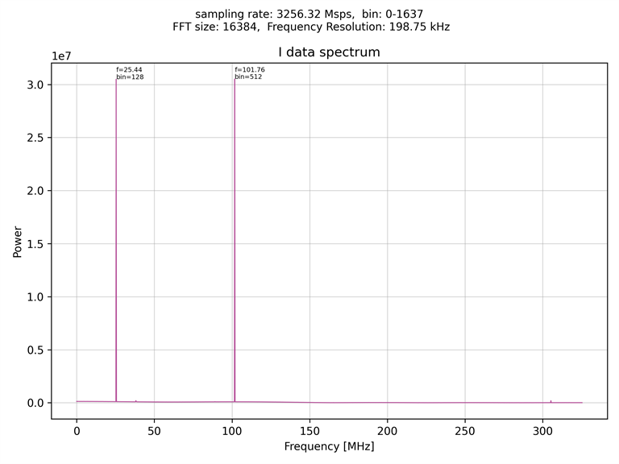

#### キャプチャユニット 1 がキャプチャした Q データのスペクトル

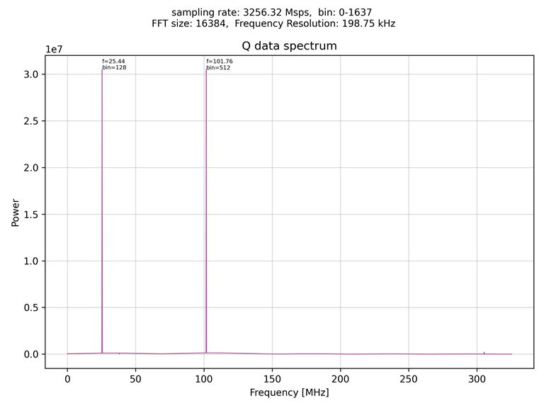

#### キャプチャユニット 5 がキャプチャした I データの先頭部分

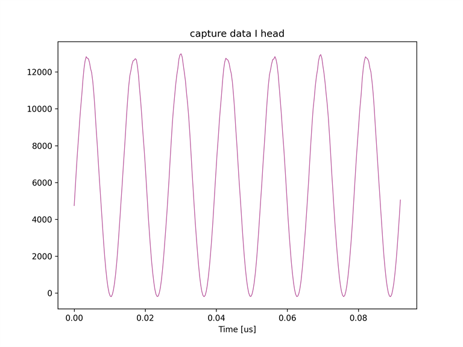

#### キャプチャユニット 5 がキャプチャした Q データの先頭部分

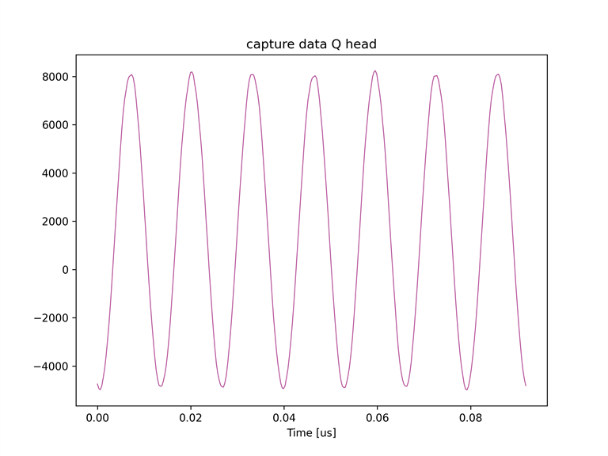

#### キャプチャユニット 5 がキャプチャした I データのスペクトル

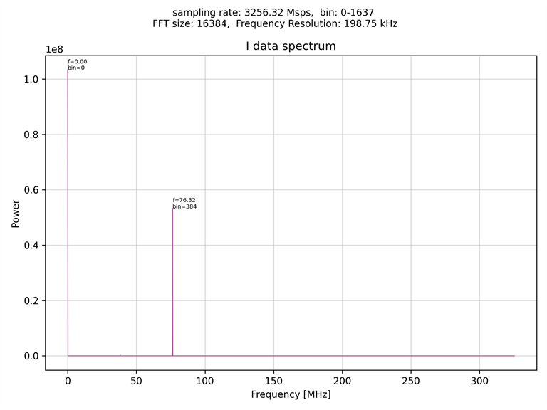

#### キャプチャユニット 5 がキャプチャした Q データのスペクトル

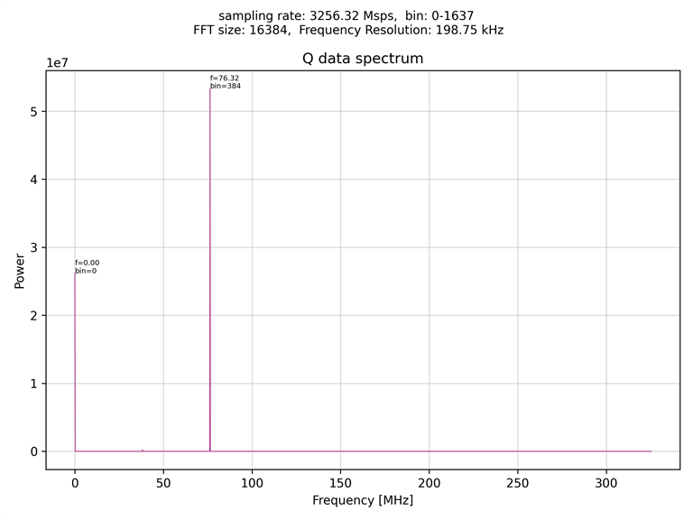


## 出力およびキャプチャされる波形についての詳細

RF Data Converter の DAC の I/Q ミキサが行う処理は以下の式で表されます．

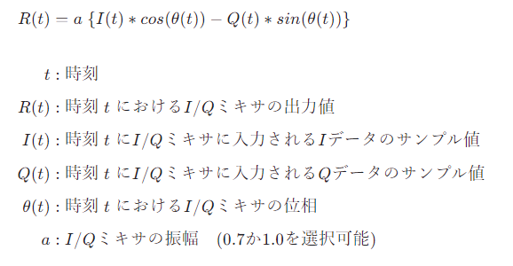

<!-- $$
\begin{align*}

R(t) & = a \; \{ I(t) * cos(\theta(t)) - Q(t) * sin(\theta(t)) \} 　　　  \\[4ex]

t &: 時刻 \\[1ex]
R(t) &: 時刻 \;t\; における I/Q ミキサの出力値 \\[1ex]
I(t) &: 時刻 \;t\; に I/Q ミキサに入力される I データのサンプル値 \\[1ex]
Q(t) &: 時刻 \;t\; に I/Q ミキサに入力される Q データのサンプル値 \\[1ex]
\theta(t) &: 時刻 \;t\; における I/Q ミキサの位相 \\[1ex]
a &: I/Q ミキサの振幅　(0.7 か 1.0 を選択可能) \\[1ex]

\end{align*}
$$ -->

ここで，DAC の I/Q ミキサにユーザ定義波形の先頭のサンプルが入力される時刻を t = 0 とすると，本スクリプトで定義されるユーザ定義波形は

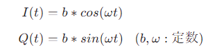

<!-- $$
\begin{align*}

I(t) &= b * cos(\omega t) \\[1ex]
Q(t) &= b * sin(\omega t) \;\;\; (b, \omega: 定数) \\[4ex]

\end{align*}
$$ -->

と表されます．

よって，DAC の I/Q ミキサの出力値は

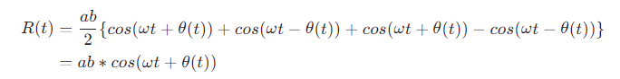

<!-- $$
\begin{align*}

R(t) &= \frac{ab}{2} \{ cos(\omega t + \theta(t)) + cos(\omega t - \theta(t)) + cos(\omega t + \theta(t)) - cos(\omega t - \theta(t)) \} \\[1ex]
&= ab * cos(\omega t + \theta(t))

\end{align*}
$$ -->

となります．

次に，RF Data Converter の ADC の I/Q ミキサが行う処理は以下の式で表されます．

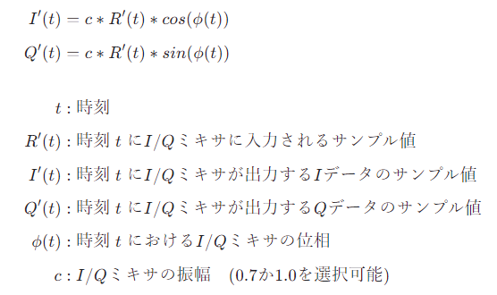

<!-- $$
\begin{align*}

I'(t) &= c * R'(t) * cos(\phi(t)) \\[1ex]
Q'(t) &= c * R'(t) * sin(\phi(t)) \\[4ex]

t &: 時刻 \\[1ex]
R'(t) &: 時刻 \;t\; に I/Q ミキサに入力されるサンプル値 \\[1ex]
I'(t) &: 時刻 \;t\; に I/Q ミキサが出力する I データのサンプル値 \\[1ex]
Q'(t) &: 時刻 \;t\; に I/Q ミキサが出力する Q データのサンプル値 \\[1ex]
\phi(t) &: 時刻 \;t\; における I/Q ミキサの位相 \\[1ex]
c &: I/Q ミキサの振幅　(0.7 か 1.0 を選択可能) \\[1ex]

\end{align*}
$$ -->


本スクリプトでは，DAC の出力を ADC に入力するので

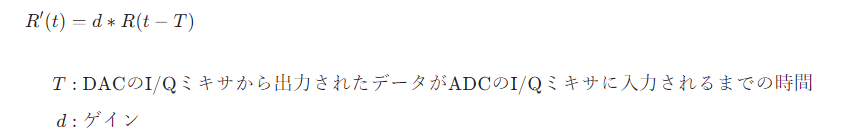

<!-- $$
\begin{align*}

R'(t) &= d * R(t - T) \\[4ex]

T &: \rm{DAC} の \rm{I/Q} ミキサから出力されたデータが \rm{ADC} の \rm{I/Q} ミキサに入力されるまでの時間 \\[1ex]
d &: ゲイン

\end{align*}
$$ -->

となります．

よって，ADC の I/Q ミキサの出力値は

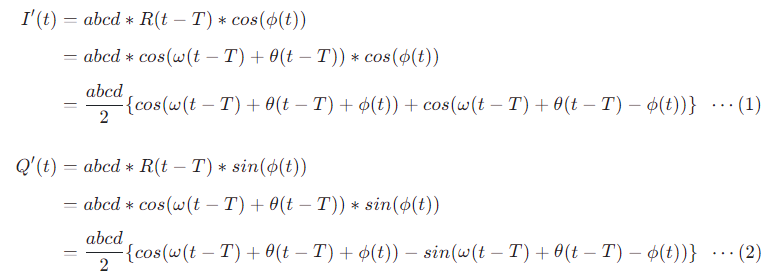

<!-- $$
\begin{align*}

I'(t) &= abcd * R(t-T) * cos(\phi(t)) \\[1ex]
&= abcd * cos(\omega (t-T) + \theta(t-T)) * cos(\phi(t)) \\[1ex]
&= \frac{abcd}{2}  \{ cos(\omega (t-T) + \theta(t-T) + \phi(t)) + cos(\omega (t-T) + \theta(t-T) - \phi(t))\} \;\; \cdots (1) \\[4ex]

Q'(t) &= abcd * R(t-T) * sin(\phi(t)) \\[1ex]
&= abcd * cos(\omega (t-T) + \theta(t-T)) * sin(\phi(t)) \\[1ex]
&= \frac{abcd}{2}  \{ cos(\omega (t-T) + \theta(t-T) + \phi(t)) - sin(\omega (t-T) + \theta(t-T) - \phi(t))\} \;\; \cdots (2) \\[1ex]


\end{align*}
$$ -->

となります．

ここで，ユーザ定義波形の周波数を **f<sub>u</sub>** ，DAC の I/Q ミキサの周波数を **f<sub>d</sub>** ，ADC の I/Q ミキサの周波数を **f<sub>a</sub>** とすると

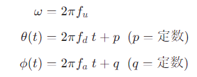

<!-- $$
\begin{align*}

\omega &= 2\pi f_u \\[1ex]
\theta(t) &= 2\pi f_d \;t+ p \;\; (p = 定数) \\[1ex]
\phi(t) &= 2\pi f_a \;t + q \;\; (q = 定数)\\[1ex]

\end{align*}
$$ -->

と表現でき，これを式 (1) と (2) に代入すると

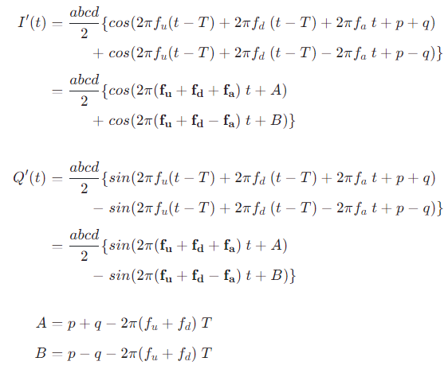

<!-- $$
\begin{align*}

& I'(t) &= \frac{abcd}{2} \{ &cos(2\pi f_u (t-T) + 2\pi f_d \;(t-T) + 2\pi f_a \;t + p + q) \\[1ex]
& & + \;&cos(2\pi f_u (t-T) + 2\pi f_d \;(t-T) - 2\pi f_a \;t + p - q) \} \\[1ex]
& &= \frac{abcd}{2} \{ &cos(2\pi \mathbf{(f_u + f_d + f_a)} \; t + A) \\[1ex]
& & + \;&cos(2\pi \mathbf{(f_u + f_d - f_a)} \; t + B) \} \\[4ex]


& Q'(t) &= \frac{abcd}{2} \{ &sin(2\pi f_u (t-T) + 2\pi f_d \;(t-T) + 2\pi f_a \;t + p + q) \\[1ex]
& & - \;&sin(2\pi f_u (t-T) + 2\pi f_d \;(t-T) - 2\pi f_a \;t + p - q) \} \\[1ex]
& &= \frac{abcd}{2} \{ &sin(2\pi \mathbf{(f_u + f_d + f_a)} \; t + A) \\[1ex]
& & - \;&sin(2\pi \mathbf{(f_u + f_d - f_a)} \; t + B) \} \\[4ex]

\end{align*}
$$

$$
\begin{align*}
A &= p + q - 2\pi (f_u + f_d) \; T \\[1ex]
B &= p - q - 2\pi (f_u + f_d) \; T
\end{align*}
$$ -->

が得られます．

よって，キャプチャデータの周波数成分のピークは，I データも Q データも (f<sub>u</sub> + f<sub>d</sub> + f<sub>a</sub>) と (f<sub>u</sub> + f<sub>d</sub> - f<sub>a</sub>) に表れることが分かります．

本スクリプトでは，I/Q ミキサおよびユーザ定義波形の周波数は

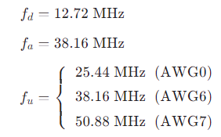

<!-- $$
\begin{align*}
f_d &= 12.72 \; \rm{MHz} \\[1ex]
f_a &= 38.16 \; \rm{MHz} \\[1ex]
f_u &= \left\{
\begin{array}{ll}
  25.44 \; \rm{MHz} \;\;(AWG 0)\\[1ex]
  38.16 \; \rm{MHz} \;\;(AWG 6)\\[1ex]
  50.88 \; \rm{MHz} \;\;(AWG 7)\\
\end{array} \\
\right. \\

\end{align*}
$$ -->

であるので，各キャプチャユニットのキャプチャデータの周波数のピーク値は以下の表の通りとなります．

|| キャプチャユニット 0 | キャプチャユニット 1 | キャプチャユニット 4 |
| -- | -- | -- | -- |
| 対応する AWG | AWG 6 | AWG 7 | AWG 0 |
| ピーク周波数 [MHz]| 12.72 <br> 89.04 | 25.44 <br> 101.76 | 0 (= 直流成分) <br> 76.32 |
