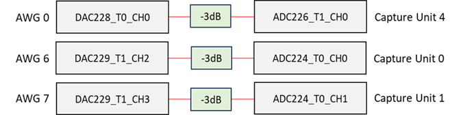
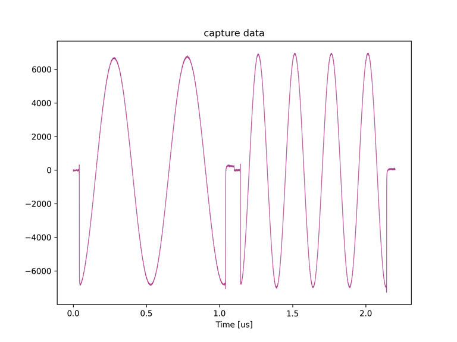
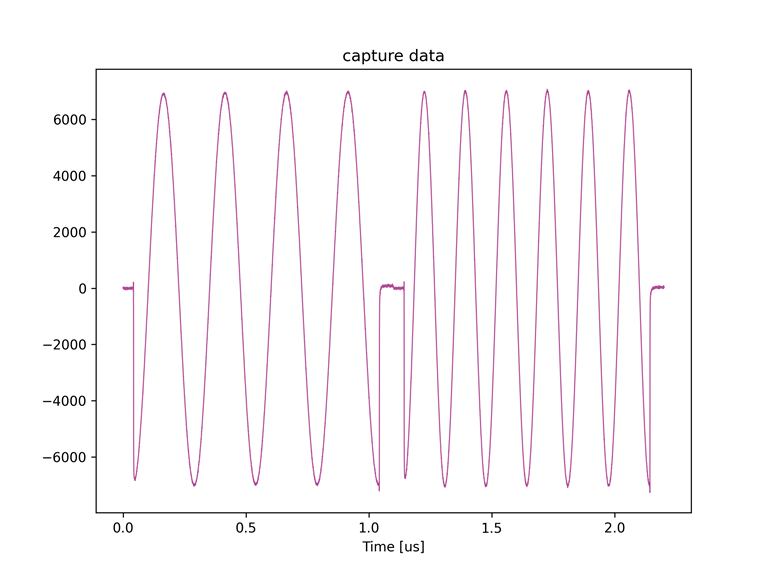
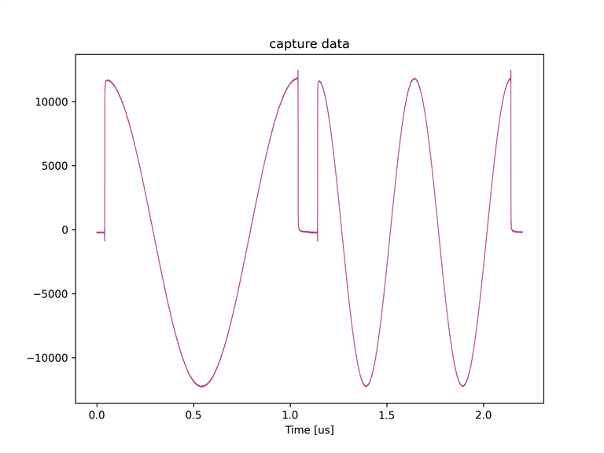
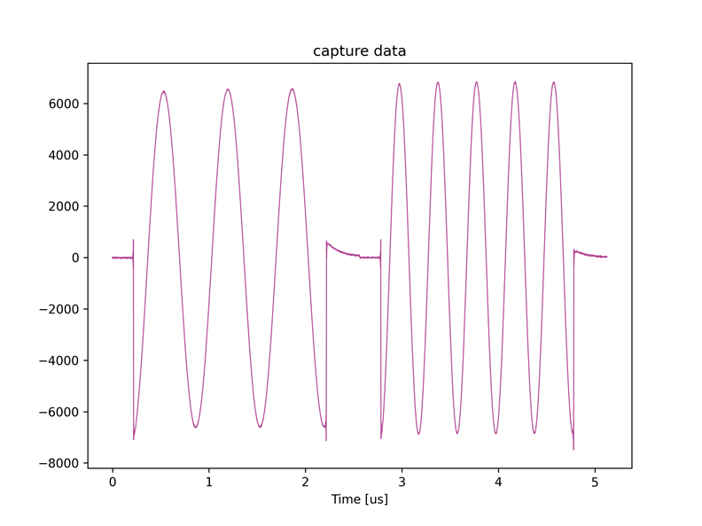
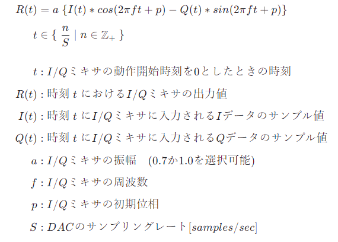
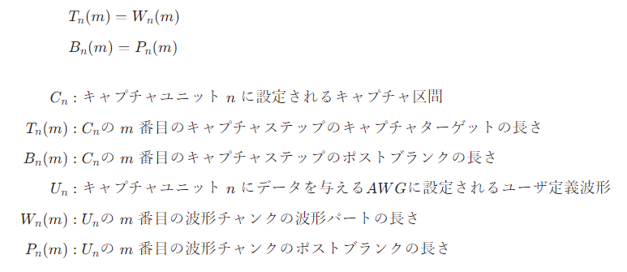
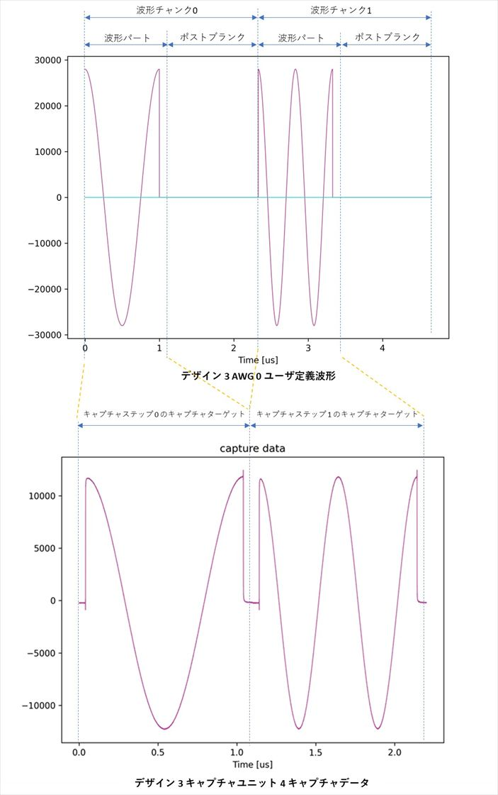

# Real データの波形を送受信する

[real_send_real_recv.py](./real_send_real_recv.py) は AWG (Arbitrary Waveform Generator) から余弦波を出力し，キャプチャユニットでキャプチャするスクリプトです．
本スクリプトは ZCU111 版 e7awg_hw の `デザイン 3 と 4` に対応しています．
各デザインのモジュール構成は，[e7awg_hw ユーザマニュアル](../../../manuals/zcu111/hw/README.md) を参照してください．


## セットアップ

以下の図のように DAC と ADC を接続します．



<br>

## 実行手順

以下のコマンドを実行します．

```
# デザイン 3 を使用する場合
python real_send_real_recv.py --design-type=dac6g-uram2

# デザイン 4 を使用する場合.  パケットフォワーディングを使用する場合, [ ] の中を追加します.
python real_send_real_recv.py --design-type=dqd  [--forward-packet]
```

<br>

## デザイン 3 を使用したときの実行結果

キャプチャユニット 0, 1, 4 がキャプチャした波形が，カレントディレクトリの下の `plot_capture_data` ディレクトリ以下にキャプチャユニットごとに作成されます．

#### キャプチャユニット 0



※ キャプチャユニット 0 のキャプチャデータは ZCU111 付属のバランの回路の特性により変位が反転しています．

#### キャプチャユニット 1



※ キャプチャユニット 1 のキャプチャデータは ZCU111 付属のバランの回路の特性により変位が反転しています．

#### キャプチャユニット 4



<br>

## デザイン ４ を使用したときの実行結果

キャプチャユニット 0 と 1 がキャプチャした波形が，カレントディレクトリの下の `plot_capture_data` ディレクトリ以下にキャプチャユニットごとに作成されます．

#### キャプチャユニット 0


※ キャプチャユニット 0 のキャプチャデータは ZCU111 付属のバランの回路の特性により変位が反転しています．

#### キャプチャユニット 1



※ キャプチャユニット 1 のキャプチャデータは ZCU111 付属のバランの回路の特性により変位が反転しています．

<br>

## DAC ミキサの設定値の詳細

RF Data Converter の DAC の I/Q ミキサが行う処理は以下の式で表されます．



<!--
$$
\begin{align*}

R(t) & = a \; \{ I(t) * cos(2\pi ft + p) - Q(t) * sin(2\pi ft + p) \} 　　　  \\[1ex]
t & \in \{ \; \frac{n}{S} \;|\; n \in \mathbb{Z} _ {+} \; \} \\[4ex]

t &: I/Q ミキサの動作開始時刻を 0 としたときの時刻 \\[1ex]
R(t) &: 時刻 \;t\; における I/Q ミキサの出力値 \\[1ex]
I(t) &: 時刻 \;t\; に I/Q ミキサに入力される I データのサンプル値 \\[1ex]
Q(t) &: 時刻 \;t\; に I/Q ミキサに入力される Q データのサンプル値 \\[1ex]
a &: I/Q ミキサの振幅　(0.7 か 1.0 を選択可能) \\[1ex]
f &: I/Q ミキサの周波数 \\[1ex]
p &: I/Q ミキサの初期位相 \\[1ex]
S &: DAC のサンプリングレート [samples/sec] \\[1ex]

\end{align*}
$$
-->

本スクリプトでは，
- a = 0.7
- f = 0
- p = 0

となるように I/Q ミキサのパラメータを設定しています．
よって，`R(t) = 0.7 * I(t)` となるため，DAC からはユーザ定義波形の I データだけが出力されます．

<br>

## ADC ミキサの設定値の詳細

本スクリプトでは RF Data Converter の ADC の I/Q ミキサは無効になっています．

<br>

## キャプチャ区間の詳細

本スクリプトで定義されるキャプチャ区間のキャプチャターゲットとポストブランクの長さは以下の式の通りです．



<!--
$$
\begin{align*}

& T_n(m) = W_n(m) \\[1ex]
& B_n(m) = P_n(m) \\[4ex]

C_n &:  キャプチャユニット \;n\; に設定されるキャプチャ区間 \\[1ex]
T_n(m) &: C_n の \;m\; 番目のキャプチャステップのキャプチャターゲットの長さ \\[1ex]
B_n(m) &: C_n の \;m\; 番目のキャプチャステップのポストブランクの長さ \\[1ex]
U_n &: キャプチャユニット \;n\; にデータを与える AWG に設定されるユーザ定義波形 \\[1ex]
W_n(m) &: U_n の \;m\; 番目の波形チャンクの波形パートの長さ \\[1ex]
P_n(m) &: U_n の \;m\; 番目の波形チャンクのポストブランクの長さ \\[1ex]

\end{align*}
$$
-->

キャプチャステップのキャプチャターゲットとポストブランクを上記のように設定することで，ユーザ定義波形の波形パートだけがキャプチャされます．
具体的なユーザ定義波形とキャプチャデータの対応関係を以下の図に示します．



