# AWG とディジタル出力モジュールから波形を出力する

[send_various_wave.py](./send_various_wave.py) は，8 つの AWG (Arbitrary Waveform Generator) から異なるパターンの波形を出力するスクリプトです．
本スクリプトは ZCU111 版 e7awg_hw の `デザイン 0, 2, 4` に対応しています．
各デザインのモジュール構成については，[e7awg_hw ユーザマニュアル](../../../manuals/zcu111/hw/README.md) を参照してください．

本スクリプトで，各 AWG の出力する波形と I/Q ミキサの設定は以下の通りです．

| AWG ID | I/Q 波形 | I/Q ミキシング |
| --- | --- | --- |
| 0 | 定数値  | なし |
| 1 | 定数値  | あり |
| 2 | 矩形波, ノコギリ波 | なし |
| 3 | 矩形波, ノコギリ波 | なし |
| 4 | 正弦波  | なし |
| 5 | 正弦波  | あり |
| 6 | 正弦波  | なし |
| 7 | 正弦波  | あり |

このサンプルスクリプトでは，I/Q ミキシング "なし" の DAC からは，RF Data Converter に入力した I/Q データの内，I 成分だけを出力しています．
そのために，I/Q ミキサの設定値のうち，周波数 `freq` を 0，初期位相 `phase_offset` を 0 にセットしています．
このことにより，出力される信号は，`I * amplitude + Q * 0` なる信号が出力されます．
このサンプルでは，amplitude に 0.7 に相当する `e7sz.MixerScale.V0P7` を設定しています．
amplitude に設定可能な値は，[rfdcdefs.py](../../../e7awgsw/rfdccommon/rfdcdefs.py) の MixerScale を参照してください．


## セットアップ

DAC, PMOD とオシロスコープを接続します．

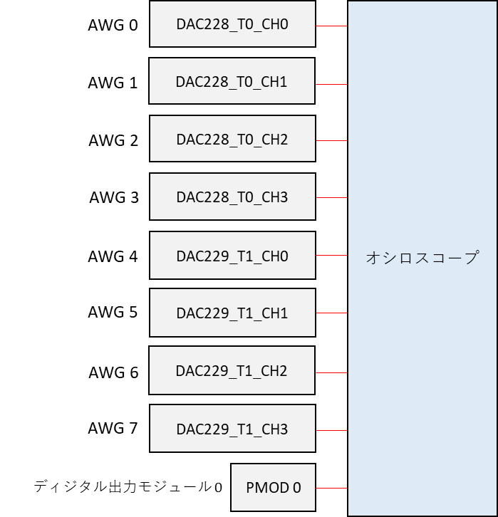

<br>

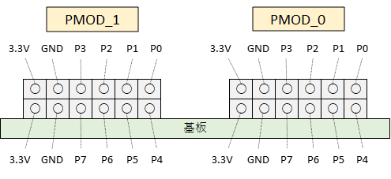

## 実行手順

以下のコマンドを実行します．

**デザイン 0 を使用する場合**

デザイン 0 は AWG 0 ~ 7 の中から同時に 5 つまで動作させることが可能です．
```
# AWG 0 ~ 4 を動作させる場合
python send_various_wave.py --awgs=0,1,2,3,4
```
<br>

**デザイン 2 を使用する場合**

デザイン 2 は AWG 0 ~ 5 の中の 5 つに加えて，AWG 6 と 7 を同時に動作させることが可能です．
```
# AWG 0, 1, 2, 3, 4, 6, 7 を動作させる場合
python send_various_wave.py --design-type=dac1g-uram2 --awgs=0,1,2,3,4,6,7
```

<br>

**デザイン 4 を使用する場合**

デザイン 4 は AWG 0, 1, 2, 3, 6, 7 を同時に動作させることが可能です．
```
# AWG 0, 1, 2, 3, 6, 7 を動作させる場合
python send_various_wave.py --design-type=dqd --awgs=0,1,2,3,6,7
```

<br>

## デザイン 0 または 2 を使用したときの実行結果

DAC と PMOD からの出力がオシロスコープで観察できます．


AWG 0, AWG 1 の波形

| 色 | 信号 |
| --- | --- |
| 黄色 | AWG 0 |
| 水色 | AWG 1 |

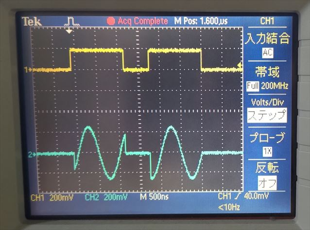

<br>

AWG 2, AWG 3 の波形

| 色 | 信号 |
| --- | --- |
| 黄色 | AWG 2 |
| 水色 | AWG 3 |

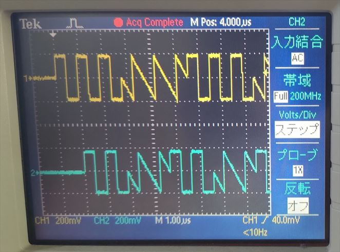

<br>

AWG 6, AWG 7 の波形 

| 色 | 信号 |
| --- | --- |
| 黄色 | AWG 6 |
| 水色 | AWG 7 |

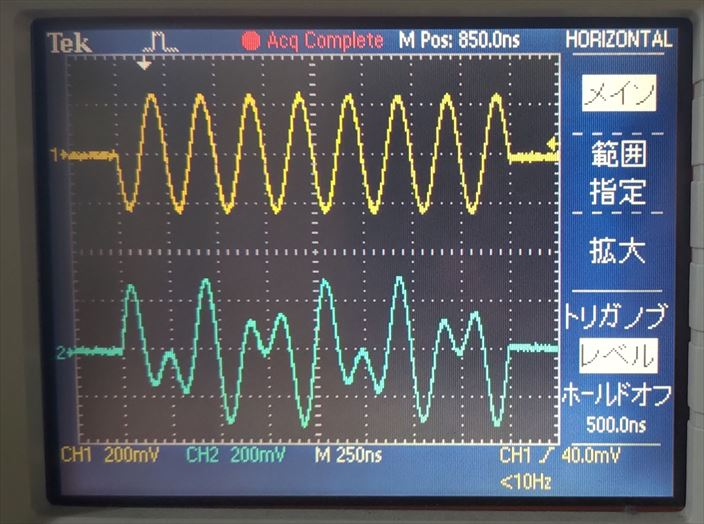

<br>

AWG 0, PMOD 0 (P0, P1) の波形

| 色 | 信号 |
| --- | --- |
| 黄色 | AWG 0 |
| ピンク | PMOD 0 P0 |
| 緑 | PMOD 0 P1 |

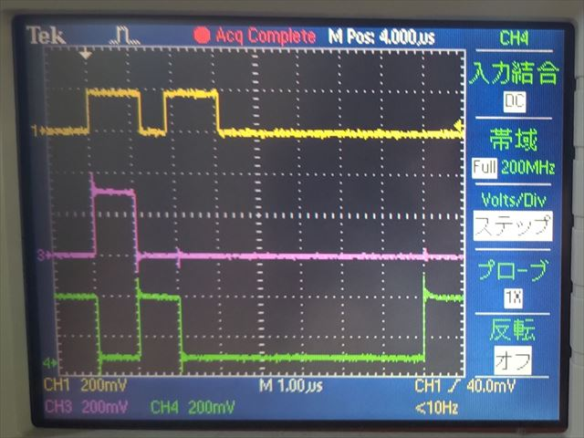

<br>

AWG 0, PMOD 0 (P2, P3) の波形

| 色 | 信号 |
| --- | --- |
| 黄色 | AWG 0 |
| ピンク | PMOD 0 P2 |
| 緑 | PMOD 0 P3 |

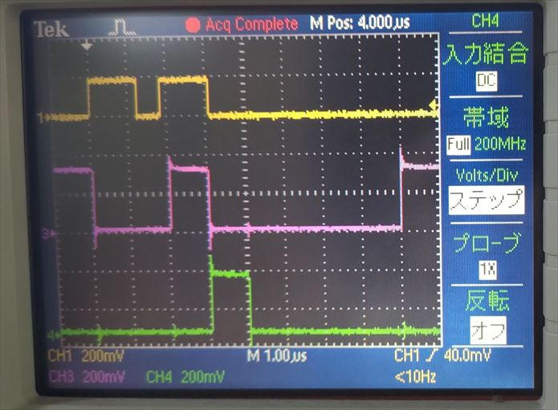

<br>

AWG 0, PMOD 0 (P4, P5) の波形

| 色 | 信号 |
| --- | --- |
| 黄色 | AWG 0 |
| ピンク | PMOD 0 P4 |
| 緑 | PMOD 0 P5 |

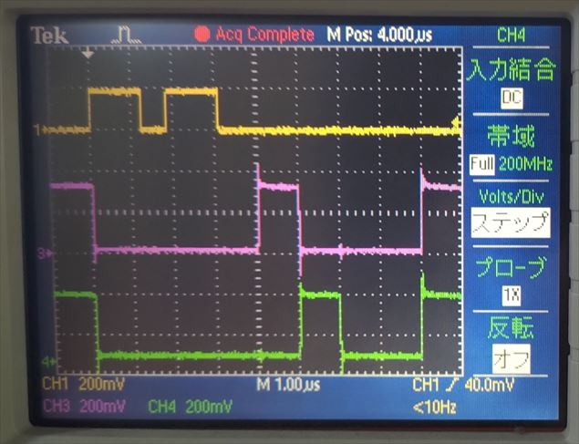

<br>

AWG 0, PMOD 0 (P6, P7) の波形

| 色 | 信号 |
| --- | --- |
| 黄色 | AWG 0 |
| ピンク | PMOD 0 P6 |
| 緑 | PMOD 0 P7 |

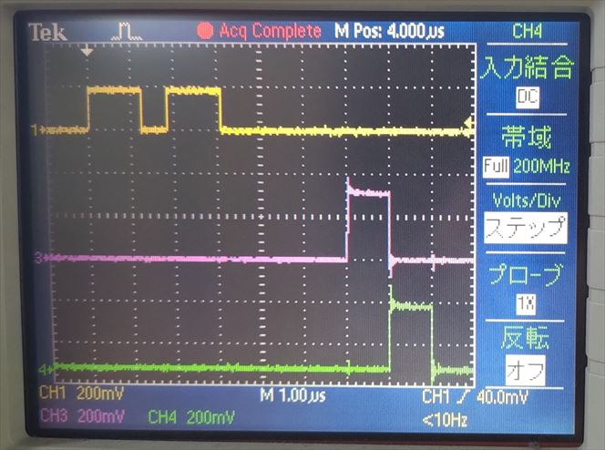

<br>

## デザイン 4 を使用したときの実行結果

DAC と PMOD からの出力がオシロスコープで観察できます．


AWG 0, AWG 1 の波形

| 色 | 信号 |
| --- | --- |
| 黄色 | AWG 0 |
| 水色 | AWG 1 |

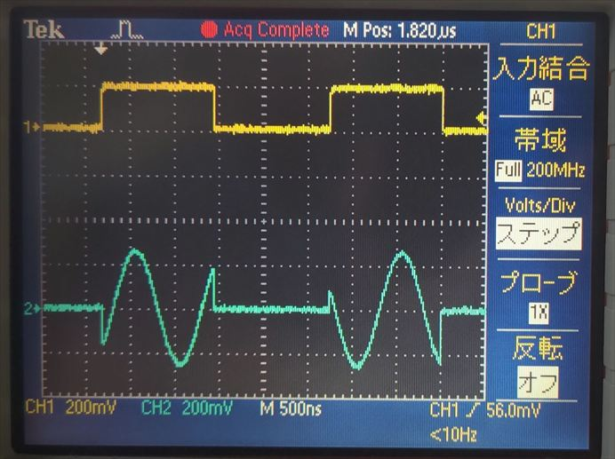

<br>

AWG 2, AWG 3 の波形

| 色 | 信号 |
| --- | --- |
| 黄色 | AWG 2 |
| 水色 | AWG 3 |

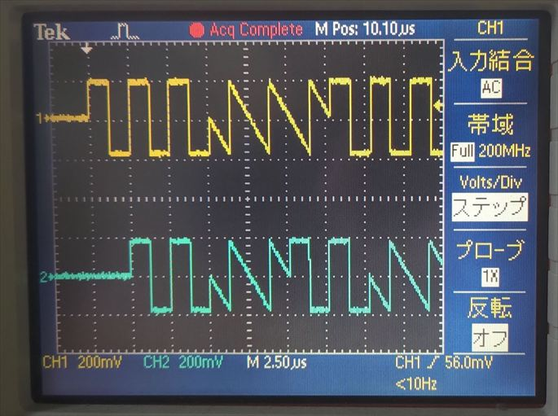

<br>

AWG 6, AWG 7 の波形 

| 色 | 信号 |
| --- | --- |
| 黄色 | AWG 6 |
| 水色 | AWG 7 |

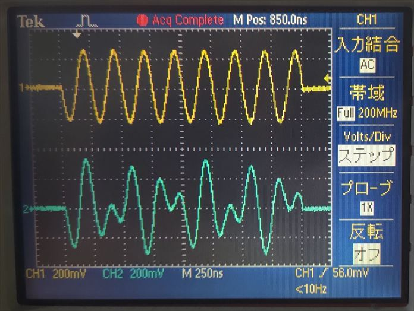

<br>

AWG 0, PMOD 0 (P0, P1) の波形

| 色 | 信号 |
| --- | --- |
| 黄色 | AWG 0 |
| ピンク | PMOD 0 P0 |
| 緑 | PMOD 0 P1 |

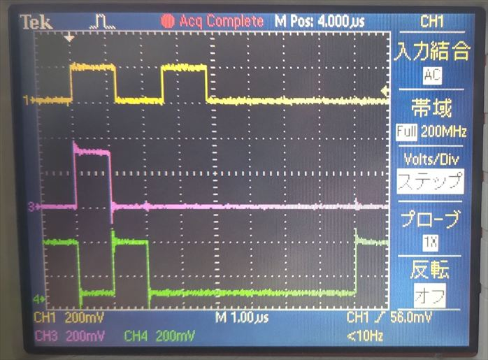

<br>

AWG 0, PMOD 0 (P2, P3) の波形

| 色 | 信号 |
| --- | --- |
| 黄色 | AWG 0 |
| ピンク | PMOD 0 P2 |
| 緑 | PMOD 0 P3 |

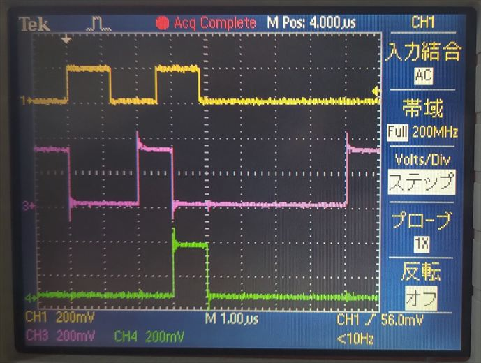

<br>

AWG 0, PMOD 0 (P4, P5) の波形

| 色 | 信号 |
| --- | --- |
| 黄色 | AWG 0 |
| ピンク | PMOD 0 P4 |
| 緑 | PMOD 0 P5 |

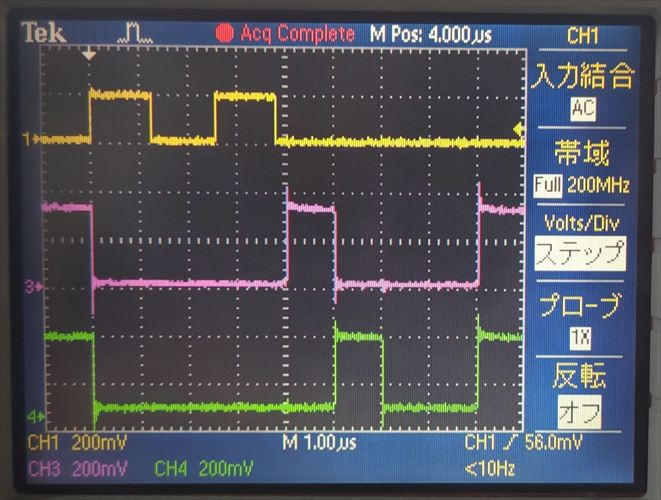

<br>

AWG 0, PMOD 0 (P6, P7) の波形

| 色 | 信号 |
| --- | --- |
| 黄色 | AWG 0 |
| ピンク | PMOD 0 P6 |
| 緑 | PMOD 0 P7 |

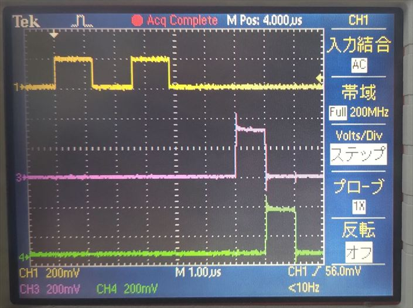
