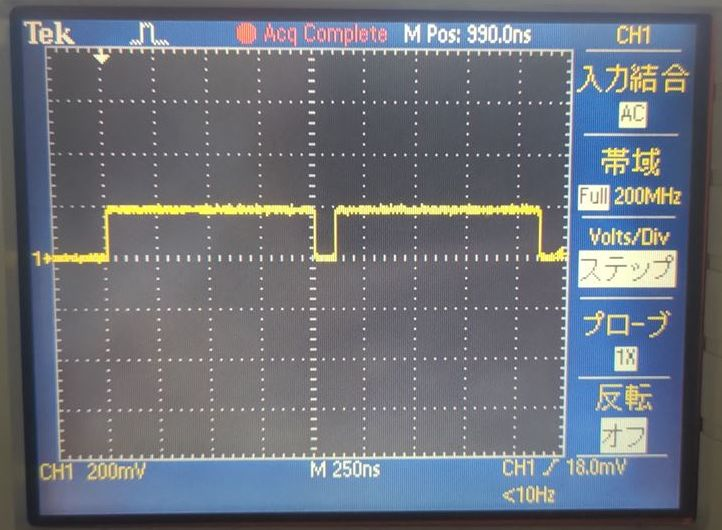
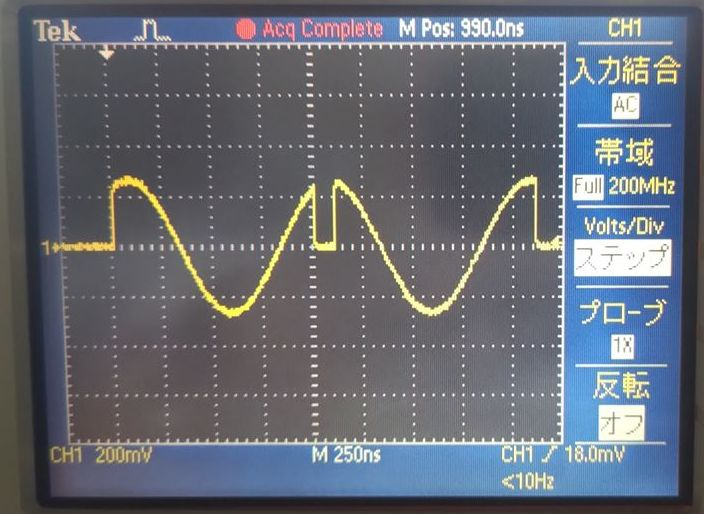
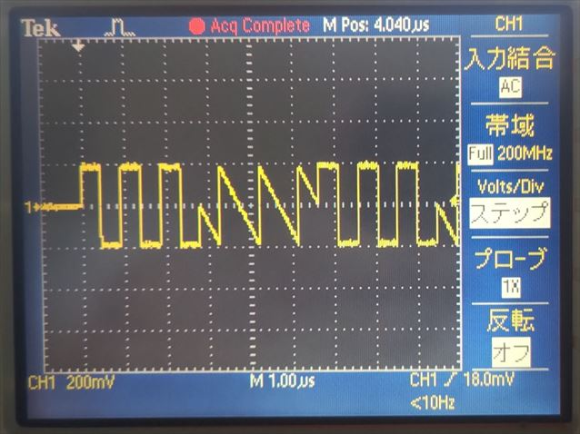
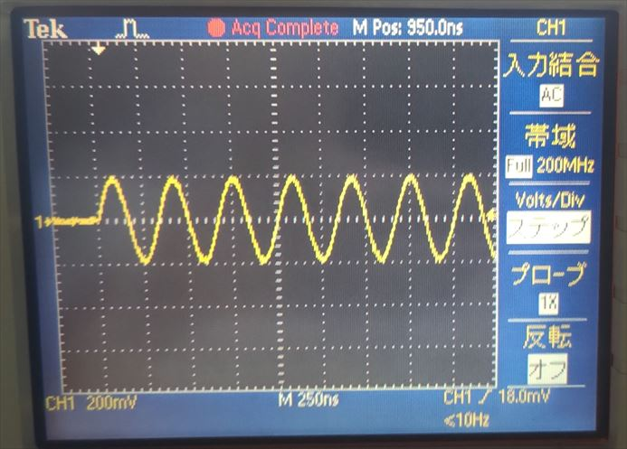
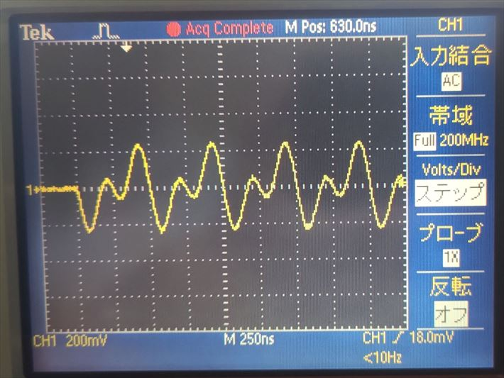
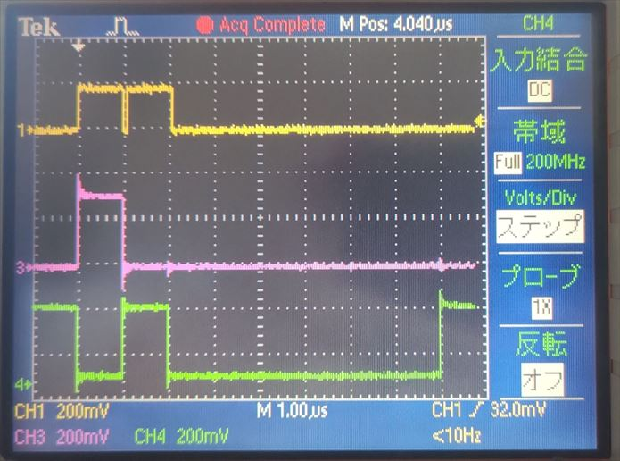
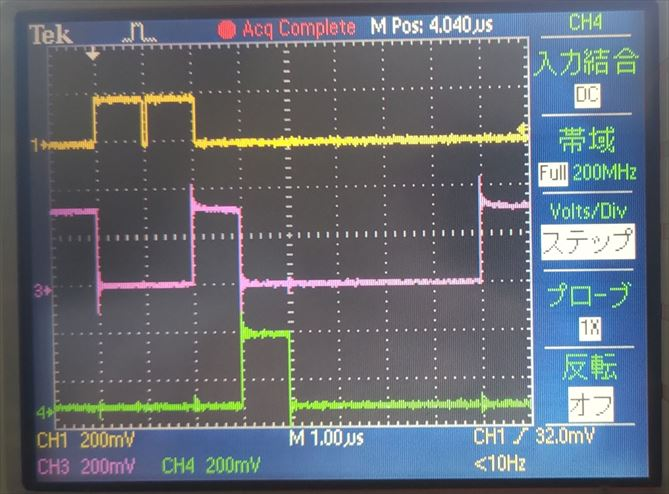
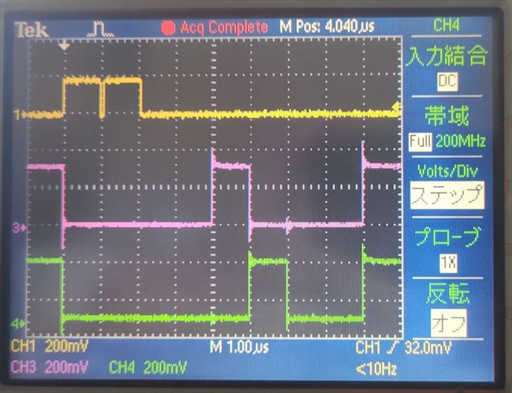
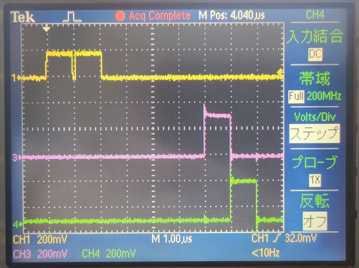

# AWG とディジタル出力モジュールから波形を出力する

[send_various_wave.py](./send_various_wave.py) は，AWG (Arbitrary Waveform Generator) から異なるパターンの波形を出力するスクリプトです．

本スクリプトは，DAC 6Gsps の FPGA デザインにのみ対応しています．
DAC 1Gsps の FPGA デザインで複数のパターンの波形を出力するスクリプトは，[send_various_wave.py](../send_various_wave/send_various_wave.py) を参照してください．

本スクリプトは，プログラム引数で AWG が出力する波形とミキサのパラメータが以下の表のように変わります．

| プログラム引数 | I/Q 波形 | I/Q ミキシング |
| --- | --- | --- |
| 0 | 定数値  | なし |
| 1 | 定数値  | あり |
| 2 | 矩形波, ノコギリ波 | なし |
| 3 | 正弦波  | なし |
| 4 | 正弦波  | あり |

本サンプルスクリプトでは，I/Q ミキシング "なし" の DAC からは，RF Data Converter に入力した I/Q データの内，I 成分だけを出力しています．
そのために，I/Q ミキサの設定値のうち，周波数 `freq` を 0，初期位相 `phase_offset` を 0 にセットしています．
このことにより，出力される信号は，`I * amplitude + Q * 0` なる信号が出力されます．
このサンプルでは，amplitude に 0.7 に相当する `e7sz.MixerScale.V0P7` を設定しています．
amplitude に設定可能な値は，[rfdcdefs.py](../../../e7awgsw/zcu111/rfdcdefs.py) の MixerScale を参照してください．


## セットアップ

DAC, PMOD とオシロスコープを接続します．


<br>


## 実行手順と結果

以下のコマンドを実行します．

```
python send_various_wave_dac_6g.py [オプション (0 ~ 4)]
```

DAC と PMOD からの出力がオシロスコープで観察できます．

オプション: 0

| 色 | 信号 |
| --- | --- |
| 黄色 | AWG 0 |



<br>

オプション: 1

| 色 | 信号 |
| --- | --- |
| 黄色 | AWG 0 |



<br>

オプション: 2

| 色 | 信号 |
| --- | --- |
| 黄色 | AWG 0 |



<br>

オプション: 3

| 色 | 信号 |
| --- | --- |
| 黄色 | AWG 0 |



<br>

オプション: 4

| 色 | 信号 |
| --- | --- |
| 黄色 | AWG 0 |



<br>

AWG 0, PMOD 0 (P0, P1) の波形

| 色 | 信号 |
| --- | --- |
| 黄色 | AWG 0 |
| ピンク | PMOD 0 P0 |
| 緑 | PMOD 0 P1 |


STG
<br>

AWG 0, PMOD 0 (P2, P3) の波形

| 色 | 信号 |
| --- | --- |
| 黄色 | AWG 0 |
| ピンク | PMOD 0 P2 |
| 緑 | PMOD 0 P3 |



<br>

AWG 0, PMOD 0 (P4, P5) の波形

| 色 | 信号 |
| --- | --- |
| 黄色 | AWG 0 |
| ピンク | PMOD 0 P4 |
| 緑 | PMOD 0 P5 |



<br>

AWG 0, PMOD 0 (P6, P7) の波形

| 色 | 信号 |
| --- | --- |
| 黄色 | AWG 0 |
| ピンク | PMOD 0 P6 |
| 緑 | PMOD 0 P7 |


