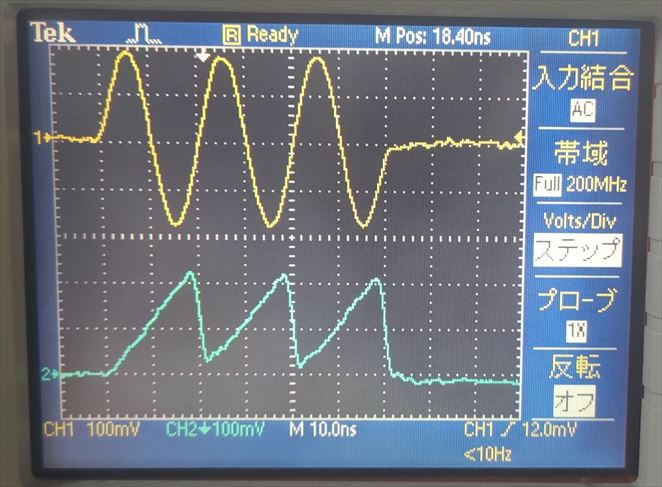

# AWG から余弦波を出力する

[sin_sawtooth.py](./sin_sawtooth.py) は AWG (Arbitrary Waveform Generator) から正弦波とノコギリ波を出力するスクリプトです．
本スクリプトは ZCU111 版 e7awg_hw の `デザイン 3` に対応しています．
デザイン 3 のモジュール構成については，[e7awg_hw ユーザマニュアル](https://github.com/e-trees/e7awg_sw/tree/simple_multi/manuals/zcu111/hw) を参照してください．

## セットアップ

以下の図のように DAC とオシロスコープを接続します．


## 実行手順と結果

以下のコマンドを実行します．

```
python sin_sawtooth.py --num-cycles=[サイクル数 0 ~ 17592186040320]

# 0 を指定すると非常に長い間 (約 5.4e7 年) 波形が出力されます
```

AWG が動作を開始するとオシロスコープで下図の波形が観測できます．

| 色 | 信号 |
| --- | --- |
| 黄色 | AWG 0 |
| 水色 | AWG 6 |



サイクル数 = 3

AWG 6 の波形は, ZCU111 に付属するバランの特性により振幅が反転するので, オシロスコープで再度反転させたものを写しています．

<br>

## AWG の波形出力を途中で止める方法

以下のコマンドを実行します．

```
python python terminate_awgs.py
```
