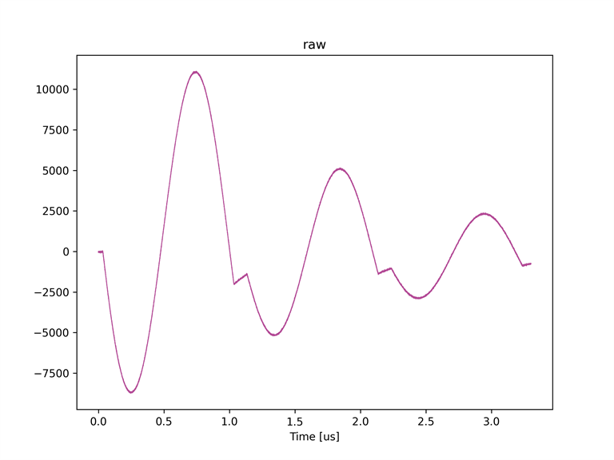
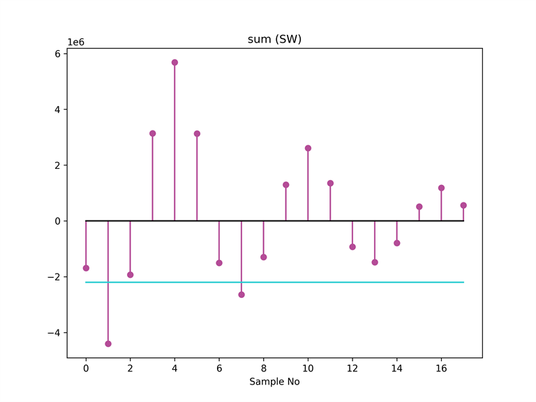
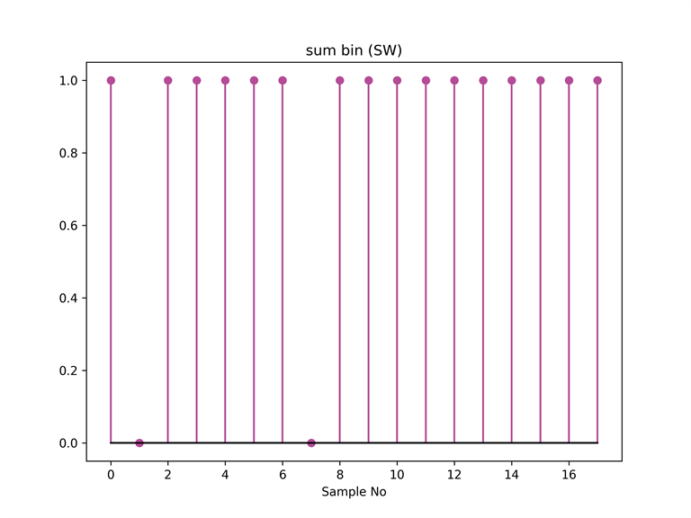
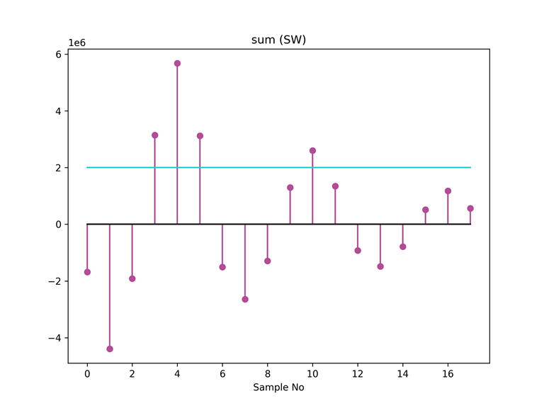
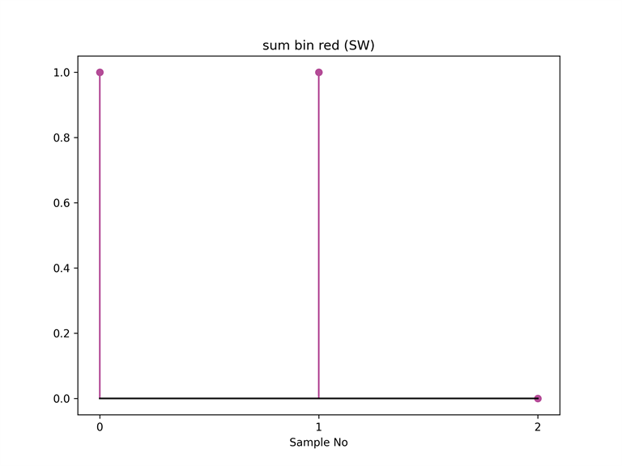

# キャプチャユニットの総和，二値化，リダクション処理を有効にする

[sum_bin_red_recv.py](./sum_bin_red_recv.py) はキャプチャユニットの総和，二値化，リダクション処理を有効にして波形データを保存するスクリプトです．
本スクリプトでは，同じ波形シーケンスを設定した AWG 6 と 7 から波形を出力し，それぞれキャプチャユニット 0 と 1 が受信します．
キャプチャユニット 0 は総和と二値化処理を適用して波形データをキャプチャし，キャプチャユニット 1 は生データをキャプチャします．
その後，キャプチャユニット 1 が保存した生データにソフトウェアで総和と二値化処理を適用し，キャプチャユニット 0 がキャプチャしたデータと比較を行います．

本スクリプトは ZCU111 版 e7awg_hw の `デザイン 3` に対応しています．
`デザイン 3` のモジュール構成は，[e7awg_hw ユーザマニュアル](../../../manuals/zcu111/hw/README.md) を参照してください．

## セットアップ

以下の図のように DAC と ADC を接続します．


<br>

## 実行手順

以下のコマンドを実行します．
`reduction` オプションによりリダクション処理の内容が変わります．
`all` の場合，キャプチャターゲットのサンプルの値が全て 1 以上のとき，そのキャプチャターゲットのリダクション処理の結果が 1 になります．
`any` の場合，キャプチャターゲットに値が 1 以上のサンプルが 1 つ以上あるとき，そのキャプチャターゲットのリダクション処理の結果が 1 になります．

```
python sum_bin_recv_red.py --reduction=all  or  --reduction=any
```

キャプチャユニット 0, 1 がキャプチャしたデータが，カレントディレクトリの下の `plot_capture_data` ディレクトリ以下にキャプチャユニットごとに作成されます．

<br>

## Reduction = all の場合の結果

#### キャプチャユニット 0 がキャプチャしたデータ


※ ★で示した点は，キャプチャユニット 1 が保存した生データにソフトウェアで総和と二値化を適用したデータを表します．

<br>

#### キャプチャユニット 1 がキャプチャした生データ



<br>

#### キャプチャユニット 1 がキャプチャした生データにソフトウェアで総和処理を適用したデータ



※ 水色の線は，キャプチャユニット 0 に設定した二値化閾値を表します．

<br>

#### キャプチャユニット 1 がキャプチャした生データにソフトウェアで総和と二値化処理を適用したデータ



**サンプルナンバーとキャプチャターゲットの対応**

| Sample No | キャプチャターゲット |
|--|--|
| 0 ~ 5 | 0 |
| 6 ~ 11 | 1 |
| 12 ~ 17 | 2 |

<br>

#### キャプチャユニット 1 がキャプチャした生データにソフトウェアで総和，二値化，リダクション処理を適用したデータ


<br>


## Reduction = any の場合の結果

#### キャプチャユニット 0 がキャプチャしたデータ


※ ★で示した点は，キャプチャユニット 1 が保存した生データにソフトウェアで総和と二値化を適用したデータを表します．

<br>


#### キャプチャユニット 1 がキャプチャした生データ


<br>

#### キャプチャユニット 1 がキャプチャした生データにソフトウェアで総和処理を適用したデータ



※ 水色の線は，キャプチャユニット 0 に設定した二値化閾値を表します．

<br>

#### キャプチャユニット 1 がキャプチャした生データにソフトウェアで総和と二値化処理を適用したデータ


**サンプルナンバーとキャプチャターゲットの対応**

| Sample No | キャプチャターゲット |
|--|--|
| 0 ~ 5 | 0 |
| 6 ~ 11 | 1 |
| 12 ~ 17 | 2 |

<br>

#### キャプチャユニット 1 がキャプチャした生データにソフトウェアで総和，二値化，リダクション処理を適用したデータ


