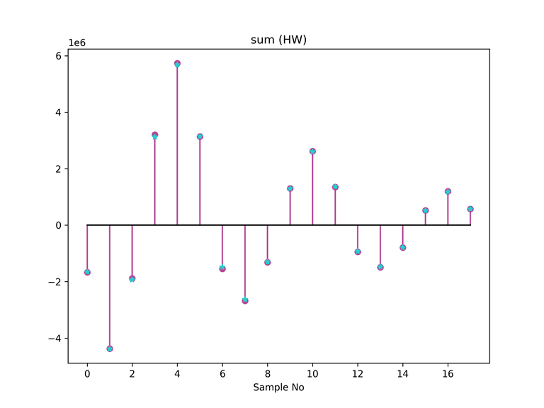
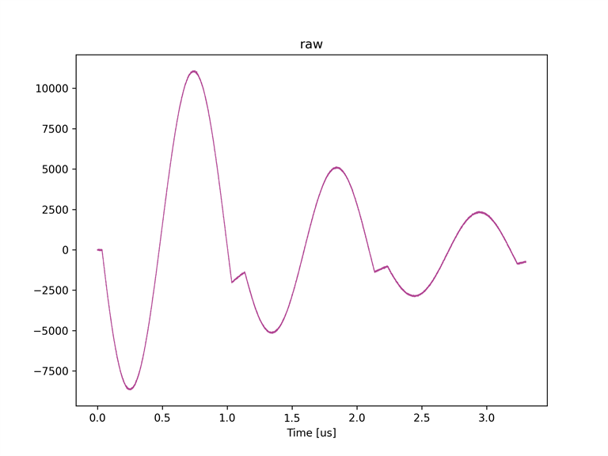
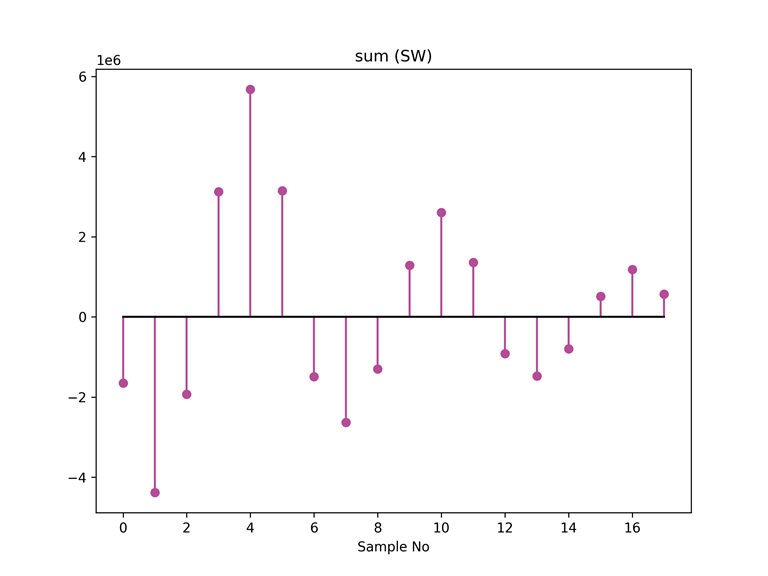

# キャプチャユニットの総和処理を有効にする

[sum_recv.py](./sum_recv.py) はキャプチャユニットの総和処理を有効にして波形データを保存するスクリプトです．
本スクリプトでは，同じ波形シーケンスを設定した AWG 6 と 7 から波形を出力し，それぞれキャプチャユニット 0 と 1 が受信します．
キャプチャユニット 0 は総和処理を適用して波形データをキャプチャし，キャプチャユニット 1 は生データをキャプチャします．
その後，キャプチャユニット 1 が保存した生データから，ソフトウェアで総和データを算出し，キャプチャユニット 0 がキャプチャした総和データと比較を行います．

本スクリプトは ZCU111 版 e7awg_hw の `デザイン 3` に対応しています．
`デザイン 3` のモジュール構成は，[e7awg_hw ユーザマニュアル](../../../manuals/zcu111/hw/README.md) を参照してください．

## セットアップ

以下の図のように DAC と ADC を接続します．


## 実行手順と結果

以下のコマンドを実行します．

```
python sum_recv.py
```

キャプチャユニット 0, 1 がキャプチャしたデータが，カレントディレクトリの下の `plot_capture_data` ディレクトリ以下にキャプチャユニットごとに作成されます．

#### キャプチャユニット 0 がキャプチャした総和データ



※ ★で示した点は，キャプチャユニット 1 が保存した生データからソフトウェアで算出した総和データを表します．

<br>

#### キャプチャユニット 1 がキャプチャした生データ




#### キャプチャユニット 1 がキャプチャした生データにソフトウェアで総和処理を適用したデータ


