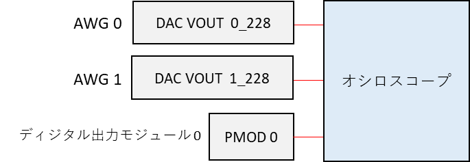
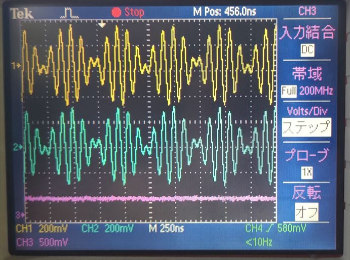

# AWG を強制停止する

[awg_termination.py](./awg_termination.py) は波形を出力中の AWG を強制停止するスクリプトです．

## セットアップ

DAC, PMOD とオシロスコープを接続します．



<br>


## 実行手順と結果

以下のコマンドを実行します．

```
# デザイン 0 を使用する場合
python awg_termination.py
```

DAC から下図のような波形が連続的に出力されます．
PMOD は 全てのポートが Hi になります．
「press Enter to stop AWGs.」と表示されたら Enter を押してください．
DAC の波形出力と PMOD からのディジタル値の出力が止まります．

| 色 | 信号 | 
| --- | --- | 
| 黄色 | AWG 0 |
| 水色 | AWG 1 |
| ピンク | PMOD 0 P0 |


