# AWG とディジタル出力モジュールから波形を出力する

[send_various_wave.py](./send_various_wave.py) は，8 つの AWG (Arbitrary Waveform Generator) から異なるパターンの波形を出力するスクリプトです．

本スクリプトで，各 AWG の出力する波形と I/Q ミキサの設定は以下の通りです．
AWG 8 ~ 15 が出力する波形は, AWG 0 ~ 7 が出力する波形の変位を反転させたものになっています．

| AWG ID | I/Q 波形 | I/Q ミキシング |
| --- | --- | --- |
| 0 | 定数値  | なし |
| 1 | 定数値  | あり |
| 2 | 矩形波, ノコギリ波 | なし |
| 3 | 矩形波, ノコギリ波 | なし |
| 4 | 正弦波  | なし |
| 5 | 正弦波  | あり |
| 6 | 余弦波  | なし |
| 7 | 余弦波  | あり |
| 8 | 定数値  | なし |
| 9 | 定数値  | あり |
| 10 | 矩形波, ノコギリ波 | なし |
| 11 | 矩形波, ノコギリ波 | なし |
| 12 | 正弦波  | なし |
| 13 | 正弦波  | あり |
| 14 | 余弦波  | なし |
| 15 | 余弦波  | あり |

このサンプルスクリプトでは，I/Q ミキシング "なし" の DAC からは，RF Data Converter に入力した I/Q データの内，I 成分だけを出力しています．
そのために，I/Q ミキサの設定値のうち，周波数 `freq` を 0，初期位相 `phase_offset` を 0 にセットしています．
このことにより，出力される信号は，`I * amplitude + Q * 0` なる信号が出力されます．
このサンプルでは，amplitude に 0.7 に相当する `e7sz.MixerScale.V0P7` を設定しています．
amplitude に設定可能な値は，[rfdcdefs.py](../../../e7awgsw/rfdccommon/rfdcdefs.py) の MixerScale を参照してください．


## セットアップ

DAC, PMOD とオシロスコープを接続します．

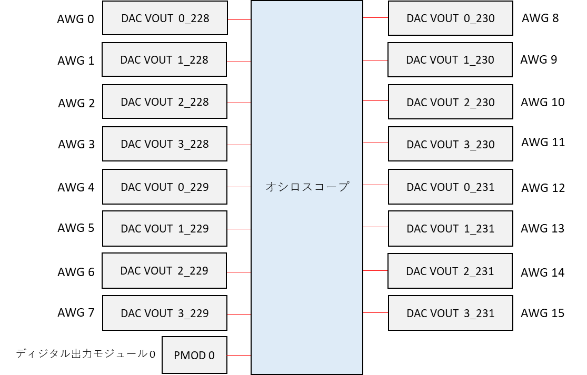

<br>

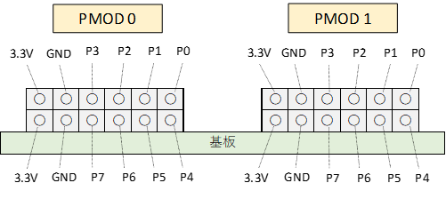

## 実行手順と結果

以下のコマンドを実行します．

```
python send_various_wave.py
```
<br>

DAC と PMOD からの出力がオシロスコープで観察できます．


AWG 0, AWG 1 の波形

| 色 | 信号 |
| --- | --- |
| 黄色 | AWG 0 |
| 水色 | AWG 1 |

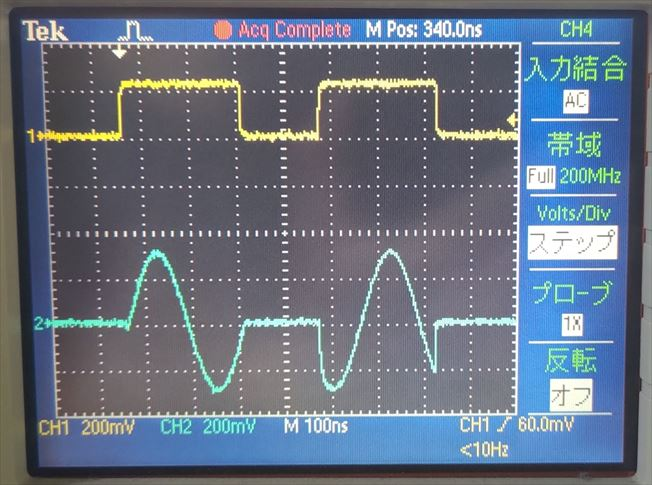

<br>

AWG 2, AWG 3 の波形

| 色 | 信号 |
| --- | --- |
| ピンク | AWG 2 |
| 緑 | AWG 3 |

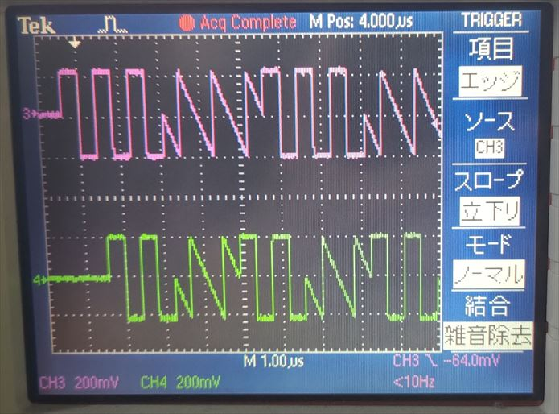

<br>

AWG 4, AWG 5 の波形 

| 色 | 信号 |
| --- | --- |
| 黄色 | AWG 4 |
| 水色 | AWG 5 |

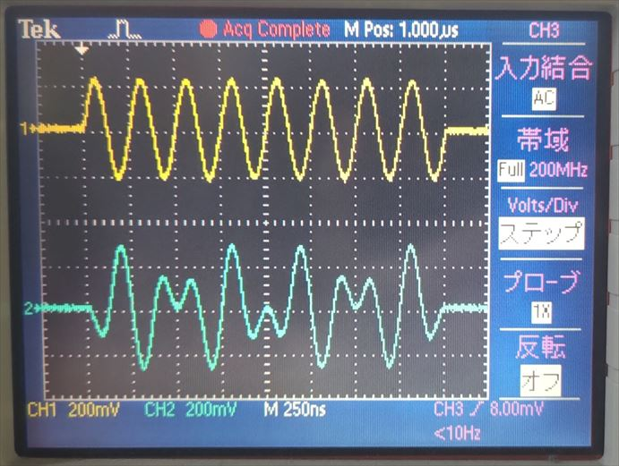

<br>

AWG 6, AWG 7 の波形 

| 色 | 信号 |
| --- | --- |
| ピンク | AWG 6 |
| 緑 | AWG 7 |

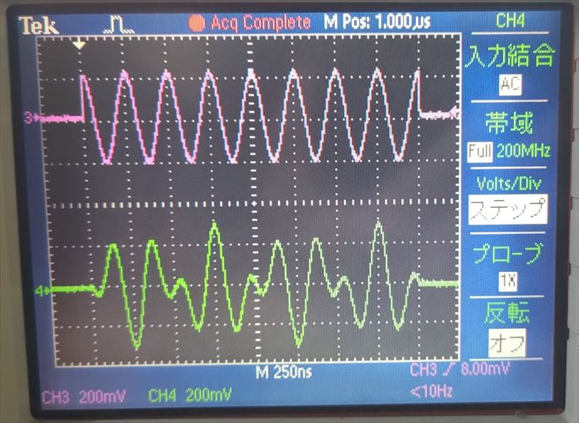

<br>

AWG 8, AWG 9 の波形 

| 色 | 信号 |
| --- | --- |
| 黄色 | AWG 8 |
| 水色 | AWG 9 |

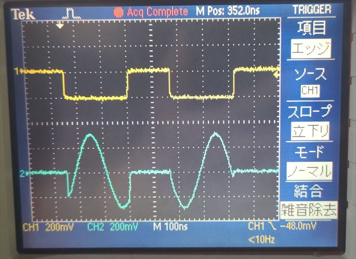

<br>

AWG 10, AWG 11 の波形 

| 色 | 信号 |
| --- | --- |
| ピンク | AWG 10 |
| 緑 | AWG 11 |

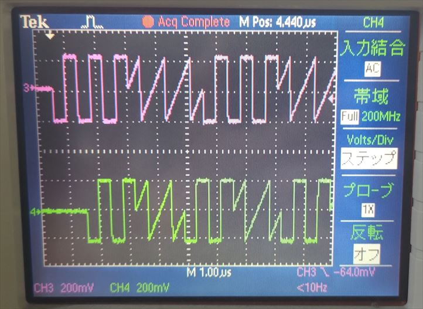

<br>

AWG 12, AWG 13 の波形 

| 色 | 信号 |
| --- | --- |
| 黄色 | AWG 12 |
| 水色 | AWG 13 |

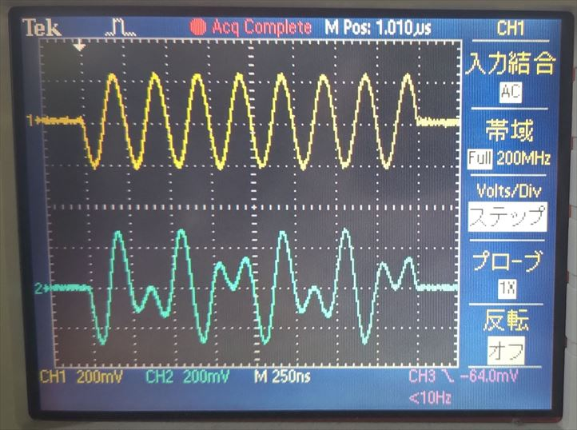

<br>

AWG 14, AWG 15 の波形 

| 色 | 信号 |
| --- | --- |
| ピンク | AWG 14 |
| 緑 | AWG 15 |

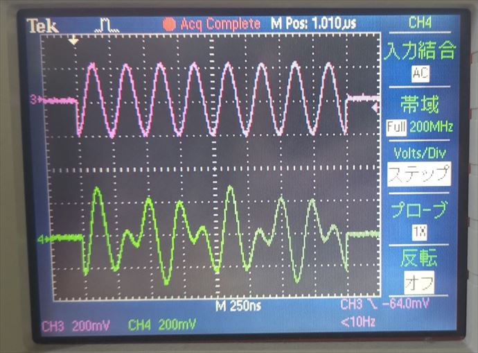

<br>

AWG 4, PMOD 0 (P0, P1) の波形

| 色 | 信号 |
| --- | --- |
| 黄色 | AWG 4 |
| ピンク | PMOD 0 P0 |
| 緑 | PMOD 0 P1 |

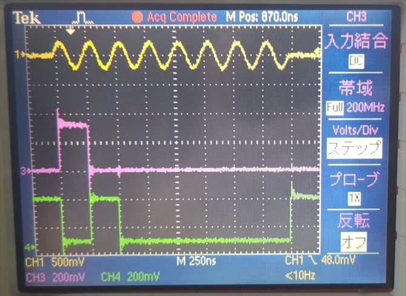

<br>

AWG 4, PMOD 0 (P2, P3) の波形

| 色 | 信号 |
| --- | --- |
| 黄色 | AWG 4 |
| ピンク | PMOD 0 P2 |
| 緑 | PMOD 0 P3 |

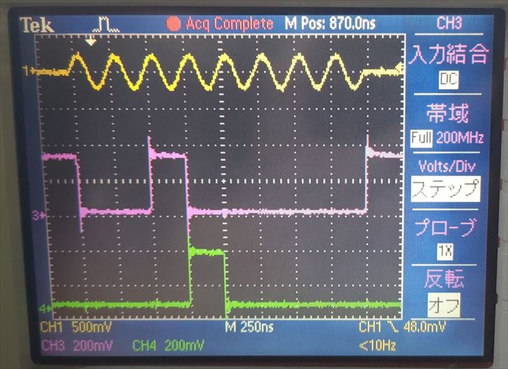

<br>

AWG 4, PMOD 0 (P4, P5) の波形

| 色 | 信号 |
| --- | --- |
| 黄色 | AWG 4 |
| ピンク | PMOD 0 P4 |
| 緑 | PMOD 0 P5 |

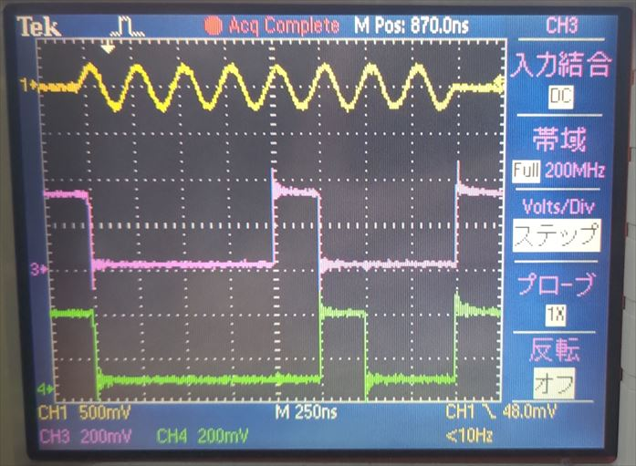

<br>

AWG 4, PMOD 0 (P6, P7) の波形

| 色 | 信号 |
| --- | --- |
| 黄色 | AWG 4 |
| ピンク | PMOD 0 P6 |
| 緑 | PMOD 0 P7 |

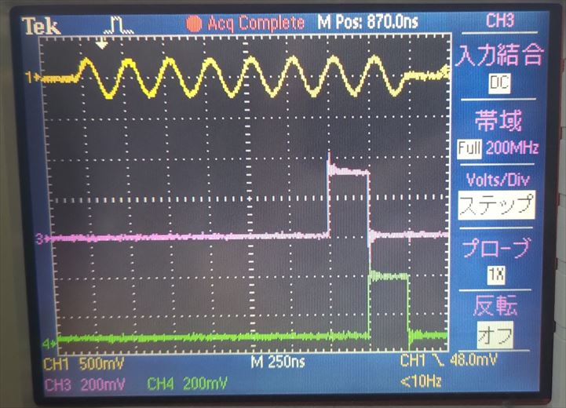
