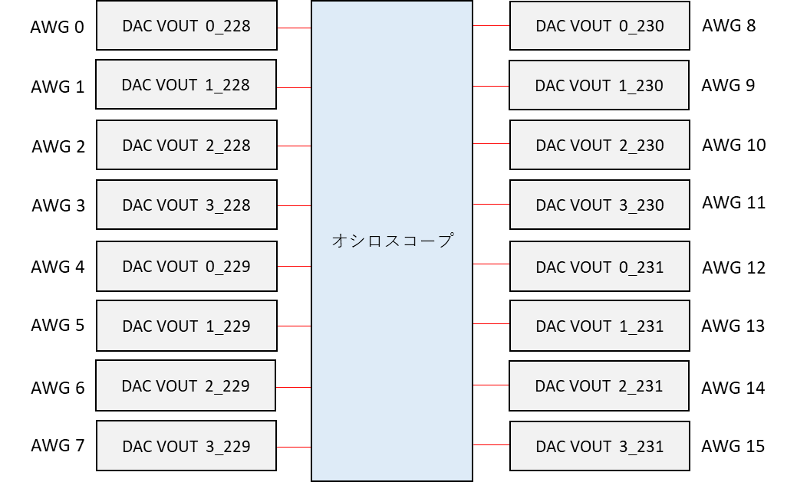
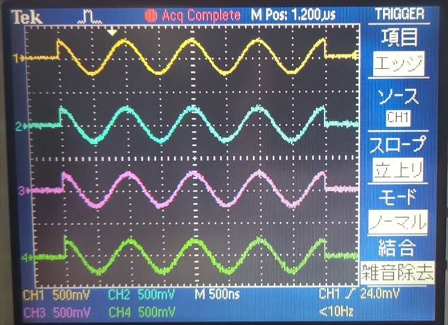
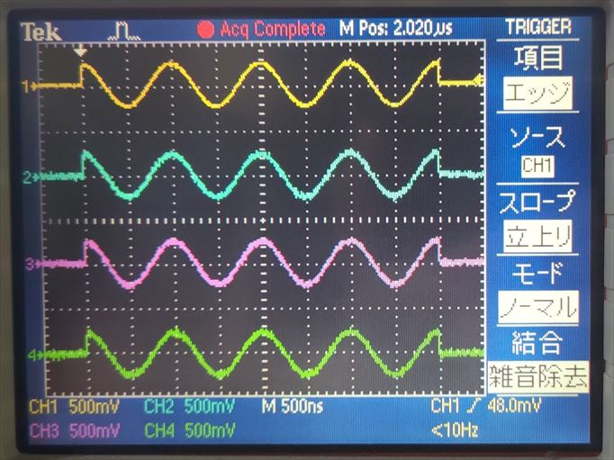
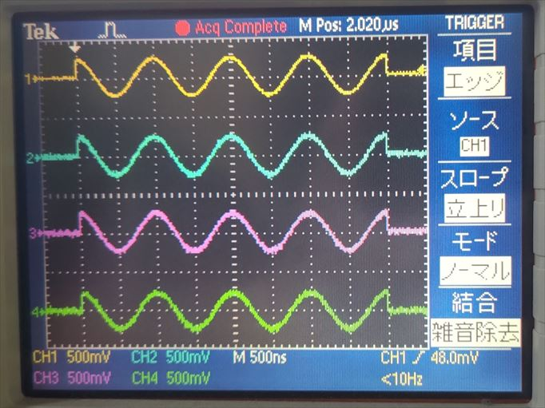
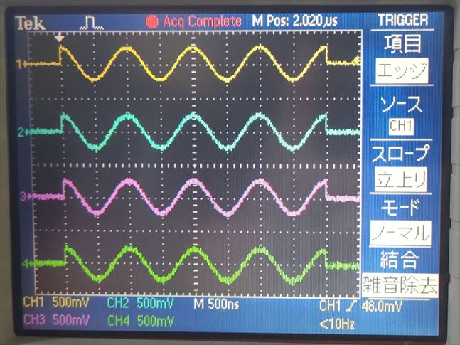

# AWG から余弦波を出力する

[send_wave.py](./send_wave.py) は AWG (Arbitrary Waveform Generator) から余弦波を出力するスクリプトです．
本スクリプトは ZCU216 版 e7awg_hw に対応しています．

## セットアップ

以下の図のように DAC とオシロスコープを接続します．



## 実行手順と結果

以下のコマンドを実行します．パケットフォワーディングを使用する場合，[ ] の中を追加します．

```
python send_wave.py  [--forward-packet]
```

AWG が動作を開始するとオシロスコープで下図の波形が観測できます．

| 色 | 信号 |
| --- | --- |
| 黄色 | AWG 0 |
| 水色 | AWG 1 |
| ピンク | AWG 2 |
| 緑 | AWG 3 |



<br>

| 色 | 信号 |
| --- | --- |
| 黄色 | AWG 4 |
| 水色 | AWG 5 |
| ピンク | AWG 6 |
| 緑 | AWG 7 |



<br>

| 色 | 信号 |
| --- | --- |
| 黄色 | AWG 8 |
| 水色 | AWG 9 |
| ピンク | AWG 10 |
| 緑 | AWG 11 |



<br>

| 色 | 信号 |
| --- | --- |
| 黄色 | AWG 12 |
| 水色 | AWG 13 |
| ピンク | AWG 14 |
| 緑 | AWG 15 |



<br>

## ミキサの設定値の詳細

RF Data Converter の I/Q ミキサの処理は以下の式で表されます．


<!--
$$
\begin{align*}

R(t) & = a \; \{ I(t) * cos(2\pi ft + p) - Q(t) * sin(2\pi ft + p) \} 　　　  \\[1ex]
t & \in \{ \; \frac{n}{S} \;|\; n \in \mathbb{Z} _ {+} \; \} \\[4ex]

t &: I/Q ミキサの動作開始時刻を 0 としたときの時刻 \\[1ex]
R(t) &: 時刻 \;t\; における I/Q ミキサの出力値 \\[1ex]
I(t) &: 時刻 \;t\; に I/Q ミキサに入力される I データのサンプル値 \\[1ex]
Q(t) &: 時刻 \;t\; に I/Q ミキサに入力される Q データのサンプル値 \\[1ex]
a &: I/Q ミキサの振幅　(0.7 か 1.0 を選択可能) \\[1ex]
f &: I/Q ミキサの周波数 \\[1ex]
p &: I/Q ミキサの初期位相 \\[1ex]
S &: DAC のサンプリングレート [samples/sec] \\[1ex]

\end{align*}
$$
-->

本スクリプトでは，
- a = 0.7
- f = 0
- p = 0

となるように I/Q ミキサのパラメータを設定しています．
よって，`R(t) = 0.7 * I(t)` となるため，DAC からはユーザ定義波形の I データだけが出力されます．
