# e7awg_hw ユーザマニュアル

## 1. 機能概要
e7awg_hw は，ユーザが定義した波形データを出力する機能と，入力された波形データに信号処理を適用してメモリに保存する機能を備えた FPGA デザインです．FPGA 内部の各モジュールは，10G Ethernet で送られる UDP/IP パケットにて制御可能になっています．
以下に e7awg_hw の概略図を示します．

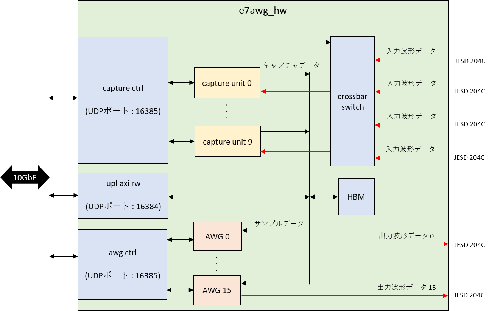

### 各モジュールとその機能
|  モジュール  |  機能  |
| ---- | ---- |
| HBM (High Bandwidth Memory) | 高速なオンチップメモリで，出力波形のサンプル値やキャプチャデータを保持します．  1 ワードは 256 bits (= 32 Bytes) です． |
| upl axi rw | e7udpip10G と HBM 間のデータの送受信を制御します． |
| capture ctrl | e7udpip10G から送られるデータをもとに capture unit を制御します． |
| capture module | 複数の capture unit を束ねるモジュールです．同じ capture module の中の capture unit は全て同じ入力波形データを受け取ります．|
| capture unit | 入力波形データに信号処理を適用して HBM に格納します．|
| awg ctrl | e7udpip10G から送られるデータをもとに AWG を制御します． |
| AWG | HBM からサンプル値を読み出し，ユーザが定義した波形の並びで出力します． |

## 2. HBM ソフトウェアインタフェース仕様

HBM は 1 ワード 256 bits (= 32Bytes) のメモリで，ワード単位でアクセス可能です．
各ワードとアドレスの対応関係は以下の図の通りです．

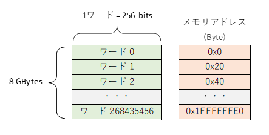

## 2.1 HBM アクセスコマンドフォーマット
HBM にアクセスするためには，HBM アクセスコマンドを UDP データとして e7awg_hw のポート 16384 に送る必要があります．
HBM アクセスコマンドには，以下の 4 種類があり，(A) と (C) が e7awg_hw に送るコマンドで，(B) と (D) がその応答として e7awg_hw から送られるコマンドです．

- (A) HBM 読み出しコマンド  
- (B) HBM 読み出し応答コマンド  
- (C) HBM 書き込みコマンド  
- (D) HBM 書き込み応答コマンド  

#### (A) HBM 読み出しコマンド
このコマンドを e7awg_hw に送信すると，アドレス `A` から `A + B - 1` までのワードデータが，HBM 読み出し応答コマンドとして返ってきます．A と B は共に 32 の倍数を指定してください．B の最大値は 4064 です．

#### (B) HBM 読み出し応答コマンド
HBM のデータを正常に読みだせた場合，**アドレス** と **バイト数** フィールドには，HBM 読み出しコマンドで指定した値が入っています．**ワードデータ 1** から **ワードデータ (B/32)** には，アドレス `A` から `A + B - 1` までのワードデータが順に格納されています．

#### (C) HBM 書き込みコマンド
このコマンドを e7awg_hw に送信すると，アドレス `A` から `A + B - 1` までのワードに，**ワードデータ 1** から **ワードデータ (B/32)** までの値が書き込まれます．A と B は共に 32 の倍数を指定してください．B の最大値は 4064 です．

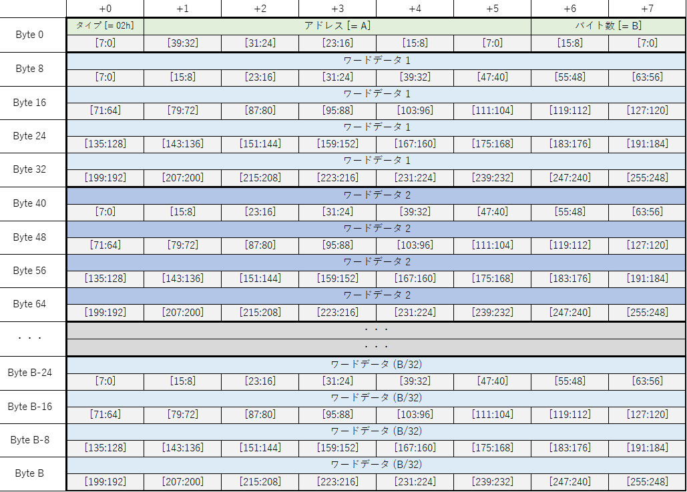

#### (D) AWG レジスタ書き込み応答コマンド
HBM にデータを正常に書き込めた場合，**アドレス** と **バイト数** フィールドには，HBM 書き込みコマンドで指定した値が入っています．

## 2.2 HBM データレイアウト
各 AWG やキャプチャユニットは，HBM との間で効率的にデータを転送するため，以下の図で示す領域を使用しなければなりません．
それぞれの領域での波形データやキャプチャデータの並びは，**3.5 HBM に格納された波形データの並び** および **4.7 HBM に格納されたキャプチャデータの並び**を参照してください．

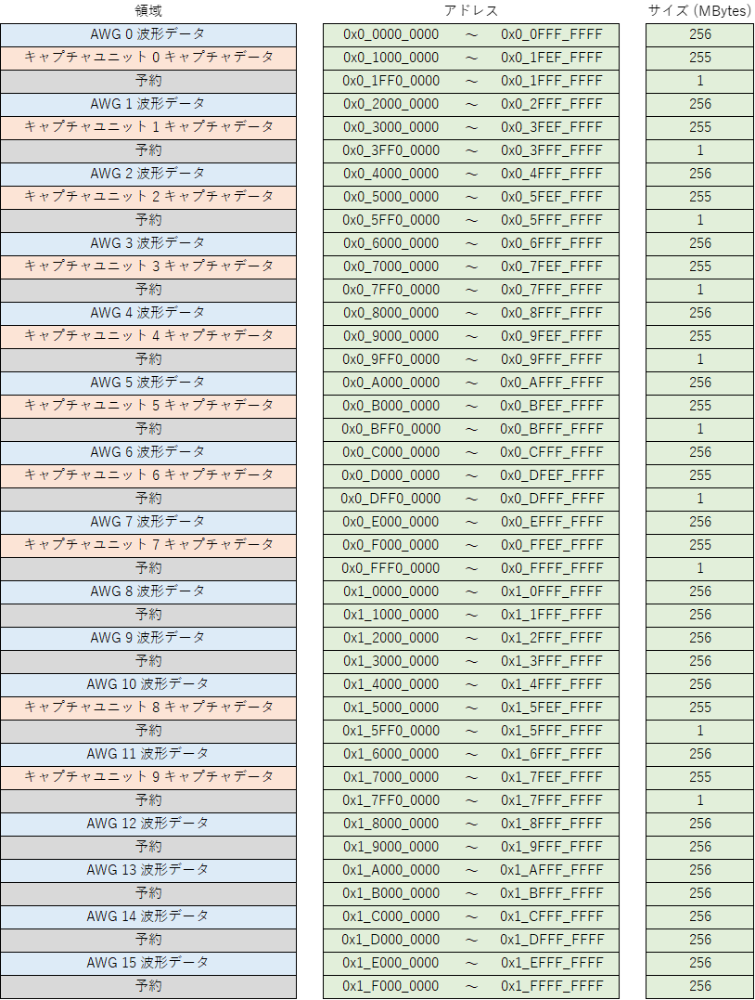

## 3. AWG ソフトウェアインタフェース仕様

### 3.1 状態遷移図

| 状態 | 説明 |
| ---- | ---- |
| RESET | AWG をリセットしている状態です．リセット解除後にリセットが完了すると `IDLE` 状態に遷移します．  リセットの開始と解除は FPGA のコンフィギュレーション完了直後に自動で行われますが，AWG 制御レジスタでも制御可能です．|
| IDLE | ユーザ定義波形の出力準備開始を待っている状態です．出力準備の開始は AWG 制御レジスタから実行可能です．|
| PRELOAD | ユーザ定義波形を出力するための準備を行っている状態です．準備が完了すると，自動的に `READY` 状態に遷移します． |
| READY | ユーザ定義波形の出力開始を待っている状態です． 出力開始は AWG 制御レジスタから実行可能です．|
| WAVE GEN | ユーザ定義波形を出力中の状態です．ユーザ定義波形の出力が完了すると，自動的に `IDLE` 状態に遷移します．|

各状態におけるステータス信号の値は以下の表のとおりです．
各ステータス信号の値は，AWG 制御レジスタの信号名と同名のビットフィールドから読み取れます．

|  状態\信号名 | wakeup | busy | ready | done |
| ---- | ---- | ---- | ---- | ---- |
| RESET    | 0 | 0 | 0 | 0 |
| IDLE     | 1 | 0 | 0 | 0 / 1|
| PRELOAD  | 1 | 1 | 0 | 0 |
| READY    | 1 | 1 | 1 | 0 |
| WAVE GEN | 1 | 1 | 0 | 0 |

※`IDLE` 時の done 信号は `WAVE GEN` から `IDLE` に遷移した後で 1 になります．

 ### 3.2 出力波形の定義

ユーザが，各 AWG に対して設定した出力波形全体を**ユーザ定義波形**と言います．
**ユーザ定義波形**は **wait word** と，その後に続く**波形シーケンス**の繰り返しで構成されます．
**波形シーケンス**は，最大 4294967295 回繰り返すことが可能です．
**wait word** は無くても問題ありません．

**wait word** は値が 0 のサンプルが並んだ波形です．
4 サンプルを 1 つの単位とする **AWG ワード**単位で指定可能で，最大長は 4294967295 **AWG ワード**となります（I データと Q データはまとめて 1 サンプルとカウントしています）．

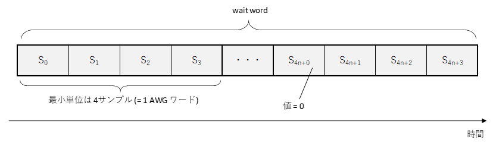

**波形シーケンス**は**波形チャンク**の繰り返しを並べたもので構成されます．
**波形チャンク**は最大 16 個まで定義でき，各チャンクは 4294967295 回まで繰り返すことが可能です．

**波形チャンク**は**波形パート**と**ポストブランク**で構成されます．
**ポストブランク**は無くても問題ありません．

**波形パート**は任意の値のサンプルが並んでおり，そのサンプル数は 64 の倍数でなければなりません．

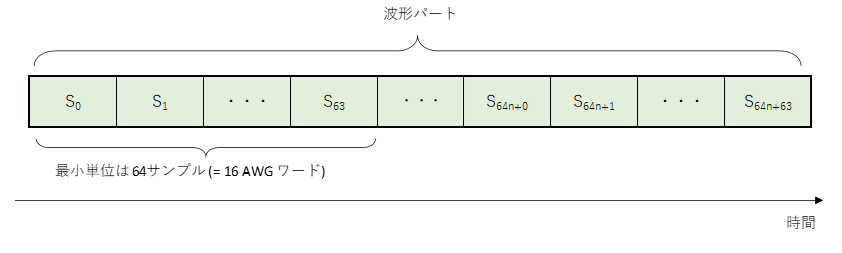

また，**波形パート**のサンプル数は，以下の制約も満たさなければなりません．
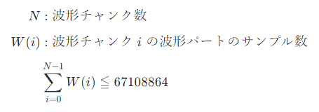

<!--
$$
\begin{align*}

N &: 波形チャンク数  \\[1ex]
W(i) &: 波形チャンク \; i \;の波形パートのサンプル数 \\[1ex]
&\displaystyle \sum_{i=0}^{N-1} W(i) \leqq 67108864
\end{align*}
$$
-->

**ポストブランク**は値が 0 のサンプルが並んだ波形で，最大長は 4294967295 **AWG ワード**となります．

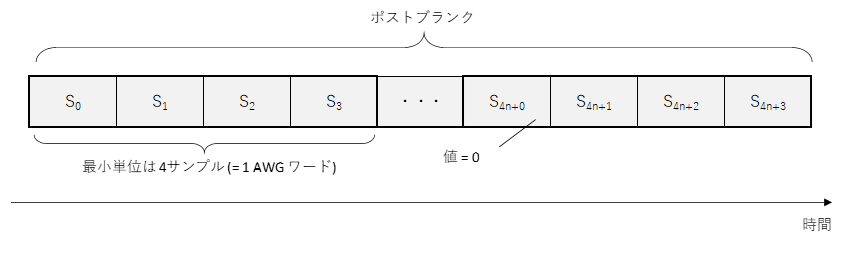

### 3.3 AWG 制御レジスタ一覧

AWG を制御するためのレジスタ一覧を以下に示します．

### 3.4 AWG 制御コマンドフォーマット
**3.3 AWG 制御レジスタ一覧**のレジスタにアクセスするためには，AWG 制御コマンドを UDP データとして e7awg_hw のポート 16385 に送る必要があります．
AWG 制御用コマンドには，以下の 4 種類があり，(A) と (C) が e7awg_hw に送るコマンドで，(B) と (D) がその応答として e7awg_hw から送られるコマンドです．

- (A) AWG レジスタ読み出しコマンド
- (B) AWG レジスタ読み出し応答コマンド
- (C) AWG レジスタ書き込みコマンド
- (D) AWG レジスタ書き込み応答コマンド

#### (A) AWG レジスタ読み出しコマンド
このコマンドを e7awg_hw に送信すると，アドレス `A` から `A + B - 1` までのレジスタ値が，AWG レジスタ読み出し応答コマンドとして返ってきます．A と B は共に 4 の倍数を指定してください．B の最大値は 4072 です．

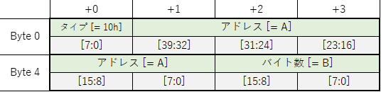

#### (B) AWG レジスタ読み出し応答コマンド
レジスタ値が正常に読みだせた場合，**アドレス** と **バイト数** フィールドには，AWG レジスタ読み出しコマンドで指定した値が入っています．**レジスタ値 1** から **レジスタ値 (B/4)** には，アドレス `A` から `A + B - 1` までのレジスタ値が順に格納されています．

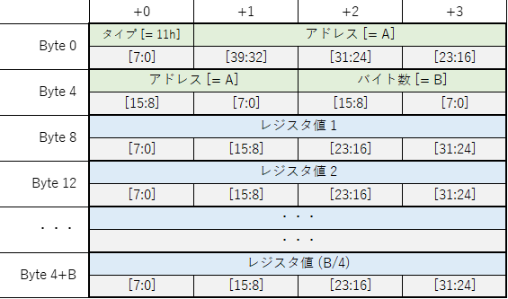

#### (C) AWG レジスタ書き込みコマンド
このコマンドを e7awg_hw に送信すると，アドレス `A` から `A + B - 1` までのレジスタに，**レジスタ値 1** から **レジスタ値 (B/4)** までの値が書き込まれます．A と B は共に 4 の倍数を指定してください．B の最大値は 4072 です．

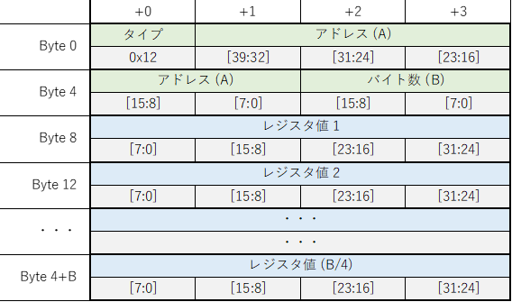

#### (D) AWG レジスタ書き込み応答コマンド

レジスタ値が正常に書き込めた場合，**アドレス** と **バイト数** フィールドには，AWG レジスタ書き込みコマンドで指定した値が入っています．

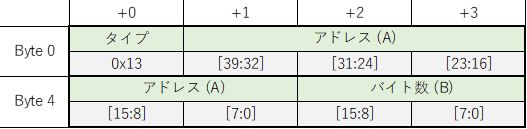

### 3.5 HBM に格納された波形データの並び

波形パートのサンプルデータは，以下の並びで HBM に格納する必要があります．
波形パートのサンプルデータの先頭アドレス A は，波形パートアドレスレジスタの値 * 16 となります．

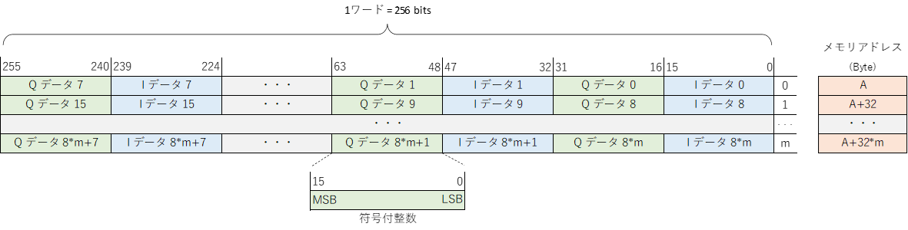

## 4. キャプチャモジュールソフトウェアインタフェース仕様

### 4.1 状態遷移

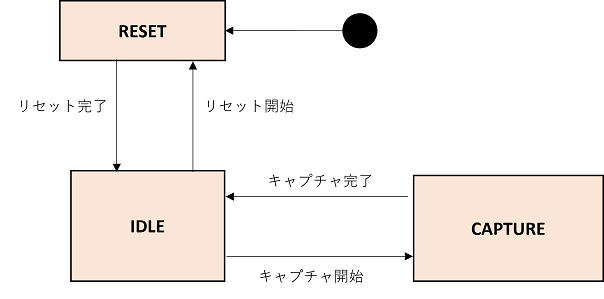

| 状態 | 説明 |
| ---- | ---- |
| RESET | キャプチャモジュールをリセットしている状態です．リセット解除後にリセットが完了すると `IDLE` 状態に遷移します．  リセットの開始と解除は FPGA のコンフィギュレーション完了直後に自動で行われますが，キャプチャ制御レジスタでも制御可能です． |
| IDLE | キャプチャの開始を待っている状態です．キャプチャは，AWG のユーザ定義波形の出力に合わせて開始されるほか，キャプチャ制御レジスタからも開始可能です．|
| CAPTURE | 入力波形に信号処理を行いメモリに保存している状態です．キャプチャパラメータで指定した数のデータの保存が完了すると，自動的に `IDLE` 状態に遷移します．|

各状態におけるステータス信号の値は以下の表のとおりです．
各ステータス信号の値は，キャプチャ制御レジスタの信号名と同名のビットフィールドから読み取れます．

|  状態\信号名 | wakeup | busy | done |
| ---- | ---- | ---- | ---- |
| RESET   | 0 | 0 | 0  |
| IDLE    | 1 | 0 | 0 / 1|
| CAPTURE | 1 | 1 | 0  |

※`IDLE` 時の done 信号は `CAPTURE` から `IDLE` に遷移した後で 1 になります．

### 4.2 キャプチャ区間の定義

ユーザは，各キャプチャユニットに対し**キャプチャ区間**を定義することで，入力波形のどの部分に何の信号処理を適用するかを決めることができます．

**キャプチャ区間**は**キャプチャディレイ**と，その後に続く**積算区間**の繰り返しで構成されます．
**キャプチャディレイ**の期間に受信した波形データは保存および信号処理の対象になりません．
**キャプチャディレイ**は無くても問題ありません．

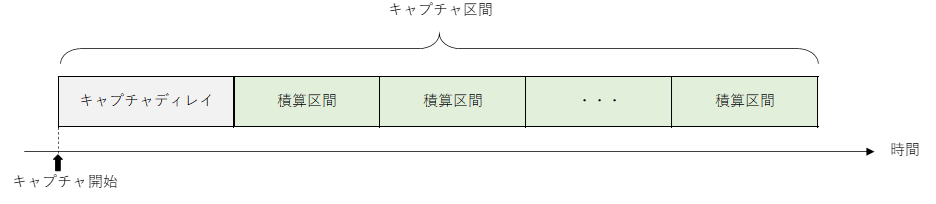

**積算区間**は**総和区間**と**ポストブランク**を交互に繰り返したものから構成されます．
**総和区間**で受信される波形データは，保存および信号処理の対象になりますが，ポストブランクで受信される波形データはその対象になりません．
**総和区間**と**ポストブランク**の長さは共に，4 サンプルを 1 つの単位とする**キャプチャワード**単位で指定可能です（I データと Q データはまとめて 1 サンプルとカウントしています）．
**総和区間**は最大 4096 個まで定義でき，別々に長さを設定できます．
**総和区間**と**ポストブランク**は，必ず 1 セットで定義しなければなりません．

**積算区間**および**総和区間**の信号処理における機能は **4.3 信号処理詳細**で説明します．

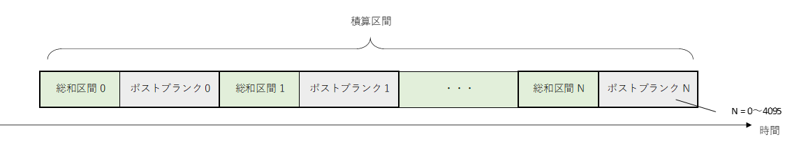

### 4.3 信号処理詳細

各キャプチャユニットには，以下の信号処理回路が含まれています．

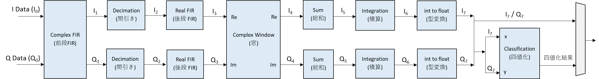

適用される処理の順番は
1. 前段 FIR フィルタ
2. 間引き
3. 後段 FIR フィルタ
4. 窓
5. 総和
6. 積算
7. 型変換
8. 四値化

となっており，型変換以外は，処理ごとに有効/無効を切り替えることができます．
それぞれの処理の詳細は以下の通りです．

#### 前段 FIR フィルタ
I/Q データを I = 実部，Q = 虚部である複素数とみなし，係数が複素数の 8 タップの FIR フィルタを適用します．

#### 間引き
各総和区間のサンプル数を 1/4 に減らします．
間引き前のサンプル数を P，間引き後のサンプル数を Q とすると  `Q = floor(P / 16)  * 4` という関係式が成り立ちます． 
※ floor(x) は x の小数点以下切り捨て

間引きが有効になっている場合，以降の処理は間引きの結果残ったサンプルにのみ適用されます．

#### 後段 FIR フィルタ
タップ数 8 の FIR フィルタを I データと Q データにそれぞれ適用します．

#### 窓
I/Q データを I = 実部，Q = 虚部である複素数とみなし，係数が複素数の窓関数を掛けます．

#### 総和
総和区間ごとに，総和開始点から総和終了点までの間（=総和範囲）にあるサンプル値を足し合わせます．
総和範囲は全総和区間で共通です．
総和終了点が総和区間の終点より後ろにある場合は，総和区間の終わりまで足します．
総和が有効になっている場合，以降の処理は総和の計算結果にのみ適用されます．

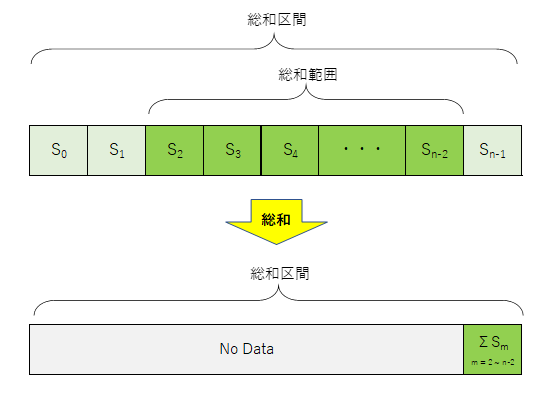

#### 積算
異なる積算区間内の同じ位置にあるサンプル同士を積算区間の個数分足し合わせます．

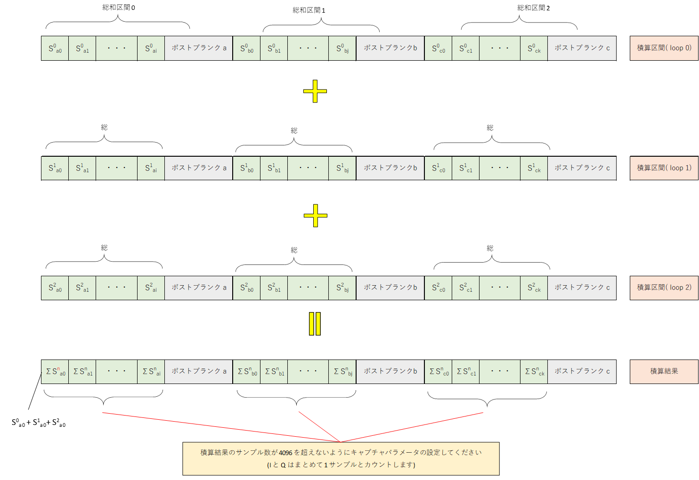

#### 四値化
入力される I/Q データの I 成分と Q 成分の値を，それぞれ **I**, **Q** とします．
I, Q の組 **(I, Q)** を x-y 平面状の点 (x, y) と対応させたとき，x-y 平面上で 2 本の直線 ①, ② により分割される領域のどこに **(I, Q)** が分類されるか計算します．

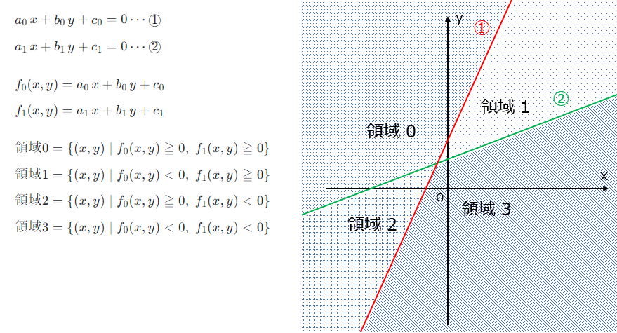

<!--
$$
\begin{align*}

&a_{0}\,x + b_{0}\,y + c_{0} = 0 \cdots \text{\textcircled 1} \\[1ex]
&a_{1}\,x + b_{1}\,y + c_{1} = 0 \cdots \text{\textcircled 2} \\[3ex]

&f_{0}(x, y) = a_{0}\,x + b_{0}\,y + c_{0} \\[1ex]
&f_{1}(x, y) = a_{1}\,x + b_{1}\,y + c_{1} \\[3ex]

&領域 0 = \{(x, y) \mid f_{0}(x, y) \geqq 0, \;f_{1}(x, y) \geqq 0 \} \\[1ex]
&領域 1 = \{(x, y) \mid f_{0}(x, y) \geqq 0, \;f_{1}(x, y) \lt   0 \} \\[1ex]
&領域 2 = \{(x, y) \mid f_{0}(x, y) \lt   0, \;f_{1}(x, y) \geqq 0 \} \\[1ex]
&領域 3 = \{(x, y) \mid f_{0}(x, y) \lt   0, \;f_{1}(x, y) \lt   0 \} \\[1ex]

\end{align*}
$$
-->

計算方法は，**I**, **Q** から **R** を求め，**R = n** のとき，**(I, Q)** を領域 **n** の点に分類します．
四値化処理の結果は **R** の値です．
**a0**, **b0**, **c0**, **a1**, **b1**, **c1** はキャプチャ制御レジスタから設定可能です．

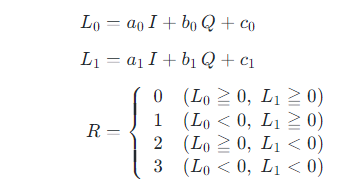
<!-- 
$$
\begin{align*}
L_{0} &= a_{0}\,I + b_{0}\,Q + c_{0} \\[1ex]
L_{1} &= a_{1}\,I + b_{1}\,Q + c_{1} \\[1ex]
R &= \left\{
\begin{array}{ll}
  0 & (L_{0} \geqq 0, \;L_{1} \geqq 0)\\
  1 & (L_{0} \geqq 0, \;L_{1} \lt 0)\\
  2 & (L_{0} \lt 0,   \;L_{1} \geqq 0)\\
  3 & (L_{0} \lt 0,   \;L_{1} \lt 0)\\
\end{array}
\right. \\[3ex]

\end{align*}
$$ -->

### 4.4 キャプチャ制御レジスタ一覧
キャプチャユニットを制御するためのレジスタ一覧を以下に示します．
レジスタ名に「#」がついているレジスタは，**4.5 キャプチャパラメータの制約**に記載した制約を満たさなければなりません．

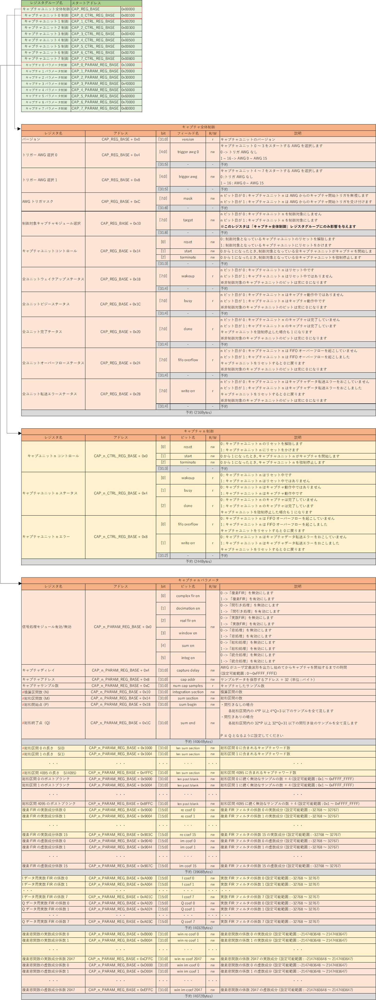

### 4.5 キャプチャパラメータの制約
総和区間数，積算区間数，各総和区間の長さ，総和開始点，総和終了点は，HW リソースの都合上，式 ①～⑧の制約を全て満たさなければなりません．

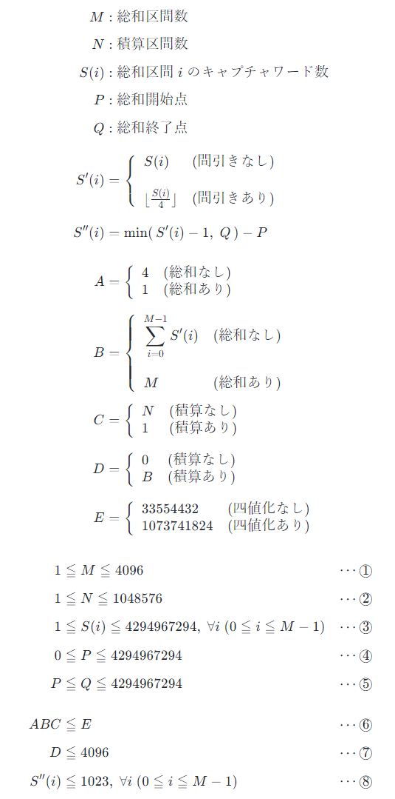

<!--
$$
\begin{align*}

M &: 総和区間数  \\[1ex]
N &: 積算区間数  \\[1ex]
S(i) &: 総和区間 \; i \;のキャプチャワード数 \\[1ex]
P &: 総和開始点  \\[1ex]
Q &: 総和終了点 \\[2ex]

S'(i) &= \left\{
\begin{array}{ll}
  S(i) & (間引きなし)\\ & \\
  \lfloor \frac{S(i)}{4} \rfloor & (間引きあり)\\
\end{array}
\right. \\[5ex]

S''(i) &= \min(\, S'(i) - 1, \;Q \,) - P \\[3ex]

A &= \left\{
\begin{array}{ll}
  4 & (総和なし)\\
  1 & (総和あり)\\
\end{array}
\right. \\[3ex]

B &= \left\{
\begin{array}{ll}
  \displaystyle\sum_{i=0}^{M-1}S'(i) & (総和なし)\\ \\
  M & (総和あり)\\
\end{array}
\right. \\[6ex]

C &= \left\{
\begin{array}{ll}
  N & (積算なし)\\
  1 & (積算あり)\\
\end{array}
\right. \\[3ex]

D &= \left\{
\begin{array}{ll}
  0 & (積算なし)\\
  B & (積算あり)\\
\end{array}
\right. \\[3ex]

E &= \left\{
\begin{array}{ll}
  33554432 & (四値化なし)\\
  1073741824 & (四値化あり)\\
\end{array}
\right. \\[3ex]

\end{align*}
$$

$$
\begin{align*}
1 &\leqq M \leqq 4096 &\cdots \text{\textcircled 1} \\[1ex]
1 &\leqq N \leqq 1048576 &\cdots \text{\textcircled 2} \\[1ex]
1 &\leqq S\lparen i \rparen \leqq 4294967294 , \; \forall i \;(0 \leqq i \leqq M - 1) &\cdots \text{\textcircled 3} \\[1ex]
0 &\leqq P \leqq 4294967294 &\cdots \text{\textcircled 4} \\[1ex]
P &\leqq Q \leqq 4294967294 &\cdots \text{\textcircled 5} \\[3ex]

ABC &\leqq E &\cdots \text{\textcircled 6} \\[1ex]
D &\leqq 4096 &\cdots \text{\textcircled 7} \\[1ex]
S''(i) &\leqq 1023 , \; \forall i \;(0 \leqq i \leqq M - 1) &\cdots \text{\textcircled 8} \\[1ex]
\end{align*}
$$
-->
<!--
条件 1 , 3 , 4,  5 は, それぞれのパラメータ単体で取り得る範囲
条件 2 は,積算結果がオーバーフローしない条件
条件 6 は, キャプチャデータを格納するのに必要な HBM のサイズからくる制約
条件 7 は, 積算結果を格納する一時メモリのサイズからくる制約
条件 8 は, 総和結果がオーバーフローしない条件.  
なお, S'' が 0 未満になる場合, 総和は結果を算出しない.
-->

### 4.6 キャプチャ制御コマンドフォーマット

**4.4 キャプチャ制御レジスタ一覧**のレジスタにアクセスするためには，キャプチャ制御コマンドを UDP データとして e7awg_hw のポート 16385 に送る必要があります．
キャプチャ制御用コマンドには以下の 4 種類があり，(A) と (C) が e7awg_hw に送るコマンドで，(B) と (D) がその応答として e7awg_hw から送られるコマンドです．

- (A) キャプチャレジスタ読み出しコマンド  
- (B) キャプチャレジスタ読み出し応答コマンド  
- (C) キャプチャレジスタ書き込みコマンド  
- (D) キャプチャレジスタ書き込み応答コマンド  

#### (A) キャプチャレジスタ読み出しコマンド
このコマンドを e7awg_hw に送信すると，アドレス `A` から `A + B - 1` までのレジスタ値が，キャプチャレジスタ読み出し応答コマンドとして返ってきます．A と B は共に 4 の倍数を指定してください．B の最大値は 4072 です．

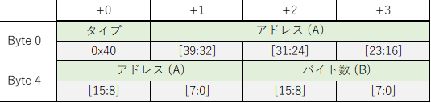

#### (B) キャプチャレジスタ読み出し応答コマンド
レジスタ値が正常に読みだせた場合，**アドレス** と **バイト数** フィールドには，キャプチャレジスタ読み出しコマンドで指定した値が入っています．**レジスタ値 1** から **レジスタ値 (B/4)** には，アドレス `A` から `A + B - 1` までのレジスタ値が順に格納されています．

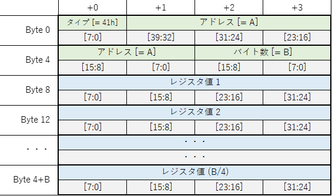

#### (C) キャプチャレジスタ書き込みコマンド
このコマンドを e7awg_hw に送信すると，アドレス `A` から `A + B - 1` までのレジスタに，**レジスタ値 1** から **レジスタ値 (B/4)** までの値を書き込みます．A と B は共に 4 の倍数を指定してください．B の最大値は 4072 です．

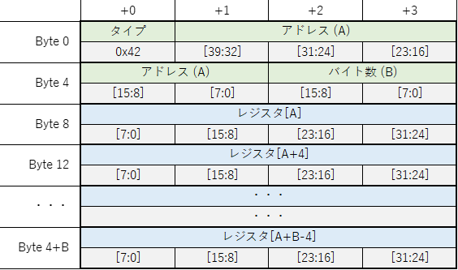

#### (D) キャプチャレジスタ書き込み応答コマンド
レジスタ値が正常に書き込めた場合，**アドレス** と **バイト数** フィールドには，キャプチャレジスタ書き込みコマンドで指定した値が入っています．

### 4.7 HBM に格納されたキャプチャデータの並び
HBM に格納されたキャプチャデータの並びは以下の通りです．
キャプチャデータの先頭アドレス A は，キャプチャアドレスレジスタの値 * 32 となります．
DSP の四値化を無効化した場合，キャプチャデータは I/Q サンプルデータとなり，有効化した場合，四値化結果となります．

#### I/Q サンプルデータ
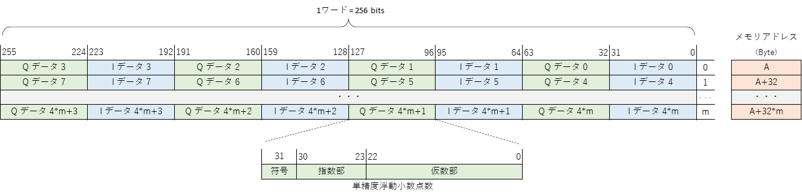

#### 四値化結果  
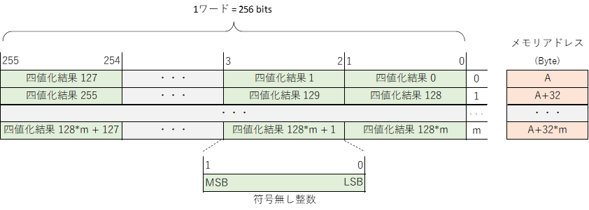
