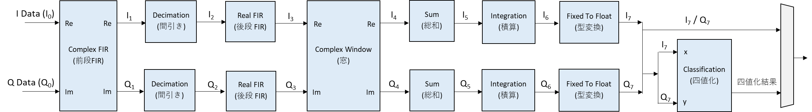
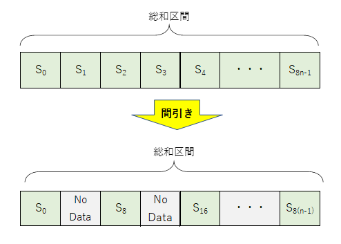

# e7awg_hw ユーザマニュアル

## 1. 機能概要
e7awg_hw は，ユーザが定義した波形データを出力する機能と，入力された波形データに信号処理を適用してメモリに保存する機能を備えた FPGA デザインです．FPGA 内部の各モジュールは，10G Ethernet で送られる UDP/IP パケットにて制御可能になっています．
以下に e7awg_hw の概略図を示します．

### 各モジュールとその機能
|  モジュール  |  機能  |
| ---- | ---- |
| HBM (High Bandwidth Memory) | 高速なオンチップメモリで，出力波形のサンプル値やキャプチャデータを保持します． |
| upl axi rw | e7udpip10G と HBM 間のデータの送受信を制御します． |
| capture ctrl | e7udpip10G から送られるデータをもとに capture unit を制御します． |
| capture module | 複数の capture unit を束ねるモジュールです．同じ capture module の中の capture unit は全て同じ入力波形データを受け取ります．|
| capture unit | 入力波形データに信号処理を適用して HBM に格納します．|
| awg ctrl | e7udpip10G から送られるデータをもとに AWG を制御します． |
| AWG | HBM からサンプル値を読み出し，ユーザが定義した波形の並びで出力します． |

## 2. AWG ソフトウェアインタフェース仕様
  - 状態遷移図
  - 波形シーケンスの定義
  - メモリマップ
  - 波形パラメータの制約
  - UDP データフォーマット

## 3. キャプチャモジュールソフトウェアインタフェース仕様

### 3.1 状態遷移

|  状態  |  説明  |
| ---- | ---- |
| RESET | キャプチャモジュールをリセットしている状態です．リセット解除後にリセットが完了すると `IDLE` 状態に遷移します．  リセットの開始と解除は FPGA のコンフィギュレーション完了直後に自動で行われますが，メモリマップトレジスタでも制御可能です． |
| IDLE | キャプチャの開始を待っている状態です．キャプチャは，AWG のユーザ定義波形の出力に合わせて開始されるほか，メモリマップトレジスタからも開始可能です．|
| CAPTURE | 入力波形に信号処理を行いメモリに保存している状態です．キャプチャパラメータで指定した数のデータの保存が完了すると，自動的に `IDLE` 状態に遷移します．|

各状態におけるステータス信号の値は以下の表のとおりです．
各ステータス信号の値は，メモリマップトレジスタの信号名と同名のビットフィールドから読み取れます．

|  状態\信号名 | wakeup | busy | done |
| ---- | ---- | ---- | ---- |
| RESET   | 0 | 0 | 0  |
| IDLE    | 1 | 0 | 0 / 1|
| CAPTURE | 1 | 1 | 0  |

※`IDLE` 時の done 信号は `CAPTURE` から `IDLE` に遷移した後で 1 になります．

### 3.2 キャプチャ区間の定義

ユーザは，各キャプチャユニットに対し**キャプチャ区間**を定義することで，入力波形のどの部分に何の信号処理を適用するかを決めることができます．

**キャプチャ区間**は**キャプチャディレイ**と，その後に続く**積算区間**の繰り返しで構成されます．
**キャプチャディレイ**の期間に受信した波形データは保存および信号処理の対象になりません．
**キャプチャディレイ**は無くても問題ありません．

**積算区間**は**総和区間**と**ポストブランク**を交互に繰り返したものから構成されます．
**総和区間**で受信される波形データは，保存および信号処理の対象になりますが，ポストブランクで受信される波形データはその対象になりません．
**総和区間**と**ポストブランク**の長さは共に，4 サンプルを 1 つの単位とする**キャプチャワード**単位で指定可能です（I データと Q データはまとめて 1 サンプルとカウントします）．
**総和区間**は最大 4096 個まで定義でき，別々に長さを設定できます．
**総和区間**と**ポストブランク**は，必ず 1 セットで定義しなければなりません．

**積算区間**および**総和区間**の信号処理における機能は **3.3 信号処理詳細**で説明します．

### 3.3 信号処理詳細

各キャプチャユニットには，以下の信号処理回路が含まれています．

適用される処理の順番は
1. 前段 FIR フィルタ
2. 間引き
3. 後段 FIR フィルタ
4. 窓
5. 総和
6. 積算

となっており，各処理ごとに有効/無効を切り替えることができます．
それぞれの処理の詳細は以下の通りです．

#### 前段 FIR フィルタ
I/Q データを I = 実部，Q = 虚部である複素数とみなし，係数が複素数の 8 タップの FIR フィルタを適用します．

#### 間引き
各総和区間のサンプル数を 1/8 に減らします．
間引き前のサンプル数を P，間引き後のサンプル数を Q とすると  `Q = floor((P + 4) / 32)  * 4` という関係式が成り立ちます． 
※ floo(x) は x の小数点以下切り捨て

間引きが有効になっている場合，以降の処理は間引きの結果残ったサンプルにのみ適用されます．

#### 後段 FIR フィルタ
タップ数 8 の FIR フィルタを I データと Q データにそれぞれ適用します．

#### 窓
I/Q データを I = 実部，Q = 虚部である複素数とみなし，係数が複素数の窓関数を掛けます．

#### 総和
総和区間ごとに，総和開始点から総和終了点までの間（=総和範囲）にあるサンプル値を足し合わせます．
総和範囲は全総和区間で共通です．
総和終了点が総和区間の終点より後ろにある場合は，総和区間の終わりまで足します．
総和が有効になっている場合，以降の処理は総和の計算結果にのみ適用されます．

#### 積算
異なる積算区間内の同じ位置にあるサンプル同士を積算区間の個数分足し合わせます．

### 3.4 レジスタ一覧
キャプチャユニットを制御するためのレジスタ一覧を以下に示します．
「#」がついているレジスタは，表中の設定範囲の他に制約があります．
詳細は **3.5 キャプチャパラメータの制約**を参照してください．

### 3.5 キャプチャパラメータの制約
積算区間数，総和区間数および各総和区間の長さは，HW リソースの都合上，数式 ①，②の制約を満たさなければなりません．

$$
\begin{align*}
M &= 総和区間数  \\[1ex]
N &= 積算区間数  \\[1ex]

S\lparen i \rparen &= 総和区間 \; i \;のキャプチャワード数 \\[1ex]

A &= \left\{
\begin{array}{ll}
  4 \displaystyle\sum_{i=0}^{M-1}S\lparen i \rparen & (間引きなし)\\ & \\
  4 \displaystyle\sum_{i=0}^{M-1} \lfloor \frac{S\lparen i \rparen + 1}{8} \rfloor & (間引きあり)\\
\end{array}
\right. \\[8ex]

B &= \left\{
\begin{array}{ll}
  A & (総和なし)\\
  M & (総和あり)\\
\end{array}
\right. \\[2ex]

C &= \left\{
\begin{array}{ll}
  N & (積算なし)\\
  1 & (積算あり)\\
\end{array}
\right. \\[2ex]

D &= \left\{
\begin{array}{ll}
  0 & (積算なし)\\
  B & (積算あり)\\
\end{array}
\right. \\[6ex]

BC &\leqq 33554432 \cdots \text{\textcircled 1} \\[1ex]
D &\leqq 16384 \cdots \text{\textcircled 2} \\
\end{align*}
$$

### UDP データフォーマット

## 4. HBM データレイアウト
