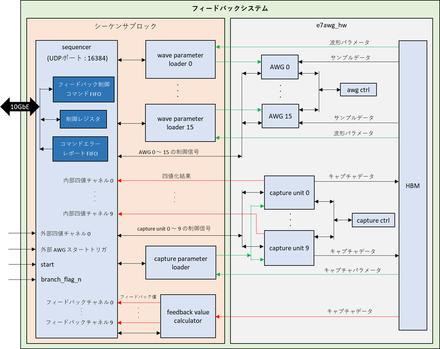

# フィードバックシステムユーザマニュアル

## 1. アーキテクチャ概要
フィードバックシステムは，キャプチャした波形データをもとに AWG とキャプチャユニットの設定を変更して，
波形データの送信とキャプチャを行うための FPGA デザインです．
本デザインは，シーケンサブロックと e7awg_hw の 2 つの部分からなっており，シーケンサブロックが，
後述する**フィードバック制御コマンド**に従って e7awg_hw の各種モジュールを制御する仕組みとなっています．
e7awg_hw に関する説明は，[e7awg_hw ユーザマニュアル](./README.md) を参照してください．

以下にフィードバックシステムの概略図を示します．

### 1.1 シーケンサブロックの各モジュールとその機能
|  モジュール  |  機能  |
| ---- | ---- |
| sequencer | フィードバック制御コマンドを逐次実行しながら，コマンドの内容に応じて他のモジュールに命令を出します． |
| feedback value calculator | sequencer の命令を受けて，キャプチャデータからフィードバック値を計算します．  フィードバック値は，AWG とキャプチャユニットに設定すべきパラメータを選択するのに使用されます． |
| parameter loader | sequencer の命令を受けて，波形パラメータもしくは，キャプチャパラメータを読み出し，前者を AWG，後者をキャプチャユニットに設定します．また，キャプチャユニットに対し，キャプチャアドレスオフセットも設定します． |

### 1.2 シーケンサの状態遷移

シーケンサには 3 つの状態があり，このうち RUNNING においてのみフィードバック制御コマンドが実行されます．
状態遷移を起こす要因として以下のものがあります．

- シーケンサの start 信号の立ち上がり
- 特定のシーケンサ制御レジスタの操作
- 停止フラグの立ったコマンドの処理

シーケンサ制御レジスタについては，**XXXXXXX** を参照してください．

| 状態 | 説明 |
| ---- | ---- |
| RESET | シーケンスブロック全体をリセットしている状態です．リセット解除後にリセットが完了すると `IDLE` 状態に遷移します．  リセットの開始と解除は FPGA のコンフィギュレーション完了直後に自動で行われますが，シーケンサ制御レジスタでも制御可能です． |
| IDLE | フィードバック制御コマンドの実行開始を待っている状態です．コマンドの実行はシーケンサの start 信号の立ち上がりで開始されるほか，シーケンサ制御レジスタからも開始可能です．|
| RUNNING | フィードバック制御コマンドを実行可能な状態です．この状態でシーケンサのコマンド FIFO にコマンドが存在すると，順番にコマンドの処理を進めます．**停止フラグ**が立っているコマンドを処理すると，シーケンサはコマンドの処理を止め `IDLE` 状態に遷移します．|

各状態におけるステータス信号の値は以下の表のとおりです．
各ステータス信号の値は，シーケンサ制御レジスタの信号名と同名のビットフィールドから読み取れます．

|  状態\信号名 | wakeup | busy | done |
| ---- | ---- | ---- | ---- |
| RESET   | 0 | 0 | 0  |
| IDLE    | 1 | 0 | 0 / 1|
| RUNNING | 1 | 1 | 0  |

※`IDLE` 時の done 信号は `RUNNING` から `IDLE` に遷移した後で 1 になります．

### 1.3 フィードバック値の計算

フィードバック値は，AWG とキャプチャユニットに設定するパラメータを選択するのに使用される値で，feedback value calculator によってキャプチャデータから算出されます．
feedback value calculator は，フィードバック値を算出元のキャプチャデータを保存したキャプチャユニットに応じて，異なる伝送路 (**フィードバックチャネル**) に送ります．
具体的には，キャプチャユニット N  (=0~7) が保存したキャプチャデータから算出されたフィードバック値をフィードバックチャネル N に送ります．
フィードバックチャネルはシーケンサにつながっており，特定のフィードバック制御コマンドの処理の際に参照されます．

現在実装されているフィードバック値算出アルゴリズムは，指定されたアドレスの四値化結果をそのままフィードバック値とするものです．

## 2. フィードバック制御コマンド

### 2.1 コマンドの状態
フィードバック制御コマンドは，UDP/IP パケットとしてシーケンサに送られた後，以下の状態を持ちます．
コマンドが失敗状態になると，そのコマンドに対応した**コマンドエラーレポート**が発行されます．
コマンドエラーレポートについては，**XXXXXXXX**を参照してください．

| 状態 | 説明 |
| ---- | ---- |
| 未処理 | シーケンサに到着後，シーケンサ内の FIFO に格納されている状態． |
| 処理中 | FIFO から取り出されて，処理されている状態．この状態のコマンドはシーケンサ内で最大 1 つです．|
| 成功 | 処理が終了した状態 (処理中のエラーなし) |
| 失敗 | 処理が終了した状態 (処理中のエラー有り) |

### 2.2 フィードバック制御コマンドフォーマット

フィードバック制御コマンドには，以下の 6 種類があります．
- (a) AWG スタートコマンド
- (b) キャプチャ終了フェンスコマンド
- (c) 波形パラメータ設定コマンド
- (d) キャプチャパラメータ設定コマンド
- (e) キャプチャアドレスオフセット設定コマンド
- (f) フィードバック値計算コマンド

これらのコマンドを，後述する**シーケンサ制御パケット**に格納して UDP データとして送る際のフォーマットについて記します．
なお，図中におけるコマンドのバイトオーダと各フィールドのビットナンバリングは以下の通りです．

 

#### 共通フィールド
全てのコマンドは，**停止フラグ**，**コマンド ID**，**コマンド No** のフィールドを持ち，これらをまとめて共通フィールドと呼びます．

| フィールド名 | 説明 |
| ---- | ---- |
| 停止フラグ | このビットが 1 になっているコマンドの処理が終わると，シーケンサはコマンドの処理を停止します． |
| コマンド ID | コマンドの種類ごとに定められた ID． |
| コマンド No | 個々のコマンドを識別するための番号.  後述するコマンドエラーレポートで，どのコマンドがエラーを起こしたか判別するために使用します. |

 

#### (a) AWG スタートコマンド (コマンド ID = 0x01)

任意の AWG を指定した時刻に同時にスタートします．

| フィールド名 | 説明 |
| ---- | ---- |
| AWG ID リスト | N bit 目が 1 のとき，N 番目の AWG をスタートします．(複数選択可能) |
| スタート時刻 | シーケンサの状態が RUNNING になった瞬間を 0 とし，`8 * スタート時刻` [ns] 後に AWG をスタートします． |

 

#### (b) キャプチャ終了フェンスコマンド (コマンド ID = 0x02)

任意のキャプチャユニットのキャプチャが，指定した時刻に終了しているか確認します．
終了していなかった場合，コマンドエラーレポートが発行されます．

| フィールド名 | 説明 |
| ---- | ---- |
| キャプチャユニット ID リスト | N bit 目が 1 のとき，N 番目のキャプチャユニットのキャプチャ終了を確認します． (複数選択可能)|
| 確認時刻 | シーケンサの状態が RUNNING になった瞬間を 0 とし，`8 * 確認時刻` [ns] 後にキャプチャの終了を確認します．この時刻にキャプチャが終了していなかった場合，コマンドエラーレポートが発行されます． |
| 強制停止フラグ | 1 にすると，確認時刻に，指定したキャプチャユニットのキャプチャが終了していなかった場合，それらに強制停止命令を送ります．強制停止命令は，キャプチャの終了待ちを行わない場合でも送信されます． |
| 終了待ちフラグ | 1 にすると，キャプチャ終了の確認後，指定した全てのキャプチャユニットのキャプチャが終了するまで，コマンドを終了しません． |

 

#### (c) AWG パラメータ設定コマンド (コマンド ID = 0x03)

任意の AWG にフィードバック値に応じた波形パラメータを設定します．

| フィールド名 | 説明 |
| ---- | ---- |
| AWG ID リスト | N bit 目が 1 のとき，N 番目の AWG に波形パラメータを設定します．(複数選択可能) |
| フィードバックチャネル ID | 参照するフィードバックチャネルの ID. |
| 最大チャンク番号 | 波形パラメータの中の，この番号以下の波形チャンクの情報を AWG に設定します．波形パラメータの詳細は，**XXXX**を参照してください． |
| パラメータID N | 参照したフィードバック値が N のとき，波形レジストリ内でこの ID の場所にある波形パラメータを AWG に設定します．波形レジストリの詳細は，**XXXX**を参照してください． |

 

#### (d) キャプチャパラメータ設定コマンド (コマンド ID = 0x04)

任意のキャプチャユニットにフィードバック値に応じたキャプチャパラメータを設定します．

| フィールド名 | 説明 |
| ---- | ---- |
| キャプチャユニット ID リスト | N bit 目が 1 のとき，N 番目のキャプチャユニットにキャプチャパラメータを設定します．(複数選択可能) |
| フィードバックチャネル ID | 参照するフィードバックチャネルの ID. |
| 設定要素 | 各ビットとキャプチャパラメータの要素が対応しており，1 にしたビットの要素がキャプチャユニットに設定されます．キャプチャパラメータの詳細は，**XXXX**を参照してください．   bit 0 : 信号処理モジュールの有効 / 無効   bit 1 : キャプチャディレイ   bit 2 : 積算区間数   bit 3 : 総和区間数   bit 4 : 総和開始点 / 終了点   bit 5 : 総和区間長 0~4095   bit 6 : ポストブランク長 0~4095   bit 7 : 複素 FIR 実数 / 虚数係数 0~15   bit 8 : I データ / Q データ FIR 係数 0~7   bit 9 : 窓関数実数 / 虚数係数 0~2047   bit 10 : 四値化パラメータ a0~c1
| パラメータID N | 参照したフィードバック値が N のとき，キャプチャパラメータレジストリ内でこの ID の場所にあるキャプチャパラメータをキャプチャユニットに設定します．キャプチャパラメータレジストリの詳細は，**XXXX**を参照してください． |

 

#### (e) キャプチャアドレス設定コマンド (コマンド ID = 0x05)

任意のキャプチャユニットに，次のキャプチャデータの格納先アドレスを設定します．

| フィールド名 | 説明 |
| ---- | ---- |
| キャプチャユニット ID リスト | N bit 目が 1 のとき，N 番目のキャプチャユニットにキャプチャアドレスを設定します．(複数選択可能) |
| アドレスオフセット | `各キャプチャユニットに割り当てられた HBM 上のデータ格納領域の先頭アドレス + アドレスオフセット` を 次のキャプチャデータの格納先とする． |

 

#### (f) フィードバック値計算コマンド (コマンド ID = 0x06)

任意のキャプチャユニットのキャプチャデータからフィードバック値を計算して，フィードバックチャネルに送ります．

| フィールド名 | 説明 |
| ---- | ---- |
| キャプチャユニット ID リスト | N bit 目が 1 のとき，N 番目のキャプチャユニットが保存したキャプチャデータからフィードバック値を計算し，フィードバックチャネル N に送ります．(複数選択可能) |

###  2.3 コマンドエラーレポートフォーマット
コマンドの処理中にエラーが発生した場合，終了時に，そのコマンドに対応したエラーレポートが発行されます．

##  3. シーケンサソフトウェアインタフェース

### レジスタ一覧

### シーケンサ制御コマンド

## 5. レジストリ構造

