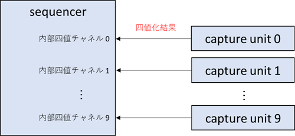
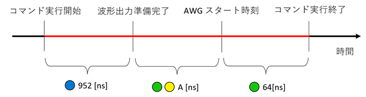
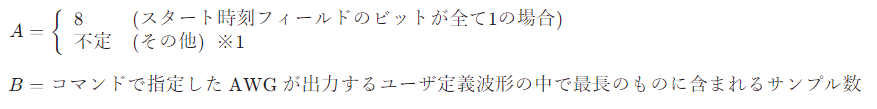
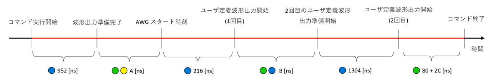
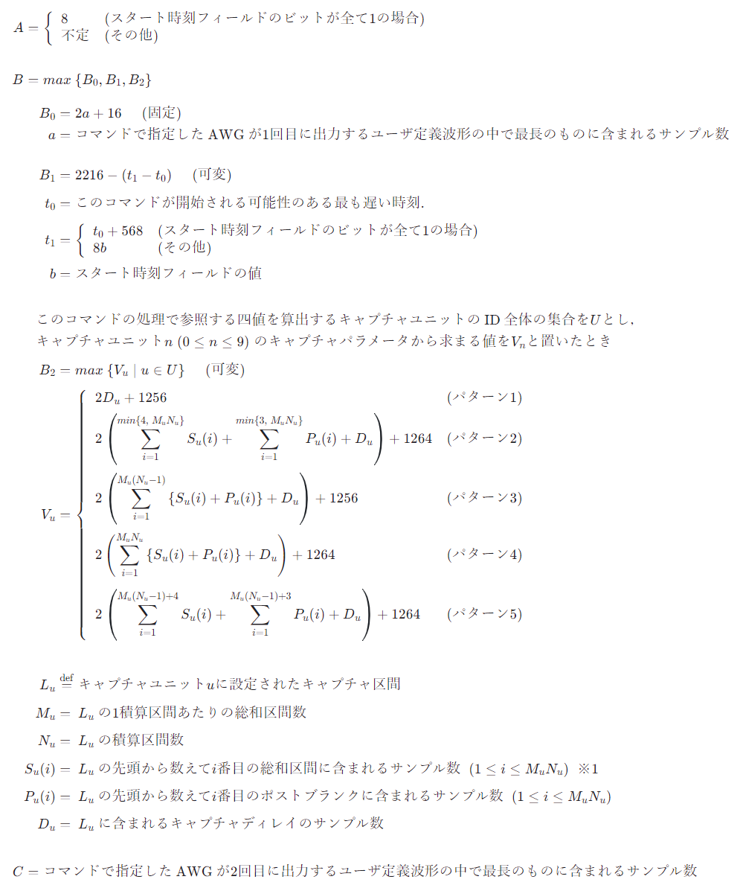
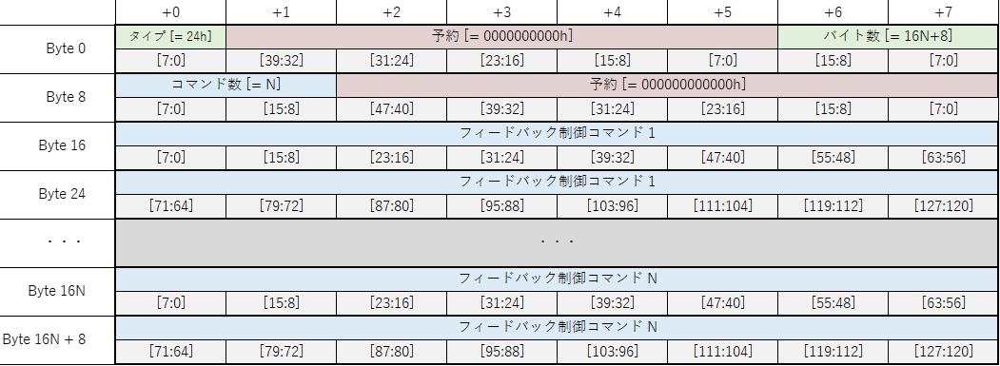

# フィードバックシステムユーザマニュアル

## 1. アーキテクチャ概要
フィードバックシステムは，キャプチャした波形データをもとに AWG とキャプチャユニットの設定を変更して，
波形データの送信とキャプチャを行うための FPGA デザインです．
本デザインは，シーケンサブロックと e7awg_hw の 2 つの部分からなっており，シーケンサブロックが，
後述する**フィードバック制御コマンド**に従って e7awg_hw の各種モジュールを制御する仕組みとなっています．
e7awg_hw に関する説明は，[e7awg_hw ユーザマニュアル](./README.md) を参照してください．

以下にフィードバックシステムの概略図を示します．

### 1.1 シーケンサブロックの各モジュールとその機能
|  モジュール  |  機能  |
| ---- | ---- |
| sequencer | フィードバック制御コマンドを逐次実行しながら，コマンドの内容に応じて他のモジュールに命令を出します． |
| feedback value calculator | sequencer の命令を受けて，キャプチャデータからフィードバック値を計算します．  フィードバック値は，特定のフィードバック制御コマンドを処理する際に，AWG とキャプチャユニットに設定するパラメータを選択するのに使用される値です． |
| wave parameter loader | sequencer の命令を受けて，[波形パラメータ](./terms.md) を HBM から読み出し，AWG に設定します．|
| capture parameter loader | sequencer の命令を受けて，[キャプチャパラメータ](./terms.md) をキャプチャユニットに設定します．その際，キャプチャアドレス以外のキャプチャパラメータは HBM から読み出し，キャプチャアドレスはフィードバック制御コマンドのパラメータから算出します．|

### 1.2 シーケンサの状態遷移

シーケンサには 3 つの状態があり，このうち RUNNING においてのみフィードバック制御コマンドが実行されます．

| 状態 | 説明 |
| ---- | ---- |
| RESET | シーケンサブロック全体をリセットしている状態です．リセット解除後にリセットが完了すると `IDLE` 状態に遷移します．  リセットの開始と解除は FPGA のコンフィギュレーション完了直後に自動で行われますが，シーケンサ制御レジスタでも制御可能です．シーケンサ制御レジスタの詳細は，**5.1 シーケンサ制御レジスタ一覧** を参照してください． |
| IDLE | フィードバック制御コマンドの実行開始を待っている状態です．コマンドの実行はシーケンサの start 信号の立ち上がりで開始されるほか，シーケンサ制御レジスタからも開始可能です．|
| RUNNING | フィードバック制御コマンドを実行可能な状態です．この状態で実行対象となるコマンドが存在すると，それらを処理します．**停止フラグ**が立っているコマンドを処理すると，シーケンサはコマンドの処理を止め `IDLE` 状態に遷移します．|

各状態におけるステータス信号の値は以下の表のとおりです．
各ステータス信号の値は，シーケンサ制御レジスタの信号名と同名のビットフィールドから読み取れます．

|  状態\信号名 | wakeup | busy | done |
| ---- | ---- | ---- | ---- |
| RESET   | 0 | 0 | 0  |
| IDLE    | 1 | 0 | 0 / 1|
| RUNNING | 1 | 1 | 0  |

※`IDLE` 時の done 信号は `RUNNING` から `IDLE` に遷移した後で 1 になります．

### 1.3 フィードバック値の計算

フィードバック値は，特定のフィードバック制御コマンドを処理する際に AWG とキャプチャユニットに設定するパラメータを選択するのに使用される値で，feedback value calculator によってキャプチャデータから計算されます．
計算結果は，算出元のキャプチャデータを保存したキャプチャユニットごとに，異なるデータパス (**フィードバックチャネル**) に送られ，シーケンサから参照できるようになります．
具体的には，キャプチャユニット N  (=0~7) が保存したキャプチャデータから算出されたフィードバック値は，フィードバックチャネル N に送られます．
フィードバック制御コマンドでフィードバック値を参照する際は，このフィードバックチャネルを指定します．

現在実装されているフィードバック値算出アルゴリズムは，指定されたアドレスの四値化結果をそのままフィードバック値とするものです．

### 1.4 四値化結果の計算

四値化結果は，特定のフィードバック制御コマンドを処理する際に AWG に設定する波形パラメータを選択するのに使用される値で，キャプチャユニットによってキャプチャデータから計算されます．
計算結果は，計算元のキャプチャデータを受け取ったキャプチャユニットごとに，異なるデータパス (**四値チャネル**) に送られ，シーケンサから参照できるようになります．
具体的には，キャプチャユニット N  (=0~7) が受け取ったキャプチャデータから算出された四値化結果は，四値チャネル N に送られます．
フィードバック制御コマンドで四値化結果を参照する際は，このフィードバックチャネルを指定します．
四値化結果は，<u>キャプチャユニットの四値化処理が有効になっている場合</u>，キャプチャ区間ごとに 1 つ四値チャネルに送られます．
1 つのキャプチャ区間から複数の四値を算出する場合は，そのキャプチャ区間で最初に計算された四値が四値チャネルに送られます．
キャプチャ区間および四値化の詳細は，[e7awg_hw ユーザマニュアル](./README.md) の **4.2 キャプチャ区間の定義** および **4.3 キャプチャユニット詳細** を参照してください．

## 2. 波形 / キャプチャパラメータフォーマット

wave parameter loader と capture parameter loader モジュールによってセットされる波形パラメータとキャプチャパラメータは，下図で示す HBM 上の領域に特定のフォーマットで格納されなければなりません．
HBM へのデータの格納方法は，[e7awg_hw ユーザマニュアル](./README.md) の **2.1 HBM アクセスパケットフォーマット** を参照してください．

### 2.1 波形パラメータフォーマット
波形パラメータは AWG ごとに格納領域が分かれています．
この格納領域は，**波形パラメータブロック**と呼ばれる 512 個の領域に分割され，各波形パラメータブロックには HBM 上の位置に応じて ID (0 ~ 511) が割り振られています．
波形パラメータブロックには，ユーザ定義波形 1 つ分の波形パラメータが含まれます．
波形シーケンスと波形パラメータの詳細は，[e7awg_hw ユーザマニュアル](./README.md) の **3.2 出力波形の定義** および **3.3 AWG 制御レジスタ一覧** を参照してください．

波形パラメータを HBM に格納する際のフォーマットは以下の図の通りです．
`波形パートアドレス N`，`波形パートワード数 N`，`ポストブランク数 N`，`チャンクリピート回数 N`は，波形シーケンスを構成する N 番目の波形チャンクのパラメータとなります．
N 番目の波形チャンクのサンプルデータは，HBM 上の`波形パートアドレス N`で指定したアドレスに格納してください．
サンプルデータを HBM に格納する際のフォーマットは，[e7awg_hw ユーザマニュアル](./README.md) の **3.5 HBM に格納された波形データの並び** を参照してください．

### 2.2 キャプチャパラメータフォーマット
キャプチャパラメータの格納領域は 512 個の **キャプチャパラメータブロック** に分けられ，HBM 上の位置に応じて ID (0~511) が割り振られています．
キャプチャパラメータブロックには，キャプチャアドレス以外のキャプチャ区間 1 つ分のキャプチャパラメータが含まれます．
同じキャプチャパラメータブロックのパラメータは複数のキャプチャユニットに設定可能です．
ただし，キャプチャユニット 8 ~ 9 に対して以下のフィールド以外のパラメータを設定しても無効になります．

- キャプチャディレイ
- 積算区間数
- 総和区間数
- 総和区間長 0 ~ 4095
- ポストブランク 0 ~ 4095

HBM に格納する際のフォーマットは以下の図の通りです．
キャプチャパラメータの各フィールドの説明は，[e7awg_hw ユーザマニュアル](./README.md) の **4.4 キャプチャ制御レジスタ一覧** を参照してください．

## 3. フィードバック制御コマンド

### 3.1 コマンドバッファ

シーケンサは，フィードバック制御コマンドを格納するためのメモリとしてコマンドバッファを持ちます．
コマンドバッファは要素数 1024 個の配列となっており，各要素にコマンドが 1 つ格納されます．
フィードバック制御コマンドは，UDP/IP パケットとしてシーケンサに送られると，インデックスの小さいほうから順番にコマンドバッファに格納されます．

 

### 3.2 コマンドカウンタ

シーケンサが動作を開始し `RUNNING` 状態になると，コマンドバッファのコマンドを順次処理します．
シーケンサが実行するコマンドは，**コマンドカウンタ** と呼ばれるレジスタが管理しています．
コマンドカウンタは，実行予定のコマンドのコマンドバッファのインデックスを保持しており，初期値は 0 です．
コマンドカウンタは，コマンドの処理が開始されるたびに自動的に 1 ずつ増えますが，3.4 で説明する `Branch By Flag コマンド` を使うと，コマンドカウンタを任意の値に変更することが可能です．

シーケンサが `RUNNING` でかつ，コマンドカウンタの指す位置にコマンドが無かった場合，シーケンサは，その位置からコマンドを読み出す前に `RUNNING` 状態のまま待機します．
このとき，その位置に新しくコマンドが格納されるとシーケンサは自動的にそのコマンドを実行します．
コマンドカウンタは，0 以上 1024 以下の値を取ることができ，この範囲外の値になったときシーケンサは動作を停止し `IDLE` 状態になります．

コマンドカウンタが変化する例を以下の図に示します．

 

### 3.3 コマンドの処理の失敗

コマンドは処理中にエラーが発生すると失敗します．
コマンドの処理が失敗すると，そのコマンドに対応した**コマンドエラーレポート**が発行されます．
処理中のコマンドは，シーケンサ制御レジスタから中止することが可能ですが，その場合もエラーが発生したとみなされます．
コマンドエラーレポートの詳細は，**4. コマンドエラーレポート**を参照してください．

 

### 3.4 フィードバック制御コマンドフォーマット

フィードバック制御コマンドには，以下の ９ 種類があります．
- (a) AWG スタートコマンド
- (b) キャプチャ終了フェンスコマンド
- (c) 波形パラメータ設定コマンド
- (d) キャプチャパラメータ設定コマンド
- (e) キャプチャアドレスオフセット設定コマンド
- (f) フィードバック値計算コマンド
- (g) 波形出力終了フェンスコマンド
- (h) 高速フィードバックコマンド
- (i) 波形パラメータ選択コマンド
- (j) Branch By Flag コマンド

これらのコマンドをシーケンサに追加する際は，本節で示すフォーマットに従って，**シーケンサ制御パケット**に格納して UDP データとして送信しなければなりません．
シーケンサ制御パケットの詳細は，**5.2 シーケンサ制御パケット** を参照してください．

コマンド (a), (b), (g), (h) は，特定の動作を行う時刻をコマンドのパラメータとして指定する必要があります．
時刻を指定する動作は，それより前に実行される全ての処理が，指定した時刻までに終了していないと正常に行われません．
よって，上記のコマンドの時刻パラメータは，各コマンドの処理時間を計算したうえで指定してください．
各コマンドの処理時間は，**3.5 フィードバック制御コマンド実行時間** を参照してください．

 

各フォーマットの図におけるコマンドのバイトオーダとフィールドのビットナンバリングは以下の通りです．

 

#### 共通フィールド
全てのコマンドは，**停止フラグ**，**コマンド ID**，**コマンド No** のフィールドを持ち，これらをまとめて共通フィールドと呼びます．

| フィールド名 | 説明 |
| ---- | ---- |
| 停止フラグ | このビットが 1 になっているコマンドの処理が終わると，シーケンサはコマンドの処理を停止し，`IDLE`状態に遷移します． |
| コマンド ID | コマンドの種類を表す ID． |
| コマンド No | 個々のコマンドを識別するための番号.  コマンドエラーレポートで，どのコマンドがエラーを起こしたか判別するために使用します. |

 

#### (a) AWG スタートコマンド

任意の AWG を指定した時刻に同時にスタートします．
指定の時刻にスタートできなかった AWG があった場合，コマンドエラーレポートが発行されます．
このコマンドを中止した場合，このコマンドにより動作させた (波形出力準備中も含む) AWG を強制停止させ，
AWG の停止を確認してからコマンドが終了します．

`スタート時刻` は，このコマンドの処理が開始される時刻と AWG が波形を出力する前準備にかかる時間を考慮して決めなければなりません．
各コマンドの実行時間とその内訳は 3.5 節を参照してください．

| フィールド名 | 説明 |
| ---- | ---- |
| コマンド ID | 0x01 |
| AWG ID リスト | N bit 目が 1 のとき，AWG N をスタートします．(複数選択可能) |
| スタート時刻 | シーケンサの状態が `RUNNING` になった瞬間を 0 とし，`8 * スタート時刻` [ns] 後に AWG をスタートします．  **全ビットが 1 のとき，AWG の即時スタートを意味します．** |
| 終了待ちフラグ | 1 にすると，スタートした全ての AWG の波形出力が終了するまでコマンドを終了しません． |

 

#### (b) キャプチャ終了フェンスコマンド

任意のキャプチャユニットのキャプチャが，指定した時刻に終了しているか確認します．
終了していなかった場合，コマンドエラーレポートが発行されます．
指定した時刻にキャプチャの終了確認処理が間に合わなかった場合，`強制停止フラグ` および `終了待ちフラグ` は無視され，コマンドは即終了します．
このとき，コマンドエラーレポートは発行されます．

| フィールド名 | 説明 |
| ---- | ---- |
| コマンド ID | 0x02 |
| キャプチャユニット ID リスト | N bit 目が 1 のとき，キャプチャユニット N のキャプチャ終了を確認します． (複数選択可能)|
| 終了確認時刻 | シーケンサの状態が `RUNNING` になった瞬間を 0 とし，`8 * 終了確認時刻` [ns] 後にキャプチャの終了を確認します．この時刻にキャプチャが終了していなかった場合，コマンドエラーレポートが発行されます． |
| 強制停止フラグ | 1 にすると，指定したキャプチャユニットのキャプチャが `終了確認時刻` に終了していなかった場合，それらに強制停止命令を送ります．強制停止命令は，キャプチャの終了待ちを行わない場合でも送信されます． |
| 終了待ちフラグ | 1 にすると，キャプチャ終了の確認後，指定した全てのキャプチャユニットのキャプチャが終了するまでコマンドを終了しません． |

 

#### (c) 波形パラメータ設定コマンド
以下の手順で，任意の AWG にフィードバック値に応じた波形パラメータを設定します
1. コマンドで指定したフィードバック値を参照して，波形パラメータの ID を選択します
2. 当該 ID のパラメータを各 AWG に割り当てられた波形パラメータ格納領域から読み出し，それぞれの AWG に設定します．

※波形パラメータ格納領域は，各 AWG が個別に持つため，格納領域ごとに当該 ID の波形パラメータをコマンドの実行前に設定しておく必要があります．

| フィールド名 | 説明 |
| ---- | ---- |
| コマンド ID | 0x03 |
| AWG ID リスト | N bit 目が 1 のとき，AWG N に波形パラメータを設定します．(複数選択可能) |
| フィードバックチャネル ID | 参照するフィードバックチャネルの ID (= 0~7) . |
| ブロック ID (0~3) | AWG に設定する波形パラメータブロックの ID．   フィードバック値によって参照されるフィールドが変わり，フィードバック値が N (= 0~3) のとき，ブロック ID (N) が参照されます．|

 

#### (d) キャプチャパラメータ設定コマンド

以下の手順で，任意のキャプチャユニットにフィードバック値に応じたキャプチャパラメータを設定します．
1. コマンドで指定したフィードバック値を参照して，キャプチャパラメータの ID を選択します
2. 当該 ID のパラメータをキャプチャパラメータ格納領域から読み出し，コマンドで指定した全てのキャプチャユニットに設定します

| フィールド名 | 説明 |
| ---- | ---- |
| コマンド ID | 0x04 |
| キャプチャユニット ID リスト | N bit 目が 1 のとき，キャプチャユニット N にキャプチャパラメータを設定します．(複数選択可能) |
| フィードバックチャネル ID | 参照するフィードバックチャネルの ID (= 0~7). |
| 設定要素 | 各ビットとキャプチャパラメータの要素が対応しており，1 にしたビットの要素がキャプチャユニットに設定されます．   bit 0 : 信号処理モジュールの有効 / 無効   bit 1 : キャプチャディレイ   bit 2 : 積算区間数   bit 3 : 総和区間数   bit 4 : 総和開始点 / 終了点   bit 5 : 総和区間長 0\~4095   bit 6 : ポストブランク長 0\~4095   bit 7 : 複素 FIR 実数 / 虚数係数 0\~15   bit 8 : I データ / Q データ FIR 係数 0\~7   bit 9 : 窓関数実数 / 虚数係数 0\~2047   bit 10 : 四値化パラメータ a0\~c1
| ブロック ID (0~3) | キャプチャユニットに設定するキャプチャパラメータブロックの ID.   フィードバック値によって参照されるフィールドが変わり，フィードバック値が N (= 0~3) のとき，ブロック ID (N) が参照されます．|

 

#### (e) キャプチャアドレス設定コマンド

任意のキャプチャユニットに，次のキャプチャデータの格納先アドレスを設定します．

| フィールド名 | 説明 |
| ---- | ---- |
| コマンド ID | 0x05 |
| キャプチャユニット ID リスト | N bit 目が 1 のとき，キャプチャユニット N にキャプチャアドレスを設定します．(複数選択可能) |
| アドレスオフセット | 本コマンドで指定した各キャプチャユニットに対して，`そのキャプチャユニットのデータ格納領域の先頭アドレス + アドレスオフセット` を次のキャプチャデータの保存先アドレスとして設定します．512 の倍数を指定してください．  キャプチャユニットとデータ格納領域の対応は，[e7awg_hw ユーザマニュアル](./README.md) の **2.2 HBM データレイアウト** を参照してください．|

 

#### (f) フィードバック値計算コマンド

任意のキャプチャユニットのキャプチャデータからフィードバック値を計算して，そのキャプチャユニットに対応したフィードバックチャネルに送ります．

| フィールド名 | 説明 |
| ---- | ---- |
| コマンド ID | 0x06 |
| キャプチャユニット ID リスト | N bit 目が 1 のとき，キャプチャユニット N が保存したキャプチャデータからフィードバック値を計算し，フィードバックチャネル N に送ります．(複数選択可能) |
| アドレスオフセット | データオフセットと合わせてフィードバック値とする四値化データを指定します．フィードバック値とする四値化データが，それを保存したキャプチャユニットのデータ格納領域の先頭アドレスから数えて `A バイト目 + B ビット目` にある時`floor(A / 32)` を指定してください (A ≧ 0, B ≧ 0)．  ※ floor(x) = x の小数点以下切り捨て
| データオフセット | アドレスオフセットと合わせてフィードバック値とする四値化データを指定します．フィードバック値とする四値化データが，それを保存したキャプチャユニットのデータ格納領域の先頭アドレスから数えて `A バイト目 + B ビット目` にある時 `(A mod 32) * 4 + (B / 2)` を指定してください (A ≧ 0, B ≧ 0)．

 

#### (g) 波形出力終了フェンスコマンド

任意の AWG の波形出力が，指定した時刻に終了しているか確認します．
終了していなかった場合，コマンドエラーレポートが発行されます．
指定した時刻に波形出力の終了確認処理が間に合わなかった場合，`強制停止フラグ` および `終了待ちフラグ` は無視され，コマンドは即終了します．
このとき，コマンドエラーレポートは発行されます．

| フィールド名 | 説明 |
| ---- | ---- |
| コマンド ID | 0x07 |
| AWG ID リスト | N bit 目が 1 のとき，AWG N の波形出力が終了しているか確認します． (複数選択可能)|
| 終了確認時刻 | シーケンサの状態が `RUNNING` になった瞬間を 0 とし，`8 * 終了確認時刻` [ns] 後に波形出力の終了を確認します．この時刻に波形の出力が終了していなかった場合，コマンドエラーレポートが発行されます． |
| 強制停止フラグ | 1 にすると，指定した AWG の波形出力が `終了確認時刻` に終了していなかった場合，それらに強制停止命令を送ります．強制停止命令は，波形出力の終了待ちを行わない場合でも送信されます． |
| 終了待ちフラグ | 1 にすると，波形出力終了の確認後，指定した全ての AWG の波形出力が終了するまでコマンドを終了しません． |

 

#### (h) 高速フィードバックコマンド
以下の手順で AWG およびキャプチャユニットが動作します．

1. コマンドで指定した AWG が，指定された時刻に同時に波形を出力します
2. AWG からスタート信号を受け取ったキャプチャユニットがキャプチャを開始後，四値化結果を出力します
3. 四値化結果をもとに AWG に波形パラメータを設定します
4. コマンドで指定した全ての AWG への波形パラメータの設定が完了すると，AWG が同時に 2 回目の波形を出力します．

1 回目に出力される波形のパラメータは，コマンド開始時に AWG に設定されているものです．
2 回目に出力される波形のパラメータは，四値化結果によって決まります．
各 AWG と参照する四値チャネルおよびロードされる波形パラメータの組み合わせは，後述する `波形パラメータ選択コマンド` で指定します．

各キャプチャユニットとそれにスタート信号を与える AWG の対応は，キャプチャ制御レジスタの `トリガー AWG 選択 0 ~ 3`，`AWG トリガマスク` レジスタで指定します．キャプチャ制御レジスタの詳細は，[e7awg_hw マニュアル](https://github.com/e-trees/e7awg_sw/tree/main/manuals) の **4.4 キャプチャ制御レジスタ一覧** を参照してください．

 

| フィールド名 | 説明 |
| ---- | ---- |
| コマンド ID | 0x08 |
| AWG ID リスト | N bit 目が 1 のとき，AWG N が波形を出力します．(複数選択可能) |
| スタート時刻 | シーケンサの状態が `RUNNING` になった瞬間を 0 とし，`8 * スタート時刻` [ns] 後に AWG が 1 回目の波形を出力します．  **全ビットが 1 のとき，AWG の即時スタートを意味します．** |
| 終了待ちフラグ | 1 にすると，AWG ID リストで指定した全ての AWG の 2 回目の波形出力が終了するまでコマンドを終了しません． |

 

#### (i) 波形パラメータ選択コマンド

高速フィードバックコマンドで AWG が 2 回目に出力する波形の候補を指定するコマンドです．
高速フィードバックコマンドでは，AWG が 2 回目の波形を出力する前に四値チャネルを参照して，その値に応じて波形パラメータブロックから AWG に波形パラメータをロードします．このコマンドは，その際の **AWG**，**四値チャネル**，**波形パラメータブロック** の組み合わせを指定します．

高速フィードバックコマンドの実行前に，同コマンドで動く全ての AWG に対して四値チャネルと波形パラメータブロックが指定されていなければなりません．
AWG ごとに異なる四値チャネルまたはブロック ID を指定する場合，このコマンドを複数回実行してください．

| フィールド名 | 説明 |
| ---- | ---- |
| コマンド ID | 0x09 |
| AWG ID リスト | N bit 目が 1 のとき，AWG N に対して四値チャネルとブロック ID が指定されます． (複数選択可能) |
| 四値チャネル ID | 参照する四値チャネルの ID (= 0~7)．|
| ブロック ID (0~3) | AWG に設定する波形パラメータブロックの ID．   四値化結果によって参照されるフィールドが変わり，四値化結果が N (= 0~3) のとき，ブロック ID (N) が参照されます．|

 

#### (j) Branch By Flag コマンド

次に実行するコマンドを切り替えるためのコマンドです．
実行時に，シーケンサが持つ「分岐フラグ」をもとに分岐が成立するかどうか（= 切り替えを行うかどうか）を判断します．
分岐が成立する場合，コマンドの `オフセット` フィールドに記した分だけ先のコマンドが次に実行されます．
分岐が成立しない場合，他のコマンドと同様にコマンドカウンタを 1 進めた位置のコマンドが実行されます．

「分岐フラグ」には，シーケンサの `branch_flag_n` ポートの入力値と，シーケンサ制御レジスタの `branch flag neg` フィールドの値があり，分岐の成立/不成立は以下の表の通りに決まります．

| branch_flag_n ポート | branch flag neg フィールド | 分岐 |
| ---- | ---- | ---- |
| 0 | 0 | 成立 |
| 0 | 1 | 不成立 |
| 1 | 0 | 不成立 |
| 1 | 1 | 不成立 |

 

| フィールド名 | 説明 |
| ---- | ---- |
| コマンド ID | 0xA |
| オフセット | ・C = 本コマンドのコマンドカウンタ値   ・A = オフセットフィールドの値 (-32768 ≦ A ≦ 32767)    分岐が成立するとコマンドカウンタが `C + A` になります．  ただし，`C + A` がコマンドカウンタの正常値（0 ~ 1024）の範囲外であった場合，コマンドカウンタは `C` のまま変わりません．  このとき，シーケンサはコマンドの処理を停止し，`Branch By Flag コマンドエラーレポート` が発行されます．|

 

### 3.5 フィードバック制御コマンド実行時間

フィードバック制御コマンドの実行時間を示します．
コマンドの実行時間はいくつかの部分に分けられ，それぞれ 🟢 **固定**，🔵 **可変**，🟡 **不定** のいずれかに分類されます．
各区分が示す意味は以下の表の通りです．

| 区分 | 説明 |
| ---- | ---- |
|🟢 **固定** | その部分の時間が常に一定であることを示します．|
|🔵 **可変** | その部分の時間がコマンドの実行タイミングにより変わることを示します．  可変部の実行時間は，それがとり得る**最大値**を記してあります．|
|🟡 **不定** | その部分の時間が AWG やキャプチャモジュールのパラメータ等に依存しており， フィードバック制御コマンド単体からは決まらないことを示します．|

本節の実行時間の横に書かれた丸マークは，その時間が丸の色と同じ上記の区分に属することを示します．
本節のタイムチャートの各時刻は，シーケンサの状態が `RUNNING` になった瞬間を基準 (= 0 [ns]) としています．
`RUNNING` になる前からコマンドカウンタが指す位置にコマンドがあった場合，そのコマンドの実行開始時刻は 0 となります．

本節のタイムチャートは，AWG 制御レジスタの `波形送信可能ブロック周期` レジスタとキャプチャ制御レジスタの `信号処理有効/無効` レジスタの値が 1 であると仮定しています．
これらのレジスタの詳細は [e7awg_hw マニュアル](https://github.com/e-trees/e7awg_sw/tree/main/manuals) の **3.3 AWG 制御レジスタ一覧** および **4.4 キャプチャ制御レジスタ一覧** を参照してください．

 

#### (a) AWG スタートコマンド

AWG スタートコマンドは `終了待ち` フラグを有効にするかどうかで実行時間が変わります．
下図の AWG スタート時刻はコマンドの `スタート時刻` フィールドで指定した値です．

**終了待ちが無効の場合**

**終了待ちが有効の場合**

<!--
$$
\\[3ex]
\hspace{-4.5em}
\begin{align*}
A &= \left\{
\begin{array}{ll}
  0 & (スタート時刻フィールドのビットが全て 1 の場合)\\
  不定 & (その他) \;\; ※1 \\
\end{array} \\
\right. \\[3ex]

B &= コマンドで指定した \:\textrm{AWG}\: が出力するユーザ定義波形の中で最長のものに含まれるサンプル数
\end{align*}
$$
-->
※1  コマンドの実行開始時刻 (= 前のコマンドの終了時刻) に依存するため.

 

#### (b) キャプチャ終了フェンスコマンド

キャプチャ終了フェンスコマンドは，`終了確認時刻` にコマンドで指定した全てのキャプチャユニットが動作を終えていたかどうかと，`終了待ち` および `強制停止` フラグを有効にするかどうかで実行時間のパターンが以下の表のように変わります．

| 終了確認時刻に キャプチャが終了していた | 終了待ちフラグ | 強制停止フラグ | パターン |
| ---- | ---- | ---- | ---- |
| Yes  | don't care    | don't care    | A    |
| No   | 0             | 0             | A    |
| No   | 0             | 1             | B    |
| No   | 1             | 0             | C    |
| No   | 1             | 1             | D    |

下図の終了確認時刻はコマンドの `終了確認時刻` フィールドで指定した値です．

**パターン A**

**パターン B**

**パターン C**

**パターン D**

 
※1 コマンド開始時刻（= 前のコマンドの終了時刻）に依存するため  
※2 キャプチャパラメータに依存するため

 

#### (c) 波形パラメータ設定コマンド

 

#### (d) キャプチャパラメータ設定コマンド

キャプチャパラメータ設定コマンドは，`設定要素` フィールドに指定したキャプチャパラメータによって実行時間が変わります．
実行時間を算出するにあたって，キャプチャパラメータを以下の表に記すグループに分けます．

| グループ | パラメータ |
| ---- | ---- |
| 1 | 信号処理モジュール有効/無効   キャプチャディレイ   積算区間数   総和区間数   総和開始/終了点 |
| 2 | 総和区間長 |
| 3 | ポストブランク長 |
| 4 | 複素 FIR 係数 |
| 5 | 実数 FIR 係数 |
| 6 | 窓関数係数 |
| 7 | 四値化パラメータ |

A = 設定するキャプチャパラメータが属するグループの番号のうち最も小さいもの

1 つのグループに属するパラメータを設定する際，実行時間 B は以下の表に従います．
グループ 1 に属するパラメータは，設定する個数によらずコマンドの実行時間は一定です．
異なるグループのパラメータを設定する場合，個々のグループの実行時間の合計を超えないことが保証されます．

| グループ | B |
| ---- | ---- |
| 1 | 680 |
| 2 | 5080 |
| 3 | 5080 |
| 4 | 688 |
| 5 | 680 |
| 6 | 5080 |
| 7 | 680 |

 

#### (e) キャプチャアドレス設定コマンド

A = コマンドで指定したキャプチャユニットの ID (= 0 ~ 9) のうち, もっとも大きいもの

 

#### (f) フィードバック値計算コマンド

A = コマンドで指定したキャプチャユニットの個数  
B = コマンドで指定したキャプチャユニットの ID (= 0 ~ 7) のうち, 最も大きい値  

 

#### (g) 波形出力終了フェンスコマンド

波形出力終了フェンスコマンドは，`終了確認時刻` にコマンドで指定した全ての AWG の波形出力が完了していたかどうかと，`終了待ち` および `強制停止` フラグを有効にするかどうかで実行時間のパターンが以下の表のように変わります．

| 終了確認時刻に 波形出力が終了していた | 終了待ちフラグ | 強制停止フラグ | パターン |
| ---- | ---- | ---- | ---- |
| Yes  | don't care    | don't care    | A    |
| No   | 0             | 0             | A    |
| No   | 0             | 1             | B    |
| No   | 1             | 0             | C    |
| No   | 1             | 1             | D    |

下図の終了確認時刻はコマンドの `終了確認時刻` フィールドで指定した値です．

**パターン A**

**パターン B**

**パターン C**

**パターン D**

 
※1 コマンド開始時刻（= 前のコマンドの終了時刻）に依存するため  
※2 波形パラメータに依存するため

 

#### (h) 高速フィードバックコマンド

高速フィードバックコマンドは`終了待ち`フラグやユーザ定義波形の長さ，キャプチャパラメータの値によって実行時間が変わります．
ユーザ定義波形とキャプチャパラメータの詳細は，[e7awg_hw ユーザマニュアル](https://github.com/e-trees/e7awg_sw/tree/main/manuals) の 3.2，4.3，4.5 節を参照してください．
下図の AWG スタート時刻はコマンドの`スタート時刻`フィールドで指定した値です．

**終了待ちが無効の場合**

**終了待ちが有効の場合**

<!--
$$
\begin{align*}
A &= \left\{
\begin{array}{ll}
  0 & (スタート時刻フィールドのビットが全て 1 の場合)\\
  不定 & (その他)\\
\end{array} \\
\right. \\
\\

B &= max \:\{B_0, B_1, B_2\} \\[2ex]

&\begin{align*}
B_0 &= 2a + 16  \;\;\;\;\; (固定) \\
a &= コマンドで指定した \:\textrm{AWG}\: が 1 回目に出力するユーザ定義波形の中で最長のものに含まれるサンプル数 \\[3ex]

B_1 &= 2224 - (t_1 - t_0) \;\;\;\;\; (可変) \\[1ex]
t_0 &= このコマンドが開始される可能性のある最も遅い時刻. \\[1ex]
t_1 &= \left\{
\begin{array}{ll}
  t_0 + 560 & (スタート時刻フィールドのビットが全て 1 の場合)\\
  8b & (その他)\\
\end{array} \\
\right. \\[2ex]
b &= スタート時刻フィールドの値 \\[4ex]

&\hspace{-1.4em} このコマンドの処理で参照する四値を算出するキャプチャユニットの \:\textrm{ID}\: 全体の集合を U とし，\\
&\hspace{-1.4em} キャプチャユニット n \;(0 \le n \le 7) \;のキャプチャパラメータから求まる値を V_n と置いたとき \\[1ex]

B_2 &= max \:\{V_u \;|\; u \in U\} \;\;\;\;\; (可変) \\[1ex]
V_u &= \left\{
\begin{array}{ll}
  2D_u + 1400 \;\; & (パターン 1) \\[1ex]
  2 \left\lparen \displaystyle\sum_{i=1}^{min\{4, \;M_uN_u\}} S_u(i) + \displaystyle\sum_{i=1}^{min\{3, \;M_uN_u\}} P_u(i) + D_u \right\rparen + 1408 & (パターン 2) \\[4ex]
  2 \left\lparen \displaystyle\sum_{i=1}^{M_u(N_u-1)} \left\{S_u(i) +  P_u(i) \right\} + D_u \right\rparen + 1400 & (パターン 3) \\[4ex]
  2 \left\lparen \displaystyle\sum_{i=1}^{M_uN_u} \left\{S_u(i) +  P_u(i) \right\} + D_u \right\rparen + 1408 & (パターン 4) \\[4ex]
  2 \left\lparen\displaystyle\sum_{i=1}^{M_u(N_u-1)+4} S_u(i) + \displaystyle\sum_{i=1}^{M_u(N_u-1)+3} P_u(i) + D_u \right\rparen + 1408 & (パターン 5) \\
\end{array} \\
\right.\\
\\[1ex]

L_u &\stackrel{\mathrm{def}}{=} キャプチャユニット u に設定されたキャプチャ区間 \\[1ex]
M_u &= \:L_u\: の 1 積算区間あたりの総和区間数 \\[1ex]
N_u &= \:L_u\: の積算区間数 \\[1ex]
S_u(i) &= \:L_u\: の先頭から数えて i 番目の総和区間に含まれるサンプル数 \;\; (1 \leq i \leq M_uN_u) \;\; ※1 \\[1ex]
P_u(i) &= \:L_u\: の先頭から数えて i 番目のポストブランクに含まれるサンプル数 \;\; (1 \leq i \leq M_uN_u) \\[1ex]
D_u &= \:L_u\: に含まれるキャプチャディレイのサンプル数

\end{align*} \\
\\
C &= コマンドで指定した \:\textrm{AWG}\: が 2 回目に出力するユーザ定義波形の中で最長のものに含まれるサンプル数 \\[1ex]
\end{align*}
$$
-->
<!--
B0: AWG の波形出力時間
B1: 波形パラメータのプリロードにかかる時間
B2: キャプチャユニットから最初の四値化結果がでるまでの時間
-->

※1 間引きを有効にする場合，Su(i) は 16 以上であるものとします.

Vu を算出する際のパターンは，Lu のキャプチャパラメータによって以下の表の通り決まります.

| 総和 | 積算 | M | パターン |
| ---- | ---- | ---- | ---- |
| 無効 | 無効 | don't care | 1 |
| 有効 | 無効 | don't care | 2 |
| 無効 | 有効 | don't care | 3 |
| 有効 | 有効 | 4 未満      | 4 |
| 有効 | 有効 | 4 以上      | 5 |

 

#### (i) 波形パラメータ選択コマンド

 

#### (j) Branch By Flag コマンド

 

## 4. コマンドエラーレポート

フィードバック制御コマンドの処理が失敗すると，そのコマンドのエラーの詳細情報 (**コマンドエラーレポート**) が発行されます．
発行されたコマンドエラーレポートは，シーケンサの中の専用の FIFO に格納され，これの送信が有効になっている場合，本章で示すフォーマットに従って，**シーケンサ制御パケット**に格納されて UDP データとしてシーケンサから送信されます．
コマンドエラーレポートの送信の有効/無効および，宛先 IP アドレスと UDP ポートは，シーケンサ制御レジスタから指定することができます．

### 4.1 コマンドエラーレポートフォーマット

コマンドエラーレポートには，以下の 6 種類があります．
- (a) AWG スタートコマンドエラーレポート
- (b) キャプチャ終了フェンスコマンドエラーレポート
- (c) 波形パラメータ設定コマンドエラーレポート
- (d) キャプチャパラメータ設定コマンドエラーレポート
- (e) キャプチャアドレスオフセット設定コマンドエラーレポート
- (f) フィードバック値計算コマンドエラーレポート
- (g) 波形出力終了フェンスコマンドエラーレポート
- (h) 高速フィードバックコマンドエラーレポート
- (i) 波形パラメータ選択コマンドエラーレポート
- (j) Branch By Flag コマンドエラーレポート

 

各フォーマットの図におけるコマンドエラーレポートのバイトオーダとフィールドのビットナンバリングは以下の通りです．

#### 共通フィールド
全てのコマンドエラーレポートは，**中止フラグ**，**レポート ID**，**レポート No** のフィールドを持ち，これらをまとめて共通フィールドと呼びます．

| フィールド名 | 説明 |
| ---- | ---- |
| 中止フラグ | 1 のとき，コマンドが処理中に中止されたことを表します．|
| レポート ID | レポートの種類を表す ID で，エラーを起こしたコマンドのコマンド ID と一致します． |
| レポート No | エラーを起こしたコマンドのコマンド No と一致します． |

 

#### (a) AWG スタートコマンドエラーレポート

AWG スタートコマンドがエラーを起こしたときに発行されます．

| フィールド名 | 説明 |
| ---- | ---- |
| レポート ID | 0x01 |
| AWG ID リスト | AWG スタートコマンドで指定した AWG のうち，指定した時刻にスタートできなかったもののリストです．  N bit 目が AWG N に対応しています．  同コマンドがスタート時刻より前に中止された場合，このフィールドは 0 となります． |

 

#### (b) キャプチャ終了フェンスコマンドエラーレポート

キャプチャ終了フェンスコマンドがエラーを起こしたときに発行されます．

| フィールド名 | 説明 |
| ---- | ---- |
| レポート ID | 0x02 |
| キャプチャユニット ID リスト | キャプチャ終了フェンスコマンドで指定したキャプチャユニットのうち，指定した時刻にキャプチャが完了していなかったもののリストです．  N bit 目がキャプチャユニット N に対応しています．  同コマンドの強制終了フラグと終了待ちフラグは，このフィールドの結果に影響を与えません．   同コマンドが `終了確認時刻` より前に中止された場合，このフィールドは 0 となります． |
| コマンド有効期限切れ | キャプチャ終了フェンスコマンドで指定した時刻にキャプチャの終了確認処理が間に合わなかった場合，このフィールドは 1 となります． |

 

#### (c) 波形パラメータ設定コマンドエラーレポート

波形パラメータ設定コマンドがエラーを起こしたときに発行されます．

| フィールド名 | 説明 |
| ---- | ---- |
| レポート ID | 0x03 |
| リードエラー | 波形パラメータを HBM から読みだすときにエラーが発生すると 1 になります． |
| ライトエラー | 波形パラメータを AWG に書き込むときにエラーが発生すると 1 になります． |

 

#### (d) キャプチャパラメータ設定コマンドエラーレポート

キャプチャパラメータ設定コマンドがエラーを起こしたときに発行されます．

| フィールド名 | 説明 |
| ---- | ---- |
| レポート ID | 0x04 |
| リードエラー | キャプチャパラメータを HBM から読みだすときにエラーが発生すると 1 になります． |
| ライトエラー | キャプチャパラメータをキャプチャユニットに書き込むときにエラーが発生すると 1 になります． |

 

#### (e) キャプチャアドレス設定コマンドエラーレポート

キャプチャアドレス設定コマンドがエラーを起こしたときに発行されます．

| フィールド名 | 説明 |
| ---- | ---- |
| レポート ID | 0x05 |
| ライトエラー | キャプチャアドレスをキャプチャユニットに設定するときにエラーが発生すると 1 になります． |

 

#### (f) フィードバック値計算コマンドエラーレポート

フィードバック値計算コマンドがエラーを起こしたときに発行されます．

| フィールド名 | 説明 |
| ---- | ---- |
| レポート ID | 0x06 |
| リードエラー | キャプチャデータを HBM から読みだすときにエラーが発生すると 1 になります． |

 

#### (g) 波形出力終了フェンスコマンドエラーレポート

波形出力終了フェンスコマンドがエラーを起こしたときに発行されます．

| フィールド名 | 説明 |
| ---- | ---- |
| レポート ID | 0x07 |
| AWG ID リスト | 波形出力終了フェンスコマンドで指定した AWG のうち，指定した時刻に波形出力が完了していなかったもののリストです．  N bit 目が AWG N に対応しています．  同コマンドの強制終了フラグと終了待ちフラグは，このフィールドの結果に影響を与えません．   同コマンドが `終了確認時刻` より前に中止された場合，このフィールドは 0 となります． |
| コマンド有効期限切れ | 波形出力終了フェンスコマンドで指定した時刻に波形出力の終了確認処理が間に合わなかった場合，このフィールドは 1 となります． |

 

#### (h) 高速フィードバックコマンドエラーレポート

高速フィードバックコマンドがエラーを起こしたときに発行されます．

| フィールド名 | 説明 |
| ---- | ---- |
| レポート ID | 0x08 |
| AWG ID リスト | 高速フィードバックコマンドで指定した AWG のうち，指定した時刻にスタートできなかったもののリストです．  N bit 目が AWG N に対応しています．  同コマンドがスタート時刻より前に中止された場合，このフィールドは 0 となります． |
| リードエラー | 波形パラメータを HBM から読みだすときにエラーが発生すると 1 になります． |
| ライトエラー | 波形パラメータを AWG に書き込むときにエラーが発生すると 1 になります． |

 

#### (i) 波形パラメータ選択コマンドエラーレポート

波形パラメータ選択コマンドがエラーを起こしたときに発行されます．

| フィールド名 | 説明 |
| ---- | ---- |
| レポート ID | 0x09 |

 

#### (j) Branch By Flag コマンドエラーレポート

Branch By Flag コマンドがエラーを起こしたときに発行されます．

| フィールド名 | 説明 |
| ---- | ---- |
| レポート ID | 0x0A |
| 範囲外分岐エラー | 分岐が成立してかつ分岐先のコマンドカウンタ値が正常値の範囲外であった場合，1 になります． |
| コマンドカウンタ値 | 範囲外分岐エラーが 1 のときの分岐先となったコマンドカウンタ値です． |

 

##  5. シーケンサソフトウェアインタフェース仕様

### 5.1 シーケンサ制御レジスタ一覧

シーケンサを制御するためのレジスタ一覧を以下に示します．

 

### 5.2 シーケンサ制御パケットフォーマット

シーケンサとサーバ間でやりとりされる UDP データをシーケンサ制御パケットと呼びます．
シーケンサ制御パケットには，以下の 7 種類があります．
(a)，(c)，(e) がシーケンサに送るパケットで，(b)，(d)，(f) がその応答としてシーケンサから送られるパケットです．
(g) はコマンドエラーレポートの送信を有効にしていた場合，シーケンサが送信するパケットです．

- (a) シーケンサ制御レジスタ読み出しパケット
- (b) シーケンサ制御レジスタ読み出し応答パケット
- (c) シーケンサ制御レジスタ書き込みパケット
- (d) シーケンサ制御レジスタ書き込み応答パケット
- (e) フィードバック制御コマンド追加パケット
- (f) フィードバック制御コマンド追加応答パケット
- (g) コマンドエラーレポートパケット

#### (a) シーケンサ制御レジスタ読み出しパケット
このパケットをシーケンサに送信すると，アドレス `A` から `A + 3` までのレジスタ値が，シーケンサ制御レジスタ読み出し応答パケットとして返ってきます．A は 4 の倍数を指定してください．バイト数は 4 で固定です．

#### (b) シーケンサ制御レジスタ読み出し応答パケット
レジスタ値が正常に読みだせた場合，**アドレス** と **バイト数** フィールドには，シーケンサ制御レジスタ読み出しパケットで指定した値が入っています．**レジスタ値 1** には，アドレス `A` から `A + 3` までのレジスタ値が格納されています．

#### (c) シーケンサ制御レジスタ書き込みパケット
このパケットをシーケンサに送信すると，アドレス `A` から `A + 3` までのレジスタに，**レジスタ値 1** の値を書き込みます．A は 4 の倍数を指定してください．バイト数は 4 で固定です．

#### (d) シーケンサ制御レジスタ書き込み応答パケット
レジスタ値が正常に書き込めた場合，**アドレス** と **バイト数** フィールドには，シーケンサ制御レジスタ書き込みパケットで指定した値が入っています．

#### (e) フィードバック制御コマンド追加パケット
このパケットをシーケンサに送信すると，フィードバック制御コマンド 1 ~ N が，シーケンサのコマンドバッファにこの順番で追加されます．
**バイト数**フィールドには，`パケット内の全コマンドのバイト数 + 8` を指定してください．
**コマンド数**フィールドには，このパケットのコマンドの個数 (= N) を指定してください．
パケット内の全コマンドのバイト数が，現在のコマンドバッファの空き領域を超えないようにしてください．
現在のコマンドバッファの空き領域は，シーケンサ制御レジスタの**コマンドバッファ空き領域レジスタ**から取得できます．

#### (f) フィードバック制御コマンド追加応答パケット

コマンドが正常に追加できた場合，**バイト数**フィールドには，フィードバック制御コマンド追加パケットで指定した値が入っています．

#### (g) コマンドエラーレポートパケット
本パケットはコマンドエラーレポートの送信を有効にしていた場合，シーケンサが送信するパケットです．
**バイト数**フィールドには，`コマンドエラーレポート 1 ~ N までのバイト数 + 8` が格納されています．

