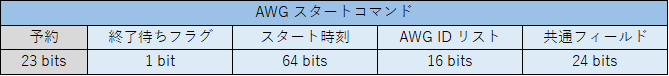

# フィードバックシステムユーザマニュアル

## 1. 機能概要
フィードバックシステムは，キャプチャした波形データをもとに AWG とキャプチャユニットの設定を変更して，
波形データの送信とキャプチャを行うための FPGA デザインです．
本デザインは，シーケンサブロックと e7awg_hw の 2 つの部分からなっており，シーケンサブロックが，
後述する**フィードバック制御コマンド**に従って e7awg_hw の各種モジュールを制御する仕組みとなっています．
e7awg_hw に関する説明は，[e7awg_hw ユーザマニュアル](./README.md) を参照してください．

以下にフィードバックシステムの概略図を示します．

### シーケンサブロックの各モジュールとその機能
|  モジュール  |  機能  |
| ---- | ---- |
| sequencer | フィードバック制御コマンドを逐次実行しながら，コマンドの内容に応じて他のモジュールに命令を出します． |
| feedback value calculator | sequencer の命令を受けて，キャプチャデータからフィードバック値を計算します．  フィードバック値は，AWG とキャプチャユニットに設定すべきパラメータを選択するのに使用されます． |
| parameter loader | sequencer の命令を受けて，波形パラメータもしくは，キャプチャパラメータを読み出し，前者を AWG，後者をキャプチャユニットに設定します．また，キャプチャユニットに対し，キャプチャアドレスオフセットも設定します． |

##  2. フィードバック制御コマンド
### 2.1 コマンドのライフサイクル
フィードバック制御コマンドは，UDP/IP パケットとしてシーケンサに送られ，シーケンサ内の FIFO に格納されます．
FIFO のコマンドは未処理のコマンドとして扱われ，シーケンサがコマンドを実行可能な状態になると FIFO から取り出されて処理されます．
シーケンサが処理するコマンドは常に 1 つだけです．処理が終了したコマンドは，シーケンサから消えます．

### 2.2 フィードバック制御コマンドフォーマット

フィードバック制御コマンドには，以下の 6 種類があります．
- AWG スタートコマンド
- キャプチャ終了フェンスコマンド
- 波形パラメータ設定コマンド
- キャプチャパラメータ設定コマンド
- キャプチャアドレスオフセット設定コマンド
- フィードバック値計算コマンド

これらのコマンドを，後述するシーケンサ制御パケットに格納して UDP データとして送る際のフォーマットについて記します．
なお，図中におけるコマンドのバイトオーダと各フィールドのビットナンバリングは以下の通りです．

#### 共通フィールド
全てのコマンドは，**停止フラグ**，**コマンド ID**，**コマンド No** のフィールドを持ち，これらをまとめて共通フィールドと呼びます．

| フィールド名 | 説明 |
| ---- | ---- |
| 停止フラグ | このビットが 1 になっているコマンドの処理が終わると，シーケンサはコマンドの処理を停止します． |
| コマンド ID | コマンドの種類ごとに定められた ID |
| コマンド No | 個々のコマンドを識別するための番号.  後述するコマンドエラーレポートで，どのコマンドがエラーを起こしたか判別するために使用します. |

#### AWG スタートコマンド

###  2.3 コマンドエラーレポートフォーマット
コマンドの処理中にエラーが発生した場合，終了時に，そのコマンドに対応したエラーレポートが，指定した IP アドレスと UDP ポートに向けて送信されます．

##  3. シーケンサソフトウェアインタフェース

### 3.1 状態遷移

| 状態 | 説明 |
| ---- | ---- |
| RESET | シーケンスブロック全体をリセットしている状態です．リセット解除後にリセットが完了すると `IDLE` 状態に遷移します．  リセットの開始と解除は FPGA のコンフィギュレーション完了直後に自動で行われますが，シーケンサ制御レジスタでも制御可能です． |
| IDLE | フィードバック制御コマンドの実行開始を待っている状態です．コマンドの実行はシーケンサの start 信号の立ち上がりで開始されるほか，シーケンサ制御レジスタからも開始可能です．|
| RUNNING | フィードバック制御コマンドを実行可能な状態です．この状態でシーケンサのコマンド FIFO にコマンドが存在すると，順番にコマンドの処理を進めます．**停止フラグ**が立っているコマンドを処理すると，シーケンサはコマンドの処理を止め `IDLE` 状態に遷移します．|

各状態におけるステータス信号の値は以下の表のとおりです．
各ステータス信号の値は，シーケンサ制御レジスタの信号名と同名のビットフィールドから読み取れます．

|  状態\信号名 | wakeup | busy | done |
| ---- | ---- | ---- | ---- |
| RESET   | 0 | 0 | 0  |
| IDLE    | 1 | 0 | 0 / 1|
| RUNNING | 1 | 1 | 0  |

※`IDLE` 時の done 信号は `RUNNING` から `IDLE` に遷移した後で 1 になります．

### レジスタ一覧

### シーケンサ制御コマンド

## 5. レジストリ構造

