# e7awg_hw ユーザマニュアル

本資料は e7awg_hw のドライバソフトウェア開発者向けのマニュアルです．
e7awg_sw（e7awg_hw の制御用ライブラリ）を使ったアプリケーションの開発方法については，
[AWG ユーザマニュアル](../sw/awg.md) および [example](../../../examples/kr260) ディレクトリ以下にあるサンプルスクリプトを参考にしてください．

## 1. 機能概要
e7awg_hw は，ユーザが定義した波形データを出力する機能を備えた FPGA デザインです．FPGA 内部の各モジュールは，10G Ethernet で送られる UDP/IP パケットにて制御可能になっています．
以下に e7awg_hw の概略図を示します．

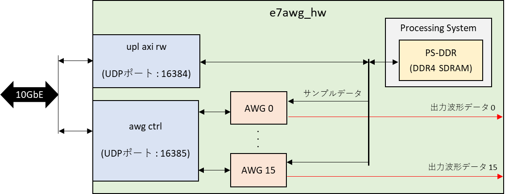

### 各モジュールとその機能
|  モジュール  |  機能  |
| ---- | ---- |
| PS-DDR | Processing System 経由でアクセスできる DDR4 SDRAM です．  1 ワードは 128 bits (= 16 Bytes) です． |
| upl axi rw | e7udpip10G と PS-DDR 間のデータの送受信を制御します． |
| awg ctrl | e7udpip10G から送られるデータをもとに AWG を制御します． |
| AWG | PS-DDR からサンプル値を読み出し，ユーザが定義した波形の並びで出力します． |

## 2. PS-DDR ソフトウェアインタフェース仕様

PS-DDR は 1 ワード 128 bits (= 16Bytes) のメモリで，ワード単位でアクセス可能です．
各ワードとアドレスの対応関係は以下の図の通りです．

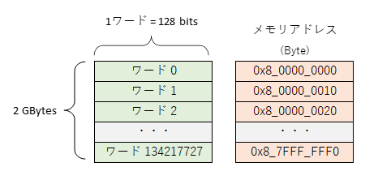

## 2.1 PS-DDR アクセスパケットフォーマット
PS-DDR にアクセスするためには，PS-DDR アクセスパケットを UDP データとして e7awg_hw のポート 16384 に送る必要があります．
PS-DDR アクセスパケットには，以下の 4 種類があり，(A) と (C) が e7awg_hw に送るパケットで，(B) と (D) がその応答として e7awg_hw から送られるパケットです．

- (A) PS-DDR 読み出しパケット  
- (B) PS-DDR 読み出し応答パケット  
- (C) PS-DDR 書き込みパケット  
- (D) PS-DDR 書き込み応答パケット  

#### (A) PS-DDR 読み出しパケット
このパケットを e7awg_hw に送信すると，アドレス `A` から `A + B - 1` までのワードデータが，PS-DDR 読み出し応答パケットとして返ってきます．A と B は共に 16 の倍数を指定してください．B の最大値は 4064 です．

#### (B) PS-DDR 読み出し応答パケット
PS-DDR のデータを正常に読みだせた場合，**アドレス** と **バイト数** フィールドには，PS-DDR 読み出しパケットで指定した値が入っています．**ワードデータ 1 ~ N** には，アドレス `A` から `A + 16N - 1` までのワードデータが順に格納されています．

#### (C) PS-DDR 書き込みパケット
このパケットを e7awg_hw に送信すると，アドレス `A` から `A + 16N - 1` までのワードに，**ワードデータ 1 ~ N** の値が書き込まれます．A は 16 の倍数を指定してください．N の最大値は 254 です．

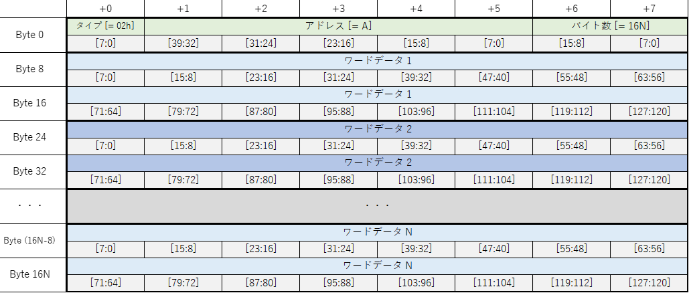

#### (D) PS-DDR 書き込み応答パケット
PS-DDR にデータを正常に書き込めた場合，**アドレス** と **バイト数** フィールドには，PS-DDR 書き込みパケットで指定した値が入っています．

## 2.2 PS-DDR データレイアウト
AWG が出力する波形データは，PS-DDR の以下の図の領域に格納しなければなりません．
PS-DDR 上での波形データの並びは，**3.5 PS-DDR に格納された波形データの並び** を参照してください．

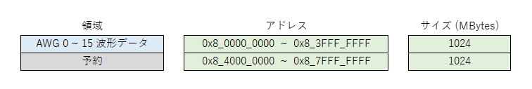

## 3. AWG ソフトウェアインタフェース仕様

### 3.1 状態遷移図

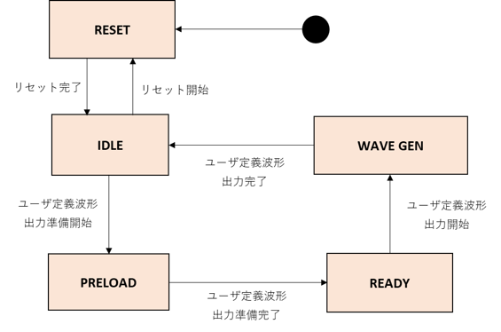

| 状態 | 説明 |
| ---- | ---- |
| RESET | AWG をリセットしている状態です．リセット解除後にリセットが完了すると `IDLE` 状態に遷移します．  リセットの開始と解除は FPGA のコンフィギュレーション完了直後に自動で行われますが，AWG 制御レジスタでも制御可能です．|
| IDLE | ユーザ定義波形の出力準備開始を待っている状態です．出力準備の開始は AWG 制御レジスタから実行可能です．|
| PRELOAD | ユーザ定義波形を出力するための準備を行っている状態です．準備が完了すると，自動的に `READY` 状態に遷移します． |
| READY | ユーザ定義波形の出力開始を待っている状態です． 出力開始は AWG 制御レジスタから実行可能です．|
| WAVE GEN | ユーザ定義波形を出力中の状態です．ユーザ定義波形の出力が完了すると，自動的に `IDLE` 状態に遷移します．|

各状態におけるステータス信号の値は以下の表のとおりです．
各ステータス信号の値は，AWG 制御レジスタの信号名と同名のビットフィールドから読み取れます．

|  状態\信号名 | wakeup | busy | ready | done |
| ---- | ---- | ---- | ---- | ---- |
| RESET    | 0 | 0 | 0 | 0 |
| IDLE     | 1 | 0 | 0 | 0 / 1|
| PRELOAD  | 1 | 1 | 0 | 0 |
| READY    | 1 | 1 | 1 | 0 |
| WAVE GEN | 1 | 1 | 0 | 0 |

※`IDLE` 時の done 信号は `WAVE GEN` から `IDLE` に遷移した後で 1 になります．

 ### 3.2 出力波形の定義

ユーザが，各 AWG に対して設定した出力波形全体を**ユーザ定義波形**と言います．
**ユーザ定義波形**は **wait word** と，その後に続く**波形シーケンス**の繰り返しで構成されます．
**波形シーケンス**は，最大 4294967295 回繰り返すことが可能です．
**wait word** は無くても問題ありません．

**wait word** は値が 0 のサンプルが並んだ波形です．
1 サンプルを 1 つの単位とする **AWG ワード** 単位で指定可能で，最大長は 4294967295 AWG ワードとなります．

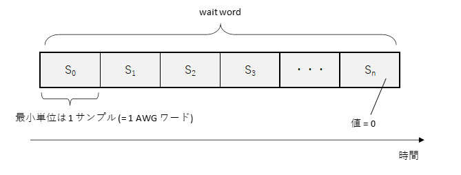

**波形シーケンス**は**波形チャンク**の繰り返しを並べたもので構成されます．
**波形チャンク**は最大 16 個まで定義でき，各チャンクは 4294967295 回まで繰り返すことが可能です．

**波形チャンク**は**波形パート**と**ポストブランク**で構成されます．
**ポストブランク**は無くても問題ありません．

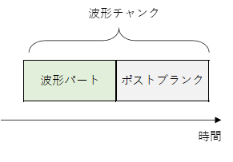

**波形パート**は任意の値のサンプルが並んでおり，そのサンプル数は 128 の倍数でなければなりません．

また，**波形パート**のサンプル数は，以下の制約も満たさなければなりません．
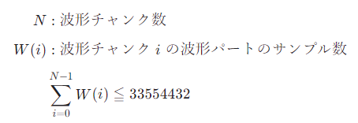

<!--
$$
\begin{align*}

N &: 波形チャンク数  \\[1ex]
W(i) &: 波形チャンク \; i \;の波形パートのサンプル数 \\[1ex]
&\displaystyle \sum_{i=0}^{N-1} W(i) \leqq 33554432
\end{align*}
$$
-->

**ポストブランク** は値が 0 のサンプルが並んだ波形で，最大長は 4294967295 AWG ワードとなります．
1 サンプル (= 1 AWG ワード) 単位で指定可能です.

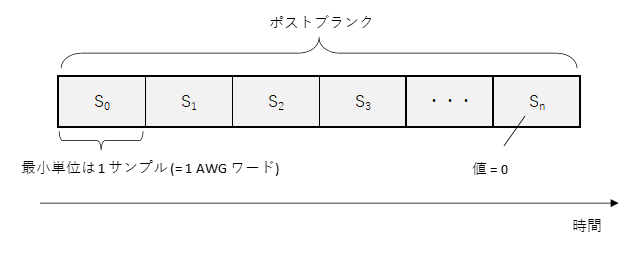

### 3.3 AWG 制御レジスタ一覧

AWG を制御するためのレジスタ一覧を以下に示します．

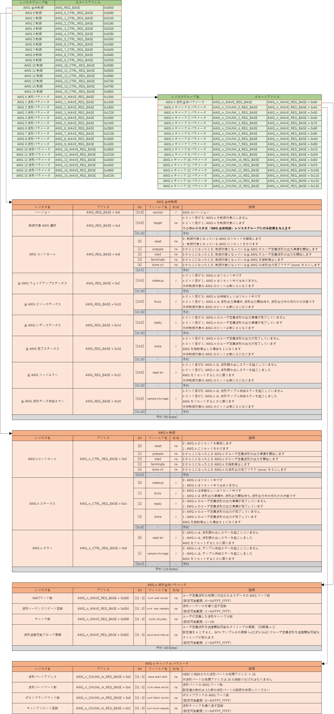

### 3.4 AWG 制御パケットフォーマット

**3.3 AWG 制御レジスタ一覧**のレジスタにアクセスするためには，AWG 制御パケットを UDP データとして e7awg_hw のポート 16385 に送る必要があります．
AWG 制御用パケットには，以下の 4 種類があり，(A) と (C) が e7awg_hw に送るパケットで，(B) と (D) がその応答として e7awg_hw から送られるパケットです．

- (A) AWG レジスタ読み出しパケット
- (B) AWG レジスタ読み出し応答パケット
- (C) AWG レジスタ書き込みパケット
- (D) AWG レジスタ書き込み応答パケット

#### (A) AWG レジスタ読み出しパケット
このパケットを e7awg_hw に送信すると，アドレス `A` から `A + B - 1` までのレジスタ値が，AWG レジスタ読み出し応答パケットとして返ってきます．A と B は共に 4 の倍数を指定してください．B の最大値は 4072 です．

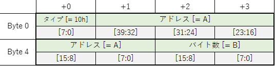

#### (B) AWG レジスタ読み出し応答パケット
レジスタ値が正常に読みだせた場合，**アドレス** と **バイト数** フィールドには，AWG レジスタ読み出しパケットで指定した値が入っています．**レジスタ値 1 ~ N** には，アドレス `A` から `A + 4N - 1` までのレジスタ値が順に格納されています．

#### (C) AWG レジスタ書き込みパケット
このパケットを e7awg_hw に送信すると，アドレス `A` から `A + 4N - 1` までのレジスタに，**レジスタ値 1 ~ N** の値が書き込まれます．A は 4 の倍数を指定してください．N の最大値は 1018 です．

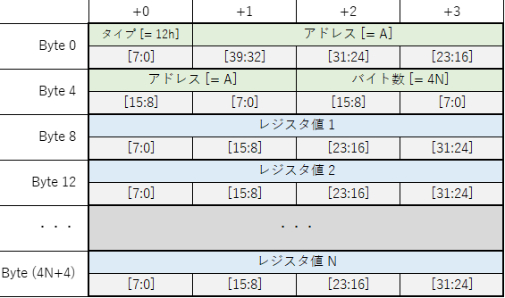

#### (D) AWG レジスタ書き込み応答パケット

レジスタ値が正常に書き込めた場合，**アドレス** と **バイト数** フィールドには，AWG レジスタ書き込みパケットで指定した値が入っています．

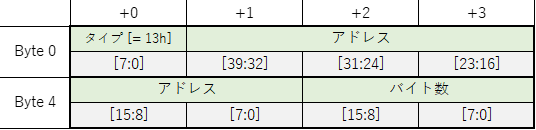

### 3.5 PS-DDR に格納された波形データの並び

波形パートのサンプルデータは，以下の並びで PS-DDR に格納する必要があります．
波形パートのサンプルデータの先頭アドレス A は，波形パートアドレスレジスタの値 * 16 となります．

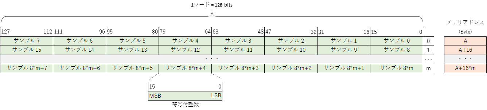
