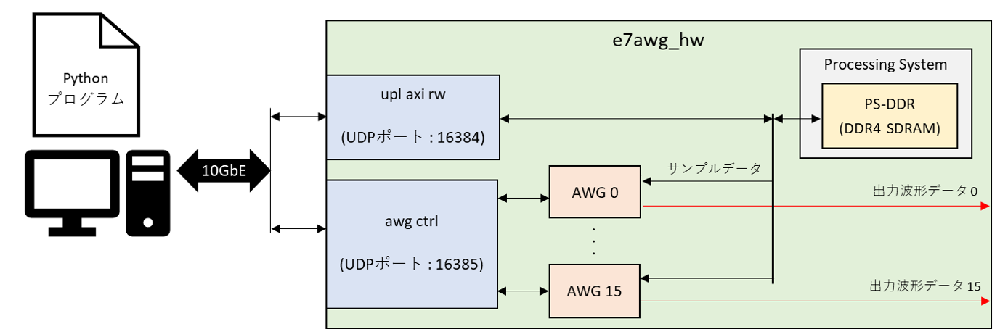
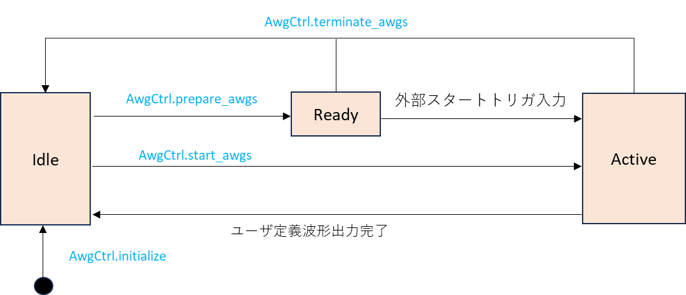
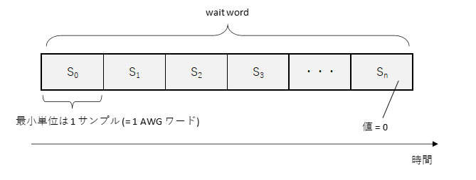
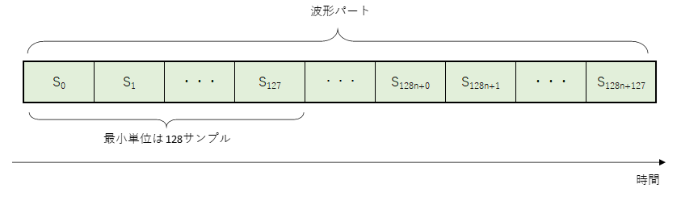
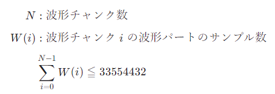
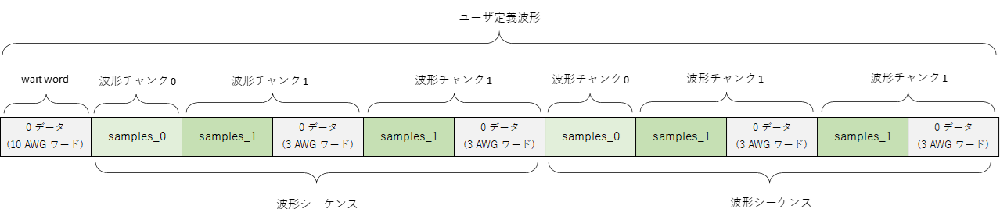

# AWG ユーザマニュアル

本資料は，KR260 を利用した Arbitrary Waveform Generator (以下 AWG) の利用者向けマニュアルです．

## 1. システム構成

AWG は KR260 の FPGA 上に実装されており，そのシステム構成は以下のようになります．
AWG の制御には専用の Python API を用います．
この API には Python で作成した波形データを FPGA に送信する機能や，AWG の動作完了を待つ機能などが含まれています．

<br>




## 2. AWG の状態

AWG は下図の状態を持ち，特定の Python API (図中の青字) が呼ばれたときや HW の特定の動作によって遷移します.



**状態の説明**

| 状態名 | 説明 |
| --- | --- |
| Idle | 初期状態. |
| Ready | 波形の出力準備が終わって外部スタートトリガの入力を待っている状態です. |
| Active | ユーザ定義波形を出力します．|

<br>

## 3. 出力波形の構造

AWG が出力可能な波形の構造と制約について説明します．

ユーザが各 AWG に対して設定した出力波形全体を**ユーザ定義波形**と言います．
**ユーザ定義波形**は **wait word** と，その後に続く**波形シーケンス**の繰り返しで構成されます．
**波形シーケンス**は，最大 4294967295 回繰り返すことが可能です．
**wait word** は無くても問題ありません．


wait word は値が 0 のサンプルが並んだ波形です． 1 サンプル単位で指定可能で，最大長は 4294967295 サンプルとなります．



**波形シーケンス**は**波形チャンク**の繰り返しを並べたもので構成されます．
**波形チャンク**は最大 16 個まで定義でき，各チャンクは 4294967295 回まで繰り返すことが可能です．


**波形チャンク**は**波形パート**と**ポストブランク**で構成されます．
**ポストブランク**は無くても問題ありません．


**波形パート**は任意の値のサンプルが並んでおり，そのサンプル数は 128 の倍数でなければなりません．



また，波形パートのサンプル数はストレージ (DDR4 SDRAM) 容量の都合上，以下の制約も満たさなければなりません． 



<!--
$$
\begin{align*}

N &: 波形チャンク数  \\[1ex]
W(i) &: 波形チャンク \; i \;の波形パートのサンプル数 \\[1ex]
&\displaystyle \sum_{i=0}^{N-1} W(i) \leqq 33554432
\end{align*}
$$
-->

**ポストブランク**は値が 0 のサンプルが並んだ波形で，最大長は 4294967295 サンプルとなります．


<br>

## 4. AWG 制御用 API の詳細

本章では AWG の操作に必要な Python API を手順ごとに説明します．
各 API の詳細は, 関数ヘッダコメントを参照してください.

### 4.1. AWG の初期化

AWG は，次節以降で述べる操作を行う前に AwgCtrl クラスの initialize メソッドを使用して初期化しなければなりません．

初期化のコード例を以下に示します

```
import e7awgsw as e7s

fpga_ip_addr = '10.0.0.16'    # KR260 の 10 Gb Ethernet ポートの IP アドレス

# AWG 制御用オブジェクトを作成する
with (e7s.AwgCtrl(fpga_ip_addr, e7s.E7AwgHwType.KR260) as awg_ctrl):
    # AWG 0 , AWG 4 を初期化
    awg_ctrl.initialize(e7s.AWG.U0, e7s.AWG.U4)
```

### 4.2. 波形データの設定

AWG に設定する波形データは，e7awgsw パッケージの WaveSequence クラスを用いて作成します．
3 章で説明したユーザ定義波形の

- 波形シーケンスの繰り返し回数
- wait word の長さ

をコンストラクタで指定し

- 波形パートのサンプル値
- 波形チャンクの繰り返し回数
- ポストブランク長

を add_chunk メソッドで指定します．

波形データを作成するコードの例を以下に示します．

```
import e7awgsw as e7s

wave_seq = e7s.WaveSequence(
    num_wait_words = 10,                  # wait word のサンプル数
    num_seq_repeats = 2,                  # 波形シーケンスの繰り返し回数
    design_type = e7s.E7AwgHwType.KR260)  # e7awg_hw の種類を指定


# 波形チャンク 0 の定義
samples_0 = [1, 2, ..., 255]
wave_seq.add_chunk(
    iq_samples = samples_0,  # サンプル値のリスト
    num_blank_words = 0,     # ポストブランクの AWG ワード数
    num_repeats = 1)         # 波形チャンクの繰り返し回数

# 波形チャンク 1 の定義
samples_1 = [-1, -2, ..., -255]
wave_seq.add_chunk(
    iq_samples = samples_1,  # サンプル値のリスト
    num_blank_words = 3,     # ポストブランクの AWG ワード数
    num_repeats = 2)         # 波形チャンクの繰り返し回数
```

上記のコードで定義されるユーザ定義波形は以下のようになります.



定義した波形を AWG に設定するには AwgCtrl クラスの set_wave_sequence メソッドを使用します．

波形データを設定するコードの例を以下に示します．

```
import e7awgsw as e7s

fpga_ip_addr = '10.0.0.16'     # KR260 の 10 Gb Ethernet ポートの IP アドレス

# AWG 制御用オブジェクトを作成する
with (e7s.AwgCtrl(fpga_ip_addr, e7s.E7AwgHwType.KR260) as awg_ctrl):

    ### AWG 初期化 (省略) ###
    ### 波形データの定義 (省略) ###

    # AWG 0 , AWG 4 に波形データを設定
    awg_ctrl.set_wave_sequence(e7s.AWG.U0, wave_seq)
    awg_ctrl.set_wave_sequence(e7s.AWG.U4, wave_seq)
```

### 4.3. 波形の出力開始と完了待ち

AWG の波形出力を開始するには AwgCtrl クラスの start_awgs メソッドを使用します．
このメソッドで指定した全ての AWG は同時にユーザ定義波形の出力を開始します．
AWG の波形出力が完了するのを待つには AwgCtrl クラスの wait_for_awgs_to_stop メソッドを使用します．
このメソッドは指定した全ての AWG の波形出力が完了するか，タイムアウトまでコントロールを返しません．

波形の出力開始と完了待ちを行うコードの例を以下に示します．

```
import e7awgsw as e7s

fpga_ip_addr = '10.0.0.16'     # KR260 の 10 Gb Ethernet ポートの IP アドレス

# AWG 制御用オブジェクトを作成する
with (e7s.AwgCtrl(fpga_ip_addr, e7s.E7AwgHwType.KR260) as awg_ctrl):

    ### AWG 初期化 (省略) ###
    ### 波形データの定義 (省略) ###
    ### 波形データの設定 (省略) ###
    
    # AWG 0 と AWG 4 のユーザ定義波形出力スタート
    awg_ctrl.start_awgs(e7s.AWG.U0, e7s.AWG.U4)
    
    # タイムアウト 5 秒で AWG 0 と AWG 4 の波形出力完了待ち
    awg_ctrl.wait_for_awgs_to_stop(5, e7s.AWG.U0, e7s.AWG.U4)
```
