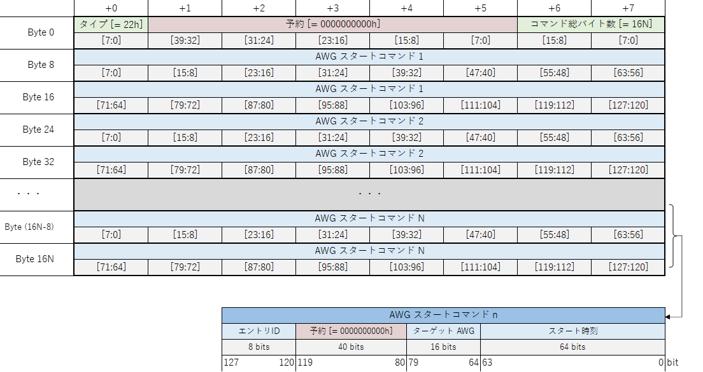

# AWG シーケンサユーザーマニュアル

## 1. 機能概要
AWG シーケンサは，後述する **AWG シーケンサコマンド** や **AWG シーケンサリクエスト** を元に，AWG のスタートや AWG 制御レジスタの設定などを行うモジュールです．
以下に AWG シーケンサの概略図を示します．

### サブモジュールとその機能
| サブモジュール | 機能 |
| ---- | ---- |
| cmd generator | UDP パケットを解析して以下の **AWG シーケンサコマンド** もしくは **AWG シーケンサリクエスト** を発行します．   AWG シーケンサコマンド  　- AWG 制御レジスタ書き込みコマンド   　- AWG スタートコマンド    AWG シーケンサリクエスト  　- コマンドキャンセルリクエスト  　- AWG 強制停止リクエスト   　- コマンドキャンセル & AWG 強制停止リクエスト |
| cmd dispatcher | コマンド FIFO からコマンドを読み取って，対応するサブモジュールにその処理を命令します．  `コマンドキャンセルリクエスト`を受けた場合，未処理のコマンドを全て破棄します．|
| axi4 writer | `AWG 制御レジスタ書き込みコマンド` を処理します． |
| awg starter | `AWG スタートコマンド` を処理します．  `AWG 強制停止リクエスト` を受けた場合，現在動作中の AWG を強制停止します．|
| コマンド FIFO | 未処理の AWG シーケンサコマンドを格納する FIFO です |

 

## 2. AWG シーケンサコマンド説明

#### コマンドのライフサイクル  

コマンドは，一度に 1 つしか処理されず，現在処理中のものが完了してから次の未処理のコマンドが開始されます．

#### 1. AWG 制御レジスタ書き込みコマンド
任意の AWG 制御レジスタにコマンドで指定した値を書き込みます．
このコマンドは，コマンド内で指定した全てのレジスタの書き込みが終了すると完了します．

#### 2. AWG スタートコマンド
任意の AWG をコマンドで指定した時刻に同時にスタートします．
このコマンドは，強制停止の場合も含めスタートした AWG の波形出力が終了すると完了します．

## 3. AWG シーケンサリクエスト説明

#### リクエストのライフサイクル  

リクエストは一度に 1 つしか処理されません．
また，リクエストの処理中に新しいコマンドおよびリクエストは発行されません．

#### 1. コマンドキャンセルリクエスト

このリクエストが発行されたときに，**未処理の**コマンドがあれば，それらを全て破棄します．

#### 2. AWG 強制停止リクエスト

このリクエストが発行されたときに，動作中の AWG があれば，それらを全て強制停止します．

#### 3. コマンドキャンセル & AWG 強制停止リクエスト

コマンドキャンセルリクエストと AWG 強制停止リクエストを 1 つのリクエストとして処理します．

## 4. AWG シーケンサ制御パケットフォーマット

AWG シーケンサとサーバ間でやりとりされる UDP データを AWG シーケンサ制御パケットと呼びます． AWG シーケンサ制御パケットには，以下の 10 種類があります．(A), (C), (E), (G), (I) が AWG シーケンサに送るパケットで，(B), (D), (F), (H), (J) がその応答として AWG シーケンサから送られるパケットです．

- (A) AWG 制御レジスタ書き込みコマンド追加パケット
- (B) AWG 制御レジスタ書き込みコマンド追加応答パケット
- (C) AWG スタートコマンド追加パケット
- (D) AWG スタートコマンド追加応答パケット
- (E) コマンドキャンセルリクエストパケット
- (F) コマンドキャンセルリクエスト応答パケット
- (G) AWG 強制停止リクエストパケット
- (H) AWG 強制停止リクエスト応答パケット
- (I) コマンドキャンセル & AWG 強制停止リクエストパケット
- (J) コマンドキャンセル & AWG 強制停止リクエスト応答パケット

以下に示すパケットの各フィールドは，ビットナンバリングの大きい方を MSB，小さいほうを LSB とします．

 

#### (A) AWG 制御レジスタ書き込みコマンド追加パケット

このパケットを送信すると，アドレス `A` から `A + B - 1` までの AWG 制御レジスタに，**レジスタ値 1** から **レジスタ値 (B/4)** までの値を書き込む `AWG 制御レジスタ書き込みコマンド` が **1 つ** 追加されます．A と B は共に 4 の倍数を指定してください．B の最大値は 4072 です．

 

#### (B) AWG 制御レジスタ書き込みコマンド追加応答パケット

`AWG 制御レジスタ書き込みコマンド` が追加されたとき，AWG シーケンサが送信するパケットです．
**アドレス**フィールドには，同コマンドによって書き込まれる一連のレジスタの先頭アドレスが格納されます．
**バイト数** フィールドには，同コマンドによって書き込まれるレジスタの総バイト数が格納されます．

 

#### (C) AWG スタートコマンド追加パケット

このパケットを送信すると，パケット内の **AWG スタートコマンドの数だけ** 同コマンドが追加されます．
各 AWG スタートコマンドには，以下の 3 つのパラメータがあります．
- スタート時刻 : タイマ値（概略図を参照）がこの値と同じになると AWG を起動する
- ターゲット AWG : n ビット目を 1 にすると AWG n が起動する
- エントリ ID : AWG スタートコマンドの識別子．エラーを起こしたコマンドの識別などに使用する．

**コマンド総バイト数** には，`AWG スタートコマンドの数 * 16` を指定してください．N の最大値は 254 です．

 

#### (D) AWG スタートコマンド追加応答パケット

`AWG スタートコマンド` を AWG シーケンサに追加したとき，AWG シーケンサが送信するパケットです．
**コマンド総バイト数** フィールドには，`追加した AWG スタートコマンドの数 * 16` が格納されます．

 

#### (E) コマンドキャンセルリクエストパケット

このパケットを送信すると，`コマンドキャンセルリクエスト` が発行されます．

 

#### (F) コマンドキャンセルリクエスト応答パケット

`コマンドキャンセルリクエスト` が発行されたとき，AWG シーケンサが送信するパケットです．

 

#### (G) AWG 強制停止リクエストパケット

このパケットを送信すると，`AWG 強制停止リクエスト` が発行されます．

 

#### (H) AWG 強制停止リクエスト応答パケット

`AWG 強制停止リクエスト` が発行されたとき，AWG シーケンサが送信するパケットです．

 

#### (I) コマンドキャンセル & AWG 強制停止リクエストパケット

このパケットを送信すると，`コマンドキャンセル & AWG 強制停止リクエスト` が発行されます．

 

#### (J) コマンドキャンセル & AWG 強制停止リクエスト応答パケット

`コマンドキャンセル & AWG 強制停止リクエスト` が発行されたとき，AWG シーケンサが送信するパケットです．

 

## 5. コマンド発行に関する制約

AWG シーケンサが発行したコマンドは，処理可能になるまで未処理状態のまま保持されます．
しかし，未処理のまま保持できるコマンドの数には上限があり，上限に達したとき正常にコマンドが発行できなくなります．
これを避けるため，以下の条件①を満たす必要があります．

<!--
$$
\begin{align*}
M &: 未処理の AWG 制御レジスタ書き込みコマンド数  \\[1ex]
N &: 未処理の AWG スタートコマンド数 \\[1ex]
S(i) &: \; i \;番目の未処理のAWG 制御レジスタ書き込みコマンドの書き込みレジスタ数 \\[1ex]
N &+ \displaystyle\sum_{i=0}^{M-1} \lceil \frac{S(i)}{4} \rceil \leqq 512 \;\cdots \text{\textcircled 1}\\
\end{align*}
$$
-->