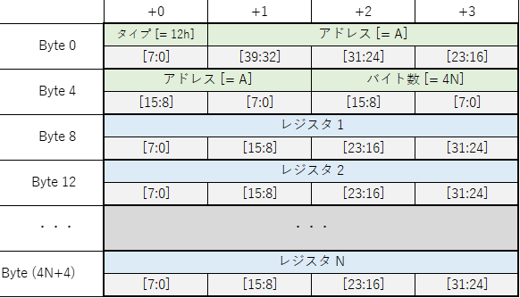
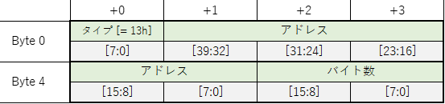

# AWG シーケンサユーザーマニュアル

## 1. 機能概要
AWG シーケンサは，UDP パケットとして送られた「コマンド」や「リクエスト」を元に，AWG のスタートや AWG 制御レジスタの設定などを行うモジュールです．
以下に AWG シーケンサの概略図を示します．

### サブモジュールとその機能
| サブモジュール | 機能 |
| ---- | ---- |
| cmd generator | UDP パケットを解析して以下のコマンドとリクエストを発行します．   コマンド  　- AWG 制御レジスタ書き込み   　- AWG スタート   リクエスト  　- コマンドキャンセル  　- AWG 強制停止   　- コマンドキャンセル & AWG 強制停止 |
| cmd dispatcher | コマンド FIFO からコマンドを読み取って，対応するサブモジュールにその処理を命令します．  「コマンドキャンセル」リクエストを受けた場合，未処理のコマンドを全て破棄します．|
| axi4 writer | 「AWG 制御レジスタ書き込み」コマンドを処理します． |
| awg starter | 「AWG スタート」コマンドを処理します．  「AWG 強制停止」リクエストを受けた場合，現在動作中の AWG を強制停止します．|

## 2. コマンド説明

#### コマンドのライフサイクル  

コマンドは，一度に 1 つしか処理されず，現在処理中のものが完了してから次の未処理のコマンドが開始されます．

#### 1. AWG 制御レジスタ書き込みコマンド
特定の AWG 制御レジスタにコマンドで指定した値を書き込みます．
このコマンドは，コマンド内で指定した全てのレジスタの書き込みが終了すると完了します．

#### 2. AWG スタートコマンド
特定の AWG をコマンドで指定した時刻にスタートします．
このコマンドは，強制停止の場合も含め，スタートした AWG の波形出力が終了すると完了します．

## 3. リクエスト説明

#### リクエストのライフサイクル  

リクエストは一度に 1 つしか処理されません．
また，リクエストの処理中に新しいコマンドおよびリクエストは発行されません．

#### 1. コマンドキャンセルリクエスト

このリクエストが発行されたときに，**未処理の**コマンドがあれば，それらを全て破棄します．

#### 2. AWG 強制停止リクエスト

このリクエストが発行されたときに，動作中の AWG があれば，それらを全て強制停止します．

#### 3. コマンドキャンセル & AWG 強制停止リクエスト

コマンドキャンセルリクエストと AWG 強制停止リクエストを 1 つのリクエストとして処理します．

## 4. UDP データフォーマット

AWG シーケンサの制御には，各コマンドやリクエストに対応した UDP データを AWG シーケンサのポート 16384 に送る必要があります．
この UDP データには，以下の 10 種類があり，(A), (C), (E), (G), (I) が AWG シーケンサに送るコマンドで，(B), (D), (F), (H), (J) がその応答として AWG シーケンサから送られるコマンドです．

- (A) AWG 制御レジスタ書き込み
- (B) AWG 制御レジスタ書き込み応答
- (C) AWG スタート
- (D) AWG スタート応答
- (E) コマンドキャンセル
- (F) コマンドキャンセル応答
- (G) AWG 強制停止
- (H) AWG 強制停止応答
- (I) コマンドキャンセル & AWG 強制停止
- (J) コマンドキャンセル & AWG 強制停止応答

#### (A) AWG 制御レジスタ書き込み

この UDP データを送信すると，アドレス `A` から `A + B - 1` までの AWG 制御レジスタに，**レジスタ値 1** から **レジスタ値 (B/4)** までの値が書き込まれます．A と B は共に 4 の倍数を指定してください．B の最大値は 4072 です．
この UDP データ 1 つにつき，AWG 制御レジスタ書き込みコマンドが 1 つ発行されます．

#### (B) AWG 制御レジスタ書き込み応答
**アドレス**フィールドには，発行予定のコマンドによって書き込まれる一連のレジスタの先頭アドレスが格納されます．
**バイト数** フィールドには，発行予定のコマンドによって書き込まれるレジスタの総バイト数が格納されます．

#### (C) AWG スタート

この UDP データを送信すると，データ内の AWG スタートコマンドの数だけ同コマンドが発行されます．
各 AWG スタートコマンドには，以下の 3 つのパラメータがあります．
- スタート時刻 : タイマ値（概略図を参照）がこの値と同じになると AWG を起動する
- ターゲット AWG : n ビット目を 1 にすると AWG n が起動する
- エントリ ID : AWG スタートコマンドの識別子．エラーを起こしたコマンドの識別などに使用する．

**コマンド総バイト数 (B)** には，`AWG スタートコマンドの数 * 16` を指定してください．B の最大値は 4064 です．

#### (D) AWG スタート応答

**コマンド総バイト数** フィールドには，`発行予定の AWG スタートコマンドの数 * 16` が格納されます．

#### (E) コマンドキャンセル

#### (F) コマンドキャンセル応答

#### (G) AWG 強制停止

#### (H) AWG 強制停止応答

#### (I) コマンドキャンセル & AWG 強制停止

#### (J) コマンドキャンセル & AWG 強制停止応答

## 5. コマンド発行に関する制約

AWG シーケンサが発行したコマンドは，処理可能になるまで未処理状態のまま保持されます．
しかし，未処理のまま保持できるコマンドの数には上限があり，上限に達したとき正常にコマンドが発行できなくなります．
これを避けるため，以下の条件①を満たす必要があります．

<!--
$$
\begin{align*}
M &: 未処理の AWG 制御レジスタ書き込みコマンド数  \\[1ex]
N &: 未処理の AWG スタートコマンド数 \\[1ex]
S(i) &: \; i \;番目の未処理のAWG 制御レジスタ書き込みコマンドの書き込みレジスタ数 \\[1ex]
N &+ \displaystyle\sum_{i=0}^{M-1} \lceil \frac{S(i)}{4} \rceil \leqq 512 \;\cdots \text{\textcircled 1}\\
\end{align*}
$$
-->