# e7awg_hw ユーザマニュアル

本資料は e7awg_hw のドライバソフトウェア開発者向けのマニュアルです．
e7awg_sw（e7awg_hw の制御用ライブラリ）を使ったアプリケーションの開発方法については，
[AWG ユーザマニュアル](../sw/awg.md) と [ディジタル出力モジュールユーザマニュアル](../sw/digital_output.md) および
[example/zcu111](../../../examples/zcu111) ディレクトリ以下にあるサンプルスクリプトを参考にしてください．

## 1. 機能概要
ZCU111 向けの e7awg_hw には 3 種類の FPGA デザインがあります．
各デザインは，ユーザが定義した波形データおよびディジタル値を出力する機能と FPGA に入力された波形データに信号処理を適用してメモリに保存する機能を備えています．
FPGA 内部の各モジュールは，10Gb Ethernet で送られる UDP/IP パケットで制御可能になっています．
以下に e7awg_hw の概略図を示します．

 

**デザイン 0 , 1**

廃止しました．

 

**デザイン 2, 3**

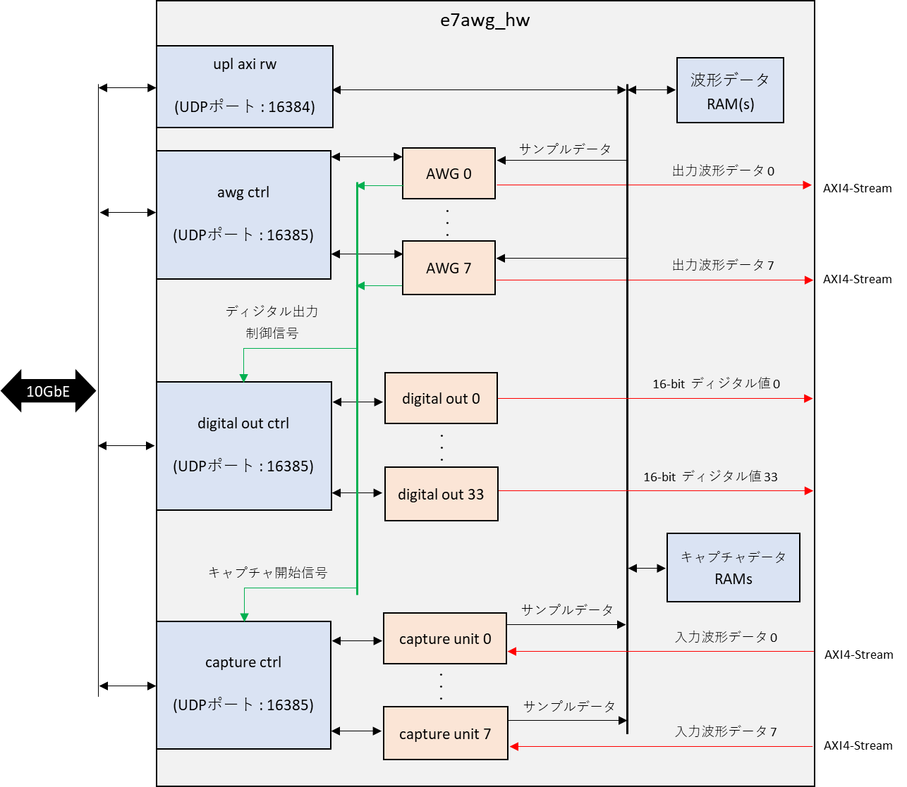

 

**デザイン 4**

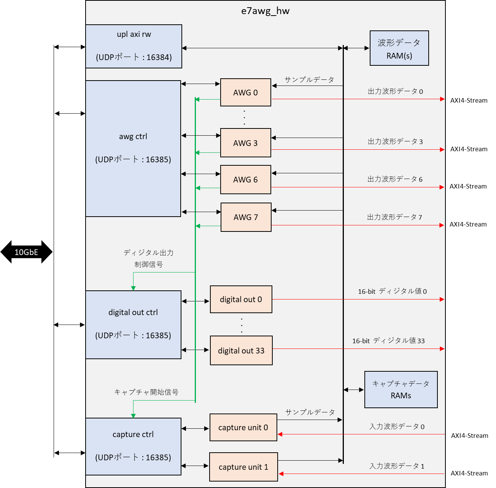

### 各モジュールとその機能
|  モジュール  |  機能  |
| ---- | ---- |
| 波形データ RAM | 出力波形のサンプル値を保持します．  1 ワードは 512 bits (= 64 Bytes) です． |
| upl axi rw | UDP/IP 通信用のコア (e7udpip10G) と 波形 / キャプチャデータ RAM 間のデータの送受信を制御します． |
| awg ctrl | UDP/IP 通信用のコア (e7udpip10G) から送られるデータをもとに AWG を制御します． |
| AWG | 波形データ RAM からサンプル値を読み出し，ユーザが定義した波形の並びで出力します． |
| digital out ctrl | UDP/IP 通信用のコア (e7udpip10G) から送られるデータをもとに digital out を制御します． |
| digital out | 内部のメモリからディジタル値を読み出し，ユーザが定義したパターンで出力します． |
| キャプチャデータ RAM | capture unit が出力したサンプル値を保持します．  1 ワードは 512 bits (= 64 Bytes) です． |
| capture ctrl | UDP/IP 通信用のコア (e7udpip10G) から送られるデータをもとに capture unit を制御します． |
| capture unit | 入力波形データに信号処理を適用して キャプチャデータ RAM に格納します． |

 

## 2. ZCU111 版 e7awg_hw の種類

ZCU111 上で動作する e7awg_hw には 3 種類の FPGA デザインがあります．
デザイン間で異なる部分は以下の通りです。

 - AWG のサンプリングレート
 - キャプチャユニット のサンプリングレート
 - データ RAM の構成

データ RAM は，波形データ RAM とキャプチャデータ RAM を合わせた RAM の呼び方です．

  

| デザイン ID | AWG の サンプリングレート [Msps] | キャプチャユニットの サンプリングレート [Msps] | データ RAM の構成 |
| --- | --- | --- | --- | 
| 2 | 552.96 | 552.96 | AWG 0 ~ 5 → DRAM x1（512 MBytes / AWG）   AWG 6 → URAM x1（1280 KBytes）   AWG 7 → URAM x1（1280 KBytes）   キャプチャユニット 0 → BRAM x1 (320 KBytes)   キャプチャユニット 1 → BRAM x1 (320 KBytes)   キャプチャユニット 2 → BRAM x1 (320 KBytes)   キャプチャユニット 3 → BRAM x1 (320 KBytes)   キャプチャユニット 4 → BRAM x1 (320 KBytes)   キャプチャユニット 5 → BRAM x1 (320 KBytes)   キャプチャユニット 6 → BRAM x1 (320 KBytes)   キャプチャユニット 7 → BRAM x1 (320 KBytes)|
| 3 | 3256.32 | 3.25632 | AWG 0 ~ 5 → DRAM x1（512 MBytes / AWG）   AWG 6 → URAM x1（1280 KBytes）   AWG 7 → URAM x1（1280 KBytes）   キャプチャユニット 0 → BRAM x1 (320 KBytes)   キャプチャユニット 1 → BRAM x1 (320 KBytes)   キャプチャユニット 2 → BRAM x1 (320 KBytes)   キャプチャユニット 3 → BRAM x1 (320 KBytes)   キャプチャユニット 4 → BRAM x1 (320 KBytes)   キャプチャユニット 5 → BRAM x1 (320 KBytes)   キャプチャユニット 6 → BRAM x1 (320 KBytes)   キャプチャユニット 7 → BRAM x1 (320 KBytes) |
| 4 | 798.72 | 798.72 | AWG 0 ~ 3, 6 → DRAM x1 (512MBytes / AWG)   AWG 7 → URAM x1 (2560 KBytes)   キャプチャユニット 0 → BRAM x1 (256 KBytes)   キャプチャユニット 1 → BRAM x1 (256 KBytes) |

※ サンプリングレートは，I/Q データの場合 I データと Q データをまとめて 1 サンプルとして計算しています．

 

## 3. データ RAM ソフトウェアインタフェース仕様

データ RAM は 1 ワード 512 bits (= 64 Bytes) のメモリで，ワード単位でアクセス可能です．
各ワードとアドレスの対応関係は以下の図の通りです．

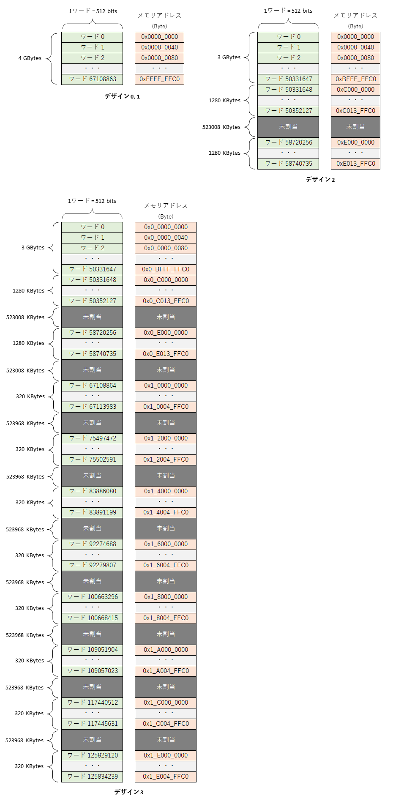

## 3.1 データ RAM アクセスパケットフォーマット
e7awg_hw のデータ RAM にアクセスするためには，データ RAM アクセスパケットを UDP データとして e7awg_hw のポート 16384 に送る必要があります．
データ RAM アクセスパケットには，以下の 4 種類があり，(A) と (C) が e7awg_hw に送るパケットで，(B) と (D) がその応答として e7awg_hw から送られるパケットです．

- (A) データ RAM 読み出しパケット
- (B) データ RAM 読み出し応答パケット
- (C) データ RAM 書き込みパケット
- (D) データ RAM 書き込み応答パケット

#### (A) データ RAM 読み出しパケット
このパケットを e7awg_hw に送信すると，アドレス `A` から `A + B - 1` までのワードデータが，データ RAM 読み出し応答パケットとして返ってきます．A と B は共に 64 の倍数を指定してください．B の最大値は 4032 です．

#### (B) データ RAM 読み出し応答パケット
データ RAM の読み出しに成功した場合，**アドレス** と **バイト数** フィールドには，データ RAM 読み出しパケットで指定した値が入っています．**ワードデータ 1 ~ N** には，アドレス `A` から `A + 64N - 1` までのワードデータが順に格納されています．

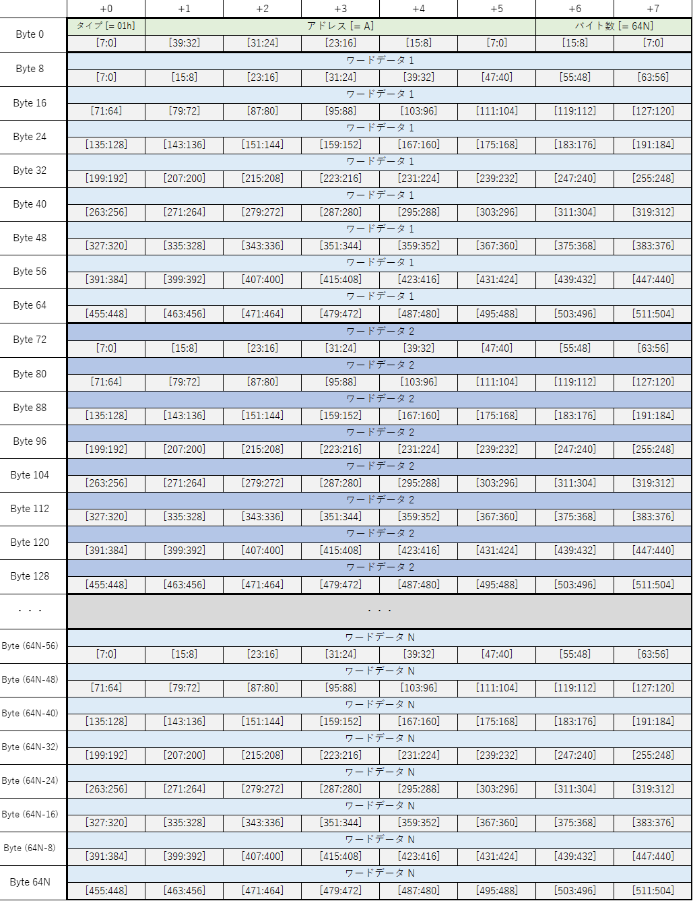

#### (C) データ RAM 書き込みパケット
このパケットを e7awg_hw に送信すると，アドレス `A` から `A + 64N - 1` までのワードに，**ワードデータ 1 ~ N** の値が書き込まれます．A は 64 の倍数を指定してください．N の最大値は 63 です．

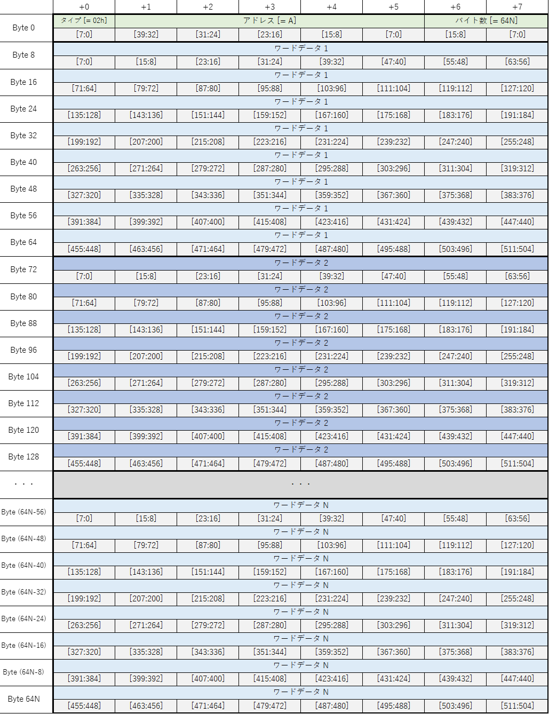

#### (D) データ RAM 書き込み応答パケット
データ RAM への書き込みに成功した場合，**アドレス** と **バイト数** フィールドには，データ RAM 書き込みパケットで指定した値が入っています．

## 3.2 データ RAM データレイアウト
各 AWG およびキャプチャユニットは，以下の図で示す RAM の領域を使用しなければなりません．
それぞれの領域での波形データおよびキャプチャデータの並びは，**4.5 波形データ RAM に格納された波形データの並び** と **6.7 キャプチャデータ RAM に格納されたキャプチャデータの並び** を参照してください．

**デザイン 2, 3**

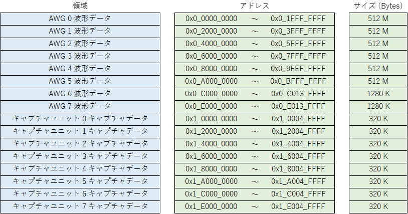

 

**デザイン 4**

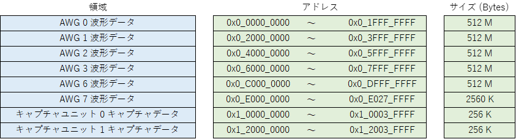

 

## 4. AWG ソフトウェアインタフェース仕様

### 4.1 状態遷移図

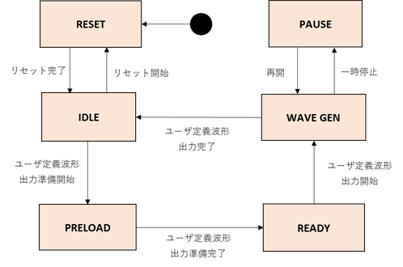

| 状態 | 説明 |
| ---- | ---- |
| RESET | AWG をリセットしている状態です．リセット解除後にリセットが完了すると `IDLE` 状態に遷移します．  リセットの開始と解除は FPGA のコンフィギュレーション完了直後に自動で行われますが，AWG 制御レジスタでも制御可能です．|
| IDLE | ユーザ定義波形の出力準備開始を待っている状態です．出力準備の開始は AWG 制御レジスタから実行可能です．|
| PRELOAD | ユーザ定義波形を出力するための準備を行っている状態です．準備が完了すると，自動的に `READY` 状態に遷移します． |
| READY | ユーザ定義波形の出力開始を待っている状態です． 出力開始は AWG 制御レジスタから実行可能です．|
| WAVE GEN | ユーザ定義波形を出力中の状態です．ユーザ定義波形の出力が完了すると，自動的に `IDLE` 状態に遷移します．|
| PAUSE | ユーザ定義波形の出力を一時停止している状態です． この一停止と再開は AWG 制御レジスタから実行可能です．| 

各状態におけるステータス信号の値は以下の表のとおりです．
各ステータス信号の値は，AWG 制御レジスタの信号名と同名のビットフィールドから読み取れます．

|  状態\信号名 | wakeup | busy | ready | done | paused |
| ---- | ---- | ---- | ---- | ---- | ---- |
| RESET    | 0 | 0 | 0 | 0 | 0 |
| IDLE     | 1 | 0 | 0 | 0 / 1| 0 |
| PRELOAD  | 1 | 1 | 0 | 0 | 0 |
| READY    | 1 | 1 | 1 | 0 | 0 |
| WAVE GEN | 1 | 1 | 0 | 0 | 0 |
| PAUSE    | 1 | 1 | 0 | 0 | 1 |

※`IDLE` 時の done 信号は `WAVE GEN` から `IDLE` に遷移した後で 1 になります．

 ### 4.2 出力波形の定義

ユーザが，各 AWG に対して設定した出力波形全体を**ユーザ定義波形**と言います．
**ユーザ定義波形**は **wait word** と，その後に続く**波形シーケンス**の繰り返しで構成されます．
**波形シーケンス**は，最大 4294967295 回繰り返すことが可能です．
**wait word** は無くても問題ありません．

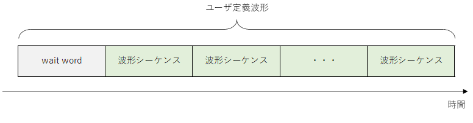

**wait word** は値が 0 のサンプルが並んだ波形です．
8 サンプルを 1 つの単位とする **AWG ワード**単位で指定可能で，最大長は 4294967295 **AWG ワード**となります（I データと Q データはまとめて 1 サンプルとカウントしています）．

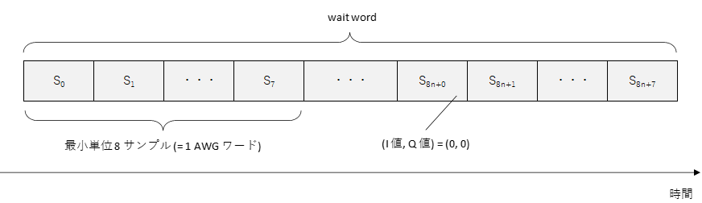

**波形シーケンス**は**波形チャンク**の繰り返しを並べたもので構成されます．
**波形チャンク**は最大 16 個まで定義でき，各チャンクは 4294967295 回まで繰り返すことが可能です．

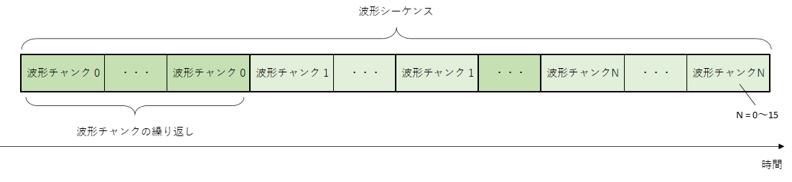

**波形チャンク**は**波形パート**と**ポストブランク**で構成されます．
**ポストブランク**は無くても問題ありません．

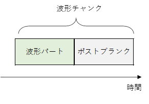

**波形パート**は任意の値のサンプルが並んでおり，そのサンプル数はデザイン 2 と 3 では **512**，デザイン 4 では **2048** の倍数でなければなりません．

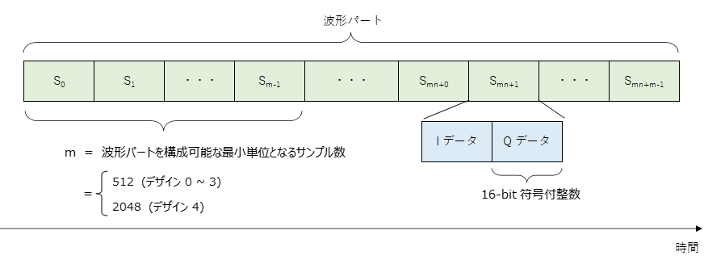

また，**波形パート**のサンプル数は，以下の制約も満たさなければなりません．
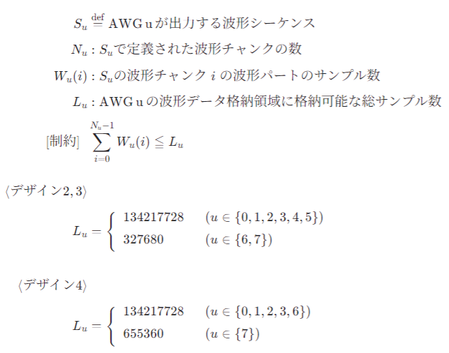

 

<!--
$$
\begin{align*}
S_u &\stackrel{\mathrm{def}}{=} \rm{AWG}\,u\, が出力する波形シーケンス \\[1ex]
N_u &: S_u で定義された波形チャンクの数  \\[1ex]
W_u(i) &: S_u の波形チャンク \; i \;の波形パートのサンプル数 \\[1ex]
L_u &: \rm{AWG}\,u\, の波形データ格納領域に格納可能な総サンプル数 \\[1ex]
[制約] \;\; &\displaystyle \sum_{i=0}^{N_u-1} W_u(i) \leqq L_u \\[5ex]

\langle デザイン 2, 3 \rangle \\[1ex]
L_u &= \left\{
\begin{array}{ll}
  134217728\;\; & (u \in \{0, 1, 2, 3, 4, 5\}) \\[1ex]
  327680\;\; & (u \in \{6, 7\}) \\[1ex]
\end{array} \\
\right.\\

\\

\langle デザイン 4 \rangle \\[1ex]
L_u &= \left\{
\begin{array}{ll}
  134217728\;\; & (u \in \{0, 1, 2, 3, 6\}) \\[1ex]
  655360\;\; & (u \in \{7\}) \\[1ex]
\end{array} \\
\right.\\

\end{align*}
$$
-->

**ポストブランク**は値が 0 のサンプルが並んだ波形で，最大長は 4294967295 **AWG ワード**となります．

### 4.3 AWG 制御レジスタ一覧

AWG を制御するためのレジスタ一覧を以下に示します．

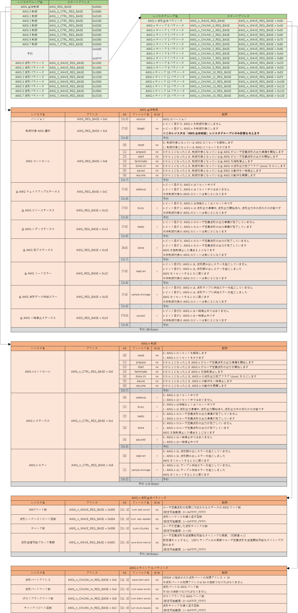

### 4.4 AWG 制御パケットフォーマット

AWG 制御レジスタにアクセスするためには，AWG 制御パケットを UDP データとして e7awg_hw のポート 16385 に送る必要があります．
AWG 制御用パケットには，以下の 4 種類があり，(A) と (C) が e7awg_hw に送るパケットで，(B) と (D) がその応答として e7awg_hw から送られるパケットです．

- (A) AWG レジスタ読み出しパケット
- (B) AWG レジスタ読み出し応答パケット
- (C) AWG レジスタ書き込みパケット
- (D) AWG レジスタ書き込み応答パケット

#### (A) AWG レジスタ読み出しパケット
このパケットを e7awg_hw に送信すると，アドレス `A` から `A + B - 1` までのレジスタ値が，AWG レジスタ読み出し応答パケットとして返ってきます．A と B は共に 4 の倍数を指定してください．B の最大値は 4072 です．

#### (B) AWG レジスタ読み出し応答パケット
レジスタ値が正常に読みだせた場合，**アドレス** と **バイト数** フィールドには，AWG レジスタ読み出しパケットで指定した値が入っています．**レジスタ値 1 ~ N** には，アドレス `A` から `A + 4N - 1` までのレジスタ値が順に格納されています．

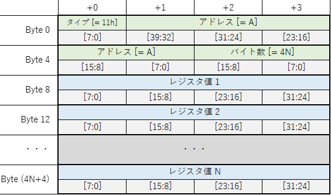

#### (C) AWG レジスタ書き込みパケット
このパケットを e7awg_hw に送信すると，アドレス `A` から `A + 4N - 1` までのレジスタに，**レジスタ値 1 ~ N** の値が書き込まれます．A は 4 の倍数を指定してください．N の最大値は 1018 です．

#### (D) AWG レジスタ書き込み応答パケット

レジスタ値が正常に書き込めた場合，**アドレス** と **バイト数** フィールドには，AWG レジスタ書き込みパケットで指定した値が入っています．

 

### 4.5 波形データ RAM に格納された波形データの並び

波形パートのサンプルデータは，以下の並びで波形データ RAM に格納する必要があります．
アドレス **A** から始まる領域に格納されたサンプルデータを AWG が出力する場合，AWG 制御レジスタの **波形パートアドレスレジスタ** に **A / 16** を格納しなければなりません．
このとき A は 16 の倍数でなければなりません．

## 5. ディジタル出力モジュールソフトウェアインタフェース仕様

### 5.1 状態遷移図

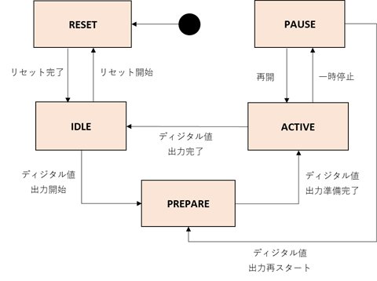

| 状態 | 説明 |
| ---- | ---- |
| RESET | ディジタル出力モジュールをリセットしている状態です．リセット解除後にリセットが完了すると `IDLE` 状態に遷移します．  リセットの開始と解除は FPGA のコンフィギュレーション完了直後に自動で行われますが，**ディジタル出力モジュール制御レジスタ** (5.4 参照) でも制御可能です．|
| IDLE | ディジタル値の出力開始を待っている状態です．ディジタル値の出力開始は ディジタル出力モジュール制御レジスタから実行可能です．|
| PREPARE | 現在設定されているディジタル値のリストを最初から出力するための準備を行っている状態です．準備が完了すると，自動的に `ACTIVE` 状態に遷移します． |
| ACTIVE | ディジタル値を出力中の状態です．出力が完了すると，自動的に `IDLE` 状態に遷移します．|
| PAUSE | ディジタル値の出力を一時停止している状態です． この一停止と再開はディジタル出力モジュール制御レジスタから実行可能です．| 

各状態におけるステータス信号の値は以下の表のとおりです．
各ステータス信号の値は，ディジタル出力モジュール制御レジスタの信号名と同名のビットフィールドから読み取れます．

|  状態\信号名 | wakeup | busy | done | paused |
| ---- | ---- | ---- | ---- | ---- |
| RESET    | 0 | 0 | 0 | 0 |
| IDLE     | 1 | 0 | 0 / 1| 0 |
| PREPARE  | 1 | 1 | 0 | 0 |
| ACTIVE   | 1 | 1 | 0 | 0 |
| PAUSE    | 1 | 1 | 0 | 1 |

※`IDLE` 時の done 信号は `ACTIVE` から `IDLE` に遷移した後で 1 になります．

 ### 5.2 AWG との同期

ディジタル出力モジュールは，AWG の動作に合わせて特定の動作を行うことができます．
対象となる動作は，下図の水色の番号を振った動作で，各動作が AWG と同期するかどうかをディジタル出力モジュール制御レジスタで設定できます．

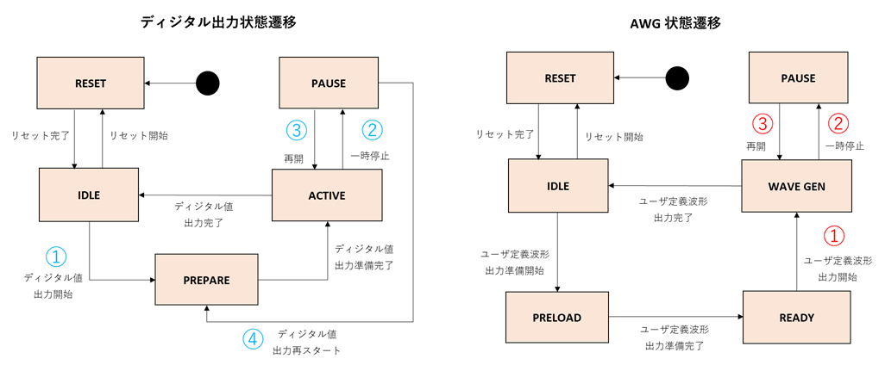

  
AWG の動作と，それに同期するディジタル出力モジュールの動作，同期の有無を決めるレジスタの対応関係は以下の通りです．
 
 

| ディジタル出力モジュールの動作 | AWG の動作 | レジスタ名 |
| ---- | ---- | ---- |
| ① | ① | スタートトリガマスク 0, 1 |
| ② | ② | 一時停止トリガマスク 0, 1 |
| ③ | ③ | 再開トリガマスク 0, 1 |
| ④ | ① | リスタートトリガマスク 0, 1 |

 ### 5.3 出力値の定義

ユーザは，各ディジタル出力モジュールに対してディジタル値のリストを設定することができます．
このリストには最大 512 個の値を登録することができ，値ごとに出力時間を設定できます．
設定方法は，ディジタル出力モジュール制御レジスタの **ディジタル出力 n パターン** レジスタグループを参照してください．

 

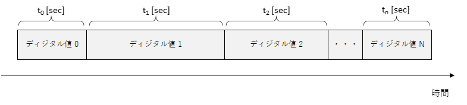

### 5.4 ディジタル出力モジュール制御レジスタ一覧

ディジタル出力モジュールを制御するためのレジスタ一覧を以下に示します．

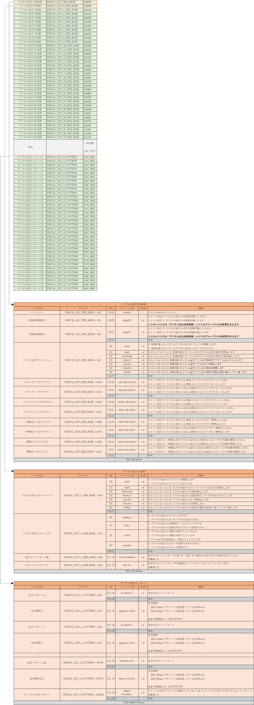

### 5.5 ディジタル出力モジュール制御パケットフォーマット

ディジタル出力モジュール制御レジスタにアクセスするためには，ディジタル出力モジュール制御パケットを UDP データとして e7awg_hw のポート 16385 に送る必要があります． ディジタル出力モジュール制御パケットには，以下の 4 種類があり，(A) と (C) が e7awg_hw に送るパケットで，(B) と (D) がその応答として e7awg_hw から送られるパケットです．

- (A) ディジタル出力モジュール制御レジスタ読み出しパケット
- (B) ディジタル出力モジュール制御レジスタ読み出し応答パケット
- (C) ディジタル出力モジュール制御レジスタ書き込みパケット
- (D) ディジタル出力モジュール制御レジスタ書き込み応答パケット

#### (A) ディジタル出力モジュール制御レジスタ読み出しパケット
このパケットを e7awg_hw に送信すると，アドレス `A` から `A + B - 1` までのレジスタ値が，ディジタル出力モジュール制御レジスタ読み出し応答パケットとして返ってきます．A と B は共に 4 の倍数を指定してください．B の最大値は 4072 です．

#### (B) ディジタル出力モジュール制御レジスタ読み出し応答パケット
レジスタ値が正常に読みだせた場合，**アドレス** と **バイト数** フィールドには，ディジタル出力モジュール制御レジスタ読み出しパケットで指定した値が入っています．**レジスタ値 1 ~ N** には，アドレス `A` から `A + 4N - 1` までのレジスタ値が順に格納されています．

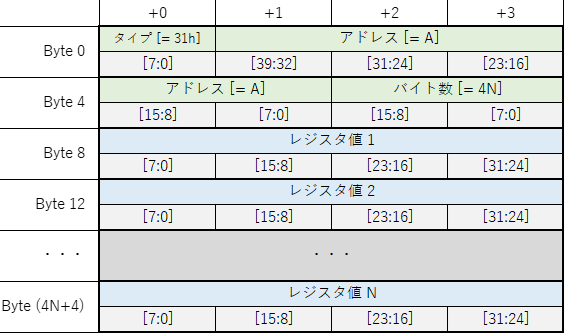

#### (C) ディジタル出力モジュール制御レジスタ書き込みパケット
このパケットを e7awg_hw に送信すると，アドレス `A` から `A + 4N - 1` までのレジスタに，**レジスタ値 1 ~ N** の値が書き込まれます．A は 4 の倍数を指定してください．N の最大値は 1018 です．

#### (D) ディジタル出力モジュール制御レジスタ書き込み応答パケット

レジスタ値が正常に書き込めた場合，**アドレス** と **バイト数** フィールドには，ディジタル出力モジュール制御レジスタ書き込みパケットで指定した値が入っています．

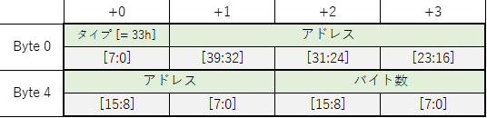

 

## 6. キャプチャユニットソフトウェアインタフェース仕様

### 6.1 状態遷移

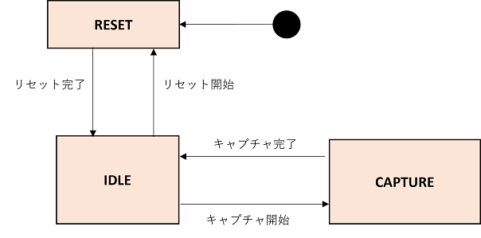

| 状態 | 説明 |
| ---- | ---- |
| RESET | キャプチャユニットをリセットしている状態です．リセット解除後にリセットが完了すると `IDLE` 状態に遷移します．  リセットの開始と解除は FPGA のコンフィギュレーション完了直後に自動で行われますが，キャプチャ制御レジスタでも制御可能です． |
| IDLE | キャプチャの開始を待っている状態です．キャプチャは，AWG のユーザ定義波形の出力に合わせて開始されるほか，キャプチャ制御レジスタからも開始可能です．|
| CAPTURE | 入力波形に信号処理を行いメモリに保存している状態です．定義されたキャプチャ区間の全てのデータの保存が完了すると，自動的に `IDLE` 状態に遷移します．|

各状態におけるステータス信号の値は以下の表のとおりです．
各ステータス信号の値は，キャプチャ制御レジスタの信号名と同名のビットフィールドから読み取れます．

|  状態\信号名 | wakeup | busy | done |
| ---- | ---- | ---- | ---- |
| RESET   | 0 | 0 | 0  |
| IDLE    | 1 | 0 | 0 / 1|
| CAPTURE | 1 | 1 | 0  |

※`IDLE` 時の done 信号は `CAPTURE` から `IDLE` に遷移した後で 1 になります．

 

### 6.2 キャプチャ区間の定義

ユーザは，各キャプチャユニットに対し**キャプチャ区間**を定義することで，入力波形のどの部分に何の信号処理を適用するかを決めることができます．

**キャプチャ区間**は**キャプチャディレイ**と，その後に続く 1 つ以上 1024 個以下の**キャプチャステップ**で構成されます．
**キャプチャディレイ**の期間に受信した波形データは保存および信号処理の対象になりません．
**キャプチャディレイ**は無くても問題ありません．

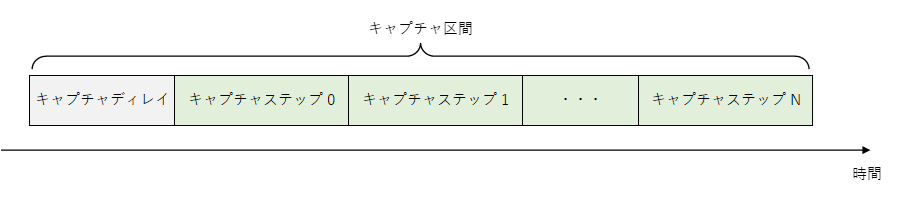

**キャプチャステップ**は**キャプチャターゲット**と**ポストブランク**を交互に繰り返したものから構成されます．
**キャプチャターゲット**で受信される波形データは，保存および信号処理の対象になりますが，ポストブランクで受信される波形データはその対象になりません．
**キャプチャターゲット**と**ポストブランク**の長さは共に，8 サンプルを 1 つの単位とする**キャプチャワード**単位で指定可能です（I データと Q データはまとめて 1 サンプルとカウントします）．
**キャプチャステップ**は最大 1024 個まで定義でき，別々に長さを設定できます．
**ポストブランク**は無くても問題ありません．

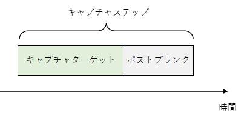

 

### 6.3 キャプチャユニット詳細

キャプチャユニットには，以下の信号処理回路が含まれています．

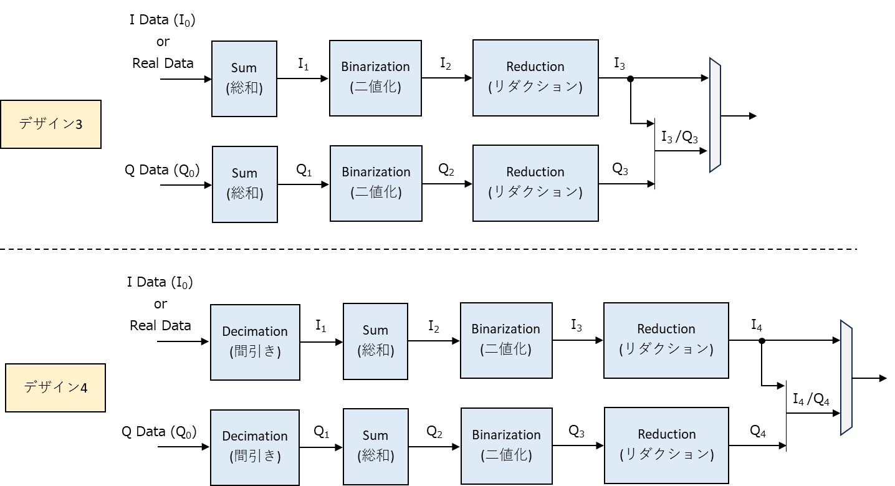

各処理は有効 / 無効を切り替えることができます．
処理が無効になった場合，入力 Ix，Qx をそのまま Ix+1 ，Qx+1 として出力します．
それぞれの処理の詳細は以下の通りです．

 

#### 間引き (デザイン 4 のみ)
キャプチャターゲットのサンプル数を減らします．
キャプチャターゲットのサンプル数を n，間引き後のサンプル数を m としたとき以下の式が成り立ちます．

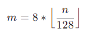

キャプチャターゲットのサンプル数が 128 で割り切れないとき，余ったサンプルはどの信号処理の対象にもなりません．

<!-- $$
m = 8 * \left\lfloor \frac{n}{128} \right\rfloor
$$ -->

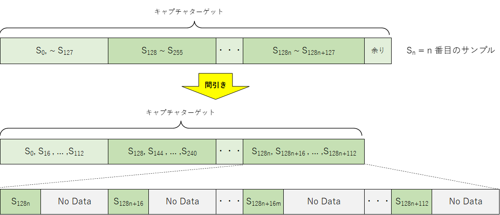

 

#### 総和
キャプチャターゲットを総和区間に分割し，各総和区間に含まれるサンプル値を全て足し合わせます．
総和区間のサンプル数はキャプチャワード単位で指定可能で，キャプチャ区間全体で共通です． 
キャプチャターゲットのサンプル数が総和区間のサンプル数で割り切れないとき，余ったサンプルはどの信号処理の対象にもなりません．
総和が有効になっている場合，以降の処理は総和の計算結果にのみ適用されます．

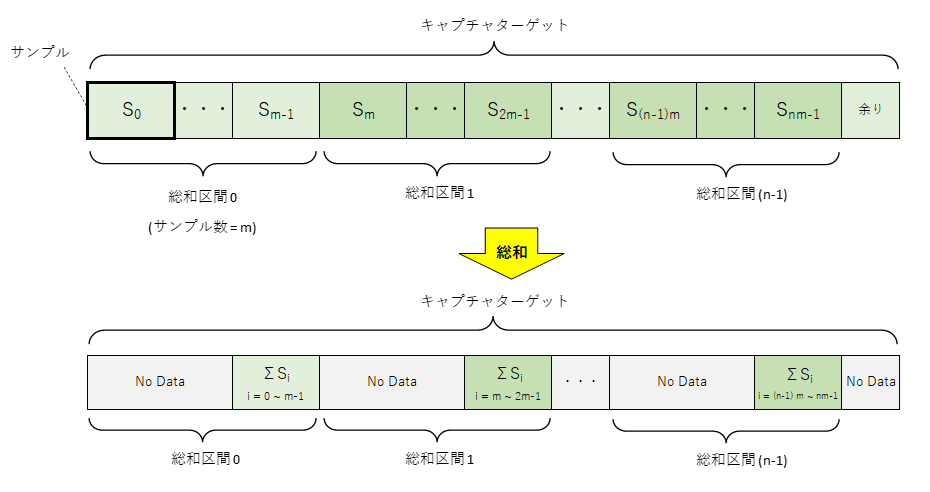

 

#### 二値化
キャプチャターゲットの各サンプルの値を二値化閾値と比較し，閾値以上ならその値を 1，そうでなければ 0 にします．

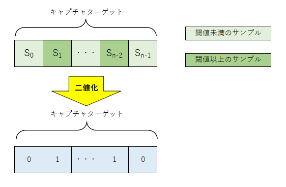

 

#### リダクション
リダクションは，キャプチャターゲットごとに，その中の全てのサンプル値をもとに 1 か 0 を算出します．
計算方法には **ANY** と **ALL** の 2 種類があり，キャプチャ区間全体でどちらか一方のみ適用できます．

| 計算方法 | 説明 |
| -- | -- |
| ANY | キャプチャターゲットの中に値が 1 以上のサンプルが 1 つ以上ある場合，そのキャプチャターゲットの計算結果が 1 になる |
| ALL | キャプチャターゲットのサンプルの値が全て 1 以上の場合，そのキャプチャターゲットの計算結果が 1 になる |

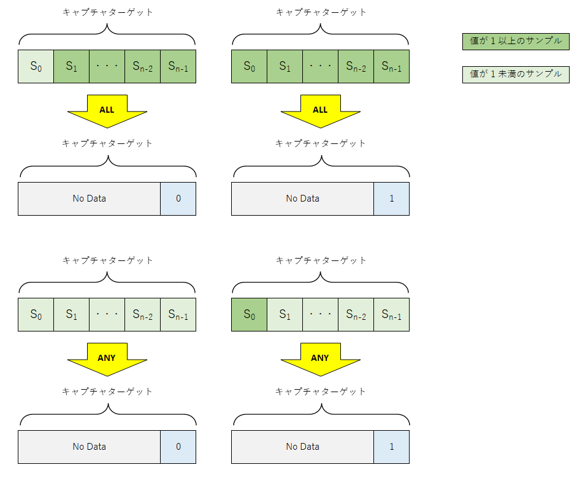

 

### 6.4 キャプチャ制御レジスタ一覧
キャプチャユニットを制御するためのレジスタ一覧を以下に示します．
レジスタ名に「#」がついているレジスタは，**6.5 キャプチャパラメータの制約**に記載した制約を満たさなければなりません．

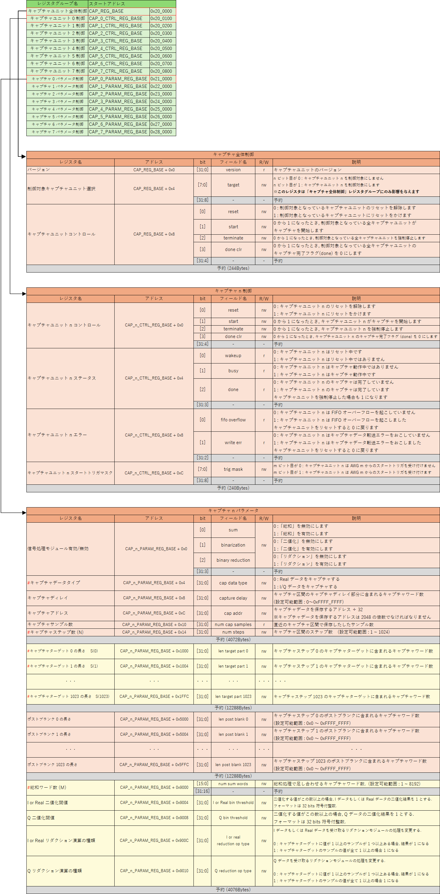

 

### 6.5 キャプチャパラメータの制約
キャプチャデータタイプ，キャプチャステップ数，キャプチャターゲットの長さ，総和ワード数は，HW リソースの都合上，式 ①～④の制約を全て満たさなければなりません．デザイン 2 と 3 では，間引きは常に無効扱いとなります．

**総和と二値化の有効 / 無効の組み合わせと対応するパターン**
| 総和 | 二値化 | パターン |
| -- | -- | -- |
| 無効 | 無効 | A |
| 有効 | 無効 | B |
| 無効 | 有効 | C |
| 有効 | 有効 | D |

 

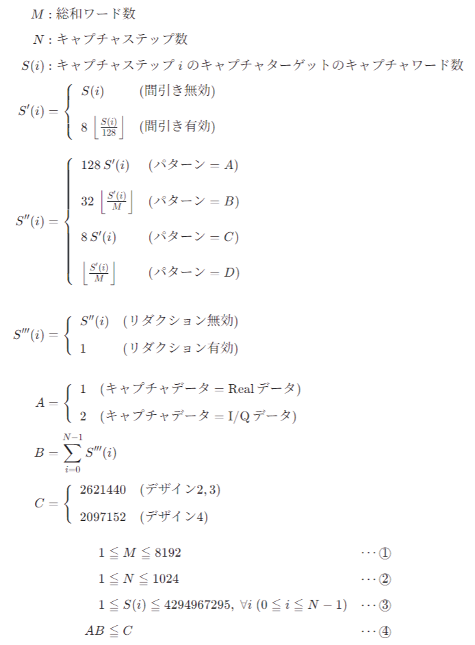

<!-- $$
\begin{align*}

M &: 総和ワード数  \\[1ex]
N &: キャプチャステップ数  \\[1ex]
S(i) &: キャプチャステップ \; i \;のキャプチャターゲットのキャプチャワード数 \\[1ex]

S'(i) &= \left\{
\begin{array}{ll}
  S(i) & (間引き無効)\\ & \\
  8 \, \left\lfloor \frac{S(i)}{128} \right\rfloor & (間引き有効)\\
\end{array}
\right. \\[6ex]

S''(i) &= \left\{
\begin{array}{ll}
  128 \, S'(i) & (パターン = A)\\ & \\
  32 \, \left\lfloor \frac{S'(i)}{M} \right\rfloor & (パターン = B)\\ && \\
  8 \, S'(i) & (パターン = C)\\ && \\
  \left\lfloor \frac{S'(i)}{M} \right\rfloor & (パターン = D)\\  
\end{array}
\right. \\[14ex]

S'''(i) &= \left\{
\begin{array}{ll}
  S''(i) & (リダクション無効)\\[2ex]
  1 & (リダクション有効)\\
\end{array}
\right. \\[6ex]

A &= \left\{
\begin{array}{ll}
  1 & (キャプチャデータ = \rm{Real} \, データ) \\[2ex]
  2 & (キャプチャデータ = \rm{I/Q} \, データ) \\
\end{array}
\right. \\[3ex]

B &= \displaystyle\sum_{i=0}^{N-1}S'''(i) \\[3ex]

C &= \left\{
\begin{array}{ll}
  2621440 & (デザイン 2, 3) \\[2ex]
  2097152 & (デザイン 4) \\
\end{array}
\right. \\[3ex]

\end{align*}
$$ -->

<!-- $$
\begin{align*}
1 &\leqq M \leqq 8192 &\cdots \text{\textcircled 1} \\[1ex]
1 &\leqq N \leqq 1024 &\cdots \text{\textcircled 2} \\[1ex]
1 &\leqq S\lparen i \rparen \leqq 4294967295 , \; \forall i \;(0 \leqq i \leqq N - 1) &\cdots \text{\textcircled 3} \\[1ex]
AB &\leqq C &\cdots \text{\textcircled 4} \\[1ex]
\end{align*}
$$ -->

<!--
条件 2, 3 それぞれのパラメータ単体で取り得る範囲
条件 1 は, 総和結果がオーバーフローしない条件
条件 4 は, キャプチャデータを格納するのに必要な RAM のサイズからくる制約
-->

 

### 6.6 キャプチャ制御パケットフォーマット

**6.4 キャプチャ制御レジスタ一覧**のレジスタにアクセスするためには，キャプチャ制御パケットを UDP データとして e7awg_hw のポート 16385 に送る必要があります．
キャプチャ制御用パケットには以下の 4 種類があり，(A) と (C) が e7awg_hw に送るパケットで，(B) と (D) がその応答として e7awg_hw から送られるパケットです．

- (A) キャプチャレジスタ読み出しパケット  
- (B) キャプチャレジスタ読み出し応答パケット  
- (C) キャプチャレジスタ書き込みパケット  
- (D) キャプチャレジスタ書き込み応答パケット  

#### (A) キャプチャレジスタ読み出しパケット
このパケットを e7awg_hw に送信すると，アドレス `A` から `A + B - 1` までのレジスタ値が，キャプチャレジスタ読み出し応答パケットとして返ってきます．A と B は共に 4 の倍数を指定してください．B の最大値は 4072 です．

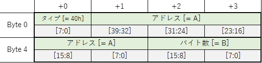

#### (B) キャプチャレジスタ読み出し応答パケット
レジスタ値が正常に読みだせた場合，**アドレス** と **バイト数** フィールドには，キャプチャレジスタ読み出しパケットで指定した値が入っています．**レジスタ値 1 ~ N** には，アドレス `A` から `A + 4N - 1` までのレジスタ値が順に格納されています．

#### (C) キャプチャレジスタ書き込みパケット
このパケットを e7awg_hw に送信すると，アドレス `A` から `A + 4N - 1` までのレジスタに，**レジスタ値 1 ~ N** の値を書き込みます．A と B は共に 4 の倍数を指定してください．N の最大値は 1018 です．

#### (D) キャプチャレジスタ書き込み応答パケット
レジスタ値が正常に書き込めた場合，**アドレス** と **バイト数** フィールドには，キャプチャレジスタ書き込みパケットで指定した値が入っています．

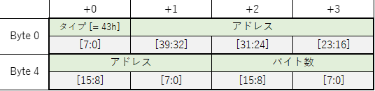

 

### 6.7 キャプチャデータ RAM に格納されたキャプチャデータの並び
キャプチャデータ RAM に格納されたキャプチャデータの並びは以下の通りです．
キャプチャデータの先頭アドレス A は，キャプチャアドレスレジスタの値 * 32 となります．
データの並びは，キャプチャデータタイプと有効にする信号処理 (間引きは除く) の組み合わせによって変わります．

| キャプチャデータタイプ | 総和 | 二値化 | リダクション | データ配置パターン |
| -- | -- | -- | -- | -- |
| Real | 無効 | 無効 | 無効 | A-0 |
| Real | 有効 | 無効 | 無効 | B-0 |
| Real |  *  | 有効 |   * | C-0 |
| Real |  *  |  *  | 有効 | C-0 |
| I/Q  | 無効 | 無効 | 無効 | A-1 |
| I/Q  | 有効 | 無効 | 無効 | B-1 |
| I/Q  |  *  | 有効 |   * | C-1 |
| I/Q  |  *  |  *  | 有効 | C-1 |

※ 「*」= Don't care

 

**パターン A-0 データレイアウト**
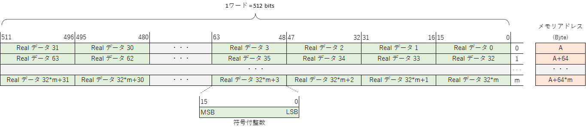

 

**パターン B-0 データレイアウト**

 

**パターン C-0 データレイアウト**
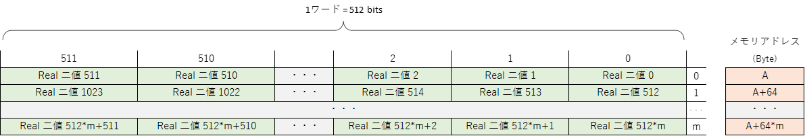

 

**パターン A-1 データレイアウト**

 

**パターン B-1 データレイアウト**
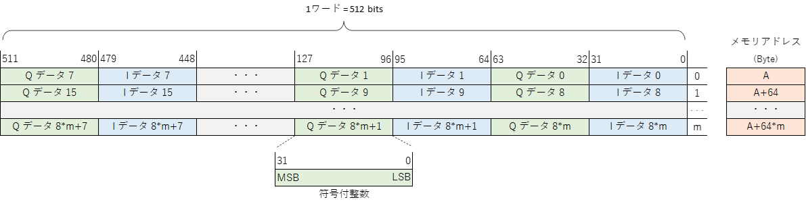

 

**パターン C-1 データレイアウト**
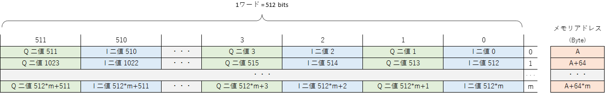
