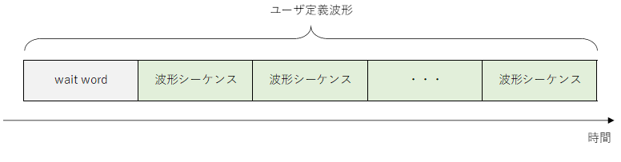
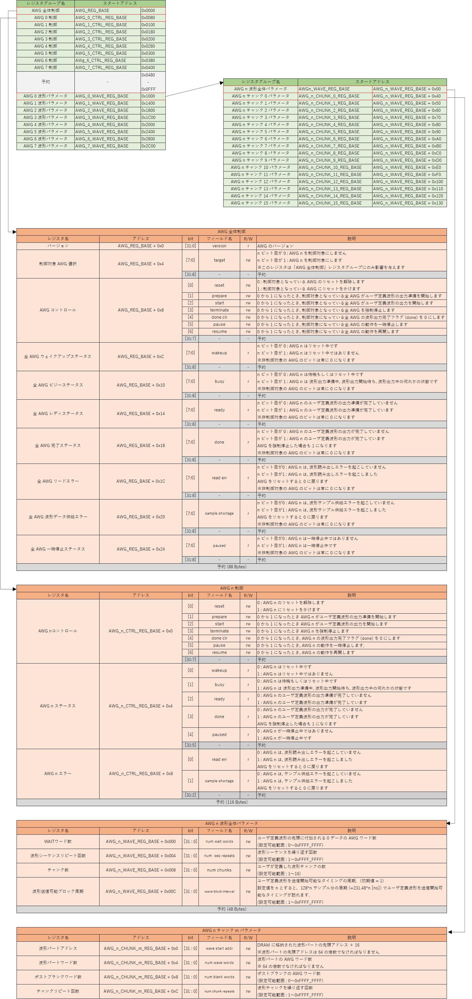

# e7awg_hw ユーザマニュアル

本資料は e7awg_hw のドライバソフトウェア開発者向けのマニュアルです．
e7awg_sw（e7awg_hw の制御用ライブラリ）を使ったアプリケーションの開発方法については，
[AWG ユーザマニュアル](../sw/awg.md) と [ディジタル出力モジュールユーザマニュアル](../sw/digital_output.md) および
[example](../../../examples/zcu111) ディレクトリ以下にあるサンプルスクリプトを参考にしてください．

## 1. 機能概要
e7awg_hw は，ユーザが定義した波形データとディジタル値を出力する機能を備えた FPGA デザインです．
FPGA 内部の各モジュールは，10Gb Ethernet で送られる UDP/IP パケットにて制御可能になっています．
以下に e7awg_hw の概略図を示します．

### 各モジュールとその機能
|  モジュール  |  機能  |
| ---- | ---- |
| DRAM | FPGA の I/O と接続されたメモリで，出力波形のサンプル値を保持します．  1 ワードは 512 bits (= 64 Bytes) です． |
| upl axi rw | UDP/IP 通信用のコア (e7udpip10G) と DRAM 間のデータの送受信を制御します． |
| awg ctrl | UDP/IP 通信用のコア (e7udpip10G) から送られるデータをもとに AWG を制御します． |
| AWG | DRAM からサンプル値を読み出し，ユーザが定義した波形の並びで出力します． |
| digital out ctrl | UDP/IP 通信用のコア (e7udpip10G) から送られるデータをもとに digital out を制御します． |
| digital out | 内部のメモリからディジタル値を読み出し，ユーザが定義したパターンで出力します． |

## 2. DRAM ソフトウェアインタフェース仕様

DRAM は 1 ワード 512 bits (= 64Bytes) のメモリで，ワード単位でアクセス可能です．
各ワードとアドレスの対応関係は以下の図の通りです．

## 2.1 DRAM アクセスパケットフォーマット
e7awg_hw の DRAM にアクセスするためには，DRAM アクセスパケットを UDP データとして e7awg_hw のポート 16384 に送る必要があります．
DRAM アクセスパケットには，以下の 4 種類があり，(A) と (C) が e7awg_hw に送るパケットで，(B) と (D) がその応答として e7awg_hw から送られるパケットです．

- (A) DRAM 読み出しパケット
- (B) DRAM 読み出し応答パケット
- (C) DRAM 書き込みパケット
- (D) DRAM 書き込み応答パケット

#### (A) DRAM 読み出しパケット
このパケットを e7awg_hw に送信すると，アドレス `A` から `A + B - 1` までのワードデータが，DRAM 読み出し応答パケットとして返ってきます．A と B は共に 64 の倍数を指定してください．B の最大値は 4032 です．

#### (B) DRAM 読み出し応答パケット
HBM のデータを正常に読みだせた場合，**アドレス** と **バイト数** フィールドには，DRAM 読み出しパケットで指定した値が入っています．**ワードデータ 1 ~ N** には，アドレス `A` から `A + 64N - 1` までのワードデータが順に格納されています．

#### (C) DRAM 書き込みパケット
このパケットを e7awg_hw に送信すると，アドレス `A` から `A + 64N - 1` までのワードに，**ワードデータ 1 ~ N** の値が書き込まれます．A は 64 の倍数を指定してください．N の最大値は 63 です．

#### (D) DRAM 書き込み応答パケット
DRAM にデータを正常に書き込めた場合，**アドレス** と **バイト数** フィールドには，DRAM 書き込みパケットで指定した値が入っています．

## 2.2 DRAM データレイアウト
各 AWG は，以下の図で示す DRAM の領域を使用することを想定しています．
それぞれの領域での波形データの並びは，**3.5 DRAM に格納された波形データの並び** を参照してください．

## 3. AWG ソフトウェアインタフェース仕様

### 3.1 状態遷移図

| 状態 | 説明 |
| ---- | ---- |
| RESET | AWG をリセットしている状態です．リセット解除後にリセットが完了すると `IDLE` 状態に遷移します．  リセットの開始と解除は FPGA のコンフィギュレーション完了直後に自動で行われますが，AWG 制御レジスタでも制御可能です．|
| IDLE | ユーザ定義波形の出力準備開始を待っている状態です．出力準備の開始は AWG 制御レジスタから実行可能です．|
| PRELOAD | ユーザ定義波形を出力するための準備を行っている状態です．準備が完了すると，自動的に `READY` 状態に遷移します． |
| READY | ユーザ定義波形の出力開始を待っている状態です． 出力開始は AWG 制御レジスタから実行可能です．|
| WAVE GEN | ユーザ定義波形を出力中の状態です．ユーザ定義波形の出力が完了すると，自動的に `IDLE` 状態に遷移します．|
| PAUSE | ユーザ定義波形の出力を一時停止している状態です． この一停止と再開は AWG 制御レジスタから実行可能です．| 

各状態におけるステータス信号の値は以下の表のとおりです．
各ステータス信号の値は，AWG 制御レジスタの信号名と同名のビットフィールドから読み取れます．

|  状態\信号名 | wakeup | busy | ready | done | paused |
| ---- | ---- | ---- | ---- | ---- | ---- |
| RESET    | 0 | 0 | 0 | 0 | 0 |
| IDLE     | 1 | 0 | 0 | 0 / 1| 0 |
| PRELOAD  | 1 | 1 | 0 | 0 | 0 |
| READY    | 1 | 1 | 1 | 0 | 0 |
| WAVE GEN | 1 | 1 | 0 | 0 | 0 |
| PAUSE    | 1 | 1 | 0 | 0 | 1 |

※`IDLE` 時の done 信号は `WAVE GEN` から `IDLE` に遷移した後で 1 になります．

 ### 3.2 出力波形の定義

ユーザが，各 AWG に対して設定した出力波形全体を**ユーザ定義波形**と言います．
**ユーザ定義波形**は **wait word** と，その後に続く**波形シーケンス**の繰り返しで構成されます．
**波形シーケンス**は，最大 4294967295 回繰り返すことが可能です．
**wait word** は無くても問題ありません．

**wait word** は値が 0 のサンプルが並んだ波形です．
8 サンプルを 1 つの単位とする **AWG ワード**単位で指定可能で，最大長は 4294967295 **AWG ワード**となります（I データと Q データはまとめて 1 サンプルとカウントしています）．

**波形シーケンス**は**波形チャンク**の繰り返しを並べたもので構成されます．
**波形チャンク**は最大 16 個まで定義でき，各チャンクは 4294967295 回まで繰り返すことが可能です．

**波形チャンク**は**波形パート**と**ポストブランク**で構成されます．
**ポストブランク**は無くても問題ありません．

**波形パート**は任意の値のサンプルが並んでおり，そのサンプル数は 512 の倍数でなければなりません．

また，**波形パート**のサンプル数は，以下の制約も満たさなければなりません．

<!--
$$
\begin{align*}

N &: 波形チャンク数  \\[1ex]
W(i) &: 波形チャンク \; i \;の波形パートのサンプル数 \\[1ex]
&\displaystyle \sum_{i=0}^{N-1} W(i) \leqq 67108864
\end{align*}
$$
-->

**ポストブランク**は値が 0 のサンプルが並んだ波形で，最大長は 4294967295 **AWG ワード**となります．

### 3.3 AWG 制御レジスタ一覧

AWG を制御するためのレジスタ一覧を以下に示します．

### 3.4 AWG 制御パケットフォーマット

AWG 制御レジスタにアクセスするためには，AWG 制御パケットを UDP データとして e7awg_hw のポート 16385 に送る必要があります．
AWG 制御用パケットには，以下の 4 種類があり，(A) と (C) が e7awg_hw に送るパケットで，(B) と (D) がその応答として e7awg_hw から送られるパケットです．

- (A) AWG レジスタ読み出しパケット
- (B) AWG レジスタ読み出し応答パケット
- (C) AWG レジスタ書き込みパケット
- (D) AWG レジスタ書き込み応答パケット

#### (A) AWG レジスタ読み出しパケット
このパケットを e7awg_hw に送信すると，アドレス `A` から `A + B - 1` までのレジスタ値が，AWG レジスタ読み出し応答パケットとして返ってきます．A と B は共に 4 の倍数を指定してください．B の最大値は 4072 です．

#### (B) AWG レジスタ読み出し応答パケット
レジスタ値が正常に読みだせた場合，**アドレス** と **バイト数** フィールドには，AWG レジスタ読み出しパケットで指定した値が入っています．**レジスタ値 1 ~ N** には，アドレス `A` から `A + 4N - 1` までのレジスタ値が順に格納されています．

#### (C) AWG レジスタ書き込みパケット
このパケットを e7awg_hw に送信すると，アドレス `A` から `A + 4N - 1` までのレジスタに，**レジスタ値 1 ~ N** の値が書き込まれます．A は 4 の倍数を指定してください．N の最大値は 1018 です．

#### (D) AWG レジスタ書き込み応答パケット

レジスタ値が正常に書き込めた場合，**アドレス** と **バイト数** フィールドには，AWG レジスタ書き込みパケットで指定した値が入っています．

 

### 3.5 DRAM に格納された波形データの並び

波形パートのサンプルデータは，以下の並びで DRAM に格納する必要があります．
波形パートのサンプルデータの先頭アドレス A は，波形パートアドレスレジスタの値 * 16 となります．

## 4. ディジタル出力モジュールソフトウェアインタフェース仕様

### 4.1 状態遷移図

| 状態 | 説明 |
| ---- | ---- |
| RESET | ディジタル出力モジュールをリセットしている状態です．リセット解除後にリセットが完了すると `IDLE` 状態に遷移します．  リセットの開始と解除は FPGA のコンフィギュレーション完了直後に自動で行われますが，**ディジタル出力モジュール制御レジスタ** (4.4 参照) でも制御可能です．|
| IDLE | ディジタル値の出力開始を待っている状態です．ディジタル値の出力開始は ディジタル出力モジュール制御レジスタから実行可能です．|
| PREPARE | 現在設定されているディジタル値のリストを最初から出力するための準備を行っている状態です．準備が完了すると，自動的に `ACTIVE` 状態に遷移します． |
| ACTIVE | ディジタル値を出力中の状態です．出力が完了すると，自動的に `IDLE` 状態に遷移します．|
| PAUSE | ディジタル値の出力を一時停止している状態です． この一停止と再開はディジタル出力モジュール制御レジスタから実行可能です．| 

各状態におけるステータス信号の値は以下の表のとおりです．
各ステータス信号の値は，ディジタル出力モジュール制御レジスタの信号名と同名のビットフィールドから読み取れます．

|  状態\信号名 | wakeup | busy | done | paused |
| ---- | ---- | ---- | ---- | ---- |
| RESET    | 0 | 0 | 0 | 0 |
| IDLE     | 1 | 0 | 0 / 1| 0 |
| PREPARE  | 1 | 1 | 0 | 0 |
| ACTIVE   | 1 | 1 | 0 | 0 |
| PAUSE    | 1 | 1 | 0 | 1 |

※`IDLE` 時の done 信号は `ACTIVE` から `IDLE` に遷移した後で 1 になります．

 ### 4.2 AWG との同期

ディジタル出力モジュールは，AWG の動作に合わせて特定の動作を行うことができます．
対象となる動作は，下図の水色の番号を振った動作で，各動作が AWG と同期するかどうかをディジタル出力モジュール制御レジスタで設定できます．

  
AWG の動作と，それに同期するディジタル出力モジュールの動作，同期の有無を決めるレジスタの対応関係は以下の通りです．
 
 

| ディジタル出力モジュールの動作 | AWG の動作 | レジスタ名 |
| ---- | ---- | ---- |
| ① | ① | スタートトリガマスク 0, 1 |
| ② | ② | 一時停止トリガマスク 0, 1 |
| ③ | ③ | 再開トリガマスク 0, 1 |
| ④ | ① | リスタートトリガマスク 0, 1 |

 ### 4.3 出力値の定義

ユーザは，各ディジタル出力モジュールに対してディジタル値のリストを設定することができます．
このリストには最大 512 個の値を登録することができ，値ごとに出力時間を設定できます．
設定方法は，ディジタル出力モジュール制御レジスタの **ディジタル出力 n パターン** レジスタグループを参照してください．

 

### 4.4 ディジタル出力モジュール制御レジスタ一覧

ディジタル出力モジュールを制御するためのレジスタ一覧を以下に示します．

### 4.5 ディジタル出力モジュール制御パケットフォーマット

ディジタル出力モジュール制御レジスタにアクセスするためには，ディジタル出力モジュール制御パケットを UDP データとして e7awg_hw のポート 16385 に送る必要があります． ディジタル出力モジュール制御パケットには，以下の 4 種類があり，(A) と (C) が e7awg_hw に送るパケットで，(B) と (D) がその応答として e7awg_hw から送られるパケットです．

- (A) ディジタル出力モジュール制御レジスタ読み出しパケット
- (B) ディジタル出力モジュール制御レジスタ読み出し応答パケット
- (C) ディジタル出力モジュール制御レジスタ書き込みパケット
- (D) ディジタル出力モジュール制御レジスタ書き込み応答パケット

#### (A) ディジタル出力モジュール制御レジスタ読み出しパケット
このパケットを e7awg_hw に送信すると，アドレス `A` から `A + B - 1` までのレジスタ値が，ディジタル出力モジュール制御レジスタ読み出し応答パケットとして返ってきます．A と B は共に 4 の倍数を指定してください．B の最大値は 4072 です．

#### (B) ディジタル出力モジュール制御レジスタ読み出し応答パケット
レジスタ値が正常に読みだせた場合，**アドレス** と **バイト数** フィールドには，ディジタル出力モジュール制御レジスタ読み出しパケットで指定した値が入っています．**レジスタ値 1 ~ N** には，アドレス `A` から `A + 4N - 1` までのレジスタ値が順に格納されています．

#### (C) ディジタル出力モジュール制御レジスタ書き込みパケット
このパケットを e7awg_hw に送信すると，アドレス `A` から `A + 4N - 1` までのレジスタに，**レジスタ値 1 ~ N** の値が書き込まれます．A は 4 の倍数を指定してください．N の最大値は 1018 です．

#### (D) ディジタル出力モジュール制御レジスタ書き込み応答パケット

レジスタ値が正常に書き込めた場合，**アドレス** と **バイト数** フィールドには，ディジタル出力モジュール制御レジスタ書き込みパケットで指定した値が入っています．

 
