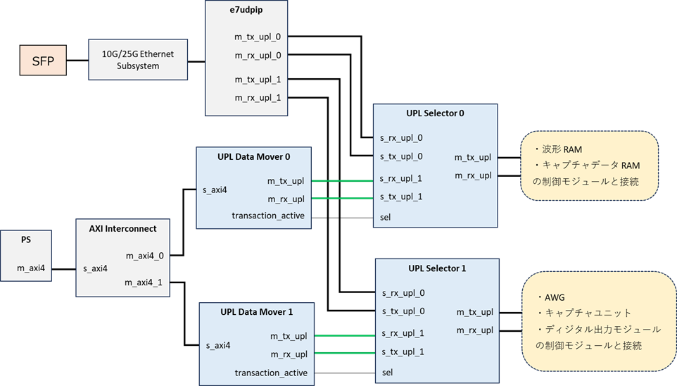
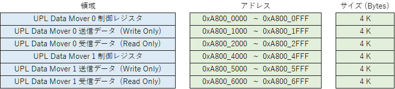
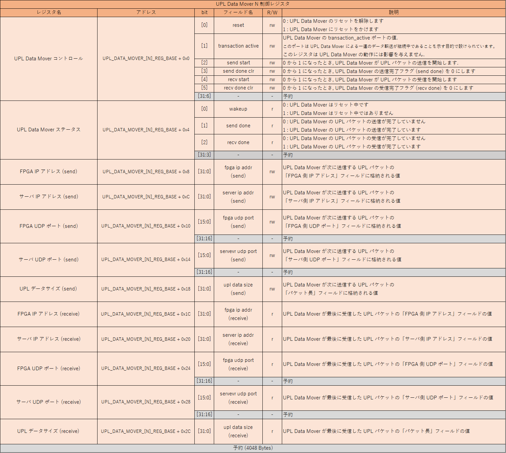

# パケットフォワーディング設計書

本資料は ZCU111 のファームウェア開発者向けのマニュアルです．
e7awg_sw（e7awg_hw の制御用ライブラリ）を使ったパケットフォワーディングのやり方については，
[パケットフォワーディングユーザマニュアル](../sw/packet_forwarding.md) を参考にしてください．

 

## 1. システム概要

ZCU111 e7awg_hw のデザイン 4 には PS と各種モジュールの間で UPL パケットを送受信する機能が含まれています．
この機能を使用する場合，PS 上で動作するプログラムから UPL Data Mover のレジスタおよびメモリを操作し，同モジュールを通じて UPL データの送受信を行います．

 

### 各モジュールとその機能
|  モジュール  |  機能  |
| ---- | ---- |
| UPL Data Mover | PS から送られたデータを UPL パケットのペイロード部に格納して送信します． また，UPL パケットを受信してペイロードを内部のメモリに格納します． |
| UPL Selector | UPL インタフェースのセレクタです．  `sel` ポートの値が x のとき s_rx_upl_x と s_tx_upl_x をそれぞれ m_tx_upl と m_rx_upl に接続します． |

 

## 2. メモリマップ

PS から見た UPL Data Mover の制御レジスタおよび UPL データを格納するメモリの物理アドレスは以下の通りです．

 

`UPL Data Mover N 送信データ` は，UPL Data Mover N が UPL パケットのペイロードとして送信するデータを格納する領域です．
`UPL Data Mover N 受信データ` は，UPL Data Mover N が受信した UPL パケットのペイロードを格納する領域です．
UPL Data Mover はパケットを受信する度にこの領域の先頭からペイロードを格納します．

 

## 3. UPL Data Mover 制御レジスタ一覧

UPL Data Mover を制御するためのレジスタ一覧を以下に示します．UPL パケットのフィールドの詳細は，[UPL パケット一覧](https://github.com/e-trees/e7awg_hw/blob/master/manuals/upl_packets.md) を参照してください．

| ベースアドレス名 | アドレス |
| ---- | ---- |
| UPL_DATA_MOVER_0_REG_BASE | 0xA800_0000 |
| UPL_DATA_MOVER_1_REG_BASE | 0xA800_4000 |

