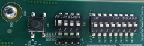
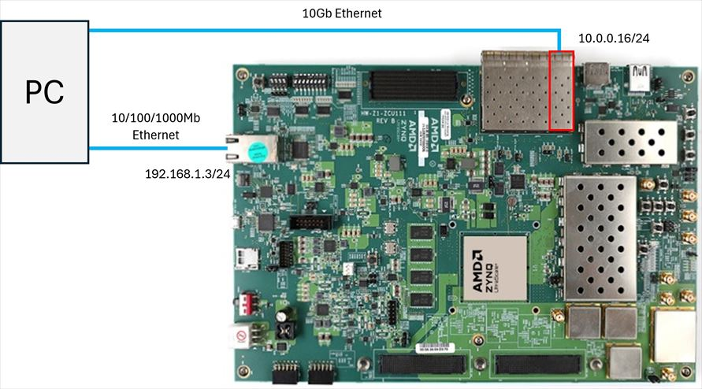

# ZCU111 のセットアップ

ZCU111 のディップスイッチを下図のように設定します．

 

PC と ZCU111 を下図のように接続します．
ZCU111 に付属の SD カードを挿入して電源を入れます．

30秒ほどで ZCU111 上の Linux が起動します．
PC から `ping 192.168.1.3` と入力してパケットの送受信ができることを確認します.

 

# e7awg_sw のセットアップ

Ubuntu (>= 18.04) 環境で [README.md](../../README.md) の操作を実行してください．
