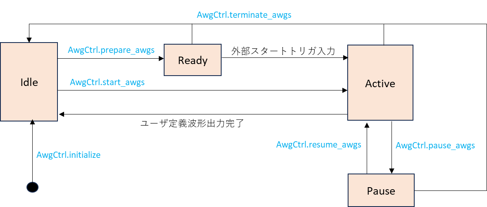

# AWG ユーザマニュアル

本資料は，ZCU111 を利用した Arbitrary Waveform Generator (以下 AWG) の利用者向けマニュアルです．

## 1. システム構成

AWG は ZCU111 の FPGA 上に実装されており，そのシステム構成は以下のようになります．
AWG の制御には専用の Python API を用います．
この API には Python で作成した波形データを FPGA に送信する機能や，AWG の動作完了を待つ機能などが含まれています．
本 FPGA デザインに含まれるディジタル出力モジュールの詳細は [こちら](./digital_output.md)  を参照してください．

本 システムには 8 つの AWG が含まれていますが，DDR4 SDRAM の帯域の都合上 6 つ以上の AWG を同時に動かすことはできません．
なお，動作させる AWG の組み合わせに制限はありません．

<br>


## 2. AWG の状態

AWG は下図の状態を持ち，特定の Python API (図中の青字) が呼ばれたときや HW の特定の動作によって遷移します.



**状態の説明**

| 状態名 | 説明 |
| --- | --- |
| Idle | 初期状態. |
| Ready | 波形の出力準備が終わって外部スタートトリガの入力を待っている状態です. |
| Active | ユーザ定義波形を出力します．|
| Pause | ユーザ定義波形の出力を一時停止します．<br> 停止中に AWG から出力されるサンプル値は I データ, Q データ共に 0 です．|

<br>

## 3. 出力波形の構造

AWG が出力可能な波形の構造と制約について説明します．

ユーザが各 AWG に対して設定した出力波形全体を**ユーザ定義波形**と言います．
**ユーザ定義波形**は **wait word** と，その後に続く**波形シーケンス**の繰り返しで構成されます．
**波形シーケンス**は，最大 4294967295 回繰り返すことが可能です．
**wait word** は無くても問題ありません．


**wait word** は, I，Q 共に値が 0 のサンプルが並んだ波形です．
8 サンプルを 1 つの単位とする **AWG ワード**単位で指定可能で，最大長は 4294967295 **AWG ワード**となります


**波形シーケンス**は**波形チャンク**の繰り返しを並べたもので構成されます．
**波形チャンク**は最大 16 個まで定義でき，各チャンクは 4294967295 回まで繰り返すことが可能です．


**波形チャンク**は**波形パート**と**ポストブランク**で構成されます．
**ポストブランク**は無くても問題ありません．


**波形パート**は任意の値のサンプルが並んでおり，そのサンプル数は 512 の倍数でなければなりません．


また，波形パートのサンプル数はストレージ (DDR4 SDRAM) 容量の都合上，以下の制約も満たさなければなりません． 


<!--
$$
\begin{align*}

N &: 波形チャンク数  \\[1ex]
W(i) &: 波形チャンク \; i \;の波形パートのサンプル数 \\[1ex]
&\displaystyle \sum_{i=0}^{N-1} W(i) \leqq 134217728
\end{align*}
$$
-->

ポストブランクは値が 0 のサンプルが並んだ波形です．
8 サンプルを 1 つの単位とする AWG ワード単位で指定可能で，最大長は 4294967295 AWG ワードとなります．


## 4. DAC パラメータ

RF Data Converter の DAC は以下のパラメータで固定となっており，ユーザが変更することはできません．

- サンプリングレート : 1105.92 [Msps]
- I/Q ミキサ : 有効
- インタポレーション : 2倍

AWG から出力される **ユーザ定義波形** は DAC に入力された後，サンプル数が 2 倍になる様に補間されます．
また，DAC のサンプリングレートは 1105.92 [Msps] なので，サンプル数が 512 * n 個 (n = 1, 2, 3, ... ) の **波形パート** は，長さが 925.926 * n[ns] (≒ 2 * 512 * n / 1105.92 * 1000) の波形となって出力されます．

<br>

## 5. AWG 制御用 API の詳細

本章では AWG の操作に必要な Python API を手順ごとに説明します．
各 API の詳細は, 関数ヘッダコメントを参照してください.

### 5.1. AWG と DAC の初期化

AWG と DAC は，次節以降で述べる操作を行う前に必ず初期化しなければなりません．
DAC の初期化には RfdcCtrl クラスの set_dac_mixer_settings, sync_dac_tiles メソッドを使用します.
AWG の初期化には AwgCtrl クラスの initialize メソッドを使用します．

初期化のコード例を以下に示します

```
import e7awgsw as e7s
import e7awgsw.zcu111 as e7sz

zcu111_ip_addr = '192.168.1.3' # ZCU111 の 10/100/1000 Mb Ethernet ポートの IP アドレス
fpga_ip_addr = '10.0.0.16'     # ZCU111 の 10 Gb Ethernet ポートの IP アドレス

# DAC/AWG 制御用オブジェクトを作成する
with (e7sz.RftoolTransceiver(zcu111_ip_addr, 15) as trasnceiver,
      e7sz.RfdcCtrl(trasnceiver) as rfdc_ctrl,
      e7s.AwgCtrl(fpga_ip_addr) as awg_ctrl):
    
    # FPGA コンフィギュレーション
    e7sz.configure_fpga(trasnceiver)

    for tile_id in list(e7sz.DacTile):
        for channel_id in list(e7sz.DacChannel):
            # I/Q ミキサの設定
            rfdc_ctrl.set_dac_mixer_settings(
                tile = tile_id,                # タイル ID
                channel = channel_id,          # チャネル ID
                freq = 100,                    # 周波数 (MHz)
                phase = 0,                     # 初期位相 (degrees)
                scale =  e7sz.MixerScale.V0P7) # 振幅

    # DAC タイルを同期させる.
    rfdc_ctrl.sync_dac_tiles()

    # AWG 0 , AWG 4 を初期化
    awg_ctrl.initialize(e7s.AWG.U0, e7s.AWG.U4)
```

### 5.2. 波形データの設定

AWG に設定する波形データは，e7awgsw パッケージの WaveSequence クラスを用いて作成します．
3 章で説明したユーザ定義波形の

- 波形シーケンスの繰り返し回数
- wait word の長さ

をコンストラクタで指定し

- 波形パートのサンプル値
- 波形チャンクの繰り返し回数
- ポストブランク長

を add_chunk メソッドで指定します．

波形データを作成するコードの例を以下に示します．

```
import e7awgsw as e7s

wave_seq = e7s.WaveSequence(
    num_wait_words = 10,  # wait word の AWG ワード数
    num_seq_repeats = 2,  # 波形シーケンスの繰り返し回数
    e7s.E7AwgHwType.ZCU111)  


# 波形チャンク 0 の定義
samples_0 = [(1, 2), ..., (100, 200)]  # [(I0, Q0), (I1, Q1), ...]
wave_seq.add_chunk(
    iq_samples = samples_0,  # サンプル値のリスト
    num_blank_words = 0,     # ポストブランクの AWG ワード数
    num_repeats = 1)         # 波形チャンクの繰り返し回数

# 波形チャンク 1 の定義
samples_1 = [(-1, -2), ..., (-100, -200)]  # [(I0, Q0), (I1, Q1), ...]
wave_seq.add_chunk(
    iq_samples = samples_1,  # サンプル値のリスト
    num_blank_words = 3,     # ポストブランクの AWG ワード数
    num_repeats = 2)         # 波形チャンクの繰り返し回数
```

上記のコードで定義されるユーザ定義波形は以下のようになります.


定義した波形を AWG に設定するには AwgCtrl クラスの set_wave_sequence メソッドを使用します．

波形データを設定するコードの例を以下に示します．

```
import e7awgsw as e7s
import e7awgsw.zcu111 as e7sz

zcu111_ip_addr = '192.168.1.3' # ZCU111 の 10/100/1000 Mb Ethernet ポートの IP アドレス
fpga_ip_addr = '10.0.0.16'     # ZCU111 の 10 Gb Ethernet ポートの IP アドレス

# DAC/AWG 制御用オブジェクトを作成する
with (e7sz.RftoolTransceiver(zcu111_ip_addr, 15) as trasnceiver,
      e7sz.RfdcCtrl(trasnceiver, e7s.E7AwgHwType.ZCU111) as rfdc_ctrl,
      e7s.AwgCtrl(fpga_ip_addr, e7s.E7AwgHwType.ZCU111) as awg_ctrl):

    ### AWG / DAC 初期化 (省略) ###
    ### 波形データの定義 (省略) ###

    # AWG 0 , AWG 4 に波形データを設定
    awg_ctrl.set_wave_sequence(e7s.AWG.U0, wave_seq)
    awg_ctrl.set_wave_sequence(e7s.AWG.U4, wave_seq)
```

### 5.3. 波形の出力開始と完了待ち

AWG の波形出力を開始するには AwgCtrl クラスの start_awgs メソッドを使用します．
このメソッドで指定した全ての AWG は同時にユーザ定義波形の出力を開始します．
AWG の波形出力が完了するのを待つには AwgCtrl クラスの wait_for_awgs_to_stop メソッドを使用します．
このメソッドは指定した全ての AWG の波形出力が完了するか，タイムアウトまでコントロールを返しません．

波形の出力開始と完了待ちを行うコードの例を以下に示します．

```
import e7awgsw as e7s
import e7awgsw.zcu111 as e7sz

zcu111_ip_addr = '192.168.1.3' # ZCU111 の 10/100/1000 Mb Ethernet ポートの IP アドレス
fpga_ip_addr = '10.0.0.16'     # ZCU111 の 10 Gb Ethernet ポートの IP アドレス

# DAC/AWG 制御用オブジェクトを作成する
with (e7sz.RftoolTransceiver(zcu111_ip_addr, 15) as trasnceiver,
      e7sz.RfdcCtrl(trasnceiver, e7s.E7AwgHwType.ZCU111) as rfdc_ctrl,
      e7s.AwgCtrl(fpga_ip_addr, e7s.E7AwgHwType.ZCU111) as awg_ctrl):

    ### AWG / DAC 初期化 (省略) ###
    ### 波形データの定義 (省略) ###
    ### 波形データの設定 (省略) ###
    
    # AWG 0 と AWG 4 のユーザ定義波形出力スタート
    awg_ctrl.start_awgs(e7s.AWG.U0, e7s.AWG.U4)
    
    # タイムアウト 5 秒で AWG 0 と AWG 4 の波形出力完了待ち
    awg_ctrl.wait_for_awgs_to_stop(5, e7s.AWG.U0, e7s.AWG.U4)
```

### 5.4. 波形出力の一時停止

ユーザ定義波形の出力を一時停止するには AwgCtrl クラスの pause_awgs メソッドを使用します．
このメソッドで指定した全ての AWG は同時にユーザ定義波形の出力を一時停止します．

ユーザ定義波形の出力を一時停止するコードの例を以下に示します．

```
import e7awgsw as e7s
import e7awgsw.zcu111 as e7sz

zcu111_ip_addr = '192.168.1.3' # ZCU111 の 10/100/1000 Mb Ethernet ポートの IP アドレス
fpga_ip_addr = '10.0.0.16'     # ZCU111 の 10 Gb Ethernet ポートの IP アドレス

# DAC/AWG 制御用オブジェクトを作成する
with (e7sz.RftoolTransceiver(zcu111_ip_addr, 15) as trasnceiver,
      e7sz.RfdcCtrl(trasnceiver, e7s.E7AwgHwType.ZCU111) as rfdc_ctrl,
      e7s.AwgCtrl(fpga_ip_addr, e7s.E7AwgHwType.ZCU111) as awg_ctrl):

    ### AWG / DAC 初期化 (省略) ###
    ### 波形データの定義 (省略) ###
    ### 波形データの設定 (省略) ###
    ### AWG の波形出力スタート (省略) ###
    
    # AWG 0 と AWG 4 のユーザ定義波形の出力を一時停止
    awg_ctrl.pause_awgs(e7s.AWG.U0, e7s.AWG.U4)
```

### 5.5. 波形出力の再開

ユーザ定義波形の出力を再開するには AwgCtrl クラスの resume_awgs メソッドを使用します．
このメソッドで指定した全ての AWG は同時にユーザ定義波形の出力を再開します．

ユーザ定義波形の出力を再開するコードの例を以下に示します．

```
import e7awgsw as e7s
import e7awgsw.zcu111 as e7sz

zcu111_ip_addr = '192.168.1.3' # ZCU111 の 10/100/1000 Mb Ethernet ポートの IP アドレス
fpga_ip_addr = '10.0.0.16'     # ZCU111 の 10 Gb Ethernet ポートの IP アドレス

# DAC/AWG 制御用オブジェクトを作成する
with (e7sz.RftoolTransceiver(zcu111_ip_addr, 15) as trasnceiver,
      e7sz.RfdcCtrl(trasnceiver, e7s.E7AwgHwType.ZCU111) as rfdc_ctrl,
      e7s.AwgCtrl(fpga_ip_addr, e7s.E7AwgHwType.ZCU111) as awg_ctrl):

    ### AWG / DAC 初期化 (省略) ###
    ### 波形データの定義 (省略) ###
    ### 波形データの設定 (省略) ###
    ### AWG の波形出力スタート (省略) ###

    # AWG 0 と AWG 4 のユーザ定義波形の出力を一時停止
    awg_ctrl.pause_awgs(e7s.AWG.U0, e7s.AWG.U4)

    time.sleep(2)

    # AWG 0 と AWG 4 のユーザ定義波形の出力を再開
    awg_ctrl.resume_awgs(e7s.AWG.U0, e7s.AWG.U4)
```

### 5.6 外部トリガの有効化

AWG が外部スタートトリガを受け付ける状態にした後で，PMOD 1 の P0 を Lo から Hi にすると AWG の波形出力を開始することができます.


AWG の外部スタートトリガを有効にするコード例を以下に示します．

```
import e7awgsw as e7s
import e7awgsw.zcu111 as e7sz

zcu111_ip_addr = '192.168.1.3' # ZCU111 の 10/100/1000 Mb Ethernet ポートの IP アドレス
fpga_ip_addr = '10.0.0.16'     # ZCU111 の 10 Gb Ethernet ポートの IP アドレス

# DAC/AWG 制御用オブジェクトを作成する
with (e7sz.RftoolTransceiver(zcu111_ip_addr, 15) as trasnceiver,
      e7sz.RfdcCtrl(trasnceiver, e7s.E7AwgHwType.ZCU111) as rfdc_ctrl,
      e7s.AwgCtrl(fpga_ip_addr, e7s.E7AwgHwType.ZCU111) as awg_ctrl):

    ### AWG / DAC 初期化 (省略) ###
    ### 波形データの定義 (省略) ###
    ### 波形データの設定 (省略) ###

    # AWG 0 と AWG 4 を外部トリガを受け付ける状態にする.
    awg_ctrl.prepare_awgs(e7s.AWG.U0, e7s.AWG.U4)

    # 以降 PMOD 1 の P0 が Lo から Hi に変化すると AWG 0 と AWG 4 は波形の出力を開始する.
```
