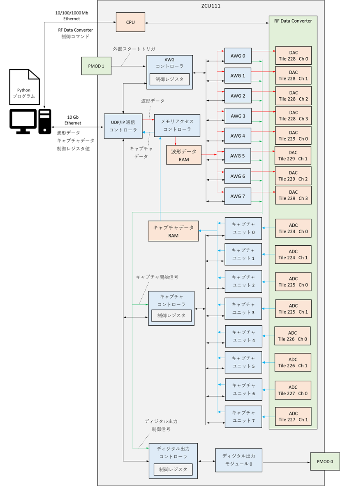
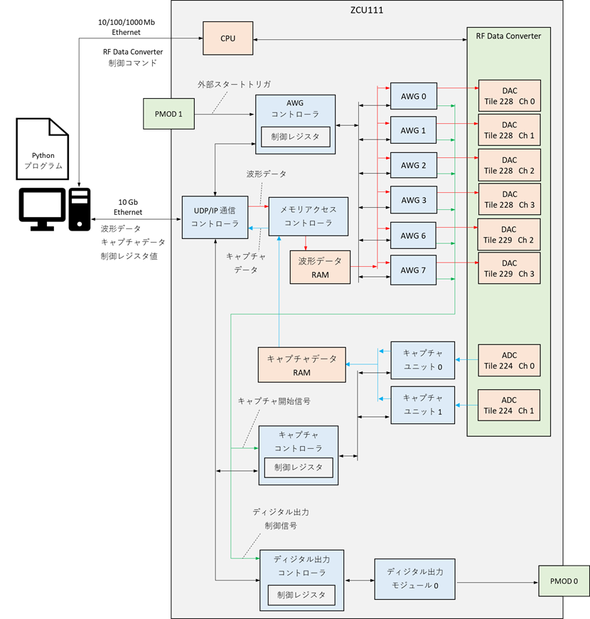
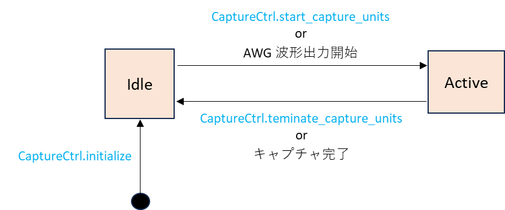
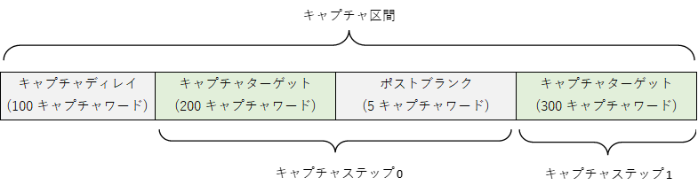

# キャプチャユニットユーザマニュアル

本資料は，ZCU111 を利用したキャプチャユニットの利用者向けマニュアルです．

## 1. システム構成

キャプチャユニットは ZCU111 の FPGA 上に実装されており，そのシステム構成は以下のようになります．
キャプチャユニットの制御には専用の Python API を用います．
この API にはキャプチャユニットが保存したデータを FPGA から読み出す機能や，キャプチャの完了を待つ機能などが含まれています．

ZCU111 向けの e7awg_hw には 5 種類の FPGA デザインがありますが，キャプチャユニットが含まれているのはデザイン 3 と 4 のみになります．
これらの FPGA デザイン間で異なる部分は 2 章を参照してください．

<br>

**デザイン 0 ~ 2**

デザイン 0 ~ 2 にはキャプチャユニット搭載されていません．

<br>

**デザイン 3**



<br>

**デザイン 4**



<br>

## 2. ZCU111 版 e7awg_hw の種類

ZCU111 上で動作する e7awg_hw には，以下の 5 種類の FPGA デザインがあります．
デザイン間で異なる部分は以下の通りです．

 - DAC のサンプリングレート
 - ADC のサンプリングレート
 - データ RAM の構成
 - キャプチャデータ RAM の構成

データ RAM は，波形データ RAM とキャプチャデータ RAM を合わせた RAM の呼び方です．

 <br>

| デザイン ID | DAC の<br>サンプリングレート [Gsps] | ADC の<br>サンプリングレート [Gsps] | データ RAM の構成 |
| --- | --- | --- | --- | 
| 0 | 1.10592 | ADC 無し | AWG 0 ~ 7 → DRAM x1（512 MBytes / AWG）|
| 1 | 6.51264 | ADC 無し | AWG 0 ~ 7 → DRAM x1（512 MBytes / AWG）|
| 2 | 1.10592 | ADC 無し | AWG 0 ~ 5 → DRAM x1（512 MBytes / AWG） <br> AWG 6 → URAM x1（1280 KBytes） <br> AWG 7 → URAM x1（1280 KBytes） |
| 3 | 6.51264 | 3.25632 | AWG 0 ~ 5 → DRAM x1（512 MBytes / AWG） <br> AWG 6 → URAM x1（1280 KBytes） <br> AWG 7 → URAM x1（1280 KBytes） <br> キャプチャユニット 0 → BRAM x1 (320 KBytes) <br> キャプチャユニット 1 → BRAM x1 (320 KBytes) <br> キャプチャユニット 2 → BRAM x1 (320 KBytes) <br> キャプチャユニット 3 → BRAM x1 (320 KBytes) <br> キャプチャユニット 4 → BRAM x1 (320 KBytes) <br> キャプチャユニット 5 → BRAM x1 (320 KBytes) <br> キャプチャユニット 6 → BRAM x1 (320 KBytes) <br> キャプチャユニット 7 → BRAM x1 (320 KBytes) |
| 4 | 1.59744 | 1.59744 | AWG 0 ~ 3, 6 → DRAM x1 (512MBytes / AWG) <br> AWG 7 → URAM x1 (2560 KBytes) <br> キャプチャユニット 0 → BRAM x1 (256 KBytes) <br> キャプチャユニット 1 → BRAM x1 (256 KBytes) |

<br>

## 3. キャプチャユニットの状態

キャプチャユニットは下図の状態を持ち，特定の Python API (図中の青字) が呼ばれたときや HW の特定の動作によって遷移します.



| 状態名 | 説明 |
| --- | --- |
| Idle | 初期状態. |
| Active | 入力された波形データに信号処理を施して出力します．|

<br>

## 4. キャプチャ区間の定義

ユーザは，各キャプチャユニットに対し**キャプチャ区間**を定義することで，入力波形のどの部分に何の信号処理を適用するかを決めることができます．

**キャプチャ区間**は**キャプチャディレイ**と，その後に続く 1 つ以上 1024 個以下の**キャプチャステップ**で構成されます．
**キャプチャディレイ**の期間に受信した波形データは保存および信号処理の対象になりません．
**キャプチャディレイ**は無くても問題ありません．


**キャプチャステップ**は**キャプチャターゲット**と**ポストブランク**を交互に繰り返したものから構成されます．
**キャプチャターゲット**で受信される波形データは，保存および信号処理の対象になりますが，ポストブランクで受信される波形データはその対象になりません．
**キャプチャターゲット**と**ポストブランク**の長さは共に，8 サンプルを 1 つの単位とする**キャプチャワード**単位で指定可能です（I データと Q データはまとめて 1 サンプルとカウントします）．
**キャプチャステップ**は最大 1024 個まで定義でき，別々に長さを設定できます．
**ポストブランク**は無くても問題ありません．


<br>

## 5. キャプチャユニット詳細

キャプチャユニットには，以下の信号処理回路が含まれています．


各処理は有効 / 無効を切り替えることができます．
処理が無効になった場合，入力 I<sub>x</sub>，Q<sub>x</sub> をそのまま I<sub>x+1</sub> ，Q<sub>x+1</sub> として出力します．
それぞれの処理の詳細は以下の通りです．

<br>

#### 間引き (デザイン 4 のみ)
キャプチャターゲットのサンプル数を減らします．
キャプチャターゲットのサンプル数を n，間引き後のサンプル数を m としたとき以下の式が成り立ちます．


キャプチャターゲットのサンプル数が 128 で割り切れないとき，余ったサンプルはどの信号処理の対象にもなりません．

<!-- $$
m = 8 * \left\lfloor \frac{n}{128} \right\rfloor
$$ -->


<br>

#### 総和
キャプチャターゲットを総和区間に分割し，各総和区間に含まれるサンプル値を全て足し合わせます．
総和区間のサンプル数はキャプチャワード単位で指定可能で，キャプチャ区間全体で共通です． 
キャプチャターゲットのサンプル数が総和区間のサンプル数で割り切れないとき，余ったサンプルはどの信号処理の対象にもなりません．
総和が有効になっている場合，以降の処理は総和の計算結果にのみ適用されます．


<br>

#### 二値化
キャプチャターゲットの各サンプルの値を二値化閾値と比較し，閾値以上ならその値を 1，そうでなければ 0 にします．


<br>

#### リダクション
リダクションは，キャプチャターゲットごとに，その中の全てのサンプル値をもとに 1 か 0 を算出します．
計算方法には **ANY** と **ALL** の 2 種類があり，キャプチャ区間全体でどちらか一方のみ適用できます．

| 計算方法 | 説明 |
| -- | -- |
| ANY | キャプチャターゲットの中に値が 1 以上のサンプルが 1 つ以上ある場合，そのキャプチャターゲットの計算結果が 1 になる |
| ALL | キャプチャターゲットのサンプルの値が全て 1 以上の場合，そのキャプチャターゲットの計算結果が 1 になる |


<br>

## 6. キャプチャパラメータの制約
キャプチャデータタイプ，キャプチャステップ数，キャプチャターゲットの長さ，総和ワード数は，HW リソースの都合上，式 ①～④の制約を全て満たさなければなりません．デザイン 3 では，間引きは常に無効扱いとなります．

**総和と二値化の有効 / 無効の組み合わせと対応するパターン**
| 総和 | 二値化 | パターン |
| -- | -- | -- |
| 無効 | 無効 | A |
| 有効 | 無効 | B |
| 無効 | 有効 | C |
| 有効 | 有効 | D |

<br>


<br>

## 7. ADC パラメータ

RF Data Converter の ADC の以下のパラメータは固定となっており，ユーザが変更することはできません．
I/Q ミキサは有効 / 無効を切り替えることができ，有効にした場合，ミキシング周波数を変更できます．

**デザイン 3**

- サンプリングレート : 3256.32 [Msps]
- 間引き : 無し

<br>

**デザイン 4**

- サンプリングレート : 1597.44 [Msps]
- 間引き : 1/2


## 8. キャプチャユニット制御用 API の詳細

本章ではキャプチャユニットの操作に必要な Python API を手順ごとに説明します．
各 API の詳細は, 関数ヘッダコメントを参照してください.

### 8.1. RF Data Converter の ADC タイルと ADC タイル ID の対応関係

本 API には RF Data Convnerter の ADC タイルを指定して実行するメソッドがあります．
各タイルに対応する ID は e7awgsw.zcu111 パッケージの AdcTile クラスに列挙子として定義されており，その対応関係は以下の通りです．

| DAC タイル | DAC タイル ID | 列挙子の値 |
| -- | -- | -- |
| Tile 224 | T0 | 0 |
| Tile 225 | T1 | 1 |
| Tile 226 | T2 | 2 |
| Tile 227 | T3 | 3 |

<br>

### 8.2. キャプチャユニットと ADC の初期化

キャプチャユニットと ADC は，次節以降で述べる操作を行う前に必ず初期化しなければなりません．
ADC の初期化は，最初に RfdcCtrl クラスの set_adc_mixer_settings で I/Q ミキサの設定を行った後，
同クラスのの sync_adc_tiles または sync_dac_adc_tiles メソッドでタイルの同期を行います．
キャプチャユニットの初期化には e7awgsw.basiccapture パッケージに含まれる CaptureCtrl クラスの initialize メソッドを使用します．

初期化のコード例を以下に示します

```
import e7awgsw as e7s
import e7awgsw.zcu111 as e7sz
import e7awgsw.basiccapture as bc

zcu111_ip_addr = '192.168.1.3' # ZCU111 の 10/100/1000 Mb Ethernet ポートの IP アドレス
fpga_ip_addr = '10.0.0.16'     # ZCU111 の 10 Gb Ethernet ポートの IP アドレス

# DAC, ADC, AWG, キャプチャユニット 制御用オブジェクトを作成する
with (e7sz.RftoolTransceiver(zcu111_ip_addr, 15) as transceiver,
      e7sz.RfdcCtrl(transceiver, e7s.E7AwgHwType.ZCU111_DAC_6G_URAM_X2) as rfdc_ctrl,
      e7s.AwgCtrl(ip_addr.fpga, e7s.E7AwgHwType.ZCU111_DAC_6G_URAM_X2) as awg_ctrl,
      bc.CaptureCtrl(fpga_ip_addr, e7s.E7AwgHwType.ZCU111_DAC_6G_URAM_X2) as cap_ctrl):
    
    # FPGA コンフィギュレーション
    e7sz.configure_fpga(trasnceiver, e7s.E7AwgHwType.ZCU111_DAC_6G_URAM_X2)

    for tile_id in list(e7sz.AdcTile):
        for channel_id in list(e7sz.AdcChannel):
            # I/Q ミキサの設定
            rfdc_ctrl.set_adc_mixer_settings(
                tile = tile_id,                # タイル ID
                channel = chennel_id,          # チャネル ID
                enable = True,                 # ミキサの有効/無効
                freq = 100,                    # 周波数 (MHz)
                phase = 0,                     # 初期位相 (degrees)
                scale = e7sz.MixerScale.V0P7)  # 振幅

    # DAC タイルを同期させる.
    rfdc_ctrl.sync_adc_tiles()

    # キャプチャユニット 0 , キャプチャユニット 1 を初期化
    cap_ctrl.initialize(e7s.CaptureUnit.U0, e7s.CaptureUnit.U1)
```


### 8.3. キャプチャパラメータの設定

キャプチャユニットに設定するパラメータは，e7awgsw.basiccapture パッケージの CaptureParam クラスを用いて作成します．
4 章で説明したキャプチャ区間のパラメータとして以下の項目を指定できます．

- キャプチャディレイの長さ
- キャプチャステップの個数
- キャプチャターゲットの長さ
- ポストブランクの長さ

5 章で説明した信号処理のパラメータとして以下の項目を指定できます．

- 有効化する処理 (間引き，総和，二値化，リダクション) 　 ※ 間引きはデザイン 4 でのみ有効化可能です．
- 総和サンプル数
- 二値化閾値
- リダクションの計算方法

キャプチャパラメータを作成するコードの例を以下に示します．

```
import e7awgsw as e7s
import e7awgsw.zcu111 as e7sz
import e7awgsw.basiccapture as bc

cap_param = bc.CaptureParam()
cap_param.capture_delay = 100                        # キャプチャディレイ
cap_param.capture_data_type = e7s.SampleDataType.IQ  # キャプチャデータタイプ 
cap_param.dsp_list = [                               # 有効化する信号処理
    bc.DspUnit.DECIMATION,
    bc.DspUnit.SUM,
    bc.DspUnit.BINARIZATION,
    bc.DspUnit.REDUCTION]

cap_param.num_sum_words = 50                         # 総和するキャプチャワード数
cap_param.i_bin_threshold = 10000                    # I データの二値化閾値
cap_param.q_bin_threshold = -30000                   # Q データの二値化閾値
cap_param.i_reduction_op = bc.ReductionOperation.ANY # I データのリダクション演算
cap_param.q_reduction_op = bc.ReductionOperation.ALL # Q データのリダクション演算

# キャプチャステップ 0 の定義
cap_param.add_capture_step(200, 5)
# キャプチャステップ 1 の定義
cap_param.add_capture_step(300, 0)
```

上記のコードで定義されるキャプチャ区間は以下のようになります.



定義したキャプチャパラメータをキャプチャユニットに設定するには CaptureCtrl クラスの set_capture_param メソッドを使用します．

キャプチャパラメータを設定するコードの例を以下に示します．

```
import e7awgsw as e7s
import e7awgsw.zcu111 as e7sz
import e7awgsw.basiccapture as bc

zcu111_ip_addr = '192.168.1.3' # ZCU111 の 10/100/1000 Mb Ethernet ポートの IP アドレス
fpga_ip_addr = '10.0.0.16'     # ZCU111 の 10 Gb Ethernet ポートの IP アドレス

# DAC, ADC, AWG, キャプチャユニット 制御用オブジェクトを作成する
with (e7sz.RftoolTransceiver(zcu111_ip_addr, 15) as transceiver,
      e7sz.RfdcCtrl(transceiver, e7s.E7AwgHwType.ZCU111_DAC_6G_URAM_X2) as rfdc_ctrl,
      e7s.AwgCtrl(ip_addr.fpga, e7s.E7AwgHwType.ZCU111_DAC_6G_URAM_X2) as awg_ctrl,
      bc.CaptureCtrl(fpga_ip_addr, e7s.E7AwgHwType.ZCU111_DAC_6G_URAM_X2) as cap_ctrl):

    ### キャプチャユニット / ADC 初期化 (省略) ###
    ### キャプチャパラメータの定義 (省略) ###

    # キャプチャユニット 0 , キャプチャユニット 1 にキャプチャパラメータを設定
    cap_ctrl.set_capture_params(e7s.CaptureUnit.U0, cap_param)
    cap_ctrl.set_capture_params(e7s.CaptureUnit.U1, cap_param)
```

<br>

### 8.4. キャプチャユニットをスタートする AWG を選択する

キャプチャユニットは， CaptureCtrl クラスの start_capture_units メソッドでもスタートできますが，任意の AWG の波形出力開始に合わせてスタートすることもできます．
このキャプチャユニットと AWG の関係は，CaptureCtrl クラスの set_trigger_awgs メソッドを使って指定できます．

キャプチャユニットをスタートする AWG を指定するコードを以下に示します．

```
import e7awgsw as e7s
import e7awgsw.zcu111 as e7sz
import e7awgsw.basiccapture as bc

zcu111_ip_addr = '192.168.1.3' # ZCU111 の 10/100/1000 Mb Ethernet ポートの IP アドレス
fpga_ip_addr = '10.0.0.16'     # ZCU111 の 10 Gb Ethernet ポートの IP アドレス

# DAC, ADC, AWG, キャプチャユニット 制御用オブジェクトを作成する
with (e7sz.RftoolTransceiver(zcu111_ip_addr, 15) as transceiver,
      e7sz.RfdcCtrl(transceiver, e7s.E7AwgHwType.ZCU111_DAC_6G_URAM_X2) as rfdc_ctrl,
      e7s.AwgCtrl(ip_addr.fpga, e7s.E7AwgHwType.ZCU111_DAC_6G_URAM_X2) as awg_ctrl,
      bc.CaptureCtrl(fpga_ip_addr, e7s.E7AwgHwType.ZCU111_DAC_6G_URAM_X2) as cap_ctrl):

    ### キャプチャユニット / ADC 初期化 (省略) ###
    ### キャプチャパラメータの定義 (省略) ###
    ### キャプチャパラメータの設定 (省略) ###

    # キャプチャユニット 0 が AWG 1 の波形出力に合わせてスタートするように設定する
    cap_ctrl.set_trigger_awgs(e7s.CaptureUnit.U0, e7s.AWG.U1) 
    # キャプチャユニット 1 が AWG 2 の波形出力に合わせてスタートするように設定する
    cap_ctrl.set_trigger_awgs(e7s.CaptureUnit.U1, e7s.AWG.U2)
```

### 8.5. キャプチャの開始と完了待ち
8.4 で紹介した設定を行ったキャプチャユニットは，AWG の波形出力開始に合わせて自動でキャプチャを開始します．
AWG の制御方法は，[AWG ユーザマニュアル](./awg.md) を参照してください．
キャプチャユニットの処理が完了するのを待つには CaptureCtrl クラスの wait_for_capture_units_to_stop メソッドを使用します．
このメソッドは指定した全てのキャプチャユニットの処理が完了するか，タイムアウトまでコントロールを返しません．

キャプチャ開始と完了待ちを行うコードの例を以下に示します．

```
import e7awgsw as e7s
import e7awgsw.zcu111 as e7sz
import e7awgsw.basiccapture as bc

zcu111_ip_addr = '192.168.1.3' # ZCU111 の 10/100/1000 Mb Ethernet ポートの IP アドレス
fpga_ip_addr = '10.0.0.16'     # ZCU111 の 10 Gb Ethernet ポートの IP アドレス

# DAC, ADC, AWG, キャプチャユニット 制御用オブジェクトを作成する
with (e7sz.RftoolTransceiver(zcu111_ip_addr, 15) as transceiver,
      e7sz.RfdcCtrl(transceiver, e7s.E7AwgHwType.ZCU111_DAC_6G_URAM_X2) as rfdc_ctrl,
      e7s.AwgCtrl(ip_addr.fpga, e7s.E7AwgHwType.ZCU111_DAC_6G_URAM_X2) as awg_ctrl,
      bc.CaptureCtrl(fpga_ip_addr, e7s.E7AwgHwType.ZCU111_DAC_6G_URAM_X2) as cap_ctrl):
    
    ### キャプチャユニット / ADC 初期化 (省略) ###
    ### キャプチャパラメータの定義 (省略) ###
    ### キャプチャパラメータの設定 (省略) ###
    ### キャプチャユニットをスタートする AWG の選択 (省略) ###
    ### DAC / AWG の設定 (省略) ###
    
    # AWG 1 と AWG 2 のユーザ定義波形出力スタート
    # 連動してキャプチャユニット 0 とキャプチャユニット 1 も動作を開始する
    awg_ctrl.start_awgs(e7s.AWG.U1, e7s.AWG.U2)
    
    # タイムアウト 5 秒でキャプチャユニット 0 とキャプチャユニット 1 の処理完了待ち
    cap_ctrl.wait_for_capture_units_to_stop(5, e7s.CaptureUnit.U0, e7s.CaptureUnit.U1)
```

### 8.6. キャプチャデータの取得
キャプチャユニットが保存したデータ（以下キャプチャデータと呼ぶ）を読み取るには，CaptureCtrl クラスの get_capture_data メソッドを使用します．
このメソッドには e7awgsw.basiccapture パッケージの CaptureParam クラスのオブジェクトを指定する必要があります．
このオブジェクトは，キャプチャデータを読み取るキャプチャユニットがキャプチャの際に使用したパラメータを格納したものでなければなりません．

キャプチャデータを読み出すコードの例を以下に示します．

```
import e7awgsw as e7s
import e7awgsw.zcu111 as e7sz
import e7awgsw.basiccapture as bc

zcu111_ip_addr = '192.168.1.3' # ZCU111 の 10/100/1000 Mb Ethernet ポートの IP アドレス
fpga_ip_addr = '10.0.0.16'     # ZCU111 の 10 Gb Ethernet ポートの IP アドレス

# DAC, ADC, AWG, キャプチャユニット 制御用オブジェクトを作成する
with (e7sz.RftoolTransceiver(zcu111_ip_addr, 15) as transceiver,
      e7sz.RfdcCtrl(transceiver, e7s.E7AwgHwType.ZCU111_DAC_6G_URAM_X2) as rfdc_ctrl,
      e7s.AwgCtrl(ip_addr.fpga, e7s.E7AwgHwType.ZCU111_DAC_6G_URAM_X2) as awg_ctrl,
      bc.CaptureCtrl(fpga_ip_addr, e7s.E7AwgHwType.ZCU111_DAC_6G_URAM_X2) as cap_ctrl):
    
    ### キャプチャユニット / ADC 初期化 (省略) ###
    ### キャプチャパラメータの定義 (省略) ###
    ### キャプチャパラメータの設定 (省略) ###
    ### キャプチャユニットをスタートする AWG の選択 (省略) ###
    ### DAC / AWG の設定 (省略) ###
    ### AWG の波形出力スタート (省略) ###
    ### キャプチャ完了待ち (省略) ###

    # キャプチャユニット 0 のキャプチャデータを読みだす
    capture_data_0 = cap_ctrl.get_capture_data(e7s.CaptureUnit.U0, cap_param)
    # キャプチャユニット 1 のキャプチャデータを読みだす
    capture_data_6 = cap_ctrl.get_capture_data(e7s.CaptureUnit.U1, cap_param)
```
