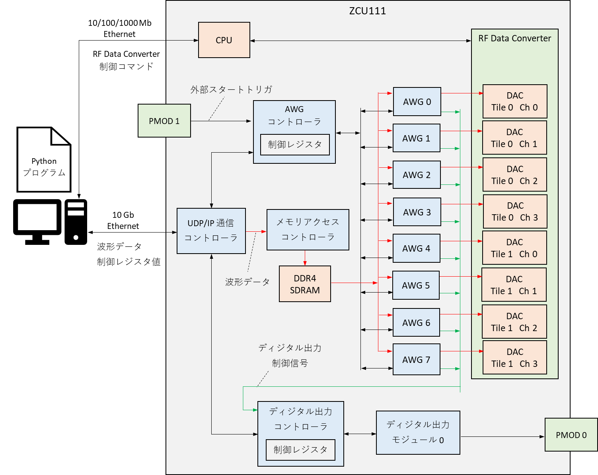

# ディジタル出力モジュールユーザマニュアル

本資料は，ZCU111 を利用したディジタル出力モジュールの利用者向けマニュアルです．

## 1. システム構成

ディジタル出力モジュールは ZCU111 の FPGA 上に実装されており，そのシステム構成は以下のようになります．
ディジタル出力モジュールの制御には専用の Python API を用います．
この API には Python で作成したディジタル出力値を FPGA に送信する機能や，ディジタル出力モジュールの動作完了を待つ機能などが含まれています．

ディジタル出力モジュールは本デザインに含まれる [Arbitrary Waveform Generator](awg.md) (以下 AWG) と連動して動作させることが可能です．



## 2. ディジタル出力モジュールの状態

ディジタル出力モジュールは下図の状態を持ち，次の 5 つのイベントで状態遷移します．
 - AWG の波形出力が開始される
 - AWG が波形出力が一時停止される
 - AWG の波形出力が再開される
 - 全ディジタル出力値の出力が完了する
 - 特定の Python API (図中の青字) が呼ばれる


**状態の説明**

| 状態名 | 説明 |
| --- | --- |
| Idle | 初期状態. |
| Prepare | 現在設定されているディジタル出力値リストの値を最初から出力するための準備を行います．|
| Active | ディジタル出力値リストから値を順に出力します．|
| Pause | ディジタル出力モジュールの動作を一時停止します．|

<br>

**状態と出力値の関係**

| 状態名 | 出力値 |
| --- | --- |
| Idle | Idle 状態専用の出力値. （詳細は 4.3 を参照）|
| Prepare | この状態に遷移する直前の出力値. |
| Active | ディジタル出力値リストの値. |
| Pause | この状態に遷移する直前の出力値. |


## 3. 出力ポート

ディジタル出力モジュール 0 の出力値は ZCU111 の PMOD 0 の電圧値として出力されます．
PMOD 0 の各ポートには P0 ~ P7 の番号が以下の図のように割り当てられ，出力値の 0 ~ 7 ビット目の 0/1 が P0 ~ P7 の Lo/Hi に対応します．


## 4. ディジタル出力モジュール制御用 API の詳細

本章ではディジタル出力モジュールの操作に必要な Python API を手順ごとに説明します．

### 4.1. 初期化

ディジタル出力モジュールは，次節以降で述べる操作を行う前に必ず初期化しなければなりません．
初期化には DigitalOutCtrl クラスの initialize メソッドを使用します．

初期化のコード例を以下に示します．

```
import e7awgsw as e7s
import e7awgsw.zcu111 as e7sz

zcu111_ip_addr = '192.168.1.3' # ZCU111 の 10/100/1000 Mb Ethernet ポートの IP アドレス
fpga_ip_addr = '10.0.0.16'     # ZCU111 の 10 Gb Ethernet ポートの IP アドレス

# ディジタル出力モジュール制御用オブジェクトを作成する
with (e7sz.RftoolTransceiver(zcu111_ip_addr, 15) as trasnceiver,
      e7s.DigitalOutCtrl(fpga_ip_addr, e7s.E7AwgHwType.ZCU111) as digital_out_ctrl):

    # FPGA コンフィギュレーション
    e7sz.configure_fpga(trasnceiver, e7s.E7AwgHwType.ZCU111)
    
    # ディジタル出力モジュール 0 の初期化
    digital_out_ctrl.initialize(e7s.DigitalOut.U0)
```

### 4.2. Active 状態の出力データの設定

Active 状態の出力データは，e7awgsw パッケージの DigitalOutputDataList クラスを用いて作成します．
同クラスの add メソッドに出力値と出力時間を設定します．
出力時間の単位は 14.4676 [ns] となります．
出力データをディジタル出力モジュールに設定するには DigitalOutCtrl クラスの set_output_data メソッドを使用します．

ディジタル出力データを設定するコード例を以下に示します．

```
import e7awgsw as e7s
import e7awgsw.zcu111 as e7sz

zcu111_ip_addr = '192.168.1.3' # ZCU111 の 10/100/1000 Mb Ethernet ポートの IP アドレス
fpga_ip_addr = '10.0.0.16'     # ZCU111 の 10 Gb Ethernet ポートの IP アドレス

# ディジタル出力モジュール制御用オブジェクトを作成する
with (e7sz.RftoolTransceiver(zcu111_ip_addr, 15) as trasnceiver,
      e7s.DigitalOutCtrl(fpga_ip_addr, e7s.E7AwgHwType.ZCU111) as digital_out_ctrl):

    ### ディジタル出力モジュールの初期化 (省略) ###

    # ディジタル出力データの作成
    dout_data_list = e7s.DigitalOutputDataList(e7s.E7AwgHwType.ZCU111)
    (dout_data_list
        .add(0x01, 100)
        .add(0x02, 150)
        .add(0x04, 200))

    # 出力データをディジタル出力モジュール 0 に設定
    digital_out_ctrl.set_output_data(dout_data_list, e7s.DigitalOut.U0)
```

このコードで定義される出力データは以下のようになります．


### 4.3. Idle 状態の出力データの設定

Idle 状態の出力データ (以下デフォルト出力値と呼ぶ) は，DigitalOutCtrl クラスの set_default_output_data メソッドで設定します．
このメソッドを呼び出すとすぐに，引数で指定したディジタル出力モジュールのデフォルト出力値が変わります．
AWG デザインをコンフィギュレーションした直後のデフォルト出力値は 0 です．
一度変更したデフォルト出力値は，初期化などの操作では変わらず，再度このメソッドで変更するまで保持されます．

デフォルト出力値を設定するコード例を以下に示します．

```
import e7awgsw as e7s
import e7awgsw.zcu111 as e7sz

zcu111_ip_addr = '192.168.1.3' # ZCU111 の 10/100/1000 Mb Ethernet ポートの IP アドレス
fpga_ip_addr = '10.0.0.16'     # ZCU111 の 10 Gb Ethernet ポートの IP アドレス

# ディジタル出力モジュール制御用オブジェクトを作成する
with (e7sz.RftoolTransceiver(zcu111_ip_addr, 15) as trasnceiver,
      e7s.DigitalOutCtrl(fpga_ip_addr, e7s.E7AwgHwType.ZCU111) as digital_out_ctrl):
    
    ### ディジタル出力モジュールの初期化 (省略) ###

    # ディジタル出力モジュール 0 のデフォルト出力値を 0x36 に変更する
    digital_out_ctrl.set_default_output_data(0x36, e7s.DigitalOut.U0)
```

### 4.4. ディジタル値出力のスタート

ディジタル出力モジュールは，Idle 状態のときにDigitalOutCtrl クラスの start_douts メソッドを呼ぶとディジタル値の出力を開始します．

ディジタル値出力をスタートするコード例を以下に示します．

```
import e7awgsw as e7s
import e7awgsw.zcu111 as e7sz

zcu111_ip_addr = '192.168.1.3' # ZCU111 の 10/100/1000 Mb Ethernet ポートの IP アドレス
fpga_ip_addr = '10.0.0.16'     # ZCU111 の 10 Gb Ethernet ポートの IP アドレス

# ディジタル出力モジュール制御用オブジェクトを作成する
with (e7sz.RftoolTransceiver(zcu111_ip_addr, 15) as trasnceiver,
      e7s.DigitalOutCtrl(fpga_ip_addr, e7s.E7AwgHwType.ZCU111) as digital_out_ctrl):
    
    ### ディジタル出力モジュールの初期化 (省略) ###
    ### ディジタル出力データの設定 (省略) ###

    # ディジタル出力モジュール 0 の動作開始
    digital_out_ctrl.start_douts(e7s.DigitalOut.U0)
```

### 4.5. ディジタル値出力の一時停止

ディジタル出力モジュールは，Active 状態のときに DigitalOutCtrl クラスの pause_douts メソッドを呼ぶと一時停止します．
一時停止中は Active 状態のときに最後に出力していた値を出力し続けます．
また，一時停止中は 4.2 および 4.3 の手順でデフォルト出力値やディジタル出力データを更新することが可能です．
一時停止中にディジタル出力データを更新した場合は，4.7 もしくは 4.9 の手順で **再スタート** をしてください．

ディジタル値出力を一時停止するコード例を以下に示します．

```
import e7awgsw as e7s
import e7awgsw.zcu111 as e7sz

zcu111_ip_addr = '192.168.1.3' # ZCU111 の 10/100/1000 Mb Ethernet ポートの IP アドレス
fpga_ip_addr = '10.0.0.16'     # ZCU111 の 10 Gb Ethernet ポートの IP アドレス

# ディジタル出力モジュール制御用オブジェクトを作成する
with (e7sz.RftoolTransceiver(zcu111_ip_addr, 15) as trasnceiver,
      e7s.DigitalOutCtrl(fpga_ip_addr, e7s.E7AwgHwType.ZCU111) as digital_out_ctrl):
    
    ### ディジタル出力モジュールの初期化 (省略) ###
    ### ディジタル出力データの設定 (省略) ###

    # ディジタル出力モジュール 0 の動作開始
    digital_out_ctrl.start_douts(e7s.DigitalOut.U0)

    # ディジタル出力モジュール 0 の一時停止
    digital_out_ctrl.pause_douts(e7s.DigitalOut.U0)
```

### 4.6. ディジタル値出力の再開

ディジタル出力モジュールは，Pause 状態のときに DigitalOutCtrl クラスの resume_douts メソッドを呼ぶと動作を再開します．

ディジタル値出力を再開するコード例を以下に示します．

```
import e7awgsw as e7s
import e7awgsw.zcu111 as e7sz

zcu111_ip_addr = '192.168.1.3' # ZCU111 の 10/100/1000 Mb Ethernet ポートの IP アドレス
fpga_ip_addr = '10.0.0.16'     # ZCU111 の 10 Gb Ethernet ポートの IP アドレス

# ディジタル出力モジュール制御用オブジェクトを作成する
with (e7sz.RftoolTransceiver(zcu111_ip_addr, 15) as trasnceiver,
      e7s.DigitalOutCtrl(fpga_ip_addr, e7s.E7AwgHwType.ZCU111) as digital_out_ctrl):
    
    ### ディジタル出力モジュールの初期化 (省略) ###
    ### ディジタル出力データの設定 (省略) ###
    ### ディジタル出力モジュールの動作開始 (省略) ###
    ### ディジタル出力モジュールの一時停止 (省略) ###

    # ディジタル出力モジュール 0 の動作再開
    digital_out_ctrl.resume_douts(e7s.DigitalOut.U0)
```

### 4.7. ディジタル値出力の再スタート

ディジタル出力モジュールは，Pause 状態のときに DigitalOutCtrl クラスの restart_douts メソッドを呼ぶと，ディジタル値の出力を最初からやり直します (再スタート)．その際 Pause 状態のときにディジタル出力データを更新していると，更新したデータが出力されます．

ディジタル値出力を再スタートするコード例を以下に示します．

```
import e7awgsw as e7s
import e7awgsw.zcu111 as e7sz

zcu111_ip_addr = '192.168.1.3' # ZCU111 の 10/100/1000 Mb Ethernet ポートの IP アドレス
fpga_ip_addr = '10.0.0.16'     # ZCU111 の 10 Gb Ethernet ポートの IP アドレス

# ディジタル出力モジュール制御用オブジェクトを作成する
with (e7sz.RftoolTransceiver(zcu111_ip_addr, 15) as trasnceiver,
      e7s.DigitalOutCtrl(fpga_ip_addr, e7s.E7AwgHwType.ZCU111) as digital_out_ctrl):
    
    ### ディジタル出力モジュールの初期化 (省略) ###
    ### ディジタル出力データの設定 (省略) ###
    ### ディジタル出力モジュールの動作開始 (省略) ###
    ### ディジタル出力モジュールの一時停止 (省略) ###

    # ディジタル出力データの作成 (Option)
    dout_data_list = e7s.DigitalOutputDataList(e7s.E7AwgHwType.ZCU111)
    (dout_data_list
        .add(0x0A, 100)
        .add(0x06, 150))

    # 出力データをディジタル出力モジュールに設定 (Option)
    digital_out_ctrl.set_output_data(dout_data_list, e7s.DigitalOut.U0)

    # ディジタル出力モジュール 0 の再スタート
    digital_out_ctrl.restart_douts(e7s.DigitalOut.U0)
```

### 4.8. スタートトリガの有効化

ディジタル出力モジュールのスタートは，Python API (DigitalOutCtrl.start_douts) を使わずに AWG の波形出力開始に合わせて行うことも可能です．
AWG の波形出力開始に合わせてスタートする場合，スタートトリガを有効にしなければなりません． 
スタートトリガの有効化には DigitalOutCtrl クラスの enable_trigger メソッドを使用します．

スタートトリガを有効化するコード例を以下に示します．

```
import e7awgsw as e7s
import e7awgsw.zcu111 as e7sz

zcu111_ip_addr = '192.168.1.3' # ZCU111 の 10/100/1000 Mb Ethernet ポートの IP アドレス
fpga_ip_addr = '10.0.0.16'     # ZCU111 の 10 Gb Ethernet ポートの IP アドレス

# ディジタル出力モジュール制御用オブジェクトを作成する
with (e7sz.RftoolTransceiver(zcu111_ip_addr, 15) as trasnceiver,
      e7s.DigitalOutCtrl(fpga_ip_addr, e7s.E7AwgHwType.ZCU111) as digital_out_ctrl):
    
    ### ディジタル出力モジュールの初期化 (省略) ###
    ### ディジタル出力データの設定 (省略) ###

    # スタートトリガの有効化
    # 以降 AWG の波形出力開始に合わせてディジタル出力モジュール 0 が動作を開始する
    digital_out_ctrl.enable_trigger(e7s.DigitalOutTrigger.START, e7s.DigitalOut.U0)
```

このスタートトリガは，いずれかの AWG の波形出力開始と同時にアサートされます．
AwgCtrl クラスの start_awgs メソッドで複数の AWG をスタートしてもスタートトリガは 1 度しかアサートされません．

### 4.9. 再スタートトリガの有効化

ディジタル出力モジュールの再スタートは，Python API (DigitalOutCtrl.restart_douts) を使わずに AWG の波形出力開始に合わせて行うことも可能です．
AWG の波形出力開始に合わせて再スタートする場合，再スタートトリガを有効にしなければなりません． 
再スタートトリガの有効化には DigitalOutCtrl クラスの enable_trigger メソッドを使用します．

再スタートトリガを有効化するコード例を以下に示します．

```
import e7awgsw as e7s
import e7awgsw.zcu111 as e7sz

zcu111_ip_addr = '192.168.1.3' # ZCU111 の 10/100/1000 Mb Ethernet ポートの IP アドレス
fpga_ip_addr = '10.0.0.16'     # ZCU111 の 10 Gb Ethernet ポートの IP アドレス

# ディジタル出力モジュール制御用オブジェクトを作成する
with (e7sz.RftoolTransceiver(zcu111_ip_addr, 15) as trasnceiver,
      e7s.DigitalOutCtrl(fpga_ip_addr, e7s.E7AwgHwType.ZCU111) as digital_out_ctrl):
    
    ### ディジタル出力モジュールの初期化 (省略) ###
    ### ディジタル出力データの設定 (省略) ###

    # 再スタートトリガの有効化
    # 以降 ディジタル出力モジュール 0 は Pause 状態のときに AWG の波形出力一時停止に合わせて一時停止する.
    digital_out_ctrl.enable_trigger(e7s.DigitalOutTrigger.RESTART, e7s.DigitalOut.U0)
```

### 4.10. 一時停止トリガの有効化

ディジタル出力モジュールの一時停止は，Python API (DigitalOutCtrl.pause_douts) を使わずに AWG の波形出力一時停止に合わせて行うことも可能です．
AWG の波形出力一時停止に合わせて一時停止する場合，一時停止トリガを有効にしなければなりません．
一時停止トリガの有効化には DigitalOutCtrl クラスの enable_trigger メソッドを使用します．

一時停止トリガを有効化するコード例を以下に示します．

```
import e7awgsw as e7s
import e7awgsw.zcu111 as e7sz

zcu111_ip_addr = '192.168.1.3' # ZCU111 の 10/100/1000 Mb Ethernet ポートの IP アドレス
fpga_ip_addr = '10.0.0.16'     # ZCU111 の 10 Gb Ethernet ポートの IP アドレス

# ディジタル出力モジュール制御用オブジェクトを作成する
with (e7sz.RftoolTransceiver(zcu111_ip_addr, 15) as trasnceiver,
      e7s.DigitalOutCtrl(fpga_ip_addr, e7s.E7AwgHwType.ZCU111) as digital_out_ctrl):
    
    ### ディジタル出力モジュールの初期化 (省略) ###
    ### ディジタル出力データの設定 (省略) ###

    # 一時停止トリガの有効化
    # 以降 ディジタル出力モジュール 0 は Active 状態のときに AWG の波形出力一時停止に合わせて一時停止する.
    digital_out_ctrl.enable_trigger(e7s.DigitalOutTrigger.PAUSE, e7s.DigitalOut.U0)
```

### 4.11. 再開トリガの有効化

ディジタル出力モジュールの動作の再開は，Python API (DigitalOutCtrl.resume_douts) を使わずに AWG の波形出力再開に合わせて行うことが可能です．
AWG の波形出力再開に合わせてディジタル出力モジュールの動作を再開する場合，再開トリガを有効にしなければなりません． 再開トリガの有効化には DigitalOutCtrl クラスの enable_trigger メソッドを使用します．

再開トリガを有効化するコード例を以下に示します．

```
import e7awgsw as e7s
import e7awgsw.zcu111 as e7sz

zcu111_ip_addr = '192.168.1.3' # ZCU111 の 10/100/1000 Mb Ethernet ポートの IP アドレス
fpga_ip_addr = '10.0.0.16'     # ZCU111 の 10 Gb Ethernet ポートの IP アドレス

# ディジタル出力モジュール制御用オブジェクトを作成する
with (e7sz.RftoolTransceiver(zcu111_ip_addr, 15) as trasnceiver,
      e7s.DigitalOutCtrl(fpga_ip_addr, e7s.E7AwgHwType.ZCU111) as digital_out_ctrl):
    
    ### ディジタル出力モジュールの初期化 (省略) ###
    ### ディジタル出力データの設定 (省略) ###

    # 再開トリガの有効化
    # 以降 ディジタル出力モジュール 0 は Pause 状態のときに AWG の波形出力再開に合わせて動作を再開する.
    digital_out_ctrl.enable_trigger(e7s.DigitalOutTrigger.RESUME, e7s.DigitalOut.U0)
```
