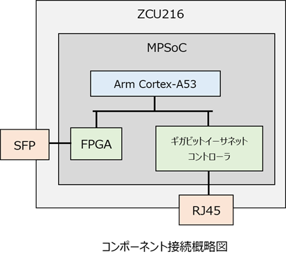
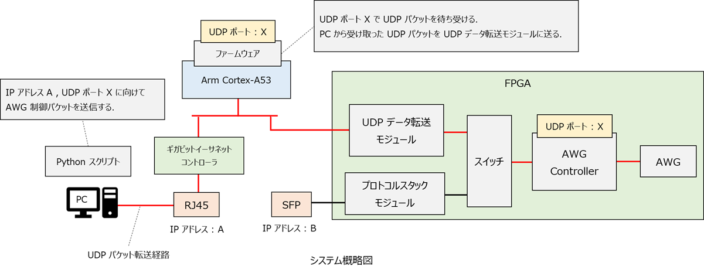

# パケットフォワーディングユーザマニュアル

ZCU216 にはイーサネットフレームを送受信可能なポートが 2 種類存在します．
1 つは RJ45 ポートで，これは MPSoC のギガビットイーサネットコントローラにつながっています．
もう 1 つは SFP ポートで, これは FPGA に直接つながっています．
前者は主に RF Data Converter を制御する際に使用され，後者はそれ以外のモジュール (AWG など) を制御する際に使用されます．




ZCU216 e7awg_hw には，本来 SFP ポート経由で受け渡しするパケットを RJ45 ポート経由で受け渡しする機能 (以下 **パケットフォワーディング** と呼ぶ) が備わっています．
これにより，10 GbE 環境がない場合でも ZCU216 e7awg_hw を使用することが可能になっています．

<br>

## 仕組み
e7awg_hw では，AWG やディジタル出力モジュールを制御する際，UDP パケットを FPGA に送信します．
このパケットは本来 SFP ポート経由で FPGA に送信しなければなりませんが，パケットフォワーディングを使用すると RJ45 経由でも送信可能になります．
パケットフォワーディングを使って AWG を制御する場合の UDP データの経路を下図に示します．

<br>



<br>

パケットフォワーディングは ZCU216 上で動作するファームウェアに命令を送ることで，有効 / 無効を切り替えることができます．
パケットフォワーディングを有効にすると，ファームウェアは AWG やディジタル出力モジュールのコントローラに割り当てられた UDP ポートで UDP パケットを待ち受けるようになります．
このとき RJ45 に対応する IP アドレスと，制御対象のモジュールの UDP ポート (上図では IP アドレス A, UDP ポート X) に向けて UDP パケットを送信すると，SFP 経由で送信した場合と同じように，対象のモジュールに UDP パケットが届きます．
e7awg_hw では，特定のモジュールが UDP パケットを受信した場合，その応答パケットがモジュールから返されますが，これも RJ45 経由で ZCU216 から PC に送信されます．

<br>

## 使い方

パケットフォワーディングを有効にするには，e7awgsw.zcu216 パッケージの `enable_packet_forwarding` メソッドを使用します．
このメソッドは AWG とディジタル出力モジュールの操作を行う前に呼び出す必要があります．
パケットフォワーディングを無効にするには，e7awgsw.zcu216 パッケージの `disable_packet_forwarding` メソッドを使用します．

パケットフォワーディングを使用する場合のコード例を以下に示します．

```
import e7awgsw as e7s
import e7awgsw.zcu216 as e7sz

zcu216_ip_addr = '192.168.1.3' # ZCU216 の 10/100/1000 Mb Ethernet ポートの IP アドレス
fpga_ip_addr = zcu216_ip_addr  # FPGA の IP アドレスを指定する部分も ZCU216 の IP アドレスを指定する.
design_type = e7s.E7AwgHwType.ZCU216

# DAC, ADC, AWG 制御用オブジェクトを作成する
with (e7sz.RftoolTransceiver(zcu216_ip_addr, 15) as transceiver,
      e7sz.RfdcCtrl(transceiver, design_type) as rfdc_ctrl,
      e7s.AwgCtrl(fpga_ip_addr, design_type) as awg_ctrl):
    
    # FPGA コンフィギュレーション
    e7sz.configure_fpga(trasnceiver, design_type)

    # パケットフォワーディングを有効化
    e7sz.enable_packet_forwarding(transceiver, design_type)

    # AWG 操作 (省略)

    # パケットフォワーディングを無効化
    e7sz.disable_packet_forwarding(transceiver)
```
